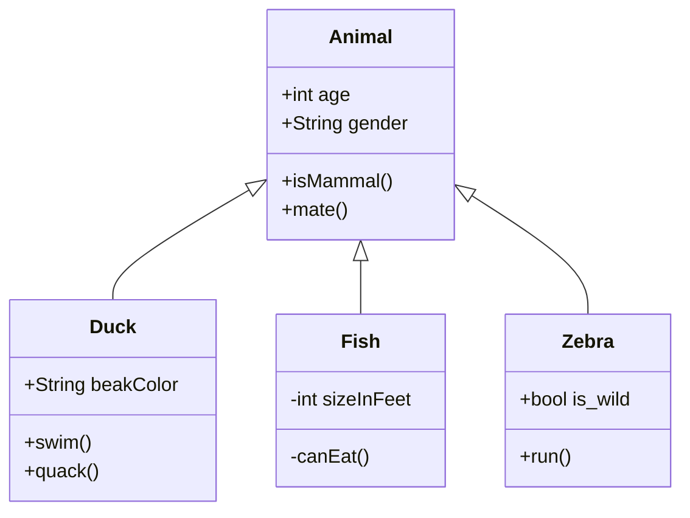

# PSS Slides

Sempre live a: https://unibo-lptsi-pss.github.io/

Ultima versione PDF stampabile disponibile a https://github.com/unibo-lptsi-pss/pss-slides/releases/latest

## Idea

Le slide in `lecture-markdown` sono gestite dal processo di CI.
Sono scritte in markdown più o meno pulito,
e vengono compilate da [hugo](https://gohugo.io/).

## Sviluppo in locale

Il repository ha dei sottomoduli.
Va quindi clonato clonando anche i submodule:

``
git clone --recurse-submodules git@github.com:unibo-lptsi-pss/pss-slides.git
``

Se per caso è già stato clonato senza submodule (sic),
allora è sufficiente:

``
git submodule update --recursive --init
``

Adesso, bisogna installare Hugo, in *versione estesa*.
Piazzate un terminale dentro `lecture-markdown`, quindi lanciate:

``
hugo server
``

Dovrebbe venir fuori un output tipo:

```
Start building sites … 
hugo v0.101.0+extended linux/amd64 BuildDate=unknown
WARN 2022/09/12 23:03:15 found no layout file for "HTML" for kind "taxonomy": You should create a template file which matches Hugo Layouts Lookup Rules for this combination.
WARN 2022/09/12 23:03:15 found no layout file for "HTML" for kind "taxonomy": You should create a template file which matches Hugo Layouts Lookup Rules for this combination.

                   | EN   
-------------------+------
  Pages            |   4  
  Paginator pages  |   0  
  Non-page files   |   0  
  Static files     | 248  
  Processed images |   0  
  Aliases          |   3  
  Sitemaps         |   0  
  Cleaned          |   0  

Built in 50 ms
Watching for changes in /home/danysk/LocalProjects/pss-slides/lecture-markdown/{archetypes,assets,content,layouts,static,themes}
Watching for config changes in /home/danysk/LocalProjects/pss-slides/lecture-markdown/config.toml
Environment: "development"
Serving pages from memory
Running in Fast Render Mode. For full rebuilds on change: hugo server --disableFastRender
Web Server is available at http://localhost:1313/ (bind address 127.0.0.1)
Press Ctrl+C to stop
```

Visitare la pagina indicata dopo "Web Server is available at" per avere una live delle slide.
Se le slide vengono modificate col processo attivo,
il browser dovrebbe aggiornarsi da solo. Wow!

Il repository può essere aperto con Visual Studio Code, gestisce la cosa più che bene.

Per capire come scrivere le slide, fare riferimento al contenuto della cartella `content`.
Dentro si troverà una cartella per pacco di slide,
e dentro ogni pacco un file `_index.md` con il contenuto della slide.

### Cose molto belle

#### Convertire il sorgente delle slide di Mirko

1. Creare una nuova slide con uno header funzionante (ad esempio copiandone un pacchetto esistente)
2. Copiare il contenuto del pacco di slide che si vuole portare da `\begin{document}` a `\end{document}` esclusi
3. lanciare lo script di sostituzione dalla root del progetto:

``
./replacer.rb lecture-markdown/content/my_new_slides/index.md
``

**Nota**: lo script è in Ruby. *Per lanciarlo vi server Ruby 3.0.4 o successivo*.

La slide verrà modificata in un formato "markdown-like".
Bisogna comunque ripassarci sopra, in particolare per gli import di codice.

#### Importare codice esterno

Come dimostrato nel pacchetto 02-objects, è possibile importare codice da fuori usando lo shortcode
`import-raw`:

<div><pre><code>```java
{}
```
</code></pre></div>

Il codice deve essere in una sottocartella di `lecture-markdown` per essere importato

#### UML via Mermaid.js

Gli UML si possono costruire programmaticamente in modo Markdown-like:

<div><pre><code>```mermaid
classDiagram
    Animal <|-- Duck
    Animal <|-- Fish
    Animal <|-- Zebra
    Animal : +int age
    Animal : +String gender
    Animal: +isMammal()
    Animal: +mate()
    class Duck{
        +String beakColor
        +swim()
        +quack()
    }
    class Fish{
        -int sizeInFeet
        -canEat()
    }
    class Zebra{
        +bool is_wild
        +run()
    }
```</code></pre></div>

Renderizza una cosa tipo:



**BUG NOTO**: in locale renderizza male.
Nella versione in deployment invece renderizza in modo corretto,
grazie ad un'action che fa inlining,
creata da @cric96, cui dovete una birra.

#### Pezzi di LaTeX

Le slide supportano MathJax. Scrivere cose tipo `$\LaTeX\ \ e=mc^2$` renderizza $LaTeX\ \ e=mc^2$ inline,
e scrivere cose tipo:
```latex
$$\sum_{i=0}^{n}\delta\int_0^{\infty}\frac{x^x}{log_2{x}}dx$$
```
renderizza:
$$\sum_{i=0}^{n}\delta\int_0^{\infty}\frac{x^x}{log_2{x}}dx$$

## Deployment

Qua viene il bello. Fa tutto da solo.
Sparate le modifiche che avete fatto,
e la CI:

1. Compilerà le slide con Hugo
2. Risolverà il bug di rendering di Mermaid.js
3. Fa il delivery sul branch `gh-pages` di questo repo: https://github.com/unibo-lptsi-pss/unibo-lptsi-pss.github.io/
4. Quel repo fa il delivery su https://unibo-lptsi-pss.github.io/
5. Una volta che è su, viene avviato un secondo processo che apre le versioni stampabili di ogni pagina e ne crea il PDF
6. I PDF vengono spediti nella pagina delle release: https://github.com/unibo-lptsi-pss/pss-slides/releases/latest
