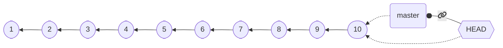

## Configuration

Configuration in Git happens at two level
* **global**: the default options, valid system-wide
* **repository**: the options specific to a repository. They have *precedence* over the global settings

### Strategy

Set up the global options reasonably,
then override them at the repository level, if needed.

### `git config`

The `config` subcommand sets the configuration options
* when operated with the `--global` option, configures the tool globally
* otherwise, it sets the option for the *current repository*
  * (there must be a valid repository)
* Usage: `git config [--global] category.option value`
  * sets `option` of `category` to `value`

---

## Configuration: main options

As said, `--global` can be omitted to override the global settings locally

### Username and email: `user.name` and `user.email`

A name and a contact are always saved as metadata, so they need to be set up

* `git config --global user.name "Your Real Name"`
* `git config --global user.email "your.email.address@your.provider"`

### Default editor

Some operations pop up a text editor.
It is convenient to set it to a tool that you know how to use
(to prevent, e.g., being "locked" inside `vi` or `vim`).
Any editor that you can invoke from the terminal works.

* `git config --global core.editor nano`

### Default branch name

How to name the default branch.
Two reasonable choices are `main` and `master`

* `git config --global init.defaultbranch master`

---

## Initializing a repository

### `git init`
* Initializes a new repository *inside the current directory*
* Reified in the `.git` folder
* The location of the `.git` folder marks the root of the repository
  * Do not nest repositories inside repositories, it is fragile
  * Nested projects are realized via *submodules* (not discussed in this course)
* **Beware of the place where you issue the command!**
  * First use `cd` to locate yourself inside the folder that contains (or will containe the project)
    * (possibly, first create the folder with `mkdir`)
  * **Then** issue `git init`
  * if something goes awry, you can delete the repository by deleting the `.git` folder.

---

## Staging

Git has the concept of *stage* (or *index*).
* Changes must be added to the stage to be committed.
* Commits save the *__changes__ included in the stage*
  * Files changed after being added to the stage neet to be re-staged
* `git add <files>` moves the current state of the files into the stage as *changes*
* `git reset <files>` removes currently staged *changes* of the files from stage
* `git commit` creates a new *changeset* with the contents of the stage


---

## Observing the repository status

It is extremely important to understand *clearly* what the current state of affairs is
* Which *branch* are we working on?
* Which *files* have been *modified*?
* Which *changes* are already *staged*?

`git status` prints the current state of the repository, example output:

```git
❯ git status
On branch master
Your branch is up to date with 'origin/master'.

Changes to be committed:
  (use "git restore --staged <file>..." to unstage)
        modified:   content/_index.md
        new file:   content/dvcs-basics/_index.md
        new file:   content/dvcs-basics/staging.png

Changes not staged for commit:
  (use "git add <file>..." to update what will be committed)
  (use "git restore <file>..." to discard changes in working directory)
        modified:   layouts/shortcodes/gravizo.html
        modified:   layouts/shortcodes/today.html
```

---

## Committing

* Requires an **author** and an **email**
  * They can be configured *globally* (at the *computer level*):
    * `git config --global user.name 'Your Real Name'`
    * `git config --global user.email 'your@email.com'`
  * The global settings can be *overridden* at the *repository level*
    * e.g., you want to commit with a different email between work and personal projects
    * `git config user.name 'Your Real Name'`
    * `git config user.email 'your@email.com'`
* Requires a **message**, using appropriate messages is **extremely important**
  * If unspecified, the commit does not get performed
  * it can be specified inline with `-m`, otherwise Git will pop up the *default editor*
    * `git commit -m 'my very clear and explanatory message'`
* The *date* is recorded automatically
* The *commit identifier* (a cryptographic hash) is generated automatically

---

## Default branch

At the first commit, there is no branch and no `HEAD`.

Depending on the version of Git, the following behavior may happen upon the first commit:
* Git creates a *new branch* named `master`
  * *legacy behavior*
  * the name is inherited from the default branch name in *Bitkeeper*
* Git creates a *new branch* named `master`, but warns that it is a deprecated behavior
  * although coming from the Latin "*magister*" (teacher) and not from the "master/slave" model of asymmetric communication control, many recently prefer `main` as seen as more inclusive
* Git refuses to commit until a default branch name is specified
  * *modern behavior*
  * Requires configuration: `git config --global init.defaultbranch default-branch-name`

---

## Ignoring files

In general, we do not want to track *all* the files in the repository folder:
* Some files could be *temporary* (e.g., created by the editor)
* Some files could be *regenerable* (e.g., compiled binaries and application archives)
* Some files could contain *private* information

Of course, we could just not `add` them, but the error is around the corner!

It would be much better to just tell Git to ignore some files.

This is achieved through a *special `.gitignore` file*.
  * the file must be named `.gitignore`, names like `foo.gitignore` or `gitignore.txt` won't work
    * A good way to create/append to this file is via `echo whatWeWantToIgnore >> .gitignore` (multiplatform command)
  * it is a list of paths that git will ignore (unless `git add` is called with the `--force` option)
  * it is possible to add exceptions

---

## `.gitignore` example

```ignore-list
# ignore the bin folder and all its contents
bin/
# ignore every pdf file
*.pdf
# rule exception (beginning with a !): pdf files named 'myImportantFile.pdf' should be tracked
!myImportantFile.pdf
```

---

<!-- write-here "shared-slides/git/newlines.md" -->

<!-- end-write -->

---

## Dealing with removal and renaming of files

* The removal of a file is a legit *change*
* As we discussed, `git add` adds a *change* to the stage
* **the change can be a removal!**

`git add someDeletedFile` is a correct command, that will stage the fact that `someDeletedFile` does not exist anymore, and its deletion must be registered at the next `commit`.

* File *renaming* is *equivalent to file deletion and file creation* where, incidentally, the new file has the same content of the deleted file
* To stage the rinomination of file `foo` into `bar`:
  * `git add foo bar`
  * it records that `foo` has been deleted and `bar` has been created
  * Git is smart enough to understand that it is a name change, and will deal with it *efficiently*

---

## Visualizing the history

Of course, it is useful to visualize the history of commits.
Git provides a dedicated sub-command:

`git log`

* opens a *navigable interactive view* of the history from the `HEAD` commit (the current commit) backwards
  * Press <kbd>Q</kbd>
* *compact* visualization: `git log --oneline`
* visualization of *all branches*: `git log --all`
* visualization of a lateral *graph*: `git log --graph`
* compact visualization of all branches with a graph: `git log --oneline --all --graph`

---

### example output of `git log --oneline --all --graph`

```text
* d114802 (HEAD -> master, origin/master, origin/HEAD) moar contribution
| * edb658b (origin/renovate/gohugoio-hugo-0.94.x) ci(deps): update gohugoio/hugo action to v0.94.2
|/  
* 4ce3431 ci(deps): update gohugoio/hugo action to v0.94.1
* 9efa88a ci(deps): update gohugoio/hugo action to v0.93.3
* bf32a8b begin with build slides
* b803a65 lesson 1 looks ready
* 6a85f8f ci(deps): update gohugoio/hugo action to v0.93.2
* b474d2a write more on the introductory lesson
* 8a7105e ci(deps): update gohugoio/hugo action to v0.93.1
* 6e40642 begin writing the first lesson
```

---

## Referring to commits: `<tree-ish>`es

In git, a reference to a commit is called `<tree-ish>`. Valid `<tree-ish>`es are:
* Full *commit hashes*, such as `b82f7567961ba13b1794566dde97dda1e501cf88`.
* *Shortened commit hashes*, such as `b82f7567`.
* *Branch names*, in which case the reference is to the last commit of the branch.
* `HEAD`, a special name referring to the current commit (the head, indeed).
* *Tag names* (we will discuss what a tag is later on).

---

## Relative references

It is possible to build *relative references*, e.g., "get me the commit before this `<tree-ish>`",
by following the commit `<tree-ish>` with a tilde (`~`) and with the number of parents to get to:
* `<tree-ish>~STEPS` where `STEPS` is an integer number produces a reference to the `STEPS-th` parent of the provided `<tree-ish>`:
  * `b82f7567~1` references the *parent* of commit `b82f7567`.
  * `some_branch~2` refers to the *parent of the parent* of the last commit of branch `some_branch`.
  * `HEAD~3` refers to the *parent of the parent of the parent* of the current commit.

* In case of merge commits (with multiple parents), `~` selects the first one
* Selection of parents can be performed with caret in case of multiple parents (`^`)
  * We won't go in depth here, but:
    * The [`git rev-parse` reference on specifying revision](https://git-scm.com/docs/git-rev-parse#_specifying_revisions) is publicly available
    * A [much more readable explanation can be found on Stack overflow](https://stackoverflow.com/a/2222920/1916413)

---

## Visualizing the differences

We want to see which *differences* a commit introduced, or what we modified in some files of the work tree

Git provides support to visualize the changes in terms of *modified lines* through `git diff`:
* `git diff` shows the difference between the *stage* and the *working tree*
  * namely, what you would stage if you perform a `git add`
* `git diff --staged` shows the difference between `HEAD` and the *working tree*
* `git diff <tree-ish>` shows the difference between `<tree-ish>` and the *working tree* (*stage excluded*)
* `git diff --staged <tree-ish>` shows the difference between `<tree-ish>` and the *working tree*, *including staged changes*
* `git diff <from> <to>`, where `<from>` and `<to>` are `<tree-ish>`es, shows the differences between `<from>` and `<to>`

---

### `git diff` Example output:

```diff
diff --git a/.github/workflows/build-and-deploy.yml b/.github/workflows/build-and-deploy.yml
index b492a8c..28302ff 100644
--- a/.github/workflows/build-and-deploy.yml
+++ b/.github/workflows/build-and-deploy.yml
@@ -28,7 +28,7 @@ jobs:
           # Idea: the regex matcher of Renovate keeps this string up to date automatically
           # The version is extracted and used to access the correct version of the scripts
           USES=$(cat <<TRICK_RENOVATE
-          - uses: gohugoio/hugo@v0.94.1
+          - uses: gohugoio/hugo@v0.93.3
           TRICK_RENOVATE
           )
           echo "Scripts update line: \"$USES\""
```

The output is compatible with the Unix commands `diff` and `patch`

Still, *binary files are an issue*! Tracking the right files is paramount.

---

## Navigating the history

Navigation of the history concretely means to move the head (in Git, `HEAD`) to arbitrary points of the history

In Git, this is performed with the `checkout` commit:
* `git checkout <tree-ish>`
  * Unless there are changes that could get lost, *moves* `HEAD` to the provided `<tree-ish>`
  * Updates all tracked files to their version at the provided `<tree-ish>`

The command can be used to selectively checkout a file from another revision:
* `git checkout <tree-ish> -- foo bar baz`
  * Restores the status of files `foo`, `bar`, and `baz` from commit `<tree-ish>`, and adds them to the stage (unless there are uncommitted changes that could be lost)
  * Note that `--` is surrounded by whitespaces, it is not a `--foo` option, it is just used as a separator between the `<tree-ish>` and the list of files
    * the files could be named as a `<tree-ish>` and we need disambiguation

---

## Detached head

Git does **not** allow *multiple heads per branch*
(other DVCS do, in particular Mercurial):
for a commit to be valid, `HEAD` must be at the "end" of a branch (on its last commit), as follows:



When an old commit is checked out this condition doesn't hold!

If we run `git checkout HEAD~4`:


The system enters a special workmode called *detached head*.

When **in detached head**, Git allows to make **commits**, but they **are lost**!

(Not really, but to retrieve them we need `git reflog` and `git cherry-pick`, that we won't discuss)
