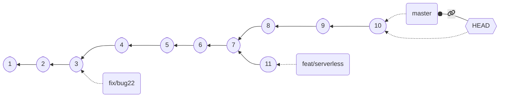
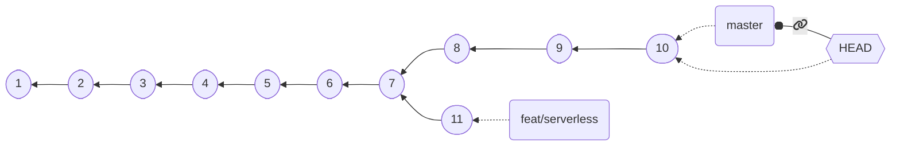

## Branches as labels: deletion

*Branches* work like *special labels* that **move** if a commit is performed when `HEAD` is **attached**.

Also, the *history* tracked by git is a *directed acyclic graph* (each commit has a reference to its parents)

$\Rightarrow$ *Branches can be removed without information loss*, as far as there is at least *another branch* from which *all the commits* of the deleted branch are *reachable*

*Safe* branch deletion is performed with `git branch -d branch-name` (fails if there is information loss).

---

## Branch deletion example

⬇️ `git branch -d fix/bug22` ⬇️

No commit is lost, branch `fix/bug22` is removed

What about `git branch -d feat/serverless`?

It would **fail** with an error message, as `11` would be lost
