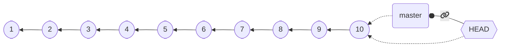
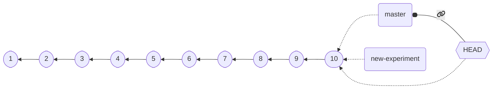
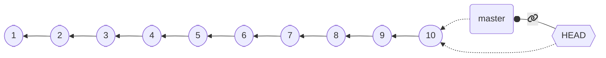
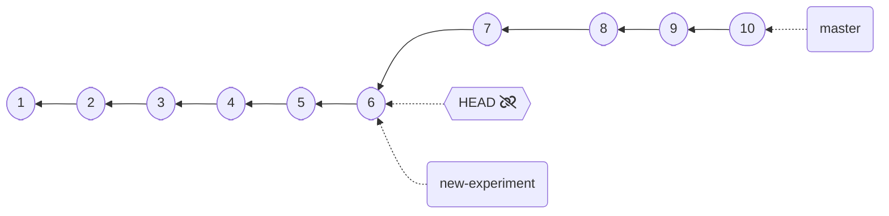
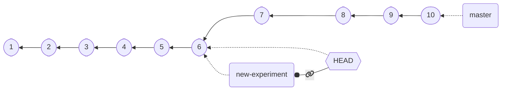
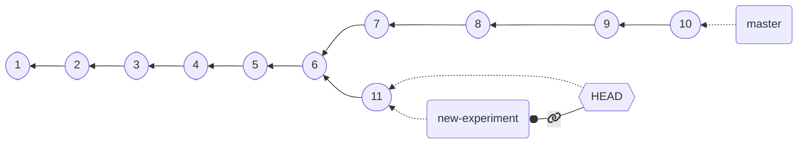
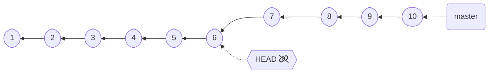
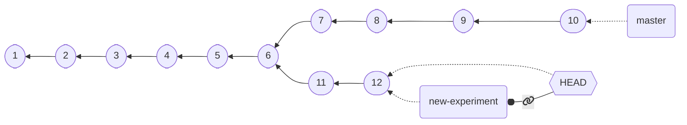
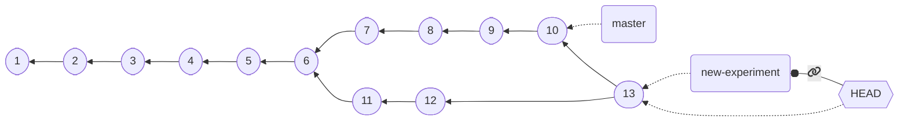
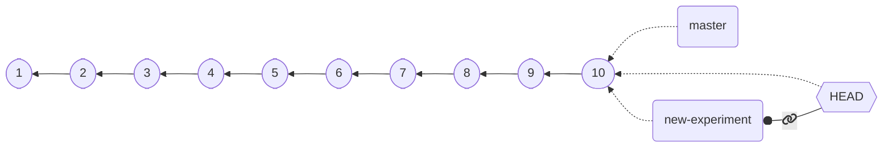

## Branches as labels

To be able to start new development lines,
we need to *create* a **branch**.

In Git, branches work like *movable labels*:
* Upon creation, they are attached to the same commit `HEAD` refers to
* If a new commit is made when `HEAD` is attached to them, they **move along with `HEAD`**

---

## Branch creation

Branches are created with `git branch branch_name`



⬇️ `git branch new-experiment` ⬇️

{}



`HEAD` does not attach to the new branch by default,
an explicit `checkout` is required.

{}

---

## Creating branches when in **DETACHED_HEAD**

Creating new branches allows to store changes made when we are in **DETACHED_HEAD** state.



{}
⬇️ `git checkout HEAD~4` ⬇️

{}

{}


* **DETACHED_HEAD**: our changes will be discarded, unless...
{}

{}
➡️ Next: `git branch new-experiment` ➡️
{}

---

## Creating branches when in **DETACHED_HEAD**

⬇️ `git branch new-experiment` ⬇️



{}
`HEAD` is still *detached* though, we need to *attach it to the new branch* for it to store our commits
{}

{}
➡️ Next: `git checkout new-experiment` ➡️
{}

---

## Creating branches when in **DETACHED_HEAD**

⬇️ `git checkout new-experiment` ⬇️



* New commits will now be stored!

{}

⬇️ [changes] + `git add` + `git commit` ⬇️

{}

{}



$\Rightarrow$ `HEAD` brings our branch forward with it!

{}

---

## One-shot branch creation

As you can imagine, creating a *new branch* and *attaching `HEAD`* to the freshly created branch is pretty common

As customary for common operations, a short-hand is provided: `git checkout -b new-branch-name`
* Creates `new-branch-name` from the current position of `HEAD`
* Attaches `HEAD` to `new-branch-name`



⬇️ `git checkout -b new-experiment` ⬇️


---

## Merging branches

Reunifying diverging development lines is *much trickier* than spawning new development lines

In other words, *merging* is **much trickier** than *branching*

* Historically, with *centralized* version control systems, merging was considered extremely delicate and difficult
* The *distributed* version control systems promoted *frequent*, *small-sized* merges, much easier to deal with
* **Conflicts** *can still arise!*
  * what if we change the same line of code in two branches differently?

In Git, `git merge target` merges the branch named `target` into the current branch (`HEAD` must be attached)

---

## Merge visual example



⬇️ `git merge master` ⬇️

{}



{}

---

## Fast forwarding

Consider this situation:


* We want `new-experiment` to also have the changes from `C7`, to `C10` (to be up to date with `master`)
* `master` contains all the commits of `new-experiment`
* We don't really need a merge commit, we can just move `new-experiment` to point it to `C6`
* $\Rightarrow$ This is called a **fast-forward**
  * It is the *default behavior* in Git when merging branches where the target is the head plus something

{}



{}

---

## Merge conflicts

Git tries to resolve most conflicts by *itself*
* It's *pretty good* at it
* but things can still require *human intervention*

In case of conflict on one or more files, Git marks the subject files as *conflicted*, and modifies them adding *merge markers*:

```text
<<<<<<< HEAD
Changes made on the branch that is being merged into,
this is the branch currently checked out (HEAD).
=======
Changes made on the branch that is being merged in.
>>>>>>> other-branch-name
```

* The user should *change the conflicted files* so that they reflect the *final desired status*
* The (now fixed) files should get added to the stage with `git add`
* The merge operation can be concluded through `git commit`
  * In case of merge, the message is pre-filled in
  * If the message is okay, `git commit --no-edit` can be used to use it without editing

---

## Good practices

**Avoiding merge conflicts is *much* better than solving them**

Although they are unavoidable in some cases, they can be *minimized* by following a few *good practices*:

* **Do not** *track files that can be generated*
  * This is harmful under many points of view, and merge conflicts are one
* **Do** *make many small commits*
  * Each coherent change should be reified into a commit
  * Even very small changes, like modification of the whitespaces
  * Smaller commits help Git better figure out what changed and in which order,
  generally leading to finer grained (and easier to solve) conflicts
* **Do** *enforce style rules* across the team
  * Style changes are legitimate changes
  * Style is often enforced at the IDE level
  * Minimal logical changes may cause widespread changes due to style modifications
* **Do** *pay attention to newlines*
  * Different OSs use different newline characters
  * Git tries to be smart about it, often failing catastrophically
