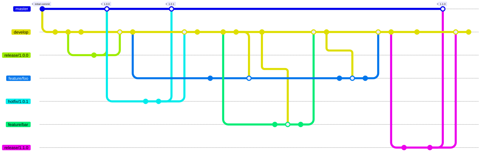

## Git flow structure

---

## Git flow: feature branches

sprouts from `develop` $\Rightarrow$ dies in `develop`

* Should remain up-to-date with develop
* There can be multiple ongoing feature branches

---

## Git flow: release branches

sprouts from `develop` $\Rightarrow$ dies in `master` and `develop`

* Pre-release changes (fixing hardcoded version numbers, changelogs, etc)

---

## Git flow: hotfix branches

sprouts from `master` $\Rightarrow$ dies in `master` and `develop`

* Fix errors that reached the mainline

