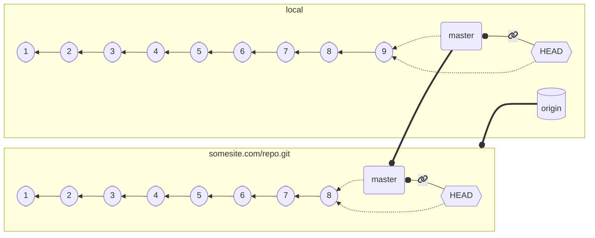

## Importing a repository

* We can initialize an **emtpy** repository with `git init`
* But most of the time we want to start from a *local copy* of an **existing** repository

Git provides a `clone` subcommand that copies *the whole history* of a repository locally
* `git clone URI destination` creates the folder `destination` and clones the repository found at `URI`
  * If `destination` is not empty, fails
  * if `destination` is omitted, a folder with the same namen of the last segment of `URI` is created
  * `URI` can be remote or local, Git supports the `file://`, `https://`, and `ssh` protocols
      * `ssh` *recommended* when available
* The `clone` subcommand checks out the remote branch where the `HEAD` is attached (*default branch*)

Examples:
* `git clone /some/repository/on/my/file/system destination`
  * creates a local folder called `destination` and copies the repository from the local directory
* `git clone https://somewebsite.com/someRepository.git myfolder`
  * creates a local folder called `myfolder` and copies the repository located at the specified `URL`
* `git clone user@sshserver.com:SomePath/SomeRepo.git`
  * creates a local folder called `SomeRepo` and copies the repository located at the specified `URL`

---

## Remotes

* Remotes are the *known copies* of the repository that exist somewhere (usually in the Internet)
* Each remote has a *name* and a *URI*
* When a repository is created via `init`, no remote is known.
* When a repository is imported via `clone`, a remote called `origin` is created automatically

*Non-local branches can be referenced* as `remoteName/branchName`

The `remote` subcommand is used to inspect and manage remotes:
* `git remote -v` *lists* the known remotes

* `git remote add a-remote URI` *adds* a new remote named `a-remote` and pointing to `URI`
* `git remote show a-remote` displays *extended information* on `a-remote`
* `git remote remove a-remote` *removes* `a-remote` (it does not delete information on the remote, it *locally* forgets that it exits)

---

## Upstream branches

Remote branches can be *associated* with local branches, with the intended meaning that the local and the remote branch are *intended to be two copies of the same branch*

* A remote branch associated to a local branch is its **upstream branch**
* upstream branches can be configured via `git branch --set-upstream-to=remote/branchName`
  * e.g.: `git branch --set-upstream-to=origin/develop` sets the current branch upstream to `origin/develop`
* When a repository is initialize by `clone`, its default branch is checked out locally with the same name it has on the remote, and the remote branch is automatically set as *upstream*

---

### Actual result of `git clone git@somesite.com/repo.git`


* `git@somesite.com/repo.git` is saved as `origin`
* The main branch (the branch where `HEAD` is attached, in our case `master`) on `origin` gets checked out locally with the same name
* The local branch `master` is set up to track `origin/master` as upstream
* Additional branches are *fetched* (they are known locally), but they are not checked out

---

## Importing remote branches

`git branch` (or `git checkout -b`) can checkout remote branches locally *once they have been fetched*.


➡️ `git checkout -b imported-feat origin/feat/serverless` ➡️

---

⬇️ `git checkout -b imported-feat origin/feat/serverless` ⬇️


* A new branch `imported-feat` is created locally, and `origin/feat/new-client` is set as its *upstream*

---

## Importing remote branches

* It is customary to reuse the upstream name if there are no conflicts
  * `git checkout -b feat/new-client origin/feat/new-client`
* Modern versions of Git automatically checkout remote branches if there are no ambiguities:
  * `git checkout feat/new-client`
  * creates a new branch `feat/new-client` with the upstream branch set to `origin/feat/new-client` if:
    * there is **no** *local branch* named `feat/new-client`
    * there is **no** *ambiguity* with remotes
  * Quicker if you are working with a single remote (pretty common)

---

## Example with multiple remotes


➡️ Next: `git clone git@somesite.com/repo.git` ➡️

---

⬇️ `git clone git@somesite.com/repo.git` ⬇️


➡️ Next: `git checkout -b feat/serverless origin/feat/serverless` ➡️

---

⬇️ `git checkout -b feat/serverless origin/feat/serverless` ⬇️


➡️ Next: `git remote add other git@somewhereelse.org/repo.git` ➡️

---

⬇️ `git remote add other git@somewhereelse.org/repo.git` ⬇️


➡️ Next: `git checkout -b other-master other/master` ➡️

---

⬇️ `git checkout -b other-master other/master` ⬇️


---

## Multiple remotes

You can operate with *multiple remotes*! Just remember: *branch names* must be *unique* for every repository
  * If you want to track `origin/master` and `anotherRemote/master`, you need *two local branches* with *diverse names*

---

## Fetching updates

To check if a *remote* has any *update* available, git provides th `git fetch` subcommand.
* `git fetch a-remote` checks if `a-remote` has any new information. If so, it downloads it.
  * **Note**: *it does **not** merge* it anywhere, it just memorizes its current status
* `git fetch` without a remote:
  * if `HEAD` is *attached* and the *current branch* has an *upstream*, then the *remote* that is hosting the *upstream branch* is fetched
  * otherwise, `origin` is fetched, if present
* To apply the updates, is then necessary to use *manually* use `merge`

The new *information fetched* includes new *commits*, *branches*, and *tags*.

---

## Fetch + merge example


➡️ Next: Changes happen on `somesite.com/repo.git` and on our repository concurrently ➡️

---

## Fetch + merge example

⬇️ Changes happen on `somesite.com/repo.git` and on our repository concurrently ⬇️


➡️ `git fetch && git merge origin/master` (assuming no conflicts or conflicts resolved) ➡️

---

## Fetch + merge example

⬇️ `git fetch && git merge origin/master` (assuming no conflicts or conflicts resolved) ⬇️


If there had been no updates locally, we would have experienced a *fast-forward*

---

## `git pull`

*Fetching* the remote with the upstream branch and then *merging* is *extremely common*,
so common that there is a special subcommand that operates.

`git pull` is equivalent to `git fetch && git merge FETCH_HEAD`
* `git pull remote` is the same as `git fetch remote && git merge FETCH_HEAD`
* `git pull remote branch` is the same as `git fetch remote && git merge remote/branch`

`git pull` is more commonly used than `git fetch` + `git merge`,
still, it is important to understand that *it is not a primitive operation*

---

## Sending local changes

Git provides a way to *send* changes to a remote: `git push remote branch`
* sends the current branch changes to `remote/branch`, and updates the remote `HEAD`
* if the branch or the remote is omitted, then the *upstream* branch is used
* `push` *requires writing rights to the remote repository*
* `push` *fails* if the pushed branch is not a *descendant* of the destination branch, which means:
  * the destination branch has *work that is not present* in the local branch
  * the destination branch *cannot be fast-forwarded* to the local branch
  * the commits on the destination branch *are not a subset* of the ones on the local branch

#### Pushing tags

By default, `git push` does not send *tags*
* `git push --tags` sends only the tags
* `git push --follow-tags` sends commits and then tags

---

## Example with git pull and git push


➡️ Next: [some changes] `git add . && git commit` ➡️

---

## Example with git pull and git push

⬇️ [some changes] `git add . && git commit` ⬇️



➡️ Next: `git push` ➡️

---

## Example with git pull and git push

⬇️ `git push` ⬇️


* Everything okay! `origin/master` was a *subset* of `master`
* The remote `HEAD` can be *fast-forwarded*

➡️ Next: someone else pushes a change ➡️

---

## Example with git pull and git push

⬇️ someone else pushes a change ⬇️


➡️ Next: [some changes] `git add . && git commit` ➡️

---

## Example with git pull and git push

⬇️ [some changes] `git add . && git commit` ⬇️


➡️ Next: `git push` ➡️

---

## Example with git pull and git push

⬇️ `git push` ⬇️

{}
**ERROR**

```text
To somesite.com/repo.git
 ! [rejected]        master -> master (fetch first)
error: failed to push some refs to 'somesite.com/repo.git'
hint: Updates were rejected because the remote contains work that you do
hint: not have locally. This is usually caused by another repository pushing
hint: to the same ref. You may want to first integrate the remote changes
hint: (e.g., 'git pull ...') before pushing again.
hint: See the 'Note about fast-forwards' in 'git push --help' for details.
```

* `master` is not a *superset* of `origin/master`
  * commit `10` is in `origin/master` but not in `master`, preventing a remote *fast-forward*
* How to solve?
  * (Git's error explains it pretty well)
{}

{}
➡️ Next: `git pull` ➡️
{}

---

## Example with git pull and git push

⬇️ `git pull` (assuming no merge conflicts, or after conflict resolution) ⬇️


* Now `master` is a *superset* of `origin/master`! (all the commits in `origin/master`, plus `11` and `12`)

➡️ Next: `git push` ➡️

---

## Example with git pull and git push


⬇️ `git push` ⬇️


The push suceeds now!
