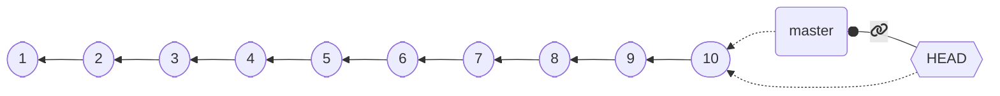
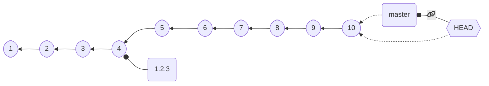
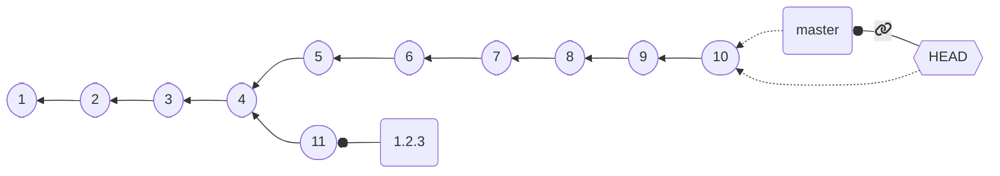
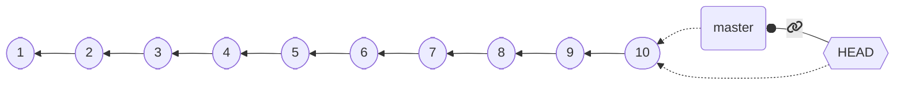
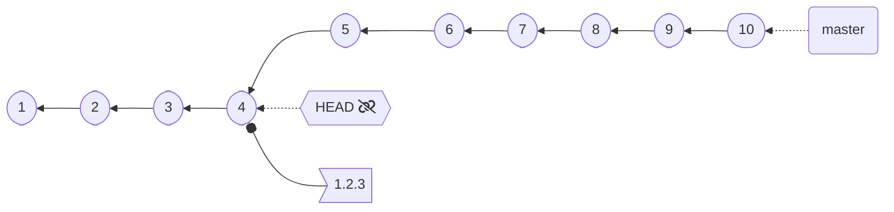

## Associating symbolic names to commits

It is often handful to associate some commits with a *symbolic name*,
most of the time to assign *versions*.
* e.g., identify commit `8d400c0` as version `1.2.3`

Although in principle *branches* could be used to do so, their nature is of *moving labels*:
when `HEAD` is attached, new commits move the branch forward.
We would like to have *branches to which `HEAD` cannot attach* (hence, they can't be moved from their creation point).

⬇️ `git checkout C4 && git branch 1.2.3 && git checkout master` ⬇️

---

## Branches as attachable (and movable) labels

Looks good, but if we do something like: ⬇️ `git checkout 1.2.3` [some changes] `git commit` ⬇️

Our version **moved**, *we never want this to happen*!

---

## Tagging

The `tag` subcommand to create *permanent labels* attached to commits.
Tags come in two fashions:
* **Lightweight** *tags* are very similar to a "permanent branch": *pointers to commits that never change*
* **Annotated** *tags*  (option `-a`) store additional information: a *message*, and, optionally, a *signature* (option `-s`/`-u`)

➡️ `git checkout C4 && git tag 1.2.3` ➡️

---

⬇️ `git checkout C4 && git tag 1.2.3` ⬇️

`HEAD` cannot attach to tags!

---

## Pushing tags

Tags are **not** pushed by default.

To push tags, use `git push --tags` after a normal push.

Alternatively, use `git push --follow-tags` to push both commits and tags.
