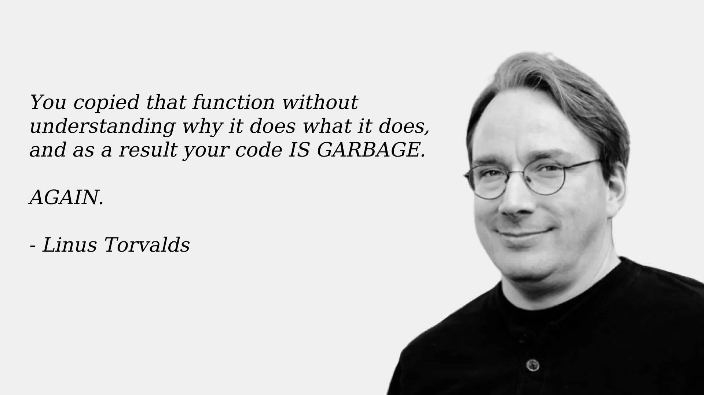

 
+++

title = "Progettazione e Sviluppo del Software"
description = "Progettazione e Sviluppo del Software, Tecnologie dei Sistemi Informatici"
outputs = ["Reveal"]
aliases = ["/intro/"]

+++

# Introduzione al corso *Progettazione e Sviluppo del Software (PSS)*

{}

---

# Docenti

* Titolare del corso: Prof. Danilo Pianini
  * e-mail: [`danilo.pianini@unibo.it`](mailto:danilo.pianini@unibo.it)
  * homepage: [`https://www.unibo.it/sitoweb/danilo.pianini`](https://www.unibo.it/sitoweb/danilo.pianini)
* Modulo 2: Prof. Gianluca Aguzzi
  * e-mail: [`gianluca.aguzzi@unibo.it`](mailto:gianluca.aguzzi@unibo.it)
  * homepage: [`https://www.unibo.it/sitoweb/gianluca.aguzzi`](https://www.unibo.it/sitoweb/gianluca.aguzzi)
* Modulo 3 (Lab): Prof. Paolo Baldini
  * e-mail: [`p.baldini@unibo.it`](mailto:p.baldini@unibo.it)
  * homepage: [`https://www.unibo.it/sitoweb/p.baldini/`](https://www.unibo.it/sitoweb/p.baldini/)

* Tutor: Dott. Luca Deluigi
  * e-mail: [`luca.deluigi5@unibo.it`](mailto:luca.deluigi5@unibo.it)
  * homepage: [`https://www.unibo.it/sitoweb/luca.deluigi5/`](https://www.unibo.it/sitoweb/luca.deluigi5/)
  

---

# Sito del corso su `virtuale.unibo.it`

* URL: [https://virtuale.unibo.it/course/view.php?id=65701](https://virtuale.unibo.it/course/view.php?id=65701)
  * sarà il luogo degli avvisi (e notifiche), forum di discussione, e della pubblicazione del materiale
  * tutti gli studenti che seguono il corso si iscrivano, e lo tengano d'occhio

---

# Contatti

### Come contattare

* Attraverso il **Forum Studenti** per domande la cui risposta è di interesse generale
  * URL: [https://virtuale.unibo.it/mod/forum/view.php?id=1628532](https://virtuale.unibo.it/mod/forum/view.php?id=1628532)
  * tutte le domande tecniche
  * tutte le domande sull'organizzazione del corso
* Via **email** *tenendo in copia tutti i docenti*
  * Per questioni personali
  * Si usi e-mail istituzionale `@studio.unibo.it`
  * Si usi prefisso `[LPTSI-PSS]` nel subject della mail
* **Ricevimento**
  * Si vedano le pagine web dei docenti

---

# Organizzazione generale del corso

## Lezioni aula (giovedì 9-11, venerdì 9-12)

* Illustrano i concetti teorici, metodologici, e pratici
* Basate su slide proiettate (ma non solo)

## Laboratorio (martedì 9-12)

* Illustra aspetti metodologici e pratici
* Con esercizi (da svolgere in autonomia) necessari alla comprensione e alla sperimentazione
    * Con l'aiuto del docente e del tutor per dubbi, problemi, e *correzioni*
* *È parte integrante del corso*, è **fondamentale per riuscire a sostenere l'esame**

## Studio a casa
* Rilettura slide
* Completamento di tutti gli esercizi presentati in laboratorio
* È praticamente obbligatorio se volete rimanere in pari...

---

# Contenuti

## Programma (di massima) del corso

* Elementi base di programmazione *object-oriented (OO)*
    * Incapsulamento, Ereditarietà, Polimorfismo
* Conoscenza del linguaggio Java
    * Vi sarà utile anche per capire il linguaggio Kotlin a Sistemi Mobile
* Aspetti avanzati dei linguaggi OO
    * Generici e varianza
    * Reflection
    * Lambda expressions, stream, e programmazione ibrida OO/funzionale
* Librerie (incluse interfacce grafiche)
* Testing
* Pattern e *buone pratiche di programmazione*
* Organizzazione di un progetto software
    * Version control (`git`)
    * Build automation (`gradle`)

---

# Materiale

- Slide (e codice sorgente) a cura dei docenti
  - messi a disposizione sul sito del corso su Virtuale
  - necessari e sufficienti per acquisire le competenze e superare l'esame

## Testi di riferimento (non necessario l'acquisto)
  ### Programmazione in Java
  * B.Eckel. Thinking in Java, 4th edition.
  * J.Block. Effective Java, 2nd edition.
  * R.Warburton. Java 8 Lambdas.

<!--  ### Programmazione in C\#
  * Jon Skeet. C\# in depth, 3rd edition.
-->

  ### Altri riferimenti
  * E.Gamma et al. Design Patterns Elements of Reusable Object-Oriented Software.
  * R.Martin. Clean Code: A Handbook of Agile Software Craftsmanship
  * Java online documentation (tutorials, Language Specification, APIs)

---

# Software
## Java
* OpenJDK 25 (Open Java Development KIT) https://jdk.java.net/25/
* IntelliJ Idea https://www.jetbrains.com/idea/
* Gradle https://gradle.org/
* Git https://git-scm.com/

## Istruzioni sull'installazione (sul PC di casa)
* https://unibo-lptsi-pss.github.io/software-installation/
* **Molto importante rendersi operativi prima del primo laboratorio!**
  * $\Rightarrow$ è consigliato l'uso del sistema operativo Linux

---

# Sul ruolo di questo corso
## Elementi essenziali
* Costruzione del software, e quindi di sistemi
* Analisi problemi, e organizzazione di soluzioni
* Tecniche base ed (alcune) avanzate di programmazione ad oggetti
* Introduzione al trend della programmazione moderna
* Gestione del progetto
* Utilizzo di strumenti integrati di sviluppo

## L'importanza nel vostro percorso
* Enfasi sull'approccio metodologico
* Competenze a curriculum
* Target di qualità piuttosto elevato
* È cruciale dedicargli subito il tempo necessario

---

# Esame

## Sviluppo + Discussione progetto

* *Progetto sviluppato in gruppo (3-4 studenti)* <!-- ; 60-70 ore a testa -->
    * Potete formare i gruppi anche prima del progetto, e aiutarvi per i laboratori
    * Il progetto vero e proprio andrà iniziato dopo la fine delle lezioni, perché solo allora avrete tutti gli elementi necessari
* Concordato col docente prima di iniziare
* Esempi di progetti del passato:
    * Tutti i progetti passati
        * https://github.com/orgs/unibo-lp-pss-projects/repositories
    * Progetti "carini" (notare che non significa che siano ben progettati!)
        * https://unibo-oop.github.io/showcase/
        * Alcuni sono del corso di OO alla Laurea Triennale, ma sono comunque interessanti
* Da relazionare con qualità, poi *discusso oralmente* (su appuntamento)
    * I dettagli (cf. consegna, relazione etc.) discussi durante il corso
    * Esempio (e template) di relazione: https://github.com/unibo-oop/OOP-report-template/releases/latest/download/13-template.pdf

---

## LLM e strumenti di AI

Esistono strumenti di intelligenza artificiale (tipicamente Large Language Models, LLM)
che possono essere utilizzati per **generare codice**.

* Allenati a partire da grandi quantità di codice sorgente *preesistente*
    * Soggetti al problema "garbage in, garbage out"
    * Risolvono molto bene (e velocemente) problemi semplici
    * Vanno utilizzati con **cautela** per problemi complessi
* Fruibili via web o integrati come *agenti* all'interno dell'ambiente di sviluppo
* Usati sempre di più, anche in contesti professionali
    * Con risultati variabili

### In questo corso: **vietati**

* Non sono consentiti in laboratorio
* Non sono consentiti a casa
* Non saranno disponibili per l'esame
    * E sono abbastanza riconoscibili usando la similarità fra progetti, per la quale abbiamo strumenti che già usiamo

---

### Motivazione

Sono strumenti *potentissimi*, ma è necessario saperli usare **criticamente**, altrimenti:
* Possono ostacolare e rallentare l'apprendimento
  * Problema del *cognitive offloading*: se non si impara a fare da soli, si impara meno
* Possono generare codice di bassa qualità (con bug, inefficienze, o problemi di stile che non riconoscete)
* Possono usare parti del linguaggio che ancora non potete conoscere
    * Ergo, generare codice non ancora comprensibile

---

## Sviluppo software, LLM, e perché usarli solo **dopo** che si è diventati esperti

Scrivere codice è la parte *facile*: la parte difficile è **decidere cosa scrivere**
e **accorgersi quando è sbagliato**

* Un LLM produce codice **plausibile**, non necessariamente *corretto*
    * Distinguere i due casi richiede *esattamente* la competenza che state costruendo
* Cosa fa un **esperto** con un assistente AI, misurato sul campo:
    * accetta meno del **44%** di ciò che il modello propone
    * il **75%** dichiara di leggere *ogni riga* generata
    * il **56%** deve fare **pulizia importante** su ciò che tiene
* La qualità del codice finale regge **perché c'è un esperto che filtra**,
    non perché il modello la garantisca
    * Togliete il filtro e resta solo il codice plausibile: *voi non siete ancora quel filtro*
* Chi non ha il filtro accumula debito:
    stanno nascendo aziende e professionisti di "**AI code cleanup**"

### In sintesi

Prima si diventa il revisore, **poi** si usa l'acceleratore

---

## Cosa dice davvero la letteratura scientifica

* Sviluppatori **esperti**, su progetti maturi che conoscono bene: con AI **19% più lenti**
    ([METR, 2025](https://arxiv.org/abs/2507.09089)) --- il tempo se ne va in verifica e correzione
    * Gli stessi autori, nel [follow-up 2026](https://metr.org/blog/2026-02-24-uplift-update/),
      avvertono che con gli strumenti più recenti la stima non è più affidabile
* **Manutenibilità**: 151 partecipanti, nessuna differenza significativa nell'evolvere codice
    scritto con o senza AI ([Borg et al., EMSE 2026](https://doi.org/10.1007/s10664-026-10889-1))
* **Sicurezza**: è l'area critica --- più vulnerabilità ad alto rischio nel codice generato
    ([Cotroneo et al., ISSRE 2025](https://doi.org/10.1109/ISSRE66568.2025.00035)),
    e gli LLM riconoscono il codice vulnerabile solo nel **12-40%** dei casi
    ([EMSE 2025](https://doi.org/10.1007/s10664-025-10658-6))
* A livello di organizzazione: +25% di adozione AI, qualità percepita **+3.4%**
    ma stabilità dei rilasci **-7.2%** ([DORA, 2024](https://cloud.google.com/blog/products/devops-sre/announcing-the-2024-dora-report))

---

Linus Torvalds, creatore di Linux, commentando un contributo contenente codice generato da un LLM

---

# Prerequisiti

## Buona conoscenza
* tecniche di programmazione imperativa/strutturata
* costruzione e comprensione di semplici algoritmi e strutture dati

## Attenzione a chi è già "fluente" in linguaggi ad oggetti
* Java o C\#
* è difficile disimparare le cattive abitudini!

---

# Introduzione al corso *Progettazione e Sviluppo del Software (PSS)*

{}