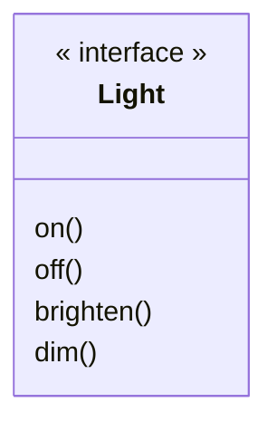
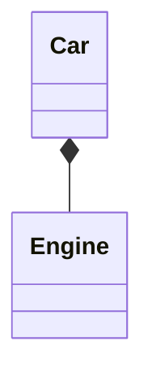
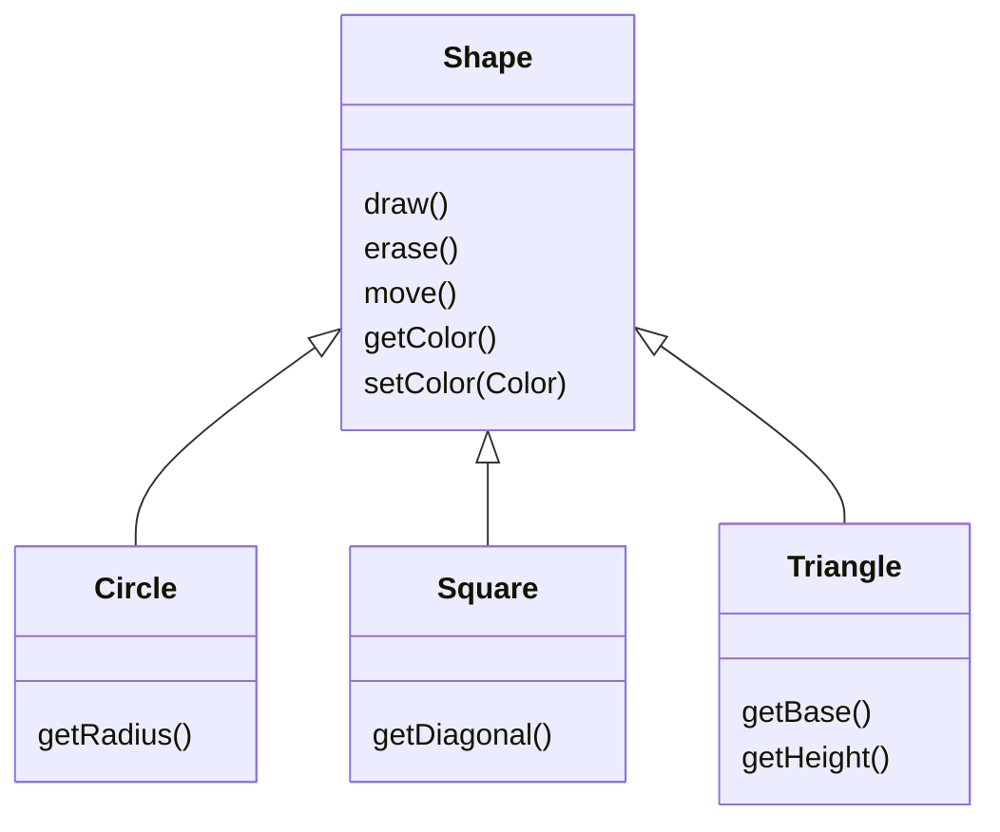
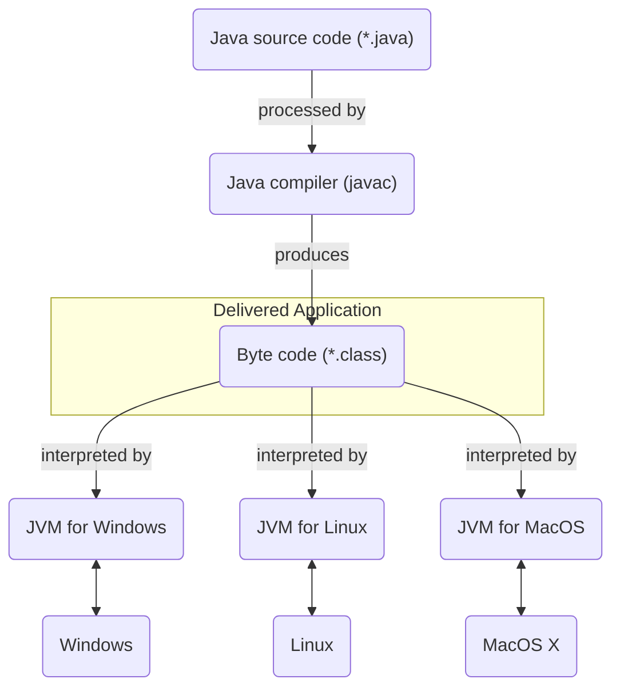

 
+++

title = "Progettazione e Sviluppo del Software"
description = "Progettazione e Sviluppo del Software, Tecnologie dei Sistemi Informatici"
outputs = ["Reveal"]
aliases = ["/oo-abstraction/"]

+++

# Ingegneria e astrazione orientata agli oggetti

<!-- write-here "cover.md" -->

<!-- end-write -->

# Sistemi software e Ingegneria

---

## Sistemi software
  
### Obiettivo di questo corso

Insegnare tecniche moderne per la costruzione di sistemi software 
$\Rightarrow$ utilizzando i concetti dei *__sistemi ad oggetti__*, che sono "mainstream"
  
### Programma vs sistema software

*__Programma__*: un set di istruzioni che automatizzano la soluzione di una classe di problemi, spesso associato ad una visione algoritmica della computazione (Input $\rightarrow$ Output). 
*__Sistema software__*: un'aggregazione di componenti di varia natura (programmi, librerie, parti del sistema operativo, basi di dati, interfacce grafiche, servizi Web, rete, dispositivi hardware) che cooperano per fornire una funzionalità computazionale.

---

## Casi di sistemi software

### Esempi
*  Calcolatrice matematica
*  Applicazione per gestire esami universitari
*  Simulatore di circuiti elettronici, movimento di folle, movimento pianeti 
*  Monitor e elaborazione di dati biometrici (pressione, dati cardiaci,..)
*  App per smartphone che mostra dove si trovano i miei contatti social
*  Video-game in cui personaggi virtuali vivono in un ambiente 3D
*  Controllore per dispositivi domotici (luce, termosifoni, acqua)
 
### Caratteristiche comuni
*  Non meri programmi, ma sistemi "pilotati" da software
*  Includono componenti algoritmiche, ma anche interazioni complesse
*  Alcuni realizzabili già alla fine di questo corso, altri richiedono maggiore expertise

---

## Fasi del processo di sviluppo

### Analisi

Si definisce in modo preciso il *__problema__* da risolvere (non la soluzione!)
  
### Design

Si definisce la struttura del sistema da sviluppare
*  progetto architetturale + progetto di dettaglio
*  si descrive la *__soluzione__*, ad uno specifico livello di dettaglio
  
### Implementazione/codifica

Si realizza il sistema sulla base del progetto, scegliendo le tecnologie adeguate (efficienti, efficaci)
* ad esempio, il linguaggio di programmazione 

### Attività di manutenzione: Collaudo, Deployment

Fasi necessarie, che spesso impiegano più del 70% delle risorse complessive

---

## Il problema dello sviluppo di sistemi software
  
http://it.wikipedia.org/wiki/Software_crisis
  
### Quali cause possono comportare il fallimento di un progetto SW?
*  Inadeguata analisi (requisiti non compresi appieno)
*  Inadeguata (o assente) progettazione
*  Cattive pratiche di programmazione 
*  Aspetti organizzativi nel team di sviluppo
    
---

## Problem space vs solution space: il "buon progetto"
 
### Problem space (fase di analisi)
L'insieme delle entità e relazioni nel mondo "reale" sulla base delle quali si formula il problema che il sistema software deve risolvere
*  per il gestionale per esami universitari: studente, corso, corso di laurea, appello, voto
  
### Solution space (fase di progetto e implementazione)

Il corrispondente insieme di entità e relazioni nel mondo "artificiale" che devono risolvere
il problema (realizzate mediante i linguaggi e le tecnologie scelte e a fronte del progetto). 
*  funzione per il calcolo della media
*  struttura dati per rappresentare i dati di uno studente
*  form per visualizzare gli esami di uno studente
 
**Un buon progetto mappa al meglio il problem space nel solution space**

---

## Concetti del solution/problem space: "livello di astrazione"
  
### Definizione di astrazione (nell'informatica)
*  È un metodo per descrivere un sistema informatico complesso mettendone da parte alcune caratteristiche specifiche, per facilitarne la progettazione, implementazione e manutenzione.
*  Un *__livello di astrazione__* è un insieme di concetti e relazioni che definiscono una astrazione, usabili quindi per definire in modo conveniente un sistema informatico
  
---

## Il livello d'astrazione dei linguaggi di programmazione
  
### Astrazione e programmazione
*  Ogni linguaggio di programmazione introduce un livello di astrazione
*  I concetti del sistema da realizzare (nel gestionale esami: corsi, voti, studenti, calcolo media voti) devono essere tradotti nei "costrutti" forniti dal linguaggio
*  È facile? È conveniente? È flessibile? Dipende dal linguaggio...
  
### Il livello di astrazione del C (e della progr. procedurale/imperativa)
*  Stato del sistema $\Rightarrow$ È costituito da strutture dati (costruite con tipi primitivi, array, puntatori e struct) tenute in stack e/o heap
*  Dinamica $\Rightarrow$ Esecuzione di procedure imperative, innestate ricorsivamente appoggiandosi allo stack
*  Organizzazione $\Rightarrow$ Librerie come set di funzioni, ricongiunte in un unico programma all'atto della compilazione/linking

---

## I limiti del linguaggio C

### C porta ad una visione piuttosto machine-oriented
*  È un livello di astrazione *fortemente influenzato dall'HW* sul quale si eseguono i programmi (CPU, memoria)
    *  uso criptico di direttive di compilazione
    *  allocazione/deallocazione dinamica manuale della memoria via librerie
    *  difficile controllo degli errori di esecuzione
    *  difficoltà a controllare gli aspetti HW-dependent
    *  difficoltà a modificare codice già "acquisito"
        *  Nota: il C nasce negli anni '70 per rimpiazzare l'Assembly nell'implementazione del sistema operativo UNIX

### La direzione dei linguaggi moderni -- o di "alto livello" (d'astrazione)
*  Introdurre un livello di astrazione vicino al problema da risolvere, ignorando il più possibile i dettagli dell'HW per risolverlo

---

## L'ecosistema dei linguaggi di programmazione
  
### Linguaggi e livelli di astrazione / paradigma
*  C, Pascal: Computing function/procedure over data structures
*  Lisp, ML: Everything is a function
*  Prolog: Everything is a decision predicate
*  Java, C++, C\#: Everything is an object (OO Programming)
* $\Rightarrow$ L'OOP si è dimostrata efficace per sistemi complessi general-purpose

### L'evoluzione del "mainstream"
Machine Lang $\xrightarrow{1950-1960}$ Assembly $\xrightarrow{1970-'190}$ C $\xrightarrow{'90-2000}$ OOP (Java,..) $\xrightarrow{?}$ ?
  
### Il futuro dei linguaggi (e anche la direzione dei linguaggi OOP)
*  OO + funzionale: Scala, Kotlin, Java 8+
*  Multi-target: Kotlin, Scala, LLVM
*  Linguaggi dinamici: Python, Ruby, Javascript, Groovy
    * O quasi...: TypeScript

---

## I vantaggi della programmazione ad oggetti
  
### Vantaggi
*  *Poche astrazioni* chiave (classe, oggetto, metodo, campo)
*  Usabili sia in progettazione che in codifica
*  Supporto a *estendibilità e riuso*
*  Supporto alla costruzione di librerie di qualità
*  Facilmente integrabile in linguaggi C-like
*  Eseguibile con alta efficienza

$\Rightarrow$ (quasi) tutti aspetti da discutere nel corso

### Le critiche all'OOP
*  Serve molta *disciplina* per "scalare" bene con la complessità del problema
*  Altri paradigmi (fra cui quello funzionale) suggeriscono come farlo...

---

# L'astrazione object-oriented

---

## L'astrazione object-oriented (OO)

# Un **oggetto** possiede
## 1. *stato*
## 2. *comportamento*
## 3. *identità*

---

## Astrazione OO: definizione più dettagliata
*  **Everything is an object.** Un oggetto è una entità che fornisce operazioni per essere manipolata.
*  **Un programma è un set di oggetti che si comunicano cosa fare scambiandosi messaggi.** Questi messaggi sono richieste per eseguire le operazioni fornite.
*  **Un oggetto ha una memoria fatta di altri oggetti.** Un oggetto è ottenuto impacchettando altri oggetti.
*  **Ogni oggetto è istanza di una classe.** Una classe descrive il comportamento dei suoi oggetti.
*  **Tutti gli oggetti di una classe possono ricevere gli stessi messaggi.** La classe indica tra le altre cose quali operazioni sono fornite, quindi per comunicare con un oggetto basta sapere qual è la sua classe.

---

## Sono questi concetti utili per il problem space?
    
### Esempio di sistema reale: la gestione informativa di un ateneo

Come organizzarla? Quale servizi fornisce?

{}

### Visione object-oriented
*  Un corso di laurea (CdL) è un "oggetto"
*  Che operazioni consente? Iscrivi studente, laurea studente, assegna docente a corso, concludi anno accademico, ...
*  Un programma (sistema) è fatto da oggetti: facoltà, corso di laurea, corsi, studente, docente
*  Le interazioni fra questi oggetti sono "scambi di messaggi"
*  Il CdL ha uno stato fatto da altri oggetti: docenti, studenti, corsi
*  Il CdL è istanza di una classe: la classe dei CdL (con una gestione comune) -- UNIBO ne gestisce dozzine contemporaneamente
    
{}

---

## OO: problem space, solution space

### L'esperienza mostra che:
*  È piuttosto agevole modellare sistemi reali (o artificiali) come sistemi orientati agli oggetti
*  Infatti, gli strumenti di modellazione standard usano il paradigma object-oriented! (Vedi UML)
    
### Il vantaggio delle soluzioni object-oriented
*  Consentono di "portare" il problem space nel solution space in modo diretto
*  Usando gli stessi concetti object-oriented anche a livello di programmazione
*  ...ossia supportano il concetto di "buon progetto" che abbiamo discusso

---

## Overview
*  Ogni oggetto ha un'*interfaccia*
*  Un oggetto *fornisce un servizio*
*  Un oggetto deve *nascondere l'implementazione*
*  Le implementazioni possono essere *riusate*
*  Il riuso tramite ereditarietà

---

## Ogni oggetto ha una interfaccia
  
### Classi, istanze, metodi, interfaccia
*  Oggetti simili sono istanze della stessa *__classe__*, o *__tipo__*
*  La classe definisce i messaggi ricevibili, attraverso *__metodi__*
*  L'insieme dei metodi prende il nome di *__interfaccia__*
*  Un messaggio ha effetto su stato e comportamento dell'oggetto

---

Esempio "lampadina" in notazione UML (Unified Modelling Language):

---

## Un oggetto fornisce un servizio
  
### Quale entità del problem space deve diventare un oggetto?
*  Conviene considerare un oggetto come un fornitore di un servizio
*  Tutto il programma può essere visto come un servizio dato all'utente
*  Principio di decomposizione: i sotto-servizi sono affidati ai vari oggetti
  
### Vantaggi di questo approccio
*  Semplifica la progettazione degli oggetti, e il mapping col problema
*  Semplifica il loro riuso in programmi diversi -- come parte di libreria
*  Semplifica la comprensione dei programmi, specialmente da terzi

Opportunità: $\Rightarrow$ Se non se ne riesce a descrivere (e comprendere) il servizio 
offerto, allora probabilmente un oggetto non ha ragione d'esistere!

Coerenza: $\Rightarrow$ Se sembra che un oggetto realizzi due servizi diversi, allora probabilmente bisogna in realtà realizzare due oggetti!

---

## Un oggetto deve nascondere l'implementazione
  
### Le due figure: creatore di classi vs. programmatore cliente
*  Chi produce la classe (e ha la responsabilità del suo funzionamento)
*  Chi usa la classe (per fornire un servizio più di alto livello)
  
### Information hiding
*  Il creatore rende visibile solo una piccola parte della classe
*  Il resto è invisibile perché suscettibile di modifiche future
*  Principio: "less is more"
*  Tipica struttura di una classe 
    *  interfaccia: la sola visibile al cliente, di norma
    *  *__membri__* (o *__campi__*) della classe (i sotto-oggetti di cui è costituito)
    *  implementazione metodi (cosa fa l'oggetto quando riceve messaggi)
        *  come cambia lo stato (membri)
        *  quali messaggi manda ad altri oggetti
        *  quale risultato fornisce (risposta al messaggio)

---

## Le implementazioni possono essere riusate
  
### Fasi del processo di riuso
*  Il creatore produce una classe e ne verifica il corretto funzionamento: diventa una unità riusabile di codice
*  Un cliente può ri-utilizzarla per creare nuovi concetti
  
### La tecnica di riuso più usata è la **composizione**
*  Un nuovo oggetto è costituito da oggetti di altre classi
*  Relazione chiamata "has-a" ("ha un")
*  Questa relazione può essere nascosta, e resa dinamica

---
  
#### Esempio "car+engine" in notazione UML:

---

## Il riuso tramite ereditarietà

### È una ulteriore, fondamentale, tecnica di riuso
*  Un nuovo oggetto(/classe) estende i servizi di uno esistente
*  Fornisce i metodi della sopra-classe, ma anche altri
*  Relazione chiamata "is-a" ("è un")

---

#### Esempio "shape" in notazione UML:

---

## Altri aspetti -- organizzazione del corso

### Funzionalità base -- I parte
*  I concetti appena introdotti
  
### Funzionalità aggiuntive -- II parte
*  Polimorfismo per genericità
*  Gestione delle eccezioni
*  Riflessività, classi innestate, enumerazioni
  
### Tecniche Avanzate -- III parte
*  Librerie avanzate (I/O, GUI, Concorrenza)
*  Integrazione con la programmazione funzionale
*  Pattern di progettazione
*  Prassi di programmazione efficace

---

# Java

---

## Java

*  Linguaggio inventato da J. Gosling, alla Sun Microsystems (1995)
*  Ora gestito da un board che ne porta avanti l'evoluzione
*  Una semplificazione di C++ pensata per sistemi embedded
*  Filosofia *Write once run everywhere*
    * Software scritto in Java può funzionare su Windows, MacOS, Linux, Solaris, su architetture ARM, x86, PowerPC, amd64...
    * Senza bisogno di ricompilare!
*  Molto diffuso in industria
    * https://www.tiobe.com/tiobe-index/
    * https://pypl.github.io/PYPL.html

  
### In questo corso
*  Useremo Java come riferimento per programmazione/progettazione
*  Le guideline progettuali che daremo sono di validità generale
    * Meccanismi simili o identici in C#, C++, Ruby, Python, Kotlin, Scala...

---

## Strumenti Java

### Java Development Kit (JDK)
*  Insieme di tool per lo sviluppatore
* useremo l'ultima versione "long term support" (LTS)
* https://adoptium.net/
  
### Java Virtual Machine (JVM) -- inclusa nel JDK
* Un programma (C/C++) che carica il bytecode delle classi e lo esegue
* Fornisce indipendenza dall'HW, e servizi aggiuntivi (SISOP, GC)
  
### Schema compilazione/interpretazione
*  Compilazione dei programmi col compilatore Java (comando `javac`)
*  Esecuzione del programma con la JVM (comando `java`)

---

## Write once, run everywhere

---

## Sviluppo storico di Java fino agli anni 10

*  Java (1996): versione iniziale
*  Java 1.2 (1998): aggiunta del framework grafico Swing
*  Java 5 (1.5) (2004): aggiunta di generici, inner class, annotazioni
    * Java è così diffuso che si decide non avrà una versione 2.x
    * Da qui, si usa il secondo numero per contare la release
*  Java 6 (2006): miglioramento prestazionale importante
*  Java 7 (2011): supporto a più linguaggi nella JVM, diamond operator
*  Java 8 (2014): aggiunta lambda expression e streams
*  Java 9 (2017): aggiunta Java Module System (Jigsaw)
    * Da qui, un rilascio ogni 6 mesi
* Java 10 (2018): aggiunta local variable type-inference
* Java 11 LTS (2018): rimozione di API deprecate e miglioramenti di performance
* Java 12 (2019): switch expressions
* Java 13 (2019): blocchi di testo

---

## Sviluppo storico di Java dagli anni 20

* Java 14 (2020): pattern Matching per `instanceof` e records
* Java 15 (2020): classi `sealed` (gerarchie sigillate, sum types)
* Java 16 (2021): stabilizzazione di features
* **$\Rightarrow$ Java 17 LTS (2021)**: miglioramento delle switch expressions
* Java 18 (2022): miglioramenti minori
* Java 19 (2022): supporto a Linux/RISC-V

---

### Modello di sviluppo attuale
* Da Java 9, si ha una nuova release ogni 6 mesi
* Ogni due anni, si ha una nuova LTS, e si raccomanda di non rimanere indietro
* OpenJDK produce l'implementazione di riferimento del JDK
    * Ne esistono anche altre!
        * Eclipse OpenJ9, Amazon Corretto, GraalVM...

