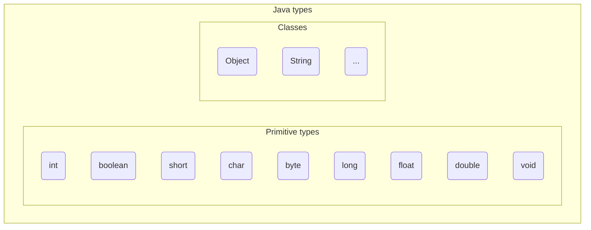

+++

title = "Progettazione e Sviluppo del Software"
description = "Progettazione e Sviluppo del Software, Tecnologie dei Sistemi Informatici"
outputs = ["Reveal"]
aliases = ["/basics/"]

+++

# Introduzione al linguaggio Java

{}

---

## Outline
  
### Goal della lezione
*  Mostrare un primo semplice programma Java
*  Fornire una panoramica di alcuni meccanismi base di Java
  
### Argomenti
* Stampa a video
* Tipi primitivi e operatori
* Variabili e riferimenti

---

## Hello World in Java (25+)

```java
void main() {
    System.out.println("Hello, World!");
}
```
In C sarebbe:
```c
#include <stdio.h>
int main(void) {
    printf("Hello, World!\n");
    return 0;
}
```

Come leggerlo?
- In Java esiste un oggetto chiamato `System` che rappresenta il sistema (creato automaticamente dalla virtual machine)
- L'oggetto system può ricevere il messaggio `out`, e risponde fornendo un oggetto che rappresenta lo standard output
- Fra i messaggi che l'oggetto che rappresenta lo standard output può ricevere ci sono:
    - `print`, analogo a `printf` in C, che stampa a video la stringa fornita
    - `println`, come `print`, ma va a capo sempre anche se non viene specificato `\n` 

---

## Compilazione ed esecuzione

- Salviamo il sorgente dentro un file `HelloWorld.java`
- Java è un linguaggio compilato, prima di eseguirlo dobbiamo compilarlo
    - Ossia, dobbiamo *tradurlo* da codice Java a un formato eseguibile dalla Java Virtual Machine (JVM),
        chiamato *bytecode* (file con estensione `.class`)
    - Il compilatore trasforma **file** di testo (di solito `*.java`) in **file** binari (`*.class`)
    - Il tool di compilazione è `javac` (Java Compiler)
        - Posizioniamo il terminale dove si trova il nostro file Java e lanciamo: `javac HelloWorld.java`
- Osserviamo che viene creato il file `HelloWorld.class`
    - Questo file contiene le iscrizioni in linguaggio bytecode
    - È un file binario, non può essere letto con un editor di testo
    - È però possibile decompilarlo e osservare le istruzioni usando `javap`
- L'interprete del bytecode (la Java Virtual Machine) non esegue file, ma *classi*
- Eseguiamolo con `java HelloWorld`
    - Notate che eseguiamo `HelloWorld`, e non `HelloWorld.class`!
    - La risoluzione del file `.class` dove si trova la classe viene fatta automaticamente dalla JVM
- Il risultato è la stampa a video di `Hello, World!`

---
## Il tool `JShell`

- In fase di sviluppo può essere utile un tool che permetta di eseguire codice Java senza doverlo salvare in un file e compilarlo ogni volta.

### JShell (JDK 9+)
  *  richiamabile da linea di comando: `jshell`
  *  è una console Java, dove si possono eseguire istruzioni vedendone subito l'effetto
  *  si ispira a tool *REPL (Read-Eval-Print Loop)* di altri linguaggi
  *  non molto usata, ma utile per veloci esperimenti (cf. slide seguenti)

---

# Tipi e operatori di Java

---

## Tipi

### Cos'è un tipo

* È un meccanismo per classificare valori (e oggetti)
* Un *tipo* è costituito da:
    * un *nome*
    * delle regole che ne definiscono la struttura, o l'enumerazione dei possibili valori
    * un *insieme di operatori* o meccanismi per manipolarli

### Type checking in Java

* Java ha *tipizzazione statica*: ogni espressione ha un tipo noto al compilatore
* Java è *type safe*: non si accettano espressioni con errori di tipo
* $\Rightarrow\ldots$ permette l'intercettazione a priori di molti errori
* $\Rightarrow\ldots$ disciplina progettazione e programmazione


---

### Tipi in Java

Java distingue due macro-categorie di tipi: tipi **primitivi** e tipi **non-primitivi**.

#### Tipi primitivi

I tipi primitivi in Java sono `boolean`, `byte`, `short`, `int`, `long`, `float`, `double`, `char`, `void`
* Sono tipi "fondamentali"
* Sono predefiniti nel linguaggio e non possono essere ridefiniti o creati dal programmatore
* Non sono oggetti (non accettano l'invio di messaggi)
* Risiedono nello stack, non nello heap
* Hanno sempre un valore (non possono essere `null`)

#### Tipi non-primitivi

* *Classi*: tipi di dato creabili dal programmatore
    * Sono utilizzate per costruire oggetti, che risiedono nello heap
* *Array*: `boolean[]`, `byte[]`, `String[]`, `String[][]`, $\ldots$
    * Sequenze ordinate (accessibili per indice) di valori dello stesso tipo
    * Sono oggetti, ma hanno una sintassi speciale
* *Stringhe*: `String`
    * Sequenza di caratteri (oggetti, ma con sintassi speciale)

---

## Tipi primitivi

| Type name | Size (bits) | Minimum        | Maximum               |
|-----------|-------------|----------------|-----------------------|
| `char`    | 16          | `\u0000` ($0$) | `\uFFFF` ($2^{16}-1$) |
| `byte`    | 8           | $-128$         | $128$                 |
| `short`   | 16          | $-2^{15}$      | $2^{15}-1$            |
| `int`     | 32          | $-2^{31}$      | $2^{31}-1$            |
| `long`    | 64          | $-2^{63}$      | $2^{63}-1$            |
| `float`   | 32          | IEEE754        | IEEE754               |
| `double`  | 64          | IEEE754        | IEEE754               |
| `boolean` | 8           | --             | --                    |
| `void`    | --          | --             | --                    |

---

## `boolean`

Rappresentano valori di verità

* Valori ammessi: `true`, `false`
* Operatori unari: `!` (not)
* Operatori binari: `&` (and), `|` (or), `^` (xor), `&&` (and-c), `||` (or-c)
    * `&&` e `||` valutano il secondo argomento solo se necessario (*short-circuiting*)
        * `false && X` restituisce `false` senza valutare `X`
        * `true || X` restituisce `true` senza valutare `X`

Gli *operatori* di *confronto e uguaglianza* restituiscono `boolean`
* Operatori di uguaglianza e diseguaglianza: `==`, `!=`
* Operatori di confronto fra primitivi numerici: `>`, `<`, `>=`, `<=`

Gli *operatori* e le *strutture di controllo* che operano sulla base di *valori di verità*
(operatore ternario `?:`, strutture `if`, `while`, e `for`)
si aspettano valori di tipo `boolean`

---

## Interi: `byte`, `short`, `int`, `long`

### Operatori

* Binari per operazioni numeriche: `+`, `-`, `*`, `/`, `%` (resto della divisione)
* Binari bit-a-bit: `&` (and), `|` (or), `^` (xor)
* Binari per bit-shift: `<<` (sinistra), `>>` (destra con segno), `>>>` (destra senza segno)
* Unari: `+`, `-` (inversione del segno), `~` (complemento bit-a-bit), `++` (incremento), `--` (decremento)
    * `++` e `--` possono essere prefissi o postfissi
        * `++x` e `--x` incrementano/decrementano e restituiscono il nuovo valore
        * `x++` e `x--` restituiscono il vecchio valore e poi incrementano/decrementano
* Operatori unari/binari applicati ad un tipo, restituiscono il tipo stesso

### Codifica, rappresentazione

* Interi codificati in [complemento a 2](https://it.wikipedia.org/wiki/Complemento_a_due)
    * da cui, per un numero di $N$ bit, il range di valori rappresentabili è $[-2^{N-1}, 2^{N-1}-1]$
* Rappresentazione decimale (`200`), ottale (`0310`), esadecimale (`0xC8`)
* Di default sono `int`, per avere un `long` va aggiunta una `L` (`15L`)
* Non c'è sintassi per `byte` e `short` (usati di rado): si usano cast espliciti (`(byte) 5`)
* È possibile usare underscore (`_`) per separare le cifre
    * Es.: `1_000_000` è più leggibile di `1000000`

---

## Numeri in virgola mobile: `float`, `double`

Numeri con virgola mobile, con valori speciali:
* "not-a-number" (`NaN`),
* $\infty$ (`POSITIVE_INFINITY`), $-\infty$ (`NEGATIVE_INFINITY`)

### Operatori
* Unari: `+` e `-`
* Binari: `+`, `-`, `*`, `/`, `%` (resto della divisione)

### Codifica, rappresentazione
* Codificati secondo lo standard [IEEE 754](https://en.wikipedia.org/wiki/IEEE_754)
    * Perdono di precisione man mano che il numero cresce
    * Sono possibili errori di arrotondamento (provate a fare `0.1 + 0.2` in JShell)
* Rappresentazione standard (`-128.345`), o scientifica (`-1.2835E+2`)
* Di default sono `double`, per avere un `float` va aggiunta una `f`

```java
5   // int
5.  // double
5d  // double
5f  // float
```

---


## Provate voi stessi..


<!--  \srcode{\scriptsize}{3}{100}{\ecl/Try.java} -->

```java
{}
```

---

## Conversioni

### Conversioni di tipo, dette anche *cast*: `(tipo)valore`

* Fra tipi numerici sono sempre consentite
    * mentre non lo sono, ad es. tra tipi numerici e `boolean`
* Possono causare perdita di informazione
* Es.: `(int)3.33`, `((double)10)/3`, `(short)100`

### Conversioni automatiche, dette anche *coercizioni*


  *  Le inserisce automaticamente il compilatore in certi casi
  *  Quando ci si aspetta un tipo, e si usa un valore diverso
  *  Solo da un tipo più specifico a uno più generale (*promozione*)
      *  (+ Specifico $\rightarrow$ + Generale) `byte`$\rightarrow$`short`$\rightarrow$`int`$\rightarrow$`long`$\rightarrow$`float`$\rightarrow$`double`
  *  Due casi:
      *  In assegnamenti: `long l=100;` diventa `long l=(long)100;`
      *  Operazioni fra tipi diversi: `10.1+10` diventa `10.1+(double)10`
      *  Passando valori a funzioni


---


## I caratteri


### Rappresentazione (esterna)

  *  Singolo carattere: `'a'`, `'z'`, `'A'`, `'='`
  *  Codice ASCII: 65 (`'A'`), 66 (`'B'`)
  *  Caratteri escape: `'\n'`, `'\\'`, `'\0'`
  *  Caratteri UTF16: `'\u6C34'`


### Codifica (rappresentazione interna)

*  UTF16
    - variable-length encoding (ogni *codepoint* in 1 o 2 unità di 16 bit) $\to$ non compatibile con ASCII
*  automaticamente convertibile ad un numerico fra 0 e 65535


<!--  \srcode{\scriptsize}{3}{100}{\ecl/TryChars.java} -->

```java
{}
```


<!--

---

```
a".getBytes(java.nio.charset.StandardCharsets.ISO_8859_1) // byte[1] { 97 }

a".getBytes(java.nio.charset.StandardCharsets.UTF_8)      // byte[1] { 97 }

a".getBytes(java.nio.charset.StandardCharsets.UTF_16)     // byte[4] { -2, -1, 0, 97 }
```
-->

---
## Le Stringhe

### Rappresentazione
- In Java sono oggetti della classe `String`.
  - Vedremo le classi in dettaglio più avanti.
- Si rappresentano con sequenze di caratteri racchiusi da doppi apici: `"Ciao Mondo!"`

### Immutabilità
- Le istanze di `String` sono immutabili: una volta create non possono essere modificate.
  - Operazioni che "modificano" una stringa in realtà ne creano una nuova.

### Operazione principale — Concatenazione
- L'operatore `+` concatena stringhe:
```java
"Ciao " + "Mondo!" // "Ciao Mondo!"
String s = "Ciao";
s = s + " Mondo";   // crea una nuova String
```


### Conversioni
- Da primitive a stringa: `String.valueOf(42)` o `"" + 42`
- Da stringa a numeri: `Integer.parseInt("42")`, `Double.parseDouble("3.14")`


---

# Array

---

## Java array

### Caratteristiche generali

  *  Internamente sono degli oggetti (cf. creazione con `new`)
  *  Quindi sono gestiti con riferimenti sullo heap
  *  Notazione ad-hoc (e C-like) per creare, leggere e scrivere elementi

### Principale differenza rispetto al C

  *  Un array ha una lunghezza (campo `length`) esplicita e accessibile (non modificabile)
  *  È impossibile violare i limiti di una array, pena un errore (`ArrayIndexOutOfBoundsException`)
  *  L'accesso all'array è di conseguenza leggermente rallentato

---


## Sintassi Array

### Creazione array

* Due notazioni, per elenco (elencazione di valori) 
  ```java
  int[] ar1 = new int[]{10,20,30,40,50,7,8,9};
  var   ar2 = new int[]{10,20,30}; // variante con `var`
  int[] ar3 = {10,20,30};          // variante senza `new`
  ```
  e per dimensione
  ```java
  int[] ar4 = new int[200];        // new int[]{0,0,...,0}
  ```
    *  quando creati per dimensione, gli elementi sono inizializzati (come se fossero campi di una classe)
*  la creazione di array di array (*matrici*) è analoga:

```java
int[][] m  = new int[][]{ new int[]{...}, ... };
int[][] m2 = new int[200][200];
```

### Accesso array (*zero-indexed*)

```java
ar4.length    // 200 (lunghezza)
ar4[23]       // espressione per leggere 24-esimo elemento
ar4[23] = 10; // assegnamento del 24-esimo elemento
m[1][2] = 10; // assegnamento riga 2 colonna 3
```


---


## Qualche esempio d'uso di array


<!--  \srcode{\scriptsize}{3}{100}{\ecl/UseArrays.java} -->

```java
{}
```

---


## Array di oggetti


### Creazione array -- stessa notazione


*  Per elenco:
```java
Object[] ar = new Object[]{ new Object(), new Object() };
```
*  Per dimensione
```java
Object[] ar2 = new Object[200];
```
* Note
    *  in ogni posizione c'è `null`
    *  frequente errore dello studente è pensare che sia un array di nuovi oggetti automaticamente creati
    *  ricorda: è una sola `new` quindi si crea un solo oggetto, l'array stesso


---

# Istruzioni (statement)

---

## I linguaggi OO sono anche imperativi/strutturati


### Java "estende" il C


  *  Come C++ e C\#, Java è alla base anche imperativo/strutturato -- altri linguaggi come Scala invece no
  *  Il codice di un metodo è un insieme di comandi C-like
<!--  *  Ecco perché li si chiama object-oriented e non object-based -->
<!-- In realtà: object-based PLs consentono di creare e usare oggetti; quelli object-oriented forniscono inoltre supporto per ereditarietà e polimorfismo -->


### Panoramica istruzioni


  *  Variabili e assegnamenti:
```java
int x;              // dichiarazione
int x=5;  var x=5;  // dichiarazione e inizializzazione (assegnamento)
x=5;                // assegnamento
```
  *  Ritorno: `return 5;`
  *  Chiamate: `meth(3,4);` `obj.meth(3);`  `Cls.meth(4);`
  *  Costrutti di controllo del flusso: `for`, `while`, `do`, `switch`, `if`, `break`, `continue`
  *  Qualche altra tipologia, che vedremo nel prosieguo


---


## Java vs C


### Principali differenze


* No coercizione da altri tipi verso `boolean` (cf. strong typing)
    * Nota: la condizione dell'`if`, `for`, `while` e `do` è un `boolean`
  ```java
  boolean b = 1;            // ERROR: incompatible types: int cannot be converted to boolean
  boolean b = (boolean) 1;  // incompatible types: int cannot be converted to boolean
  if(1){ /* ... */ }        // ERROR: incompatible types: int cannot be converted to boolean
  ```
* No puntatori, no de/allocazione manuale di oggetti

<!--
*  Nel `for` è possibile dichiarare la variabile di ciclo (come nel C99), che sarà visibile solo internamente
```java
for(int i=0; i<10; i++){ /* .. */ }
```
--->


### Differenza filosofica


*  Java è molto più restrittivo del C
*  Molto di ciò che è solo *warning* in C, è *errore* in Java
    *  *unreachable statement*: istruzioni non raggiungibili (per errore)
    *  *variable may not have been initialised* (uso variabile prima del suo init)
    *  *missing return statement* (un return finale è obbligatorio)
*  Può sembrare una filosofia che rende la programmazione "rigida", e invece è cruciale per supportare lo sviluppo di software di qualità
*  Le prassi che discuteremo ci porteranno ulteriori rigidità

---


## Java come linguaggio puramente strutturato-procedurale

### Un uso limitato (ma a volte utile) di Java

  *  Una classe ha solo metodi o campi dichiarati `static`
  *  In questo caso tale classe definice un insieme di *funzioni/procedure* e *variabili globali* (a quella classe), ossia una struttura analoga a quella di una libreria C
  *  Un metodo (o campo) *__statico__* viene richiamato nel seguente modo:
      *  da fuori la classe (se dichiarato `public`): `<nome-classe>.<nome-metodo>(...)`
      *  da dentro la classe: `<nome-metodo>(...)`
  *  E' una tecnica usata per realizzare *utility class*, come ad esempio la classe delle funzioni matematiche `java.lang.Math`


---


## Qualche prova di `java.lang.Math`


<!--  \srcode{\ssmall}{3}{100}{\ecl/UseMath.java} -->

```java
{}
```

---


## Un esercizio sugli array


Costruire una funzione che dato un array ne produce in uscita uno della stessa lunghezza, ma invertendo il primo elemento con l'ultimo, il secondo col penultimo, etc..

<!--  %\sizedcode{\scriptsize}{code/Reverse.java}
  \srcode{\scriptsize}{3}{100}{\ecl/Reverse.java} -->

```java
{}
```

---


## For-each


### Java introduce una variante del ciclo `for`


   *  supporta l'astrazione di "per ogni elemento della collezione fai.."
   *  utile con gli array quando non importa il valore corrente dell'indice
   *  utilizzabile con oggetti *iterabili*, quindi anche con le Collection di Java (liste, insiemi,..)


### Sintassi -- caso di array di interi

```java
for(int v: array){ /* uso di v */ }
```

   *  spesso usato con `var`:
```java
for(var v: array){ /* uso di v */ }
```
   *  `array` è una espressione che restituisce un `int[]`
   *  nel corpo del `for`, `v` vale via via ogni elemento dell'array
   *  leggi "per ogni `v` in `array` esegui il corpo"


---


## For-each: esempio


<!--  %\sizedcode{\scriptsize}{code/Sum.java}
  \srcode{\scriptsize}{3}{100}{\ecl/Sum.java} -->

```java
{}
```

---


## Fornire input da linea di comando: argomenti del `main`


<!--  %\sizedcode{\scriptsize}{code/Sum.java}
  \srcode{\scriptsize}{3}{100}{\ecl/SumMain.java}-->

```java
{}
```

---


## Elementi applicativi all'interno del corso OOP


### Teoria o applicazioni?


  *  La parte applicativa è maggiormente sviluppata in laboratorio e poi sperimentata nella realtà nella prova d'esame di progetto
  *  In aula si illustrano i concetti, i meccanismi, e gli elementi metodologici
  *  Spesso comunque si mostreranno applicazioni di esempio, semplici ma "paradigmatiche", dove discutere alcuni aspetti tecnici e metodologici


---


## Applicazione: `GuessMyNumberApp`


### Problema


  Realizzare una applicazione che, scelto un numero a caso compreso fra 1 a 100, chieda all'utente di indovinarlo, dandogli $10$ tentativi e indicando ogni volta se il numero in input è maggiore o minore di quello scelto all'inizio


### Alcune scelte progettuali


  *  L'applicazione è realizzabile in prima battuta come codice strutturato dentro al `main`
  *  Le (max) 10 iterazioni sono realizzabili da un ciclo (p.e., `for`)


### Elementi implementativi


  *  `java.io.Console#readLine` usabile per leggere input da tastiera (console ottenibile da `System.console()`, se associata alla JVM in uso)
  *  `java.lang.Integer.parseInt(String)` usabile per convertire una stringa in un numero
  *  `java.util.Random.nextInt` usabile per ottenere un numero random


---


## Implementazione `GuessMyNumberApp`


<!--  \srcode{\scriptsize}{3}{100}{\ecl/GuessMyNumberApp.java} -->

```java
{}
```

---


## Tipi primitivi e operatori

Flusso:

* HelloWorld in Java che mostra il punto d'ingresso senza codice
* Interazione di base fra il programma e il sistema utilizzando System.out.println
    * Esiste un oggetto sistema (sempre disponibile e creato dalla JVM) che si chiama `System.out` e rappresenta lo standard output
    * Questo oggetto può ricevere messaggi `print` (funziona come `printf` in C) che stampano a video quello che viene fornito e messaggi `println` che vanno anche a capo
* Abbiamo usato una Stringa `"..."`: esistono alcuni tipi di dato che sono forniti dal sistema

# Tipi primitivi e operatori

* In java i tipi di dato si dividono in due categorie: le classi e i tipi primitivi
    * Infatti Java non è un linguaggio OOP "puro" (i primitivi esistono per motivi di efficienza)
* descrizione dei primitivi
* operatori su primitivi (+ - * / % < > <= >= == != && || !)
* descrizione delle stringhe (che sono classe)
* concatenazione di stringhe
* definizione di variabili con tipo esplicito o con `var`

---

### Esempio (a parole) di programma OOP

TODO: Gianlu metti un UML

Programma che scalda un piatto di pasta e lo mangia:
* Classi: `MicrowaveOven`, `Food`
* Programma:
    1. Crea un oggetto di tipo `MicrowaveOven`, modello `"HotPoint Ariston"`, nome: `oven`
    2. Crea un oggetto di tipo `Food`, tipo: `"Pasta al sugo"`, nome: `pasta`
    3. Invia il messaggio `insert(pasta)` all'oggetto `oven`
    4. Invia il messaggio `setTime(60)` all'oggetto `oven`
    5. Invia il messaggio `setPower(800)` all'oggetto `oven`
    6. Invia il messaggio `start()` all'oggetto `oven`
    7. Invia il messaggio `getContent()` all'oggetto `oven`
    8. Invia il messaggio `consume()` all'oggetto `pasta`

---

Flusso:
* Uml del programma di esempio
* Costruzione di classi (solo campi)
* Istanziazione di oggetti
* Programma di esempio quindi quello sopra ma senza metodi
* Individuare la scomodità: vogliamo controllare che la potenza non superi 800W.
* introdurre `if` (`else`/`else if`)
* Il controllo di potenza lo deve fare il microonde, non il programma: se provate a scaldare la pasta a 8KW, il microonde semplicemente non ve lo fa fare
* Aggiunta di metodi alla classe

## Ogni oggetto ha una interfaccia

### Classi, istanze, metodi, interfaccia
*  Oggetti simili sono istanze della stessa *__classe__*, o *__tipo__*
*  La classe definisce i messaggi ricevibili, attraverso *__metodi__*
*  L'insieme dei metodi prende il nome di *__interfaccia__*
*  Un messaggio ha effetto su stato e comportamento dell'oggetto

---

> **Everything is an object**

### Riferimenti ad oggetti
*  Nessun meccanismo per accedere ai dati per valore o puntatore!
*  Le variabili conterranno dei riferimenti agli oggetti veri e propri, sono quindi dei nomi "locali" utilizzabili per denotare l'oggetto
  
```java
// Creo un oggetto String, e lo assegno al nome s
// questo oggetto stringa rappresenta la sequenza vuota di caratteri
String s = new String();

// In generale si crea un oggetto con l'operatore "new"
// Accetta 0,1 o più argomenti, a seconda del tipo: valori primitivi (numeri), string literals, o oggetti
String s2 = new String("prova");
Point2D p = new Point2D(10.5, 20.3);
Object o = new Object();
```

---


## Variabili, oggetti, e valori primitivi


  
### Concetti base

* Variabile: un contenitore con nome (come in C), usabile per denotare un oggetto
* Valore primitivo: p.e. un numero, anche assegnabile ad una variabile

```java
String s = new String("prova");

// Un caso ad-hoc di Java, equivalente a:
// String s2 = new String("casa");
String s2 = "casa";

// Definisco il nome s4, ma non lo inizializzo
String s4;
// ora assegno s4, da qui in poi è utilizzabile
s4 = "auto";

// Il nome i è assegnato al valore primitivo 5
int i = 5;
```

---


## "(Almost) Everything is an object"

### Tipi primitivi: rappresentano i valori "built-in"
Assomigliano molto a quelli del C, ma hanno dimensioni fissate
  
| Type name | Size (bits) | Minimum | Maximum |
| --------- | ---- | ------- | ------- |
| boolean | -- | -- | -- |
| char | 16 | `\u0000` | `\uFFFF` |
| byte | 8 | $-128$ | $128$ |
| short | 16 | $-2^{15}$ | $2^{15}-1$ |
| int | 32 | $-2^{31}$ | $2^{31}-1$ |
| long | 64 | $-2^{63}$ | $2^{63}-1$ |
| float | 32 | IEEE754 | IEEE754 |
| double | 64 | IEEE754 | IEEE754 |
| void | -- | -- | -- |

*  I `boolean` possono valere `true` o `false`
*  Altre classi di libreria (`BigDecimal`, `BigInteger`) gestiscono numeri di dimensione/precisione arbitraria

---


## Una prima classificazione dei tipi



---

## Variabili e tipi

``` java
// assegnamenti con tipi primitivi
int i = 5;
double d = 145e-20;
boolean b = true;

// assegnamenti con classi
Object o = new Object(); 
String s = "altra stringa";
Point2D p = new Point2D(10.4, 20.3);

// assegnamento da/a variabile
int other = i;
Point2D q = p;

// assegnamento a null
Object on = null;
```

---


## Costrutto `var`: local variable type inference (Java 10+)
  
* usabile nelle variabili locali (a funzioni/metodi) per avere maggiore concisione
* il compilatore capisce (inferisce) il tipo della varibile dall'espressione assegnata
* non abusarne, specialmente all'inizio!
  
```java
// assegnamenti con tipi primitivi
var i = 5;
var d = 145e-20;
var b = true;

// assegnamenti con classi
var o = new Object(); 
var s = "altra stringa";
var p = new Point2D(10.4, 20.3);

// assegnamento da/a variabile
var other = i;
var q = p;
```

---

## Oggetti e memoria
  
### Gestione della memoria

* tutti gli *oggetti* sono allocati nella memoria __heap__
* le *variabili* allocate nello **stack**, nei rispettivi record di attivazione
* le variabili di *tipi primitivi contengono direttamente il valore*
* le variabili che contengono *oggetti in realtà hanno un riferimento* verso lo heap
* nota: ancora non sappiamo cosa contiene un oggetto

```java
// assegnamenti con tipi primitivi: contengono VALORI!
var i = 5;
var d = 145e-20;
var b = true;
// assegnamenti con classi contengono RIFERIMENTI!
var o = new Object(); 
var s = "altra stringa";
var p = new Point2D(10.4, 20.3);
var other = i; // VALORE!
var q = p; // Stesso RIFERIMENTO!
Object on = null; // Riferimento speciale al valore null
```

---

## Visibilità
  
### "Scope" delle variabili
*  È simile a quello di C
*  variabili dentro un blocco non sono visibili fuori
*  differenza rispetto a C: variabili non inizializzate non sono utilizzabili!
  
### Tempo di vita degli oggetti
*  finito lo scope di una variabile, l'oggetto continua a esistere
*  verrà deallocato automaticamente dal sistema se non più usato
    *  se, direttamente o indirettamente, nessuna variabile lo può raggiungere
    *  un componente della JVM, il *__garbage collector__*, è preposto a questo compito

---

# Principali costrutti dell'object-orientation

---

## Costruire classi

### Premesse
* la *__classe__* è l'unità fondamentale di programmazione OO
* progettare e costruire classi correttamente sarà l'obiettivo del corso
* incominciamo descrivendo la loro struttura generale
* solo nelle prossime lezioni daremo linee guida definitive

### Cos'è una classe
* è un template (*stampino*) per generare oggetti di una certa forma
* ne definisce *tipo*, *struttura* in memoria e *comportamento*

### Classe vs. oggetto
* classe: è una descrizione (parte di programma)
* oggetto: è una entità a tempo di esecuzione, è *__istanza__* di una classe

---

## Struttura di una classe

### Nome della classe
È anche il nome del tipo
  
### Membri della classe
*__Campi__* (fields)
* descrivono la struttura/stato dell'oggetto in memoria

*__Metodi__* (methods)
* descrivono i messaggi accettati e il comportamento corrispondente

---


## Classi: un po' di codice

#### Costruzione di classi
```java
class A { // A è il nome della classe
  ... // qui si riporta il suo contenuto
}

class AltroEsempioDiClasse { // Nota il PascalCase
  ...
}
```

#### Uso

```java
// codice cliente
A obj1 = new A(); // creo un oggetto di A, con nome obj1
A obj2 = new A(); // creo un altro oggetto di A
AltroEsempioDiClasse obj3 = new AltroEsempioDiClasse();
A obj4; // variabile obj4 non inizializzata
obj4 = new A(); // ok
obj4 = new AltroEsempioDiClasse(); // NO!! Errore semantico
```

---

## Campi
  
### Elementi costitutivi dei campi
* i campi di una classe assomigliano ai membri di una struct del C
* ognuno è una sorta di variabile (nome + tipo)
    * per i campi non è usabile il costrutto `var`!
* ve ne possono essere 0,1, molti
* lo stato di un oggetto è l'attuale valore associato ai campi
* potrebbero essere valori primitivi, o altri oggetti
  
### Valore di un campo
*  impostabile al momento della sua dichiarazione
*  se non inizializzato vale:
    *  `0` per i tipi numerici
    *  `false` per i booleani
    *  `null` per le classi
*  accessibile da codice cliente con notazione `object.field`
    * c.d. "dot notation"

---

## Campi: Un semplice esempio giocattolo

#### Classe

```java
class A {
  int i;
  int j = 2;
  Object o;
}
```

#### Uso

```java
A obj = new A();
int a = obj.i; // a varrà 0
int b = obj.j; // b varrà 2
obj.i = 10; // modifico lo stato di obj
int d = obj.i; // d varrà 10
obj.o = new Object(); // riassegno obj.o
A obj2 = new A();
obj.i = obj2.i; // quanto varrà ora obj.i?
```

---


## Campi: l'esempio Point3D

#### Classe

```java
class Point3D {
  double x;	// Nota, l'ordine dei campi è irrilevante
  double y;
  double z;
}
```

#### Uso

```java
Point3D a = new Point3D(); // Creo due punti, di nome a e b
Point3D b = new Point3D();
a.x = 10.0;	// Imposto lo stato di a
a.y = 20.0;
a.z = 30.0;
b.x = a.x * 2; // Imposto lo stato di b
b.y = a.y * 2; // .. a partire da quello di a
b.z = a.z * 2;
int mod2a = a.x * a.x + a.y * a.y + a.z * a.z;
int mod2b = b.x * b.x + b.y * b.y + b.z * b.z;
boolean aGreater = (mod2a > mod2b); // false
```

---

## Metodi
  
### Elementi costitutivi dei metodi
*  i metodi di una classe assomigliano a funzioni (del C)
*  ognuno ha una *__intestazione__* (o signature) e un corpo
    * a sua volta l'intestazione ha il *nome*, tipo di *ritorno*, *argomenti*
*  di metodi ve ne possono essere 0,1, molti
*  definiscono il *comportamento* dell'oggetto
  
### Significato di un metodo
* codice cliente richiama un metodo con notazione `object.method(arguments)`
  * Di nuovo, *dot notation*! (stavolta con le parentesi)
* corrisponde ad inviare un messaggio a `object`
* `object` è chiamato il *__receiver__* del messaggio (o dell'invocazione)
* il comportamento conseguente è dato dall'esecuzione del corpo
* il corpo può leggere/scrivere il valore dei campi

---

## Metodi: Un esempio giocattolo

#### Classe

```java
class Adder {
  int total;

  void add(int a){ // input "int a"
    total = total + a;              
  }

  int getValue(){ // intestazione funzione
    return total; // corpo funzione
  }
}
```

#### Uso

```java
Adder adder = new Adder();
int v = adder.total; // vale 0
adder.add(10); // modifico adder
adder.add(20); // modifico adder
int v2 = adder.total; // vale 30
int v3 = adder.getValue(); // vale 30
```

---


## La variabile speciale `this`

* dentro ad un metodo si può accedere agli argomenti o ai campi
* per rendere meno ambigua la sintassi, Java fornisce una variabile speciale denotata con `this`
  * contiene il riferimento all'oggetto che sta gestendo il messaggio
* per motivi di leggibilità, viene spesso omessa
  * all'inizio, è opportuno usarla sempre!


```java
class Adder {
  int total;

  void add(int a){ // input "int a"
    this.total = this.total + a;              
  }

  int getValue(){ // intestazione funzione
    return this.total; // corpo funzione
  }
}
```

---


## Metodi: altro esempio Point3D

```java
class Point3D { // Class declaration
    double x; // 3 campi
    double y;
    double z;

    void build(double a, double b, double c){
        this.x = a;
        this.y = b;
        this.z = c;
    }

    double getNormSquared(){
        return this.x * this.x + this.y * this.y + this.z * this.z;
    }

    boolean equal(Point3D q){	// true if two points are equal
        return this.x == q.x && this.y == q.y && this.z == q.z;    
    }
}
// codice cliente
Point3D p = new Point3D(); // Create a new point p
p.build(10.0, 20.0, 30.0); // set up the point 
Point3D q = new Point3D(); // create a new point q
q.build(10.0, 20.0, 31.0); // set up point q
double m2 = p.getNormSquared(); // get the squared norm of m2
boolean samePoint = p.equal(q); // chiedo a p se è uguale a q
```

---

# Programmi Java

---

## Programmi Java
  
### Elementi costitutivi dei programmi Java
* librerie (insiemi di classi)
  * Incluse nel Java Development Kit
  * esterne (nostre o di altri, vedremo come importarle)
* un insieme di classi che costituiscono l'applicazione
* almeno una di tali classi ha un metodo speciale `main`
  * Ma possono essercene più d'una
* un `main` è un punto d'accesso di un programma

---

## Il metodo `main`

Il `main` deve avere la seguente dichiarazione:

## `public static void main(String[] args)`

tre concetti che spiegheremo in dettaglio nel prosieguo:
* `public` indica il fatto che debba essere visibile "a tutti"
* `static` indica che non è un metodo dell'oggetto, ma della classe
* `String[]` indica il tipo "array di stringhe"

---

## Package e librerie Java: organizzazione
  
### Librerie di Java

*  Documentazione auto-generata, consultabile offline, o online:
  * https://docs.oracle.com/en/java/javase/21/docs/api/
  <br>
  (google search "*java 21 javadoc*")
*  contano più di 4000 classi, raggruppate in 200+ *__package__* (e 50+ *__moduli__*)
  
### Package
*  un package è un contenitore di classi con uno scopo comune, di alto livello
*  tipicamente un package contiene qualche decina di classi
*  i package sono organizzati ad albero, con notazione `name1.name2.name3`
*  Package principali: `java.lang`, `java.util`, `java.io`
  
---


## Package, moduli e librerie Java
  
### Moduli (Java 9+)
* un modulo definisce un frammento di codice "autonomo":
  * con chiara interfaccia ed esplicite dipendenze da altri
  * esempi: `java.base`, `java.desktop`, `java.sql`, `java.xml`
* le librerie per Java 9+ possono essere distribuite in uno o più moduli
* un modulo è costituito internamente da uno o più package
* ad esempio, `java.base` contiene i package principali che useremo    
  
### Impatto sulla programmazione "base"
*  il concetto di modulo *__non impatta__* i sorgenti,
  ma "solo" la gestione dei componenti:
  per il momento non ce ne occuperemo perché il JDK fornisce "di default" accesso a tutti i moduli che ci servono (`java.*`)
*  il concetto di package, invece, *__impatta__* i sorgenti:
  *il nome completo di una classe include il package* in cui si trova 

---

## Package, moduli e librerie Java: uso
  
### Importare una classe di "libreria"
* per usare le classi di una libreria prima le si importa
* lo si fa con la clausola `import`, da usare all'inizio del sorgente
    * importo la singola classe: `import java.util.Date;`
    * importo l'intero package: `import java.util.*;`
    * importazione di default: `import java.lang.*;`
* senza importazioni, ogni classe andrebbe sempre qualificata indicandone anche il package completo:
  * `java.util.Date now = new java.util.Date();`
*  importare evita quindi solo di dover indicare ogni volta il package
  
### Classi (e funzionalità) "deprecate"
* dichiarate come "scadute", ossia preferibilmente "da non usare più"
  * Tipicamente perché il loro funzionamento è stato mal progettato
  * Potrebbero essere *rimosse* in una nuova versione di Java!
* noi le utilizzeremo per **solo scopo didattico** `java.util.Date`

---

## Stampe su terminale
  
### Il metodo `System.out.println`
* `System` è una *classe* nel package `java.lang`
* `out` è un suo *campo* che rappresenta lo standard output
  * `static`o, ossia uguale per ogni istanza di `System`
* `println` è un *metodo* che accetta una `String`a e la stampa
* l'operatore `+` concatena stringhe a valori

---

## "Hello world" Java Program

```java
{}
```
  
### Compilazione ed esecuzione
* con un editor di testo si scrive la classe in un file `Hello.java`
* si compila la classe col comando: `javac Hello.java`
* se non ci sono errori, viene generato il *__bytecode__* `Hello.class`
* si esegue il programma con: `java Hello`
* la JVM cerca la classe `Hello`, e ne esegue il `main`
  * Nota: la JVM cerca la **classe** `Hello`, *non il file* `Hello.class`

---

## Librerie, oggetti, e stampe

```java
{}
```

---

## Costruire e provare classi

```java
{}
```

* Dopo aver compilato, si esegue la classe col `main`:
  * `java Print`

---

## Classi...

```java
{}
```

---

## ...e classi clienti

```java
{}
```
* si compilano separatamente
  * Siccome per compilare `UsePoint3D.java` serve la *classe* `Point3D`, il *file* `Point3D.java` va compilato prima
* si possono anche compilare insieme, dandoli entrambi al compilatore
  * `javac UsePoint3D.java Point3D.java`
  * o, usando la sintassi "glob": `javac *.java`
* si esegue la classe col `main`
  * `java UsePoint3D`

---

## Preview del prossimo laboratorio
  
### Obiettivi
* familiarizzare con la compilazione da linea di comando in Java
* fare qualche esercizio con la costruzione e uso di classi

---

# Oggetti e classi

{}
