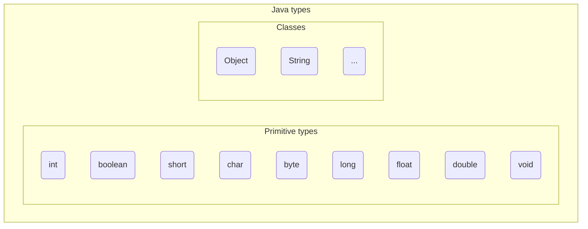

 
+++

title = "Progettazione e Sviluppo del Software"
description = "Progettazione e Sviluppo del Software, Tecnologie dei Sistemi Informatici"
outputs = ["Reveal"]
aliases = ["/objects/"]

+++

# Oggetti e classi

{}

---

## Outline
  
### Goal della lezione
*  Illustrare i concetti base del paradigma object-oriented
*  Mostrare un primo semplice programma Java
*  Fornire una panoramica di alcuni meccanismi Java
  
### Argomenti
*  Oggetti e riferimenti
*  Tipi primitivi
*  Classi, metodi e campi
*  Accenno a package e librerie
*  Stampe a video
*  Primo semplice programma Java
  
---

# Elementi base dei tipi di Java

---

> **Everything is an object**

### Riferimenti ad oggetti
*  Nessun meccanismo per accedere ai dati per valore o puntatore!
*  Le variabili conterranno dei riferimenti agli oggetti veri e propri, sono quindi dei nomi "locali" utilizzabili per denotare l'oggetto
  
```java
// Creo un oggetto String, e lo assegno al nome s
// questo oggetto stringa rappresenta la sequenza vuota di caratteri
String s = new String();

// In generale si crea un oggetto con l'operatore "new"
// Accetta 0,1 o più argomenti, a seconda del tipo: valori primitivi (numeri), string literals, o oggetti
String s2 = new String("prova");
Point2D p = new Point2D(10.5, 20.3);
Object o = new Object();
```

---


## Variabili, oggetti, e valori primitivi


  
### Concetti base

* Variabile: un contenitore con nome (come in C), usabile per denotare un oggetto
* Valore primitivo: p.e. un numero, anche assegnabile ad una variabile

```java
String s = new String("prova");

// Un caso ad-hoc di Java, equivalente a:
// String s2 = new String("casa");
String s2 = "casa";

// Definisco il nome s4, ma non lo inizializzo
String s4;
// ora assegno s4, da qui in poi è utilizzabile
s4 = "auto";

// Il nome i è assegnato al valore primitivo 5
int i = 5;
```

---


## "(Almost) Everything is an object"

### Tipi primitivi: rappresentano i valori "built-in"
Assomigliano molto a quelli del C, ma hanno dimensioni fissate
  
| Type name | Size (bits) | Minimum | Maximum |
| --------- | ---- | ------- | ------- |
| boolean | -- | -- | -- |
| char | 16 | `\u0000` | `\uFFFF` |
| byte | 8 | $-128$ | $128$ |
| short | 16 | $-2^{15}$ | $2^{15}-1$ |
| int | 32 | $-2^{31}$ | $2^{31}-1$ |
| long | 64 | $-2^{63}$ | $2^{63}-1$ |
| float | 32 | IEEE754 | IEEE754 |
| double | 64 | IEEE754 | IEEE754 |
| void | -- | -- | -- |

*  I `boolean` possono valere `true` o `false`
*  Altre classi di libreria (`BigDecimal`, `BigInteger`) gestiscono numeri di dimensione/precisione arbitraria

---


## Una prima classificazione dei tipi



---

## Variabili e tipi

``` java
// assegnamenti con tipi primitivi
int i = 5;
double d = 145e-20;
boolean b = true;

// assegnamenti con classi
Object o = new Object(); 
String s = "altra stringa";
Point2D p = new Point2D(10.4, 20.3);

// assegnamento da/a variabile
int other = i;
Point2D q = p;

// assegnamento a null
Object on = null;
```

---


## Costrutto `var`: local variable type inference (Java 10+)
  
* usabile nelle variabili locali (a funzioni/metodi) per avere maggiore concisione
* il compilatore capisce (inferisce) il tipo della varibile dall'espressione assegnata
* non abusarne, specialmente all'inizio!
  
```java
// assegnamenti con tipi primitivi
var i = 5;
var d = 145e-20;
var b = true;

// assegnamenti con classi
var o = new Object(); 
var s = "altra stringa";
var p = new Point2D(10.4, 20.3);

// assegnamento da/a variabile
var other = i;
var q = p;
```

---

## Oggetti e memoria
  
### Gestione della memoria

* tutti gli *oggetti* sono allocati nella memoria __heap__
* le *variabili* allocate nello **stack**, nei rispettivi record di attivazione
* le variabili di *tipi primitivi contengono direttamente il valore*
* le variabili che contengono *oggetti in realtà hanno un riferimento* verso lo heap
* nota: ancora non sappiamo cosa contiene un oggetto

```java
// assegnamenti con tipi primitivi: contengono VALORI!
var i = 5;
var d = 145e-20;
var b = true;
// assegnamenti con classi contengono RIFERIMENTI!
var o = new Object(); 
var s = "altra stringa";
var p = new Point2D(10.4, 20.3);
var other = i; // VALORE!
var q = p; // Stesso RIFERIMENTO!
Object on = null; // Riferimento speciale al valore null
```

---

## Visibilità
  
### "Scope" delle variabili
*  È simile a quello di C
*  variabili dentro un blocco non sono visibili fuori
*  differenza rispetto a C: variabili non inizializzate non sono utilizzabili!
  
### Tempo di vita degli oggetti
*  finito lo scope di una variabile, l'oggetto continua a esistere
*  verrà deallocato automaticamente dal sistema se non più usato
    *  se, direttamente o indirettamente, nessuna variabile lo può raggiungere
    *  un componente della JVM, il *__garbage collector__*, è preposto a questo compito

---

# Principali costrutti dell'object-orientation

---

## Costruire classi

### Premesse
* la *__classe__* è l'unità fondamentale di programmazione OO
* progettare e costruire classi correttamente sarà l'obiettivo del corso
* incominciamo descrivendo la loro struttura generale
* solo nelle prossime lezioni daremo linee guida definitive

### Cos'è una classe
* è un template (*stampino*) per generare oggetti di una certa forma
* ne definisce *tipo*, *struttura* in memoria e *comportamento*

### Classe vs. oggetto
* classe: è una descrizione (parte di programma)
* oggetto: è una entità a tempo di esecuzione, è *__istanza__* di una classe

---

## Struttura di una classe

### Nome della classe
È anche il nome del tipo
  
### Membri della classe
*__Campi__* (fields)
* descrivono la struttura/stato dell'oggetto in memoria

*__Metodi__* (methods)
* descrivono i messaggi accettati e il comportamento corrispondente

---


## Classi: un po' di codice

#### Costruzione di classi
```java
class A { // A è il nome della classe
  ... // qui si riporta il suo contenuto
}

class AltroEsempioDiClasse { // Nota il PascalCase
  ...
}
```

#### Uso

```java
// codice cliente
A obj1 = new A(); // creo un oggetto di A, con nome obj1
A obj2 = new A(); // creo un altro oggetto di A
AltroEsempioDiClasse obj3 = new AltroEsempioDiClasse();
A obj4; // variabile obj4 non inizializzata
obj4 = new A(); // ok
obj4 = new AltroEsempioDiClasse(); // NO!! Errore semantico
```

---

## Campi
  
### Elementi costitutivi dei campi
* i campi di una classe assomigliano ai membri di una struct del C
* ognuno è una sorta di variabile (nome + tipo)
    * per i campi non è usabile il costrutto `var`!
* ve ne possono essere 0,1, molti
* lo stato di un oggetto è l'attuale valore associato ai campi
* potrebbero essere valori primitivi, o altri oggetti
  
### Valore di un campo
*  impostabile al momento della sua dichiarazione
*  se non inizializzato vale:
    *  `0` per i tipi numerici
    *  `false` per i booleani
    *  `null` per le classi
*  accessibile da codice cliente con notazione `object.field`
    * c.d. "dot notation"

---

## Campi: Un semplice esempio giocattolo

#### Classe

```java
class A {
  int i;
  int j = 2;
  Object o;
}
```

#### Uso

```java
A obj = new A();
int a = obj.i; // a varrà 0
int b = obj.j; // b varrà 2
obj.i = 10; // modifico lo stato di obj
int d = obj.i; // d varrà 10
obj.o = new Object(); // riassegno obj.o
A obj2 = new A();
obj.i = obj2.i; // quanto varrà ora obj.i?
```

---


## Campi: l'esempio Point3D

#### Classe

```java
class Point3D {
  double x;	// Nota, l'ordine dei campi è irrilevante
  double y;
  double z;
}
```

#### Uso

```java
Point3D a = new Point3D(); // Creo due punti, di nome a e b
Point3D b = new Point3D();
a.x = 10.0;	// Imposto lo stato di a
a.y = 20.0;
a.z = 30.0;
b.x = a.x * 2; // Imposto lo stato di b
b.y = a.y * 2; // .. a partire da quello di a
b.z = a.z * 2;
int mod2a = a.x * a.x + a.y * a.y + a.z * a.z;
int mod2b = b.x * b.x + b.y * b.y + b.z * b.z;
boolean aGreater = (mod2a > mod2b); // false
```

---

## Metodi
  
### Elementi costitutivi dei metodi
*  i metodi di una classe assomigliano a funzioni (del C)
*  ognuno ha una *__intestazione__* (o signature) e un corpo
    * a sua volta l'intestazione ha il *nome*, tipo di *ritorno*, *argomenti*
*  di metodi ve ne possono essere 0,1, molti
*  definiscono il *comportamento* dell'oggetto
  
### Significato di un metodo
* codice cliente richiama un metodo con notazione `object.method(arguments)`
  * Di nuovo, *dot notation*! (stavolta con le parentesi)
* corrisponde ad inviare un messaggio a `object`
* `object` è chiamato il *__receiver__* del messaggio (o dell'invocazione)
* il comportamento conseguente è dato dall'esecuzione del corpo
* il corpo può leggere/scrivere il valore dei campi

---

## Metodi: Un esempio giocattolo

#### Classe

```java
class Adder {
  int total;

  void add(int a){ // input "int a"
    total = total + a;              
  }

  int getValue(){ // intestazione funzione
    return total; // corpo funzione
  }
}
```

#### Uso

```java
Adder adder = new Adder();
int v = adder.total; // vale 0
adder.add(10); // modifico adder
adder.add(20); // modifico adder
int v2 = adder.total; // vale 30
int v3 = adder.getValue(); // vale 30
```

---


## La variabile speciale `this`

* dentro ad un metodo si può accedere agli argomenti o ai campi
* per rendere meno ambigua la sintassi, Java fornisce una variabile speciale denotata con `this`
  * contiene il riferimento all'oggetto che sta gestendo il messaggio
* per motivi di leggibilità, viene spesso omessa
  * all'inizio, è opportuno usarla sempre!


```java
class Adder {
  int total;

  void add(int a){ // input "int a"
    this.total = this.total + a;              
  }

  int getValue(){ // intestazione funzione
    return this.total; // corpo funzione
  }
}
```

---


## Metodi: altro esempio Point3D

```java
class Point3D { // Class declaration
    double x; // 3 campi
    double y;
    double z;

    void build(double a, double b, double c){
        this.x = a;
        this.y = b;
        this.z = c;
    }

    double getNormSquared(){
        return this.x * this.x + this.y * this.y + this.z * this.z;
    }

    boolean equal(Point3D q){	// true if two points are equal
        return this.x == q.x && this.y == q.y && this.z == q.z;    
    }
}
// codice cliente
Point3D p = new Point3D(); // Create a new point p
p.build(10.0, 20.0, 30.0); // set up the point 
Point3D q = new Point3D(); // create a new point q
q.build(10.0, 20.0, 31.0); // set up point q
double m2 = p.getNormSquared(); // get the squared norm of m2
boolean samePoint = p.equal(q); // chiedo a p se è uguale a q
```

---

# Programmi Java

---

## Programmi Java
  
### Elementi costitutivi dei programmi Java
* librerie (insiemi di classi)
  * Incluse nel Java Development Kit
  * esterne (nostre o di altri, vedremo come importarle)
* un insieme di classi che costituiscono l'applicazione
* almeno una di tali classi ha un metodo speciale `main`
  * Ma possono essercene più d'una
* un `main` è un punto d'accesso di un programma

---

## Il metodo `main`

Il `main` deve avere la seguente dichiarazione:

## `public static void main(String[] args)`

tre concetti che spiegheremo in dettaglio nel prosieguo:
* `public` indica il fatto che debba essere visibile "a tutti"
* `static` indica che non è un metodo dell'oggetto, ma della classe
* `String[]` indica il tipo "array di stringhe"

---

## Package e librerie Java: organizzazione
  
### Librerie di Java

*  Documentazione auto-generata, consultabile offline, o online:
  * https://docs.oracle.com/en/java/javase/17/docs/api/
  <br>
  (google search "*java 17 javadoc*")
*  contano più di 4000 classi, raggruppate in 200+ *__package__* (e 50+ *__moduli__*)
  
### Package
*  un package è un contenitore di classi con uno scopo comune, di alto livello
*  tipicamente un package contiene qualche decina di classi
*  i package sono organizzati ad albero, con notazione `name1.name2.name3`
*  Package principali: `java.lang`, `java.util`, `java.io`
  
---


## Package, moduli e librerie Java
  
### Moduli (Java 9+)
* un modulo definisce un frammento di codice "autonomo":
  * con chiara interfaccia ed esplicite dipendenze da altri
  * esempi: `java.base`, `java.desktop`, `java.sql`, `java.xml`
* le librerie per Java 9+ possono essere distribuite in uno o più moduli
* un modulo è costituito internamente da uno o più package
* ad esempio, `java.base` contiene i package principali che useremo    
  
### Impatto sulla programmazione "base"
*  il concetto di modulo *__non impatta__* i sorgenti,
  ma "solo" la gestione dei componenti:
  per il momento non ce ne occuperemo perché il JDK fornisce "di default" accesso a tutti i moduli che ci servono (`java.*`)
*  il concetto di package, invece, *__impatta__* i sorgenti:
  *il nome completo di una classe include il package* in cui si trova 

---

## Package, moduli e librerie Java: uso
  
### Importare una classe di "libreria"
* per usare le classi di una libreria prima le si importa
* lo si fa con la clausola `import`, da usare all'inizio del sorgente
    * importo la singola classe: `import java.util.Date;`
    * importo l'intero package: `import java.util.*;`
    * importazione di default: `import java.lang.*;`
* senza importazioni, ogni classe andrebbe sempre qualificata indicandone anche il package completo:
  * `java.util.Date now = new java.util.Date();`
*  importare evita quindi solo di dover indicare ogni volta il package
  
### Classi (e funzionalità) "deprecate"
* dichiarate come "scadute", ossia preferibilmente "da non usare più"
  * Tipicamente perché il loro funzionamento è stato mal progettato
  * Potrebbero essere *rimosse* in una nuova versione di Java!
* noi le utilizzeremo per **solo scopo didattico** `java.util.Date`

---

## Stampe su terminale
  
### Il metodo `System.out.println`
* `System` è una *classe* nel package `java.lang`
* `out` è un suo *campo* che rappresenta lo standard output
  * `static`o, ossia uguale per ogni istanza di `System`
* `println` è un *metodo* che accetta una `String`a e la stampa
* l'operatore `+` concatena stringhe a valori

---

## "Hello world" Java Program

```java
{}
```
  
### Compilazione ed esecuzione
* con un editor di testo si scrive la classe in un file `Hello.java`
* si compila la classe col comando: `javac Hello.java`
* se non ci sono errori, viene generato il *__bytecode__* `Hello.class`
* si esegue il programma con: `java Hello`
* la JVM cerca la classe `Hello`, e ne esegue il `main`
  * Nota: la JVM cerca la **classe** `Hello`, *non il file* `Hello.class`

---

## Librerie, oggetti, e stampe

```java
{}
```

---

## Costruire e provare classi

```java
{}
```

* Dopo aver compilato, si esegue la classe col `main`:
  * `java Print`

---

## Classi...

```java
{}
```

---

## ...e classi clienti

```java
{}
```
* si compilano separatamente
  * Siccome per compilare `UsePoint3D.java` serve la *classe* `Point3D`, il *file* `Point3D.java` va compilato prima
* si possono anche compilare insieme, dandoli entrambi al compilatore
  * `javac UsePoint3D.java Point3D.java`
  * o, usando la sintassi "glob": `javac *.java`
* si esegue la classe col `main`
  * `java UsePoint3D`

---

## Preview del prossimo laboratorio
  
### Obiettivi
* familiarizzare con la compilazione da linea di comando in Java
* fare qualche esercizio con la costruzione e uso di classi
