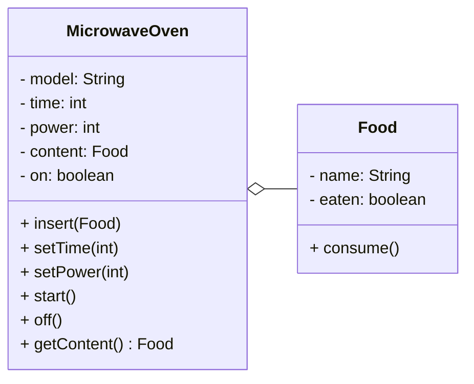
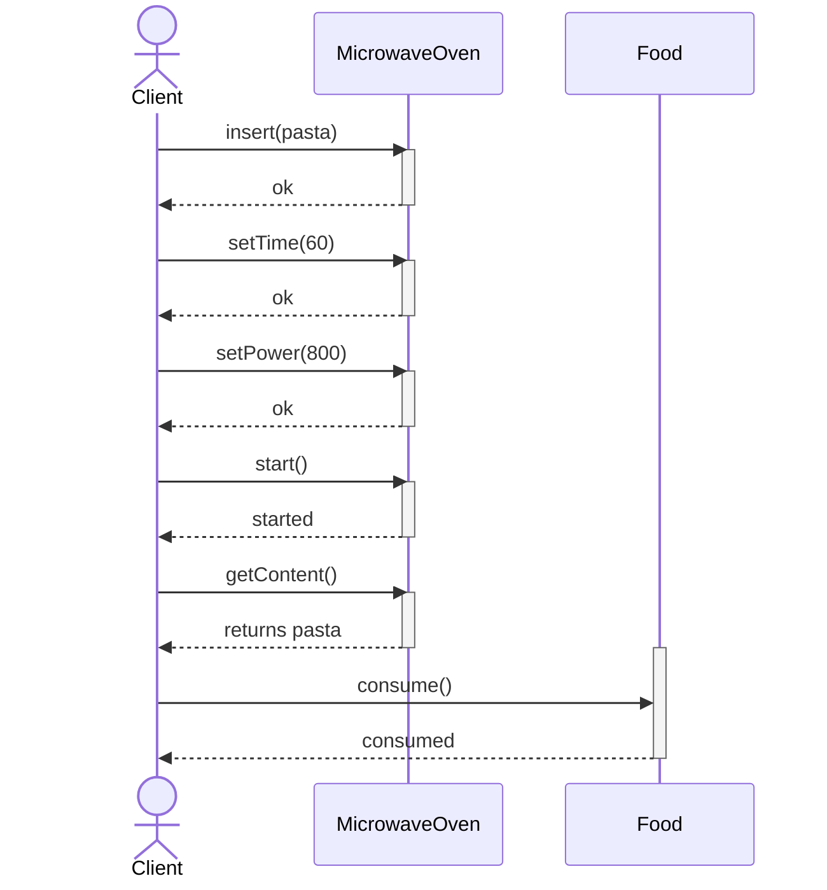
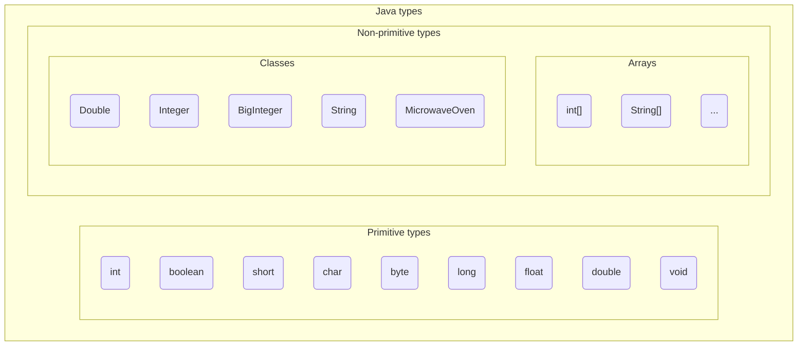

+++

title = "Progettazione e Sviluppo del Software"
description = "Progettazione e Sviluppo del Software, Tecnologie dei Sistemi Informatici"
outputs = ["Reveal"]
aliases = ["/objects/"]

+++

# Oggetti e classi

{}

---

## Outline
  
### Obiettivi della lezione
*  Illustrare i concetti base del paradigma object-oriented
*  Mostrare un primo semplice programma Java
*  Fornire una panoramica di alcuni meccanismi Java
  
### Argomenti
*  Classi, metodi e campi
*  Stampe a video
*  Primo semplice programma Java

---

## Astrazione OO
* **Everything is an object.** Un oggetto è un'entità che fornisce operazioni per essere manipolata.
* **Un programma è un insieme di oggetti che comunicano scambiandosi messaggi.** Questi messaggi sono richieste per eseguire le operazioni fornite.
* **Un oggetto ha una memoria fatta di altri oggetti.** Un oggetto è ottenuto impacchettando altri oggetti.
* **Ogni oggetto è istanza di una classe.** Una classe descrive il comportamento comune a tutti gli oggetti che le appartengono.
* **Tutti gli oggetti di una classe possono ricevere gli stessi messaggi.** La classe indica, tra le altre cose, quali operazioni sono fornite; quindi, per comunicare con un oggetto basta sapere qual è la sua classe.


---

## Classi e Oggetti

Due forni a microonde dello stesso modello sono due oggetti distinti, ma hanno la stessa struttura e gli stessi comportamenti.

La **classe** in OOP è la descrizione di un tipo di oggetto; ne definisce:
* *struttura* -- come è fatta, quali sono gli elementi (proprietà) che la compongono
  * Nel caso di un forno a microonde, ad esempio, la potenza, il tempo di cottura, il tipo di cibo inserito
* *comportamento* -- cosa può fare, quali operazioni sono possibili
    * il comportamento potrebbe prevedere l'*interazione* con altri oggetti
    * ad esempio, il microonde può ricevere un messaggio per impostare la potenza, oppure per avviarsi

A partire da una classe, si possono creare degli **oggetti**.
* Si dice che l'oggetto è un'**istanza** della *classe*.

Un programma OOP è un insieme di classi.
Il comportamento è definito a partire da un punto di ingresso (il `main`),
e si sviluppa attraverso l'interazione tra gli oggetti.

---

### Esempio (a parole) di programma OOP

Programma che scalda un piatto di pasta e lo mangia:
* Classi: `MicrowaveOven`, `Food`
* Programma:
  1. Crea un oggetto di tipo `MicrowaveOven`, modello `"HotPoint Ariston"`, nome: `oven`
  2. Crea un oggetto di tipo `Food`, tipo: `"Pasta al sugo"`
  3. Invia il messaggio `insert(pasta)` all'oggetto `oven`
  4. Invia il messaggio `setTime(60)` all'oggetto `oven`
  5. Invia il messaggio `setPower(800)` all'oggetto `oven`
  6. Invia il messaggio `start()` all'oggetto `oven`
  7. Invia il messaggio `getContent()` all'oggetto `oven`
  8. Invia il messaggio `consume()` all'oggetto `pasta`

---

### Diagramma delle classi UML



Il rombo indica "può contenere un oggetto del tipo indicato" (*aggregazione*).

---

### Diagramma delle sequenze UML


Ok, ora vediamo come si realizza un programma del genere in Java!

---

## Costruzione di una classe
In Java, una classe è definita con la parola chiave `class`, seguita dal **nome** della classe (in PascalCase), e da un blocco di codice tra parentesi graffe `{}`.

```java
class MicrowaveOven {
  // qui si riporta il suo contenuto
}
```
- Come posso creare un oggetto di questa classe? Attraverso l'operatore `new`:
```java
MicrowaveOven oven = new MicrowaveOven();
```

### Riferimenti ad oggetti
* L'accesso agli oggetti avviene sempre per *riferimento*
    * Java non offre alcuna sintassi per conoscere la posizione in memoria (puntatore),
    né consente di allocare oggetti sullo stack (valore)
  * Le variabili sono quindi dei nomi "locali" utilizzabili per denotare l'oggetto
  * Esiste un valore speciale (`null`) che indica l'assenza di un oggetto
* Notate: Il **nome della _classe_** è anche il **nome del _tipo_** degli oggetti che crea!
    * `null` può essere assegnato a variabili di tipo oggetto indipendentemente dalla classe
  
---

## In Java: "(*almost*) Everything is an object"

* I tipi primitivi (`int`, `boolean`, `char`, ...) non sono oggetti
    * In molti linguaggi OO lo sono
    * In Java, sono "tipi speciali" per motivi di efficienza
    * Esistono comunque delle classi wrapper (`Integer`, `Boolean`, `Character`, ...) che li incapsulano
    * Esistono anche formati numerici più complessi che sono oggetti (`BigInteger`, `BigDecimal`)
* Le strutture di controllo (`if`, `while`, `for`, ...) non sono oggetti
    * Questo anche nella maggior parte degli altri linguaggi object-oriented

### Una prima classificazione dei tipi


---

## **Stato** di un oggetto: *campi*

Lo **stato** di un oggetto sono codificati attraverso *campi*
* i campi di una classe assomigliano ai membri di una struct del C
* i campi possono essere valori primitivi o altri oggetti
* ognuno è una sorta di variabile (nome + tipo)
    * per i campi non è usabile il costrutto `var`.
* lo stato di un oggetto a un dato momento è rappresentato dal valore associato ai suoi campi
* dato un oggetto in una variabile di nome `object`, il suo campo `field` è accessibile con notazione `object.field` (*dot notation*)

### Sintassi di un campo
```java
[modificatori] tipo nome [= valore_iniziale];
```
- I **modificatori** sono opzionali, e ne esistono diversi (li vedremo più avanti)
- Il **tipo** può essere un tipo primitivo o il nome di una classe
- Il **nome** è un identificatore (in camelCase)

```java
class ClassName {
    int field1;
}
```

--- 
### Valore di un campo
* - Il **valore_iniziale** è opzionale, e può essere un'espressione del tipo appropriato
* impostabile al momento della dichiarazione
* se non inizializzato, vale:
   *  `0` per i tipi numerici
   *  `false` per i booleani
   *  `null` per le classi
```java
class ClassName {
    int field1 = 10; // inizializzato a 10
    boolean field2;  // inizializzato a false
    String field3;   // inizializzato a null
}
```
--- 

## Costruzione di una classe: campi

- Il cibo è una classe a sé stante, con un campo `name` che ne indica il tipo
```java
{}
```
---

## Costruzione di una classe: campi

Il microonde deve:
* tenere traccia del modello
* tenere traccia del tempo di cottura
* tenere traccia della potenza
* sapere se è acceso o spento
* sapere che cibo contiene (se c'è)

Quali campi?

{}

- Il forno a microonde ha cinque campi: `model`, `time`, `power`, `on`, e `content`

```java
{}
```

{}

---

- Ora possiamo riprodurre il programma di esempio:
```java
{}
```

---

## Definire il comportamento di un oggetto

Problema: il microonde deve operare solo in certe condizioni:
- se il cibo è presente (altrimenti è pericoloso)
- se il tempo è positivo (altrimenti non ha senso) e non superiore a 1 ora (altrimenti il rischio di bruciare è troppo alto)
- se la potenza è positiva e compresa fra 150W (scongelamento) e 800W (massimo del forno)

Possiamo fare tutti questi controlli nel `main`, **ma**:
* per ogni accensione del microonde, vanno ripetuti
* in caso di modifica, come ad esempio supporto per potenza di 900W, vanno modificati tutti i punti
* c'è alta probabilità di errori

La **responsabilità** di mantenere coerente lo **stato** è del forno a microonde, non del `main`!

#### Vorremmo poter inviare al forno **un messaggio** che richieda di accendere *se le condizioni sono verificate*

---

## Metodi
  
### Elementi costitutivi dei metodi
* i metodi definiscono il *comportamento* dell'oggetto
* i metodi di una classe assomigliano a funzioni (di C)
    * con una speciale variabile implicita `this`, sempre definita, che denota l'oggetto che contiene il metodo
* i metodi hanno una *__intestazione__* (o **signature**), un **tipo di ritorno** e un **corpo**
    * a sua volta l'intestazione ha il *nome* e una *lista di argomenti*
    * non possono esistere due metodi con la stessa signature

---

## Sintassi: definizione e invocazione dei metodi

### Definizione di un metodo
```java
[modificatori] tipo_ritorno nome([tipo1 arg1, tipo2 arg2, ...]) {
    // corpo
    return espressione; // se tipo_ritorno != void
}
```
- I **modificatori** sono opzionali, e ne esistono diversi (li lifeveremo più avanti)
- Il **tipo_ritorno** è il tipo del valore restituito (o `void` se non restituisce nulla)
- Il **nome** è un identificatore (in camelCase)
- I **parametri** sono una lista separata da virgole di variabili formali
    * ogni parametro ha un tipo e un nome 
- Il **corpo** è un blocco di codice tra parentesi graffe `{}`
- La parola chiave `return` è usata per restituire un valore (se il tipo di ritorno non è `void`)
- Dentro ad un metodo si può accedere ai campi dell'oggetto usando `this.field`
```java
class ClassName {
  int field1;
  int method1(int arg1) {
      return this.field1 + arg1;
  }
}
```
---

### Significato di un metodo (invocazione)
* codice cliente richiama un metodo con notazione `object.method(arguments)`
  * Di nuovo, *dot notation*! (stavolta con le parentesi)
* corrisponde ad inviare un messaggio a `object`
* `object` è chiamato il *__receiver__* del messaggio (o dell'invocazione)
* il comportamento conseguente è dato dall'esecuzione del corpo
* il corpo può leggere/scrivere il valore dei campi
```java
ClassName obj = new ClassName();
int result = obj.method1(20);    // Manda il messaggio method1(20) a obj 
```
---

## Metodi -- `Food`
Proviamo ad aggiungere dei metodi alle nostre classi `Food` e `MicrowaveOven`
- La classe `Food` ha un metodo `consume()` che "mangia" il cibo
- Se il cibo è già stato mangiato, non succede nulla
```java
{}
```

---

## Metodi -- `MicrowaveOven`
- Che metodi avrà la classe `MicrowaveOven`?
{}
- Deve avere diversi metodi per impostare lo stato:
  * `setTime(int t)` per impostare il tempo (controllo, t > 0 e t <= 120)
  * `setPower(int p)` per impostare la potenza (controllo, p >= 150 e p <= 800)
  * `insert(Food f)` per inserire il cibo (controllo, se il forno è in uno stato valido, e f != null)
{}

{}
- Deve avere dei metodi per azionare/spegnere il forno:
  * `start()` per accendere (controllo, cibo != null, time > 0, power > 150)
  * `off()` per spegnere (nessun controllo)
  * `getContent()` per ottenere il cibo cotto (se il forno è acceso, lo spegne e restituisce il cibo togliendolo dal microonde)
{}

---

## Metodi -- `MicrowaveOven` (continua)
<div style="display:flex; gap:2rem; flex-wrap:wrap; align-items:stretch; height:100%; font-size:0.9rem; box-sizing:border-box;">
  <div style="flex:1; min-width:280px; height:100%;">

  ```java
  {}
  ```
  
  </div>
</div>

--- 

## Nuovo programma con metodi

```java
{}
```

---


## Altro esempio: classe `Point3D`

- Una classe che rappresenta un punto nello spazio tridimensionale
- con tre campi `x`, `y`, `z`
  - tutti di tipo `double`
  - e tre metodi:
    - `build(double a, double b, double c)` per inizializzare il punto
    - `getNormSquared()` che restituisce la norma al quadrato del punto
    - `equal(Point3D q)` che restituisce true se il punto è uguale a `q`

---

## Classe `Point3D`: implementazione

{}

```java
{}
```
{}

## Esempi d'uso

{}

```java
{}
```
{}


- *Notate*: la *costruzione* e l'*inizializzazione* hanno senso se messe insieme 
  - in Java, questo è fatto con i **costruttori** (ne parleremo più avanti)

---

## Riepilogo
- Abbiamo visto i concetti base della programmazione object-oriented
  - Che cos'è un *oggetto* e una *classe*?
  - Come si definiscono *campi* e *metodi*
- Abbiamo visto come si costruisce un semplice programma Java
- Cosa vedremo nella prossima lezione:
  - Codice Statico
  - Costruttori
  - Oggetti in memoria
  - Package

---

# Oggetti e classi

{}
