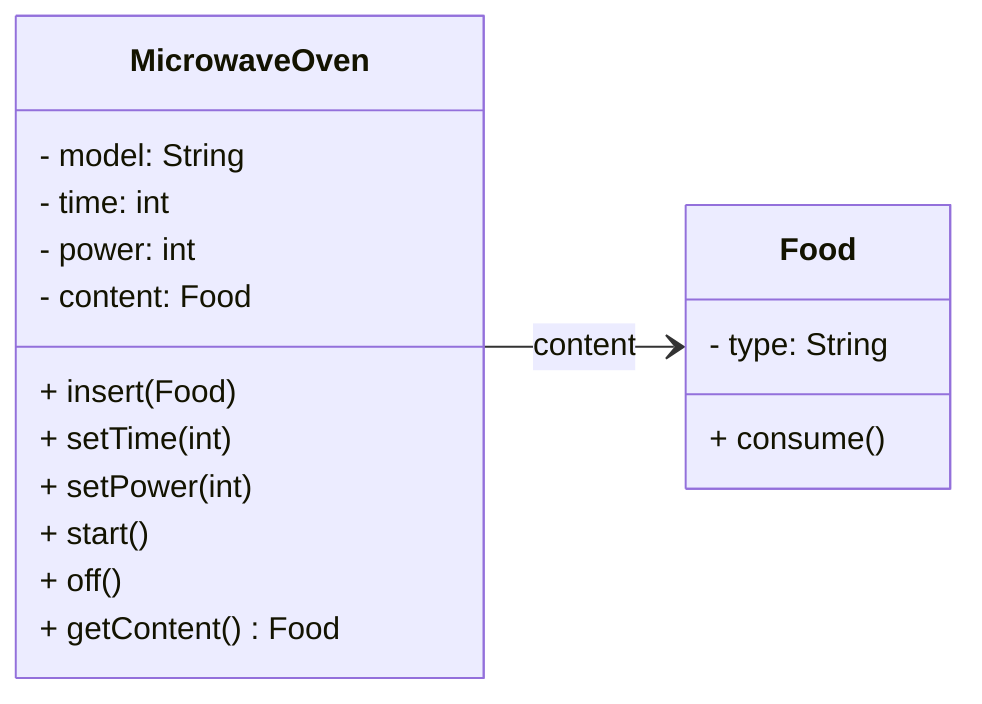
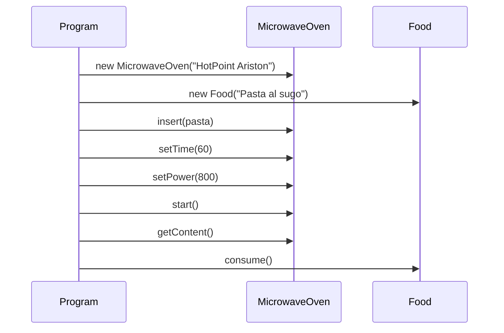
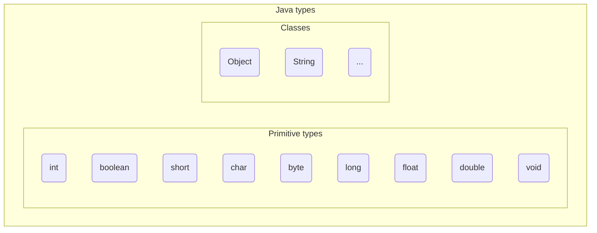

+++

title = "Progettazione e Sviluppo del Software"
description = "Progettazione e Sviluppo del Software, Tecnologie dei Sistemi Informatici"
outputs = ["Reveal"]
aliases = ["/objects/"]

+++

# Oggetti e classi

{}

---

## Outline
  
### Goal della lezione
*  Illustrare i concetti base del paradigma object-oriented
*  Mostrare un primo semplice programma Java
*  Fornire una panoramica di alcuni meccanismi Java
  
### Argomenti
*  Oggetti e riferimenti
*  Tipi primitivi
*  Classi, metodi e campi
*  Accenno a package e librerie
*  Stampe a video
*  Primo semplice programma Java

---

## Astrazione OO
*  **Everything is an object.** Un oggetto è una entità che fornisce operazioni per essere manipolata.
*  **Un programma è un set di oggetti che si comunicano cosa fare scambiandosi messaggi.** Questi messaggi sono richieste per eseguire le operazioni fornite.
*  **Un oggetto ha una memoria fatta di altri oggetti.** Un oggetto è ottenuto impacchettando altri oggetti.
*  **Ogni oggetto è istanza di una classe.** Una classe descrive il comportamento dei suoi oggetti.
*  **Tutti gli oggetti di una classe possono ricevere gli stessi messaggi.** La classe indica tra le altre cose quali operazioni sono fornite, quindi per comunicare con un oggetto basta sapere qual è la sua classe.


---

## Classi e Oggetti

Due forni a microonde dello stesso modello sono due oggetti distinti, ma hanno la stessa struttura e gli stessi comportamenti.

La **classe** in OOP è la descrizione di un tipo di oggetto, ne definisce:
* *struttura* -- come è fatta, quali sono gli elementi (proprietà) che la compongono
  * Nel caso di un forno a microonde, ad esempio, la potenza, il tempo di cottura, il tipo di cibo inserito
* *comportamento* -- cosa può fare, quali operazioni sono possibili
    * il comportamento potrebbe prevedere l'*interazione* con altri oggetti
    * ad esempio, il microonde può ricevere un messaggio per impostare la potenza, oppure per avviarsi

A partire da una classe, si possono creare degli **oggetti**
* Si dice che l'oggetto è *istanza* della classe

Un programma OOP è un insieme di classi.
Il comportamento è definito a partire da un punto di ingresso (il `main`),
e si sviluppa attraverso l'interazione tra gli oggetti.

---

### Esempio (a parole) di programma OOP

Programma che scalda un piatto di pasta e lo mangia:
* Classi: `MicrowaveOven`, `Food`
* Programma:
  1. Crea un oggetto di tipo `MicrowaveOven`, modello `"HotPoint Ariston"`, nome: `oven`
  2. Crea un oggetto di tipo `Food`, tipo: `"Pasta al sugo"`, nome: `pasta`
  3. Invia il messaggio `insert(pasta)` all'oggetto `oven`
  4. Invia il messaggio `setTime(60)` all'oggetto `oven`
  5. Invia il messaggio `setPower(800)` all'oggetto `oven`
  6. Invia il messaggio `start()` all'oggetto `oven`
  7. Invia il messaggio `getContent()` all'oggetto `oven`
  8. Invia il messaggio `consume()` all'oggetto `pasta`

---

### Diagramma delle classi UML



---

### Diagramma delle sequenze UML



Ok, ora vediamo come si realizza un programma del genere in Java!

---

## Costruzione di una classe
In Java, una classe è definita con la parola chiave `class`, seguita dal **nome** della classe (in PascalCase), e da un blocco di codice tra parentesi graffe `{}`.

```java
class MicrowaveOven {
  // qui si riporta il suo contenuto
}
```
- Come posso creare un oggetto di questa classe? Attraverso l'operatore `new`:
```java
MicrowaveOven oven = new MicrowaveOven();
```
### Riferimenti ad oggetti
*  Nessun meccanismo per accedere ai dati per valore o puntatore!
*  Le variabili conterranno dei riferimenti agli oggetti veri e propri, sono quindi dei nomi "locali" utilizzabili per denotare l'oggetto
* Notate: Il `nome` della classe è anche il `nome` del `tipo` degli oggetti che crea!
  
---

## "(Almost) Everything is an object"

### Tipi primitivi: rappresentano i valori "built-in"
Assomigliano molto a quelli del C, ma hanno dimensioni fissate
  
| Type name | Size (bits) | Minimum | Maximum |
| --------- | ---- | ------- | ------- |
| boolean | -- | -- | -- |
| char | 16 | `\u0000` | `\uFFFF` |
| byte | 8 | $-128$ | $128$ |
| short | 16 | $-2^{15}$ | $2^{15}-1$ |
| int | 32 | $-2^{31}$ | $2^{31}-1$ |
| long | 64 | $-2^{63}$ | $2^{63}-1$ |
| float | 32 | IEEE754 | IEEE754 |
| double | 64 | IEEE754 | IEEE754 |
| void | -- | -- | -- |

*  I `boolean` possono valere `true` o `false`
*  Altre classi di libreria (`BigDecimal`, `BigInteger`) gestiscono numeri di dimensione/precisione arbitraria

---

## Una prima classificazione dei tipi


---


## Campi
  
### Elementi costitutivi dei campi
* i campi di una classe assomigliano ai membri di una struct del C
* ognuno è una sorta di variabile (nome + tipo)
    * per i campi non è usabile il costrutto `var`!
* ve ne possono essere 0,1, molti
* lo stato di un oggetto è l'attuale valore associato ai campi
* potrebbero essere valori primitivi, o altri oggetti
  
### Valore di un campo
*  impostabile al momento della sua dichiarazione
*  se non inizializzato vale:
    *  `0` per i tipi numerici
    *  `false` per i booleani
    *  `null` per le classi
*  accessibile da codice cliente con notazione `object.field`
    * c.d. "dot notation"

--- 

## Costruzione di una classe: campi
- Il cibo è una classe a sé stante, con un campo `type` che ne indica il tipo
```java
class Food {
  String type;   // tipo di cibo, es. "Pasta al sugo"
  boolean isEaten; // true se il cibo è stato mangiato
}
```

- Il forno a microonde ha tre campi: `time`, `power`, e `content`

```java
class MicrowaveOven {
  int time;       // tempo di cottura in secondi
  int power;      // potenza in watt
  Food content;   // cibo attualmente nel forno
}
```
- Ora possiamo riprodurre il programma di esempio:
```java
void main() {
  MicrowaveOven oven = new MicrowaveOven();
  oven.time = 60;
  oven.power = 800;
  oven.content = new Food(); // new Food() è un'espressione!
  oven.content.type = "Pasta al sugo"; // Posso accedere ai campi di content!
  oven.isOn = true;
  oven.content.isEaten = true;
  System.out.println(oven.content.type); // stampa "Pasta al sugo"
  System.out.println(oven.power); // stampa 800
  System.out.println(oven.time); // stampa 60
}
```
---


## Costruzione di una classe: metodi
- Supponiamo ora di voler far in modo di verificare che la potenza non superi 800W
- Come si potrebbe fare:
```java
int power = System.in.nextInt(); // leggo la potenza da terminale
if (power <= 800 || power >= 0) {
  oven.power = power;
} else {
  System.out.println("Errore: potenza troppo alta!");
}
```
- Nota: come esiste System.out per l'output, esiste System.in per l'input
- Se volessi reimpostare la potenza?
- Dovrei riscrivere lo stesso codice, con il rischio di errori e duplicazioni 
  - Ad esempio, cambia la potenza massima da 800W a 700W e devo cambiare tutto
- La **responsabilità** di mantenere lo **stato** coerente è del forno a microonde, non del `main`!
- Per questo, in OOP si usano i **metodi**

---

## Metodi
  
### Elementi costitutivi dei metodi
*  i metodi di una classe assomigliano a funzioni (del C)
*  ognuno ha una *__intestazione__* (o signature) e un corpo
    * a sua volta l'intestazione ha il *nome*, tipo di *ritorno*, *argomenti*
*  di metodi ve ne possono essere 0,1, molti
*  definiscono il *comportamento* dell'oggetto
  
### Significato di un metodo
* codice cliente richiama un metodo con notazione `object.method(arguments)`
  * Di nuovo, *dot notation*! (stavolta con le parentesi)
* corrisponde ad inviare un messaggio a `object`
* `object` è chiamato il *__receiver__* del messaggio (o dell'invocazione)
* il comportamento conseguente è dato dall'esecuzione del corpo
* il corpo può leggere/scrivere il valore dei campi

---

## Metodi -- Piccolo esempio

```java
class MicrowaveOven {
  int time;
  int power;
  Food content;
  boolean isOn;

  void setPower(int power) {
    if (power <= 800 && power >= 0) {
      this.power = power;
    }
  }

  void setTime(int time) {
    if (time >= 0) {
      this.time = time;
    }
  }

  void start() {
    if (!isOn && content != null && power > 0 && time > 0) {
      isOn = true;
    }
  }

  void getContent() {
    return content;
  }

  void off() {
    if (isOn){
      isOn = false; // se è acceso, lo spegne
    }
  }
}
```

## Oggetti e memoria
  
### Gestione della memoria

* tutti gli *oggetti* sono allocati nella memoria __heap__
* le *variabili* allocate nello **stack**, nei rispettivi record di attivazione
* le variabili di *tipi primitivi contengono direttamente il valore*
* le variabili che contengono *oggetti in realtà hanno un riferimento* verso lo heap
* nota: ancora non sappiamo cosa contiene un oggetto

```java
// assegnamenti con tipi primitivi: contengono VALORI!
var i = 5;
var d = 145e-20;
var b = true;
// assegnamenti con classi contengono RIFERIMENTI!
var o = new Object(); 
var s = "altra stringa";
var p = new Point2D(10.4, 20.3);
var other = i; // VALORE!
var q = p; // Stesso RIFERIMENTO!
Object on = null; // Riferimento speciale al valore null
```

---

## Visibilità
  
### "Scope" delle variabili
*  È simile a quello di C
*  variabili dentro un blocco non sono visibili fuori
*  differenza rispetto a C: variabili non inizializzate non sono utilizzabili!
  
### Tempo di vita degli oggetti
*  finito lo scope di una variabile, l'oggetto continua a esistere
*  verrà deallocato automaticamente dal sistema se non più usato
    *  se, direttamente o indirettamente, nessuna variabile lo può raggiungere
    *  un componente della JVM, il *__garbage collector__*, è preposto a questo compito

---

Flusso:
* Uml del programma di esempio
* Costruzione di classi (solo campi)
* Istanziazione di oggetti
* Programma di esempio quindi quello sopra ma senza metodi
* Individuare la scomodità: vogliamo controllare che la potenza non superi 800W.
* introdurre `if` (`else`/`else if`)
* Il controllo di potenza lo deve fare il microonde, non il programma: se provate a scaldare la pasta a 8KW, il microonde semplicemente non ve lo fa fare
* Aggiunta di metodi alla classe


## La variabile speciale `this`

* dentro ad un metodo si può accedere agli argomenti o ai campi
* per rendere meno ambigua la sintassi, Java fornisce una variabile speciale denotata con `this`
  * contiene il riferimento all'oggetto che sta gestendo il messaggio
* per motivi di leggibilità, viene spesso omessa
  * all'inizio, è opportuno usarla sempre!


```java
class Adder {
  int total;

  void add(int a){ // input "int a"
    this.total = this.total + a;              
  }

  int getValue(){ // intestazione funzione
    return this.total; // corpo funzione
  }
}
```

---


## Metodi: altro esempio Point3D

```java
class Point3D { // Class declaration
    double x; // 3 campi
    double y;
    double z;

    void build(double a, double b, double c){
        this.x = a;
        this.y = b;
        this.z = c;
    }

    double getNormSquared(){
        return this.x * this.x + this.y * this.y + this.z * this.z;
    }

    boolean equal(Point3D q){	// true if two points are equal
        return this.x == q.x && this.y == q.y && this.z == q.z;    
    }
}
// codice cliente
Point3D p = new Point3D(); // Create a new point p
p.build(10.0, 20.0, 30.0); // set up the point 
Point3D q = new Point3D(); // create a new point q
q.build(10.0, 20.0, 31.0); // set up point q
double m2 = p.getNormSquared(); // get the squared norm of m2
boolean samePoint = p.equal(q); // chiedo a p se è uguale a q
```


## Preview del prossimo laboratorio
  
### Obiettivi
* familiarizzare con la compilazione da linea di comando in Java
* fare qualche esercizio con la costruzione e uso di classi

---

---


# Oggetti e classi

{}