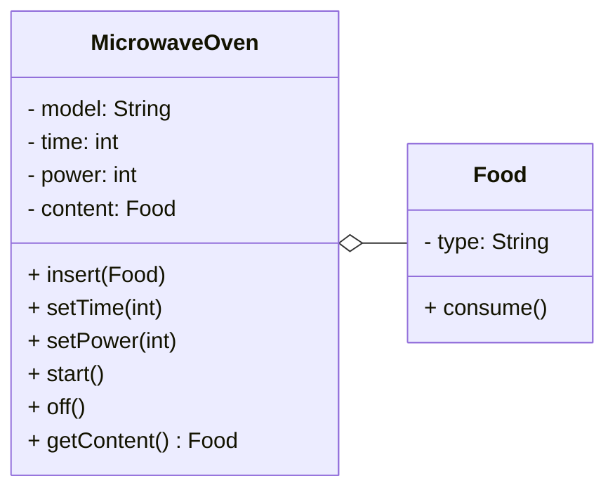
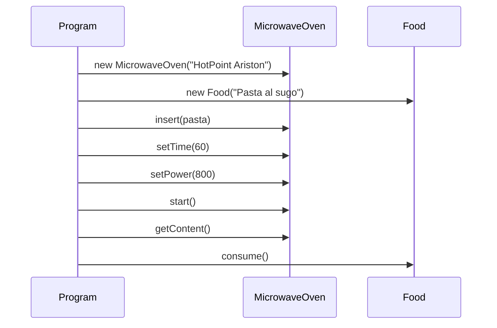
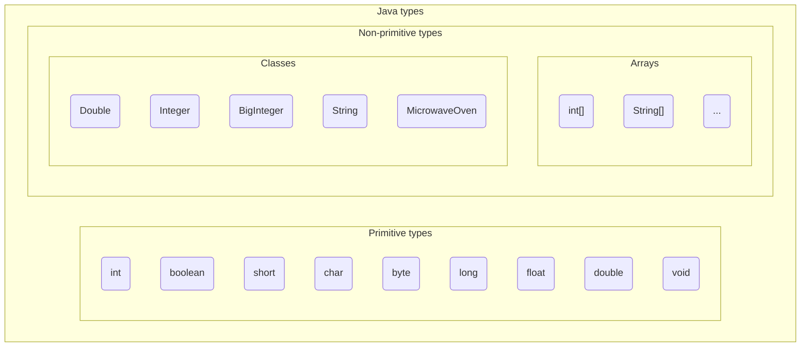

+++

title = "Progettazione e Sviluppo del Software"
description = "Progettazione e Sviluppo del Software, Tecnologie dei Sistemi Informatici"
outputs = ["Reveal"]
aliases = ["/objects/"]

+++

# Oggetti e classi

{}

---

## Outline
  
### Obiettivi della lezione
*  Illustrare i concetti base del paradigma object-oriented
*  Mostrare un primo semplice programma Java
*  Fornire una panoramica di alcuni meccanismi Java
  
### Argomenti
*  Oggetti e riferimenti 
*  Tipi primitivi
*  Classi, metodi e campi
*  Accenno a package e librerie
*  Stampe a video
*  Primo semplice programma Java

---

## Astrazione OO
* **Everything is an object.** Un oggetto è un'entità che fornisce operazioni per essere manipolata.
* **Un programma è un insieme di oggetti che comunicano scambiandosi messaggi.** Questi messaggi sono richieste per eseguire le operazioni fornite.
* **Un oggetto ha una memoria fatta di altri oggetti.** Un oggetto è ottenuto impacchettando altri oggetti.
* **Ogni oggetto è istanza di una classe.** Una classe descrive il comportamento comune a tutti gli oggetti che le appartengono.
* **Tutti gli oggetti di una classe possono ricevere gli stessi messaggi.** La classe indica, tra le altre cose, quali operazioni sono fornite; quindi, per comunicare con un oggetto basta sapere qual è la sua classe.


---

## Classi e Oggetti

Due forni a microonde dello stesso modello sono due oggetti distinti, ma hanno la stessa struttura e gli stessi comportamenti.

La **classe** in OOP è la descrizione di un tipo di oggetto; ne definisce:
* *struttura* -- come è fatta, quali sono gli elementi (proprietà) che la compongono
  * Nel caso di un forno a microonde, ad esempio, la potenza, il tempo di cottura, il tipo di cibo inserito
* *comportamento* -- cosa può fare, quali operazioni sono possibili
    * il comportamento potrebbe prevedere l'*interazione* con altri oggetti
    * ad esempio, il microonde può ricevere un messaggio per impostare la potenza, oppure per avviarsi

A partire da una classe, si possono creare degli **oggetti**.
* Si dice che l'oggetto è un'istanza della classe.

Un programma OOP è un insieme di classi.
Il comportamento è definito a partire da un punto di ingresso (il `main`),
e si sviluppa attraverso l'interazione tra gli oggetti.

---

### Esempio (a parole) di programma OOP

Programma che scalda un piatto di pasta e lo mangia:
* Classi: `MicrowaveOven`, `Food`
* Programma:
  1. Crea un oggetto di tipo `MicrowaveOven`, modello `"HotPoint Ariston"`, nome: `oven`
  2. Crea un oggetto di tipo `Food`, tipo: `"Pasta al sugo"`, nome: `pasta`
  3. Invia il messaggio `insert(pasta)` all'oggetto `oven`
  4. Invia il messaggio `setTime(60)` all'oggetto `oven`
  5. Invia il messaggio `setPower(800)` all'oggetto `oven`
  6. Invia il messaggio `start()` all'oggetto `oven`
  7. Invia il messaggio `getContent()` all'oggetto `oven`
  8. Invia il messaggio `consume()` all'oggetto `pasta`

---

### Diagramma delle classi UML



Il rombo indica "può contenere un oggetto del tipo indicato" (*aggregazione*).

---

### Diagramma delle sequenze UML



Ok, ora vediamo come si realizza un programma del genere in Java!

---

## Costruzione di una classe
In Java, una classe è definita con la parola chiave `class`, seguita dal **nome** della classe (in PascalCase), e da un blocco di codice tra parentesi graffe `{}`.

```java
class MicrowaveOven {
  // qui si riporta il suo contenuto
}
```
- Come posso creare un oggetto di questa classe? Attraverso l'operatore `new`:
```java
MicrowaveOven oven = new MicrowaveOven();
```

### Riferimenti ad oggetti
* L'accesso agli oggetti avviene sempre per *riferimento*
    * Java non offre alcuna sintassi per conoscere la posizione in memoria (puntatore),
    né consente di allocare oggetti sullo stack (valore)
  * Le variabili sono quindi dei nomi "locali" utilizzabili per denotare l'oggetto
  * Esiste un valore speciale (`null`) che indica l'assenza di un oggetto
* Notate: Il **nome della _classe_** è anche il **nome del _tipo_** degli oggetti che crea!
    * `null` può essere assegnato a variabili di tipo oggetto indipendentemente dalla classe
  
---

## In Java: "(*almost*) Everything is an object"

* I tipi primitivi (`int`, `boolean`, `char`, ...) non sono oggetti
    * In molti linguaggi OO lo sono
    * In Java, sono "tipi speciali" per motivi di efficienza
    * Esistono comunque delle classi wrapper (`Integer`, `Boolean`, `Character`, ...) che li incapsulano
    * Esistono anche formati numerici più complessi che sono oggetti (`BigInteger`, `BigDecimal`)
* Le strutture di controllo (`if`, `while`, `for`, ...) non sono oggetti
    * Questo anche nella maggior parte degli altri linguaggi object-oriented

### Una prima classificazione dei tipi


---

## **Stato** di un oggetto: *campi*

Lo **stato** di un oggetto sono codificati attraverso *campi*
* i campi di una classe assomigliano ai membri di una struct del C
* i campi possono essere valori primitivi o altri oggetti
* ognuno è una sorta di variabile (nome + tipo)
    * per i campi non è usabile il costrutto `var`.
* lo stato di un oggetto a un dato momento è rappresentato dal valore associato ai suoi campi
* dato un oggetto in una variabile di nome `object`, il suo campo `field` è accessibile con notazione `object.field` (*dot notation*)

TODO sintassi

### Valore di un campo
* impostabile al momento della dichiarazione
* se non inizializzato, vale:
   *  `0` per i tipi numerici
   *  `false` per i booleani
   *  `null` per le classi

--- 

## Costruzione di una classe: campi

- Il cibo è una classe a sé stante, con un campo `name` che ne indica il tipo
```java
class Food {
  String name;   // nome di cibo, es. "Pasta al sugo"
  boolean eaten; // true se il cibo è stato mangiato
}
```

TODO Gianlu Food

---

## Costruzione di una classe: campi

Il microonde deve:
* tenere traccia del tempo di cottura
* tenere traccia della potenza
* sapere se è acceso o spento
* sapere che cibo contiene (se c'è)

Quali campi?

{}

- Il forno a microonde ha tre campi: `time`, `power`, e `content`

```java
class MicrowaveOven {
    int time;       // tempo di cottura in secondi
    int power;      // potenza in watt
    boolean on;   // true se il forno è acceso
    Food content;   // cibo attualmente nel forno
}
```

{}


---

- Ora possiamo riprodurre il programma di esempio:
```java
void main() {
  MicrowaveOven oven = new MicrowaveOven();
  oven.time = 60;
  oven.power = 800;
  oven.content = new Food(); // new Food() è un'espressione!
  oven.content.type = "Pasta al sugo"; // Posso accedere ai campi di content!
  oven.isOn = true;
  oven.content.isEaten = true;
  System.out.println(oven.content.type); // stampa "Pasta al sugo"
  System.out.println(oven.power); // stampa 800
  System.out.println(oven.time); // stampa 60
}
```
---

## Definire il comportamento di un oggetto

Problema: il microonde deve operare solo in certe condizioni:
- se il cibo è presente (altrimenti è pericoloso)
- se il tempo è positivo (altrimenti non ha senso) e non superiore a 1 ora (altrimenti il rischio di bruciare è troppo alto)
- se la potenza è positiva e compresa fra 150W (scongelamento) e 800W (massimo del forno)

Possiamo fare tutti questi controlli nel `main`, **ma**:
* per ogni accensione del microonde, vanno ripetuti
* in caso di modifica, come ad esempio supporto per potenza di 900W, vanno modificati tutti i punti
* c'è alta probabilità di errori

La **responsabilità** di mantenere coerente lo **stato** è del forno a microonde, non del `main`!

#### Vorremmo poter inviare al forno **un messaggio** che richieda di accendere *se le condizioni sono verificate*

---

## Metodi
  
### Elementi costitutivi dei metodi
* i metodi definiscono il *comportamento* dell'oggetto
* i metodi di una classe assomigliano a funzioni (di C)
    * con una speciale variabile implicita `this`, sempre definita, che denota l'oggetto che contiene il metodo
* i metodi hanno una *__intestazione__* (o **signature**), un **tipo di ritorno** e un **corpo**
    * a sua volta l'intestazione ha il *nome* e una *lista di argomenti*
    * non possono esistere due metodi con la stessa signature

---

TODO: sintassi (definizione e invocazione)


### Significato di un metodo
* codice cliente richiama un metodo con notazione `object.method(arguments)`
  * Di nuovo, *dot notation*! (stavolta con le parentesi)
* corrisponde ad inviare un messaggio a `object`
* `object` è chiamato il *__receiver__* del messaggio (o dell'invocazione)
* il comportamento conseguente è dato dall'esecuzione del corpo
* il corpo può leggere/scrivere il valore dei campi

---

## Metodi -- Piccolo esempio

```java
class MicrowaveOven {
  int time;
  int power;
  Food content;
  boolean isOn;

  void setPower(int power) {
    if (power <= 800 && power >= 0) {
      this.power = power;
    }
  }

  void setTime(int time) {
    if (time >= 0) {
      this.time = time;
    }
  }

  void start() {
    if (!isOn && content != null && power > 0 && time > 0) {
      isOn = true;
    }
  }

  Food getContent() {
    return content;
  }

  void off() {
    if (isOn){
      isOn = false; // se è acceso, lo spegne
    }
  }
}
```

---

## Oggetti e memoria
  
### Gestione della memoria

* tutti gli *oggetti* sono allocati nella memoria __heap__
* le *variabili* allocate nello **stack**, nei rispettivi record di attivazione
* le variabili di *tipi primitivi contengono direttamente il valore*
* le variabili che contengono *oggetti in realtà hanno un riferimento* verso lo heap

### Tempo di vita degli oggetti
*  finito lo scope di una variabile, l'oggetto continua a esistere
*  verrà deallocato automaticamente dal sistema se non più usato
    *  se, direttamente o indirettamente, nessuna variabile lo può raggiungere
    *  un componente della JVM, il *__garbage collector__*, è preposto a questo compito

TODO: lezione prima

### "Scope" delle variabili
*  È simile a quello di C
*  variabili dentro un blocco non sono visibili fuori
*  differenza rispetto a C: variabili non inizializzate non sono utilizzabili!
  
---

---


## Metodi: altro esempio Point3D

```java
class Point3D { // dichiarazione della classe
    double x; // 3 campi
    double y;
    double z;

    void build(double a, double b, double c){
        this.x = a;
        this.y = b;
        this.z = c;
    }

    double getNormSquared(){
        return this.x * this.x + this.y * this.y + this.z * this.z;
    }

    boolean equal(Point3D q){
        // true se i due punti sono uguali
        return this.x == q.x && this.y == q.y && this.z == q.z;    
    }
}
// codice cliente
Point3D p = new Point3D(); // crea un nuovo punto p
p.build(10.0, 20.0, 30.0); // inizializza il punto 
Point3D q = new Point3D(); // crea un nuovo punto q
q.build(10.0, 20.0, 31.0); // inizializza il punto q
double m2 = p.getNormSquared(); // ottiene la norma al quadrato
boolean samePoint = p.equal(q); // chiedo a p se è uguale a q
```


## Preview del prossimo laboratorio
  
### Obiettivi
* familiarizzare con la compilazione da linea di comando in Java
* fare qualche esercizio con la costruzione e uso di classi

---