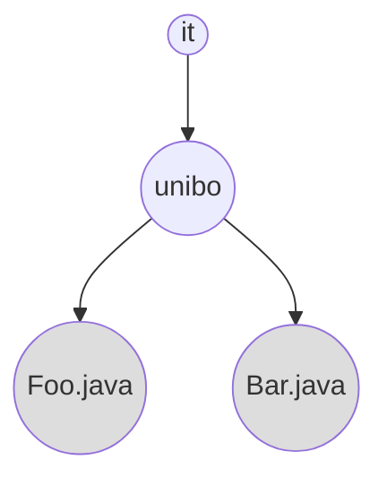
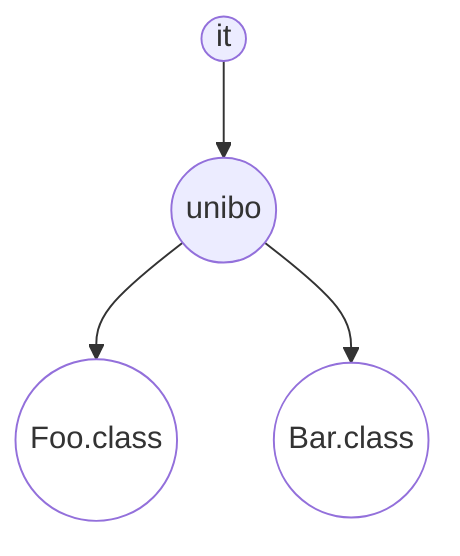

+++

title = "Progettazione e Sviluppo del Software"
description = "Progettazione e Sviluppo del Software, Tecnologie dei Sistemi Informatici"
outputs = ["Reveal"]
aliases = ["/objects-2/"]

+++

# Oggetti e Classi pt.2: inizializzazione, accessi, distruzione

<!-- write-here "cover.md" -->

<!-- end-write -->


## Outline


### Goal della lezione


  *  Completare i meccanismi OO di Java a livello di classe
  *  Porre le basi per poter fare della corretta progettazione
  *  Discutere aspetti collegati alla vita di un oggetto (costruzione, accesso, distruzione)


### Argomenti


  *  Codice statico
  *  Costruttori
  *  Overloading di metodi
  *  Approfondimento sui package
  *  Controllo d'accesso
  *  Finalizzazione e garbage collection


---


# Codice statico

---


## Codice statico


### Meccanismo


  *  Alcuni campi e metodi di una classe possono essere dichiarati `static`
  *  Esempi visti:
      *  il `main` dal quale parte un programma Java
      *  il metodo `java.util.Arrays.toString()` (ossia, il metodo `toString` nella classe `Arrays` dentro al package `java.util`)
      *  il campo `java.lang.System.out`
      *  il metodo `java.lang.System.getProperty()`
  *  Tali campi e metodi sono considerate *proprietà della classe*, non dell'oggetto
  *  Sintassi: `Classe.metodo(argomenti)`, e `Classe.campo`
      *  omettendo la classe si assume quella da cui parte la chiamata


### Sulla notazione

*  Iniziano con *minuscolo*: nomi di package (`it.unibo.students`), metodi (`getName`) e campi (`firstName`)
*  Iniziano con *maiuscolo*: nomi di classe (e.g. `Student`)
    * Questo consente di capire facilmente il significato delle istruzioni


---


## Uso di codice statico o non statico in una classe `C`?


### Codice non statico (detto anche *codice d'istanza*)


*  È codice puro object-oriented
*  Definisce le operazioni e lo stato di ogni oggetto creato da `C`


### Codice statico


*  Non è codice puro object-oriented, ma codice in stile "imperativo/strutturato"
*  Definisce funzioni e variabili del componente software definito da `C`
    *  possono essere visti come metodi e campi dell'unico oggetto "classe `C`" (cf. *reflection*)


### Usarli assieme?


*  Le helper class abbiano solo metodi/campi statici
*  Le classi OO non abbiano metodi/campi statici, a meno di qualche funzionalità "generale" della classe (si veda nel proseguio)


---


## Esempio Point3D


```java
{}
```


---


## Uso Point3D


```java
{}
```

---


## Point3D: commenti


### Si notino le due diverse chiamate


*  `build` è sempre chiamata *su un oggetto*, ossia su: `new Point3D()`
*  `zero` e `max` sono chiamate *sulla classe* `Point3D`


### Razionale


*  `max` è una funzionalità sui `Point3D`, quindi è naturale includerla nella classe `Point3D`, ma non è inquadrabile come funzionalità di un singolo oggetto (ognuno darebbe la stessa risposta)
*  `zero` è trattato come "costante", quindi non è proprietà di un oggetto


### Un errore comune


*  se si omette l'indicazione del receiver, si rischia di chiamare una proprietà non statica da un metodo statico, e questo comporta un errore segnalato dal compilatore
    * a questo si ovvia inserendo sempre l'indicazione del receiver


---


## Variante Point3DBis.. inizializzazione con ritorno


```java
{}
```

---


## Uso Point3DBis


```java
{}
```

---


## Point3DBis: commenti


### Si noti la struttura del metodo `build`


*  inizializza il valore dei campi
*  restituisce `this`


### Razionale


*  è possibile concatenare creazione di oggetto e sua inizializzazione
*  schema chiamato *"fluente"*


---


## Sull'uso delle proprietà `static`


### Consigli generali


*  nella programmazione OO pura, andrebbero interamente evitati
*  frequente invece l'uso di costanti
*  a volte sono comodi, per ora cercare di tenere separate nelle classi le parti `static` dalle altre (poi vedremo "pattern" più sofisticati)
*  le librerie di Java ne fanno largo uso


### Prassi frequente in Java


*  se `C` è una classe usata per generare oggetti, la classe `Cs` (plurale) conterrà solo proprietà statiche relative
*  es: `Object`/`Objects`, `Array`/`Arrays`, `Collection`/`Collections`


### In altri linguaggi.. come Scala


*  parte statica e non-statica *__vanno necessariamente__* posizionate in porzioni diverse del codice


---


## Ristrutturazione `Point3D`


```java
{}
```

---


## Modulo `Points`


```java
{}
```


---


## Uso `Point3D` e `Points`


```java
{}
```

---


# Costruttori

---


## La costruzione degli oggetti


### L'operatore `new`


*  Allo stato attuale delle nostre conoscenze, l'operatore `new T` crea un oggetto di tipo `T` inizializzando tutti i suoi campi al loro valore di default (p.e. $0$ per i numeri), e ne restituisce il riferimento
```java
Point3D   p  = new Point3D();
Point3D[] ps = new Point3D[2]; // [null, null]
```
*  Problema: garantire una corretta *inizializzazione*


### *Costruttori* di una classe

*  I *costruttori* assomigliano per struttura ai metodi: hanno un nome e possono avere dei parametri formali
    * alla `new` si possono quindi passare dei valori
* Particolarità (rispetto ai metodi)
    * Hanno lo *stesso nome della classe* in cui si trovano
    * Si dichiarano *senza tipo di ritorno* (è implicito che il tipo di ritorno sia il tipo della classe)
*  Il *costruttore di default* (a zero argomenti) è implicitamente definito solo se non se ne aggiungono altri -- ecco perché era consentito scrivere: `new Point3D()`


---


## Esempio: Point3D


```java
{}
```

---


## Gli argomenti del costr. spesso corrispondono ai campi


```java
{}
```

---


## Esempio: Persona (3 costruttori)


```java
{}
```

---


## Esempio: Uso di Persona (3 costruttori)


```java
{}
```

### Sequenza d'azioni effettuate con una `new`


*  si crea l'oggetto con tutti i campi inizializzati al default
*  si esegue il codice del costruttore (`this` punta all'oggetto creato)
*  la `new` restituisce il riferimento `this`


---


## Istruzione `this(..)`


### Usabile per chiamare un altro costruttore


*  tale istruzione può solo essere la prima di un costruttore
*  questo meccanismo consente di riusare il codice di altri costruttori


```java
{}
```

---


## Overloading dei costruttori


### Overloading: un nome, più significati


*  L'*overloading* è un meccanismo che consente di definire più metodi/operatori con lo stesso nome
*  La difficoltà che comporta è dovuta alla necessità di disambiguazione
*  Due esempi visti finora: overloading operatori matematici (cf. `+`) e overloading costruttori


### Overloading dei costruttori

Data una `new`, quale costruttore richiamerà? (JLS 15.12)

*  si scartano i costruttori con *numero di argomenti* che non corrisponde
*  si scartano i costruttori il cui *tipo d'argomenti* non è compatibile
*  se ve ne è *uno solo* allora è quello che verrà chiamato..
*  altrimenti il compilatore segnala un errore (per ambiguità)

---

## Overloading dei metodi


### Overloading dei metodi

*  Si può fare overloading dei metodi con stessa tecnica di risoluzione
*  Sia su metodi statici, che su metodi standard (metodi istanza)


```java
{}
```


---


# Controllo d'accesso

---


## I package


### Problema


*  Un framework mainstream come quello di Java può disporre  di decine di migliaia di classi di libreria e di applicazione
*  È necessario un meccanismo per consentire di strutturarle in gruppi (a più *livelli gerarchici*)
*  Per poter meglio gestirli in memoria secondaria, e per meglio accedervi
    * cf. filesystem nei sistemi operativi


### Package in Java


*  Ogni classe appartiene ad un *__package__*
*  Un package ha nome gerarchico `n1.n2....nj` (p.e. `java.lang`)
*  Le classi di un package devono trovarsi in una medesima directory
*  Questa è la subdirectory `n1/n2/../nj` a partire da una delle directory presenti nella variabile d'ambiente `CLASSPATH`


---


## I package pt. 2


### Dichiarazione del package


*  Ogni unità di compilazione (file `.java`) deve specificare il suo package
*  Lo fa con la direttiva `package pname;`
*  Se non lo fa, allora trattasi del *package di "default"*
*  Se lo fa, tale file dovrà stare nella opportuna directory


### Importazione classi da altri package


*  Una classe va usata (p.e. nella `new` o come tipo) specificando anche il package (p.e. `new java.util.Date()`)
*  Per evitare tale specifica, si inserisce una direttiva di importazione
    *  `import java.util.*;` importa tutte le classi di `java.util`
    *  `import java.util.Date;` importa la sola `java.util.Date`
* L'importazione non è necessaria per classi che si trovano nello stesso package

---

## Package: esempio di organizzazione dei sorgenti .class e dei file compilati .class

<div class="container">
<div class="col">



</div>
<div class="col">



</div>
</div>

---

## Unità di compilazione e livello d'accesso "package"


### Unità di compilazione


*  Un'*unità di compilazione* è un file compilabile in modo atomico da `javac`
*  Si deve chiamare con estensione `.java`
*  Può contenere varie classi indicate una dopo l'altra


### Livello d'accesso package


*  Le classi in una unità di compilazione, i loro metodi, campi, e costruttori hanno di *default* il *__livello d'accesso package__*
    * sono *visibili e richiamabili solo dentro al package stesso*
    * sono invisibili da fuori


---


## Livelli d'accesso `public` e `private`


### Livello d'accesso `public` -- visibile da tutte le classi


*  Lo si indica anteponendo alla classe/metodo/campo/costruttore la keyword `public`
*  La corrispondente classe/metodo/campo/costruttore sarà visibile ed utilizzabile da qualunque classe, senza limitazioni


### Livello d'accesso `private` -- visibile solo nella classe corrente


*  Lo si indica anteponendo al metodo/campo/costruttore la keyword `private`
*  Il corrispondente metodo/campo/costruttore sarà visibile ed utilizzabili solo dentro alla classe in cui è definito


---


## Qualche conseguenza


### A livello di classe


* In una unità di compilazione solo una classe può essere `public`
* Tale classe deve avere lo stesso nome del file `.java`


### A livello di metodi/campi/costruttori


*  la scelta `public`/`private` può consentire di gestire a piacimento il concetto di *__information hiding__*, come approfondiremo la prossima settimana


---


## La keyword `final`


### `final` = non modificabile


*  Ha vari utilizzi: in metodi, campi, argomenti di funzione e variabili
*  Tralasciamo per ora il caso dei metodi
*  Negli altri casi denota variabili/campi assegnati e non più modificabili


### Il caso più usato: costanti di una classe


*  Es.: `public static final int CONST=10;`
*  Perché usarle?
*  Anche se `public`, si ha la garanzia che nessuno le modifichi
*  Sono gestibili in modo più performante


### Il caso dei "magic number"


*  Ogni numero usato in una classe per qualche motivo (3,21,..)..
*  ..sarebbe opportuno venisse mascherato da una costante, per motivi di leggibilità e di più semplice modificabilità


---


## Esempio Magic Numbers


  ```java
  {}
  ```

---


## `GuessMyNumberApp` revisited


```java
{}
```

---


# Distruzione oggetti

---


## Allocazione degli oggetti in memoria


### Operatore `new`


*  Incorpora l'equivalente della funzione `malloc` del C
*  Il compilatore calcola la dimensione necessaria da allocare
*  La `new` chiama il gestore della memoria, che alloca lo spazio necessario
*  Si inizializza l'area e si restituisce il suo riferimento


### Cosa c'è in un oggetto (e, quanto  è grande?)


*  Non tutti i dettagli sono noti, dipende dalla JVM
*  Di sicuro contiene i seguenti elementi:
    *  Spazio per ogni campo (non statico) della classe
    *  Un riferimento ad una struttura dati relativa alla classe dell'oggetto
    *  Un riferimento alla *__tabella dei metodi virtuali__* (una struttura dati necessaria a trovare dinamicamente i metodi da richiamare)


---


## Distruzione degli oggetti


### Il tempo di vita degli oggetti


*  Durante l'esecuzione di un programma, è verosimile che *molti oggetti* vengano creati
*  Ogni creazione comporta l'uso di una parte di memoria centrale
*  Non è noto quanto *durerà* l'esecuzione del programma
    * Qualcuno dovrà preoccuparsi di deallocare la memoria


### Il garbage collector (GC)


*  Il *garbage collector (GC)* è un componente della JVM richiamato dalla JVM con una frequenza che dipende dallo stato della memoria
*  Ogni volta, cerca oggetti in memoria heap che nessuna parte attiva del programma (thread) sta più usando (neanche indirettamente)
*  Una volta trovati, li dealloca (come la `free` del C) *__senza che il programmatore debba occuparsene__*


---


## Esempio funzionamento GC


```java
{}
```


---


# Una applicazione

---


## Applicazione: `Mandelbrot`


### Problema


  Data una semplice classe `Picture` che gestisce gli aspetti grafici, realizzare una applicazione che disegna il frattale Mandelbrot.


### Elementi progettuali


*  Classe fornita `Picture` -- codice non comprensibile ora
    *  ha un costruttore che accetta larghezza e altezza in pixel della finestra
    *  metodo `void drawPixel(int x,int y,int color)`
*  Classe `Complex` modella numeri complessi e operazioni base
*  Classe `Mandelbrot` si occupa di calcolare il valore di ogni punto del rettangolo
    *  metodo `void advancePosition()` passa al prossimo punto
    *  metodo `boolean isCompleted()` dice se ci sono altri punti da calcolare
    *  metodo `int computeIteratrions()` dice quante iterazioni vengono calcolate per il punto corrente
*  Classe `MandelbrotApp` ha il solo `main`


### Elementi implementativi


*  Implementazione ancora preliminare e da migliorare


---


## Classe `Complex`


```java
{}
```


---


## Classe `Mandelbrot`

{}

```java
{}
```

{}

---


## Classe `MandelbrotApp`


```java
{}
```

---


## Preview del prossimo laboratorio

### Obiettivi

* Esercizi su piccoli algoritmi su array e tipi primitivi
* Uso costruttori
* Aspetti avanzati della compilazione in Java (cf. classpath)
* Introduzione al build system Gradle
