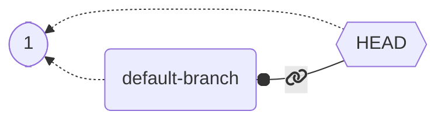
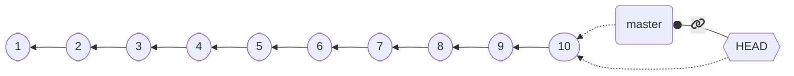

+++

title = "Progettazione e Sviluppo del Software"
description = "Progettazione e Sviluppo del Software, Tecnologie dei Sistemi Informatici"
outputs = ["Reveal"]
aliases = ["/git/"]

+++

# Sistemi di controllo versione

{}

---

## Riconoscimenti

* Questo materiale è ampiamente basato su quello realizzato dal Prof.
Danilo Pianini, che ringrazio.

* Ogni errore riscontratovi è esclusiva responsabilità degli autori di questo documento.

---


## Outline

### Goal della lezione

* Apprendere motivazioni, obiettivi, e tipologie degli strumenti di controllo di versione
* Apprendere l'utilizzo pratico del DVCS `git`

### Argomenti

* Concetto di *Version Control System (VCS)* 
* Tipologie di VCS: centralizzati vs. *decentralizzati*
* Concetti dei DVCS: repository, working tree, commit, branch, commit reference, checkout
* `git`: 
  * operatività di base: comandi `config`, `init`, `add`, `reset`, `commit`, `status`, `checkout`, `log`, `diff`
  * elementi peculiari: concetto di *stage* (*index*), configurazione, `.gitignore`,  gestione dei caratteri di "fine linea"
  * ulteriore operatività di base: comandi `branch`, `merge`
  * lavorare con i *remote*: comandi `clone`, `push`, `fetch`, `pull`
* *GitHub*: hosting per repository git + servizi per sviluppo collaborativo

---

# Introduzione ai Sistemi di Controllo di Versione (VCS)

---

## Motivazioni

Due motivazioni principali:

* *tenere traccia delle modifiche* durante lo sviluppo del software
    * *evitare la perdita* di progressi
    * osservare / tornare *avanti e indietro* nella cronologia delle modifiche
    * *documentare* il processo di sviluppo
* supportare la *collaborazione* tra più sviluppatori di software
    - lavorare *concorrentemente*
    - *integrazione* delle modifiche e *risoluzione dei conflitti*
---

## Tracciare le modifiche

Hai mai avuto bisogno di *ripristinare* un progetto o un compito a una *versione precedente*?

Come hai tracciato la *storia* del progetto?

### Metodo classico

1. trovare una *convenzione di denominazione* per file/cartelle
2. *creare una copia* ogni volta che si registra un progresso rilevante
3. *creare una copia* ogni volta che inizia uno sviluppo ambizioso ma rischioso

**Inefficace!**

* *Inefficiente*: consuma molte risorse (spazio)
* Richiede tempo e operazioni manuali *proclivi all'errore*
* Diversi compiti sono *difficili*: Come capire cosa c'era nelle versioni precedenti? Come selezionare solo alcune modifiche?

---

## Promuovere flussi di lavoro collaborativi

Hai mai avuto bisogno di sviluppare un progetto o un compito *in team*?

Come hai organizzato il lavoro per *massimizzare la produttività*?

### Metodi classici

* *Uno schermo, molte teste*
  * a.k.a. uno lavora, gli altri dormono
* *Blocchi*: "per favore non toccare la sezione 2, ci sto lavorando"
  * probabilità di conflitti prossima al 100%
* *Condivisione in tempo reale* (come Google Docs o Overleaf)
  * accettabile in molti casi per documenti di testo (ma con il rischio di "frankenstenizzazione")
  * dirompente con il codice (le incoerenze sono molto meno tollerabili nei linguaggi formali)

---
## Sistemi di Controllo di Versione (VCS)

* Anche chiamati Sistemi di Gestione del Contenuto Sorgente (SGCS)

*Sistemi di Controllo di Versione (VCS)*: strumenti pensati per supportare lo sviluppo di progetti tramite
* Il tracciamento della *storia* del progetto
* Il permesso di effettuare dei *rollback*
* La raccolta di *meta-informazioni* sulle modifiche
  * Autori, date, note...
* Il *merge* delle informazioni prodotte in diverse fasi
* La *facilitazione di flussi di lavoro paralleli* (in alcuni casi)

Due tipi principali:

* **Centralizzati**: Una *copia di riferimento* del repository contiene tutta la storia; gli sviluppatori lavorano su un sottoinsieme di tale storia
* **Distribuiti**: *Ogni copia* del repository contiene *tutta la storia* (cioè, ogni sviluppatore ne ha una localmente)

---

## VCS Locale vs. Centralizzato vs. Distribuito

### Locale


---

### Centralizzato


---

### Distribuito


---

## Breve storia

* **Concurrent Versioning System (CVS)** (1986): sistema client-server (modello *centralizzato*, la verità risiede sul server), opera su singoli file o a livello di repository, la cronologia è memorizzata in una directory nascosta, utilizza la compressione delta per risparmiare spazio.
* **Apache Subversion (SVN)** (2000): successore di CVS, ancora ampiamente utilizzato (soprattutto nelle aziende che faticano a rinnovare i propri processi). Modello *centralizzato* (simile a CVS). Migliorata la gestione dei file binari. Migliorata la concorrenza per le operazioni, ma ancora macchinoso per i flussi di lavoro paralleli.
* **Mercurial** e **Git** (entrambi aprile 2005): sistemi di controllo versione *decentralizzati* (DVCS), nessuna copia "speciale" del repository, ogni client memorizza l'intera cronologia. Altamente scalabili. Favoriscono il lavoro parallelo permettendo un'agevole creazione e fusione di rami. Concettualmente molto simili (quando due strumenti di successo emergono contemporaneamente con un modello simile in modo indipendente, è un'indicazione che il modello sottostante è "quello giusto" per il contesto).

**Git** è ora il DVCS dominante (sebbene Mercurial sia ancora in uso, ad esempio, per Python, Java, Facebook).

---

## Tendenze Google ad oggi


<script type="text/javascript" src="https://ssl.gstatic.com/trends_nrtr/3045_RC01/embed_loader.js"></script>
<script type="text/javascript">
var today = new Date().toISOString().split('T')[0]
var dateRange = `2004-01-01 $
{today}
`
trends.embed.renderExploreWidget(
  "TIMESERIES",
  {
    "comparisonItem":[
      {"keyword":"/m/05vqwg","geo":"","time":dateRange},
      {"keyword":"/m/012ct9","geo":"","time":dateRange},
      {"keyword":"/m/09d6g","geo":"","time":dateRange},
      {"keyword":"/m/08441_","geo":"","time":dateRange}
    ],
    "category":0,
    "property":""
  },
  {
    "exploreQuery":"date=all&q=%2Fm%2F028m4s,%2Fm%2F04tj5z,%2Fm%2F080c0g9",
    "guestPath":"https://trends.google.com:443/trends/embed/"
  }
);
</script>
---

## Intuizione: la cronologia di un progetto

1. Crea un nuovo progetto


---
2. Apportare alcune modifiche


---

3. Poi sempre di più, fino a quando il progetto è pronto


A prima vista, la cronologia di un progetto *sembra* una **linea**.

---

## Tranne che, nel mondo reale...

> Anything that can go wrong will go wrong
<br><cite>$1^{st}$ Murphy's law</cite>

> If anything simply cannot go wrong, it will anyway
<cite>$5^{th}$Murphy's law
</br>

---

# ...le cose vanno storte


---

## Ripristinare le modifiche

Tornare *indietro nel tempo* a uno stato precedente in cui le cose funzionavano


---

## Ottenere la versione precedente e correggere

Quindi correggere l'errore


Se si considerano i rollback, la cronologia è un **albero**!

---

# Collaborazione: divergenza

Alice e Bob lavorano insieme per un po' di tempo, poi tornano a casa e lavorano separatamente, in parallelo

Hanno una cronologia *divergente*!


---

# Collaborazione: riconciliazione


Se si ha la possibilità di *riconciliare gli sviluppi divergenti*, la cronologia diventa un **grafo**!

Riconciliare gli sviluppi divergenti è solitamente chiamato **merge** (unione)

---

## Concetti e terminologia DVCS: *Repository*

**Repository**: include l'intero contenuto/cronologia del progetto (e i *metadati*)

* tutte le *modifiche*, insieme ai loro *autori*, *date* e *descrizioni*
* informazioni su come *ripristinare* le modifiche
* *differenze* tra diversi punti nel tempo
* e così via

Di solito, memorizzato in una cartella nascosta nella *cartella principale* del progetto

---

## Concetti e terminologia DVCS: *Working Tree*

(o *worktree*, o *working directory*)

l'insieme di **file** (solitamente, all'interno di una *cartella radice*) che costituiscono il progetto,
escludendo i *metadati*.

---

## Concetti e terminologia DVCS: *Commit*

Uno **stato salvato** del progetto.
* Raccoglie le *modifiche* necessarie per trasformare il commit precedente (*genitore*) nel commit corrente (*tracciamento differenziale*)
* Crea uno *snapshot* dello stato del worktree (snapshotting).
* Registra i metadati: *commit genitore*, *autore*, *data*, un *messaggio* che riassume le modifiche e un *identificatore univoco (UID)*.
* Un commit senza genitori è un *commit iniziale*.
* Un commit con più genitori è un *commit di merge*.


---

## Concetti e terminologia DVCS: *Branch*

Una **sequenza nominata di commit**


Se nessun branch è stato creato al primo commit, viene utilizzato un nome predefinito.

---

## Concetti e terminologia DVCS: *Riferimenti ai commit*

Per poter tornare *indietro nel tempo* o *cambiare branch*, è necessario **fare riferimento ai commit**

* I riferimenti ai commit sono anche chiamati `tree-ish`
* Ogni commit ha un **identificatore univoco**, che è un riferimento valido
* Un **nome di branch** è un riferimento di commit valido (punta all'*ultimo commit di quel branch*)

### Un nome di commit speciale è **HEAD**, che si riferisce al *commit corrente*
  * Quando si esegue un commit, **HEAD** si sposta in avanti verso il nuovo commit


### Riferimenti assoluti e relativi

Aggiungere `~` e un numero `i` a un tree-ish valido significa "`i-esimo` genitore di questo tree-ish"


---

## Concetti e terminologia DVCS: *Checkout*

L'operazione di **spostamento verso un altro commit** (cioè a uno snapshot o versione del progetto)
* Spostamento verso *un altro branch*
* Spostamento *indietro nel tempo*

Sposta `HEAD` verso il *tree-ish di destinazione* specificato

---

## Esempio di evoluzione del progetto

Proviamo a vedere cosa succede quando sviluppiamo un progetto, passo dopo passo.

---

1. primo commit




2. secondo commit


---


---


Oh, no, c'è stato un errore! Dobbiamo effettuare un rollback!

---

## *checkout di C4*


* Nessuna informazione va persa, possiamo tornare allo stato `6` ogni volta che vogliamo.
* Cosa succede se facciamo un commit ora?

---

## Branching!


*Ok, ma c'erano elementi utili in `5`, vorrei averli in `new-branch` 

---

## Merging!


**Nota che:**
* abbiamo due branch
* `8` è un commit di merge, in quanto ha due genitori: `7` e `5`
* la situazione è la stessa indipendentemente dal fatto che si tratti di *un singolo sviluppatore che torna indietro nello sviluppo* o di *sviluppatori multipli che lavorano in parallelo*!
* questo è possibile perché *ogni copia del repository contiene l'intera history*!
---


## Sistema di controllo delle versioni distribuito di riferimento: Git

Sistema di controllo delle versioni distribuito di fatto

* *Distribuito*
* Creato nel *2005* per sostituire BitKeeper come SCM per il kernel Linux
  * Le prestazioni erano una preoccupazione principale
  * Scritto in C
* Sviluppato da Linus Torvalds
  * Ora mantenuto da altri
* *Orientato a Unix*
  * Tiene traccia dei permessi dei file Unix
* Molto *veloce*
  * Alla sua creazione, 10 volte più veloce di Mercurial¹, 100 volte più veloce di Bazaar

¹ Meno differenza ora, Facebook ha migliorato notevolmente Mercurial

---

## Divertente introduzione storica



---

## Approccio: prima la riga di comando

#### (in realtà: solo riga di comando)

**Git è uno strumento a interfaccia a riga di comando (CLI)**

Sebbene esistano interfacce grafiche, non ha senso imparare una GUI:
* sono più soggette a modifiche future rispetto alla CLI
* aggiungono un livello di interposizione tra te e lo strumento
* a meno che non siano incomplete, espongono *più complessità* di quella che possiamo gestire in questo corso
  * cosa fai con una casella di controllo etichettata "squash when merging"?
  * e che dire del *checkout ricorsivo dei sottomoduli*?
* non appena impari *la CLI*, diventi così proficuo che diventi *più lento* quando c'è un'interfaccia grafica di mezzo

**Do per scontato una conoscenza minima dello shell, per favore fammelo sapere ORA se non l'hai mai visto**

---

# Operazioni di base con Git

---

## Configurazione

La configurazione in Git avviene a due livelli:
* **globale**: le opzioni predefinite, valide a livello di sistema
* **repository**: le opzioni specifiche di un repository. Hanno *precedenza* sulle impostazioni globali

### Strategia

Imposta le opzioni globali in modo ragionevole,
poi sovrascrivile a livello di repository, se necessario.

### `git config`

Il sottocomando `config` imposta le opzioni di configurazione
* quando viene utilizzato con l'opzione `--global`, configura lo strumento globalmente
* altrimenti, imposta l'opzione per il *repository corrente*
  * (deve esserci un repository valido)
* Utilizzo: `git config [--global] category.option value`
  * imposta `option` di `category` a `value`

---

## Configurazione: opzioni principali

Come detto, `--global` può essere omesso per sovrascrivere le impostazioni globali localmente

### Nome utente ed email: `user.name` e `user.email`

Un nome e un contatto vengono sempre salvati come metadati, quindi devono essere configurati

* `git config --global user.name "Il tuo vero nome"`
* `git config --global user.email "il.tuo.indirizzo.email@il.tuo.provider"`

### Editor predefinito

Alcune operazioni aprono un editor di testo.
È conveniente impostarlo su uno strumento che sai usare
(per evitare, ad esempio, di essere "bloccato" all'interno di `vi` o `vim`).
Funziona qualsiasi editor che puoi invocare dal terminale.

* `git config --global core.editor nano`

### Nome del ramo predefinito

Come denominare il ramo predefinito.
Due scelte ragionevoli sono `main` e `master`

* `git config --global init.defaultbranch master`

---

## Inizializzazione di un repository

### `git init`
* Inizializza un nuovo repository *all'interno della directory corrente*
* Materializzato nella cartella `.git`
* La posizione della cartella `.git` segna la radice del repository
  * *Non annidare* i repository all'interno dei repository: è fragile
  * I progetti annidati sono realizzati tramite *sottomoduli* (non discussi in questo corso)
* **Attenzione al luogo in cui si esegue il comando!**
  * Prima usa `cd` per posizionarti all'interno della cartella che contiene (o conterrà) il progetto
    * (eventualmente, crea prima la cartella con `mkdir`)
  * **Quindi** esegui `git init`
  * se qualcosa va storto, puoi eliminare il repository eliminando la cartella `.git`.

---

## Staging

Git ha il concetto di *stage* (o *index*).
* Le modifiche devono essere aggiunte allo stage per essere committate.
* I commit salvano le *__modifiche__ incluse nello stage*
  * I file modificati dopo essere stati aggiunti allo stage devono essere nuovamente aggiunti allo stage
* `git add <files>` sposta lo stato corrente dei file nello stage come *modifiche*
* `git reset <files>` rimuove le *modifiche* attualmente in stage dei file dallo stage
* `git commit` crea un nuovo *changeset* con il contenuto dello stage


---

## Osservazione dello stato del repository

È estremamente importante capire *chiaramente* qual è lo stato attuale delle cose
* Su quale *ramo* stiamo lavorando?
* Quali *file* sono stati *modificati*?
* Quali *modifiche* sono già *in stage*?

`git status` stampa lo stato corrente del repository, esempio di output:

```git
❯ git status
Sul ramo master
Il tuo ramo è aggiornato con 'origin/master'.

Modifiche da impegnare:
  (usa "git restore --staged <file>..." per rimuovere dallo stage)
        modificato:   content/_index.md
        nuovo file:   content/dvcs-basics/_index.md
        nuovo file:   content/dvcs-basics/staging.png

Modifiche non in stage per l'impegno:
  (usa "git add <file>..." per aggiornare ciò che verrà impegnato)
  (usa "git restore <file>..." per scartare le modifiche nella working directory)
        modificato:   layouts/shortcodes/gravizo.html
        modificato:   layouts/shortcodes/today.html
```

---

## Commit

* Richiede un **autore** e un'**email**
  * Possono essere configurati *globalmente* (a livello di *computer*):
    * `git config --global user.name 'Il tuo vero nome'`
    * `git config --global user.email 'la.tua@email.com'`
  * Le impostazioni globali possono essere *sovrascritte* a livello di *repository*
    * ad esempio, desideri effettuare il commit con un'email diversa tra progetti lavorativi e personali
    * `git config user.name 'Il tuo vero nome'`
    * `git config user.email 'la.tua@email.com'`
* Richiede un **messaggio**, l'utilizzo di messaggi appropriati è **estremamente importante**
  * Se non specificato, il commit non viene eseguito
  * può essere specificato in linea con `-m`, altrimenti Git aprirà l' *editor predefinito*
    * `git commit -m 'il mio messaggio molto chiaro ed esplicativo'`
* La *data* viene registrata automaticamente
* L' *identificatore di commit* (un hash crittografico) viene generato automaticamente

---

## Ramo predefinito

Al primo commit, non esiste alcun ramo e nessun `HEAD`.

A seconda della versione di Git, potrebbe verificarsi il seguente comportamento al primo commit:
* Git crea un *nuovo ramo* denominato `master`
  * *comportamento legacy*
  * il nome è ereditato dal nome del ramo predefinito in *Bitkeeper*
* Git crea un *nuovo ramo* denominato `master`, ma avverte che si tratta di un comportamento deprecato
  * sebbene derivi dal latino "*magister*" (maestro) e non dal modello "master/slave" di controllo asimmetrico della comunicazione, molti recentemente preferiscono `main` considerato più inclusivo
* Git si rifiuta di effettuare il commit fino a quando non viene specificato un nome di ramo predefinito
  * *comportamento moderno*
  * Richiede la configurazione: `git config --global init.defaultbranch nome-ramo-predefinito`

---

## Ignorare i file

In generale, non vogliamo tracciare *tutti* i file nella cartella del repository:
* Alcuni file potrebbero essere *temporanei* (ad esempio, creati dall'editor)
* Alcuni file potrebbero essere *rigenerabili* (ad esempio, binari compilati e archivi di applicazioni)
* Alcuni file potrebbero contenere informazioni *private*

Naturalmente, potremmo semplicemente non aggiungerli, ma l'errore è dietro l'angolo!

Sarebbe molto meglio dire a Git di ignorare alcuni file.

Ciò si ottiene tramite un file *speciale `.gitignore`*.
  * il file deve essere denominato `.gitignore`, nomi come `foo.gitignore` o `gitignore.txt` non funzioneranno
    * Un buon modo per creare/aggiungere a questo file è tramite `echo cosaVogliamoIgnorare >> .gitignore` (comando multipiattaforma)
  * è un elenco di percorsi che Git ignorerà (a meno che `git add` non venga chiamato con l'opzione `--force`)
  * è possibile aggiungere eccezioni

---

## Esempio di `.gitignore`

```ignore-list
# ignora la cartella bin e tutto il suo contenuto
bin/
# ignora ogni file pdf
*.pdf
# eccezione alla regola (che inizia con !): i file pdf denominati 'myImportantFile.pdf' devono essere tracciati
!myImportantFile.pdf
```

---

## Andare a capo è più complicato di quanto sembri

Andare a capo è un'operazione in due fasi:
1. Riporta il cursore all'inizio della riga
2. Sposta il cursore di una riga in basso

Nelle *teletipografie elettromeccaniche* (e anche nelle macchine da scrivere), erano due operazioni distinte:
1. *Carriage Return* (riporta il carrello nella sua posizione più a sinistra)
2. *Line Feed* (ruota il carrello di un passo)

---
## Una telescrivente


* scrittura di testo senza che gli utenti debbano inviare esplicitamente comandi di *ritorno a capo* e *avanzamento riga*.

---

## A capo nel mondo moderno

I terminali sono stati progettati per comportarsi come telescriventi virtuali.
* Infatti, sono ancora chiamati **TTY** (**T**ele**TY**pewriter).
* Nei sistemi Unix-like, sono ancora implementati come *dispositivi virtuali*.
  * Se si dispone di MacOS X o Linux, è possibile vedere quale dispositivo virtuale supporta il terminale corrente usando `tty`.
* Ad un certo punto, Unix ha deciso che `LF` era sufficiente nei TTY virtuali per andare a capo.
  * Probabilmente *ispirato dal linguaggio C*, dove `\n` significa "a capo".
  * Il comportamento può ancora essere disabilitato.
```text
otterremmo
            righe
                 come queste
```

#### Conseguenza:
* I sistemi Windows vanno a capo con un carattere `CR` seguito da un carattere `LF`: `\r\n`.
* I sistemi Unix-like vanno a capo con un carattere `LF`: `\n`.
* I vecchi sistemi Mac andavano a capo con un carattere `CR`: `\r`.
  * Fondamentalmente hanno deciso di usare un singolo carattere come Unix, ma hanno fatto la scelta opposta.
  * MacOS X è conforme a POSIX e usa `\n`.

---

## A capo e controllo di versione

Se il tuo team utilizza *sistemi operativi multipli*, è probabile che, per impostazione predefinita, gli editor di testo utilizzino `LF` (su Unix) o `CRLF`.

È anche molto probabile che, al momento del salvataggio, l'intero file venga riscritto con i *terminatori di riga* "*localmente* corretti*".

* Questo però porterebbe a *tutte le righe modificate*!
* La differenziale sarebbe enorme.
* *Sorgeranno conflitti ovunque*!

Git cerca di affrontare questo problema *convertendo automaticamente* i terminatori di riga in modo che corrispondano ai *terminatori di riga iniziali del file*.

* questo di solito si traduce in repository con *terminatori di riga illogicamente misti* (a seconda di chi ha creato per primo un file) e un sacco di avvisi sulle conversioni `LF`/`CRLF`.

I terminatori di riga dovrebbero invece essere **configurati per tipo di file!**

---

## `.gitattributes`

* Una strategia sensata è quella di utilizzare `LF` ovunque, tranne che per gli script di Windows (`bat`, `cmd`, `ps1`).
* Git può essere configurato tramite un file `.gitattributes` nella root del repository.
  * In realtà può fare [molto di più che imporre i terminatori di riga](https://git-scm.com/docs/gitattributes).
* Esempio:
```text
* text=auto eol=lf
*.[cC][mM][dD] text eol=crlf
*.[bB][aA][tT] text eol=crlf
*.[pP][sS]1 text eol=crlf
```


---

## Gestione della rimozione e del rinominamento dei file

* La rimozione di un file è una *modifica* legittima.
* Come discusso, `git add` aggiunge una *modifica* allo staging area.
* **la modifica può essere una rimozione!**

`git add someDeletedFile` è un comando corretto, che metterà in staging area il fatto che `someDeletedFile` non esiste più e che la sua eliminazione deve essere registrata al prossimo `commit`.

* Il *rinominamento* di un file è *equivalente all'eliminazione e alla creazione di un file*, dove, per inciso, il nuovo file ha lo stesso contenuto del file eliminato.
* Per mettere in staging area la rinominazione del file `foo` in `bar`:
  * `git add foo bar`
  * registra che `foo` è stato eliminato e `bar` è stato creato.
  * Git è abbastanza intelligente da capire che si tratta di un cambio di nome e lo gestirà *efficientemente*.

---

## Visualizzazione della cronologia

Naturalmente, è utile visualizzare la cronologia dei commit.
Git fornisce un sottocomando dedicato:

`git log`

* apre una *visualizzazione interattiva navigabile* della cronologia dal commit `HEAD` (il commit corrente) all'indietro.
  * Premere <kbd>Q</kbd>
* Visualizzazione *compatta*: `git log --oneline`
* Visualizzazione di *tutti i branch*: `git log --all`
* Visualizzazione di un grafico *laterale*: `git log --graph`
* Visualizzazione compatta di tutti i branch con un grafico: `git log --oneline --all --graph`

---

### Esempio di output di `git log --oneline --all --graph`

```text
* d114802 (HEAD -> master, origin/master, origin/HEAD) moar contribution
| * edb658b (origin/renovate/gohugoio-hugo-0.94.x) ci(deps): update gohugoio/hugo action to v0.94.2
|/  
* 4ce3431 ci(deps): update gohugoio/hugo action to v0.94.1
* 9efa88a ci(deps): update gohugoio/hugo action to v0.93.3
* bf32a8b begin with build slides
* b803a65 lesson 1 looks ready
* 6a85f8f ci(deps): update gohugoio/hugo action to v0.93.2
* b474d2a write more on the introductory lesson
* 8a7105e ci(deps): update gohugoio/hugo action to v0.93.1
* 6e40642 begin writing the first lesson
```

---

## Riferimento ai commit: `<tree-ish>`

In Git, un riferimento a un commit è chiamato `<tree-ish>`. I `<tree-ish>` validi sono:
* Hash di *commit* completi, come `b82f7567961ba13b1794566dde97dda1e501cf88`.
* Hash di *commit* abbreviati, come `b82f7567`.
* *Nomi di branch*, nel qual caso il riferimento è all'ultimo commit del branch.
* `HEAD`, un nome speciale che fa riferimento al commit corrente (la testa, appunto).
* *Nomi di tag* (discuteremo cosa sia un tag più avanti).

---

## Riferimenti relativi

È possibile creare *riferimenti relativi*, ad esempio "prendimi il commit precedente a questo `<tree-ish>`",
seguendo il commit `<tree-ish>` con una tilde (`~`) e con il numero di genitori a cui arrivare:
* `<tree-ish>~STEPS` dove `STEPS` è un numero intero produce un riferimento al genitore `STEPS-esimo` del `<tree-ish>` fornito:
  * `b82f7567~1` fa riferimento al *genitore* del commit `b82f7567`.
  * `some_branch~2` fa riferimento al *genitore del genitore* dell'ultimo commit del branch `some_branch`.
  * `HEAD~3` fa riferimento al *genitore del genitore del genitore* del commit corrente.

* Nel caso di commit di merge (con più genitori), `~` seleziona il primo.
* La selezione dei genitori può essere eseguita con il caret nel caso di più genitori (`^`).
  * Non approfondiremo qui, ma:
    * Il riferimento [`git rev-parse` sulla specifica della revisione](https://git-scm.com/docs/git-rev-parse#_specifying_revisions) è pubblicamente disponibile.
    * Una [spiegazione molto più leggibile si trova su Stack Overflow](https://stackoverflow.com/a/2222920/1916413).

---

## Visualizzazione delle differenze

Vogliamo vedere quali *differenze* ha introdotto un commit, o cosa abbiamo modificato in alcuni file dell'area di lavoro.

Git fornisce supporto per visualizzare le modifiche in termini di *righe modificate* tramite `git diff`:
* `git diff` mostra la differenza tra lo *staging area* e l'area di lavoro.
  * vale a dire, ciò che si metterebbe in staging area se si esegue un `git add`.
* `git diff --staged` mostra la differenza tra `HEAD` e lo *staging area*.
  * quindi, fondamentalmente, ciò che si sta per commettere.
* `git diff <tree-ish>` mostra la differenza tra `<tree-ish>` e l'area di lavoro (*staging area escluso*).
* `git diff --staged <tree-ish>` mostra la differenza tra `<tree-ish>` e l'area di lavoro, *incluse le modifiche in staging area*.
* `git diff <da> <a>`, dove `<da>` e `<a>` sono `<tree-ish>`, mostra le differenze tra `<da>` e `<a>`.
* `git diff --word-diff` è utile quando si lavora su testo.

---

### Esempio di output di `git diff`:

```diff
diff --git a/.github/workflows/build-and-deploy.yml b/.github/workflows/build-and-deploy.yml
index b492a8c..28302ff 100644
--- a/.github/workflows/build-and-deploy.yml
+++ b/.github/workflows/build-and-deploy.yml
@@ -28,7 +28,7 @@ jobs:
           # Idea: the regex matcher of Renovate keeps this string up to date automatically
           # The version is extracted and used to access the correct version of the scripts
           USES=$(cat <<TRICK_RENOVATE
-          - uses: gohugoio/hugo@v0.94.1
+          - uses: gohugoio/hugo@v0.93.3
           TRICK_RENOVATE
           )
           echo "Scripts update line: \"$USES\""
```

* Una [spiegazione dettagliata del formato del messaggio diff si trova qui](https://www.freecodecamp.org/news/git-diff-and-patch/).
* L'output è compatibile con i comandi Unix `diff` e `patch`.
* Tuttavia, i *file binari sono un problema*! Il tracciamento dei file giusti è fondamentale.

---

## Navigazione nella cronologia

La navigazione nella cronologia significa concretamente spostare la testa (in Git, `HEAD`) su punti arbitrari della cronologia.

In Git, questo viene eseguito con il commit `checkout`:
* `git checkout <tree-ish>`
  * A meno che non ci siano modifiche che potrebbero andare perse, *sposta* `HEAD` sul `<tree-ish>` fornito.
  * Aggiorna tutti i file tracciati alla loro versione nel `<tree-ish>` fornito.

Il comando può essere utilizzato per *effettuare il checkout selettivo di un file da un'altra revisione*:
* `git checkout <tree-ish> -- foo bar baz`
  * Ripristina lo stato dei file `foo`, `bar` e `baz` dal commit `<tree-ish>` e li aggiunge allo staging area (a meno che non ci siano modifiche non commesse che potrebbero andare perse).
  * Si noti che `--` è circondato da spazi bianchi, non è un'opzione `--foo`, viene semplicemente utilizzato come separatore tra il `<tree-ish>` e l'elenco dei file.
    * i file potrebbero essere denominati come un `<tree-ish>` e abbiamo bisogno di disambiguazione.

---

## Head staccato

Git **non** consente *più head per branch*
(altri DVCS lo fanno, in particolare Mercurial):
affinché un commit sia valido, `HEAD` deve essere alla "fine" di un branch (sul suo ultimo commit), come segue:



Quando viene effettuato il checkout di un commit vecchio, questa condizione non è più valida!

Se eseguiamo `git checkout HEAD~4`:

```mermaid
flowchart RL
  HEAD{{"HEAD fas:fa-unlink"}}
  b1(master)

  C10([10]) --> C9([9]) --> C8([8]) --> C7([7]) --> C6([6]) --> C5([5]) --> C4([4]) --> C3([3]) --> C2([2]) --> C1([1])

  b1 -.-> C10

  HEAD -.-> C6

  class HEAD head;
  class b1,b2 branch;
  class C1,C2,C3,C4,C5,C6,C7,C8,C9,C10 commit;
```
Il sistema entra in una modalità di lavoro speciale chiamata *detached head*.

Quando si è in **detached head**, Git permette di effettuare **commit**, ma questi **vanno persi**!

* (Non del tutto, ma è necessario creare un branch, oppure per recuperarli serve `git reflog` e `git cherry-pick`, argomenti che non tratteremo)


---

# Branching e merging

---

## Branch come etichette

Per poter iniziare nuove linee di sviluppo,
è necessario *creare* un **branch**.

In Git, i branch funzionano come *etichette mobili*:
* Al momento della creazione, sono attaccati allo stesso commit a cui fa riferimento `HEAD`
* Se viene effettuato un nuovo commit quando `HEAD` è attaccato ad essi, si **muovono insieme a `HEAD`**

---

## Creazione di un branch

I branch vengono creati con `git branch branch_name`


```mermaid
flowchart RL
%%  HEAD{{"HEAD fas:fa-unlink"}}
  HEAD{{"HEAD"}}
  b1(master)

  C10([10]) --> C9([9]) --> C8([8]) --> C7([7]) --> C6([6]) --> C5([5]) --> C4([4]) --> C3([3]) --> C2([2]) --> C1([1])

  b1 -.-> C10

  HEAD -.-> C10
  HEAD --"fas:fa-link"--o b1

  class HEAD head;
  class b1,b2 branch;
  class C1,C2,C3,C4,C5,C6,C7,C8,C9,C10 commit;
```

⬇️ `git branch new-experiment` ⬇️

{}

```mermaid
flowchart RL
%%  HEAD{{"HEAD fas:fa-unlink"}}
  HEAD{{"HEAD"}}
  b1(master)
  b2(new-experiment)

  C10([10]) --> C9([9]) --> C8([8]) --> C7([7]) --> C6([6]) --> C5([5]) --> C4([4]) --> C3([3]) --> C2([2]) --> C1([1])

  b1 -.-> C10
  b2 -.-> C10

  HEAD -.-> C10
  HEAD --"fas:fa-link"--o b1

  class HEAD head;
  class b1,b2 branch;
  class C1,C2,C3,C4,C5,C6,C7,C8,C9,C10 commit;
```

`HEAD` *non si associa al nuovo ramo per default*: è necessario un esplicito comando `checkout`.

{}

---

## Creazione di rami in stato **DETACHED_HEAD**

La creazione di nuovi rami permette di salvare le modifiche apportate quando ci si trova nello stato **DETACHED_HEAD**.

```mermaid
flowchart RL
%%  HEAD{{"HEAD fas:fa-unlink"}}
  HEAD{{"HEAD"}}
  b1(master)

  C10([10]) --> C9([9]) --> C8([8]) --> C7([7]) --> C6([6]) --> C5([5]) --> C4([4]) --> C3([3]) --> C2([2]) --> C1([1])

  b1 -.-> C10

  HEAD -.-> C10
  HEAD --"fas:fa-link"--o b1

  class HEAD head;
  class b1,b2 branch;
  class C1,C2,C3,C4,C5,C6,C7,C8,C9,C10 commit;
```

{}
⬇️ `git checkout HEAD~4` ⬇️

{}

{}

```mermaid
flowchart RL
  HEAD{{"HEAD fas:fa-unlink"}}
  b1(master)

  C10([10]) --> C9([9]) --> C8([8]) --> C7([7]) --> C6([6]) --> C5([5]) --> C4([4]) --> C3([3]) --> C2([2]) --> C1([1])

  b1 -.-> C10

  HEAD -.-> C6

  class HEAD head;
  class b1,b2 branch;
  class C1,C2,C3,C4,C5,C6,C7,C8,C9,C10 commit;
```

* **DETACHED_HEAD**: le nostre modifiche verranno scartate, a meno che...

{}

{}
➡️ Next: `git branch new-experiment` ➡️
{}

---

## Creazione di rami in stato **DETACHED_HEAD**

⬇️ `git branch new-experiment` ⬇️

```mermaid
flowchart RL
  HEAD{{"HEAD fas:fa-unlink"}}
  b1(master)
  b2("new-experiment")

  C10([10]) --> C9([9]) --> C8([8]) --> C7([7]) --> C6([6]) --> C5([5]) --> C4([4]) --> C3([3]) --> C2([2]) --> C1([1])

  b1 -.-> C10

  HEAD -.-> C6
  b2 -.-> C6

  class HEAD head;
  class b1,b2 branch;
  class C1,C2,C3,C4,C5,C6,C7,C8,C9,C10 commit;
```

{}
`HEAD` è ancora *staccato*, quindi dobbiamo *attaccarlo al nuovo ramo* affinché memorizzi i nostri commit.{}

{}
➡️ Next: `git checkout new-experiment` ➡️
{}

---

## Creating branches when in **DETACHED_HEAD**

⬇️ `git checkout new-experiment` ⬇️

```mermaid
flowchart RL
  HEAD{{"HEAD"}}
  b1(master)
  b2("new-experiment")

  C10([10]) --> C9([9]) --> C8([8]) --> C7([7]) --> C6([6]) --> C5([5]) --> C4([4]) --> C3([3]) --> C2([2]) --> C1([1])

  b1 -.-> C10

  HEAD -.-> C6
  HEAD --"fas:fa-link"--o b2
  b2 -.-> C6

  class HEAD head;
  class b1,b2 branch;
  class C1,C2,C3,C4,C5,C6,C7,C8,C9,C10 commit;
```

* I nuovi commit saranno ora salvati!

{}

⬇️ [changes] + `git add` + `git commit` ⬇️

{}

{}

```mermaid
flowchart RL
  HEAD{{"HEAD"}}
  b1(master)
  b2("new-experiment")

  C10([10]) --> C9([9]) --> C8([8]) --> C7([7]) --> C6([6]) --> C5([5]) --> C4([4]) --> C3([3]) --> C2([2]) --> C1([1])
  C11([11]) --> C6

  b1 -.-> C10

  HEAD -.-> C11
  HEAD --"fas:fa-link"--o b2
  b2 -.-> C11

  class HEAD head;
  class b1,b2 branch;
  class C1,C2,C3,C4,C5,C6,C7,C8,C9,C10,C11 commit;
```

$\Rightarrow$ `HEAD` fa avanzare il nostro ramo con sé!

{}

---

## Creazione di un branch "one-shot"

Come potete immaginare, creare un *nuovo branch* e *agganciare `HEAD`* al branch appena creato è un'operazione piuttosto comune.

Come consuetudine per le operazioni comuni, è disponibile un comando abbreviato: `git checkout -b new-branch-name`
* Crea `new-branch-name` dalla posizione corrente di `HEAD`
* Aggancia `HEAD` a `new-branch-name`

```mermaid
flowchart RL
  HEAD{{"HEAD fas:fa-unlink"}}
  b1(master)

  C10([10]) --> C9([9]) --> C8([8]) --> C7([7]) --> C6([6]) --> C5([5]) --> C4([4]) --> C3([3]) --> C2([2]) --> C1([1])

  b1 -.-> C10

  HEAD -.-> C6

  class HEAD head;
  class b1,b2 branch;
  class C1,C2,C3,C4,C5,C6,C7,C8,C9,C10 commit;
```

⬇️ `git checkout -b new-experiment` ⬇️

```mermaid
flowchart RL
  HEAD{{"HEAD"}}
  b1(master)
  b2("new-experiment")

  C10([10]) --> C9([9]) --> C8([8]) --> C7([7]) --> C6([6]) --> C5([5]) --> C4([4]) --> C3([3]) --> C2([2]) --> C1([1])

  b1 -.-> C10

  HEAD -.-> C6
  HEAD --"fas:fa-link"--o b2
  b2 -.-> C6

  class HEAD head;
  class b1,b2 branch;
  class C1,C2,C3,C4,C5,C6,C7,C8,C9,C10 commit;
```

---

## Unione di branch

Riunificare linee di sviluppo divergenti è *molto più complicato* che creare nuove linee di sviluppo.

In altre parole, *l'unione* è **molto più complicata** della *creazione di branch*.

* Storicamente, con i sistemi di controllo di versione *centralizzati*, l'unione era considerata estremamente delicata e difficile.
* I sistemi di controllo di versione *distribuiti* hanno promosso unioni *frequenti* e di *piccole dimensioni*, molto più facili da gestire.
* I **conflitti** *possono ancora verificarsi!*
  * cosa succede se modifichiamo la stessa riga di codice in due branch in modo diverso?

In Git, `git merge target` unisce il branch chiamato `target` nel branch corrente (`HEAD` deve essere associato).

---

## Esempio visivo di unione

```mermaid
flowchart RL
  HEAD{{"HEAD"}}
  b1(master)
  b2("new-experiment")

  C10([10]) --> C9([9]) --> C8([8]) --> C7([7]) --> C6([6]) --> C5([5]) --> C4([4]) --> C3([3]) --> C2([2]) --> C1([1])
  C12([12]) --> C11([11]) --> C6 

  b1 -.-> C10

  HEAD -.-> C12
  HEAD --"fas:fa-link"--o b2
  b2 -.-> C12

  class HEAD head;
  class b1,b2 branch;
  class C1,C2,C3,C4,C5,C6,C7,C8,C9,C10,C11,C12 commit;
```

⬇️ `git merge master` ⬇️

{}

```mermaid
flowchart RL
  HEAD{{"HEAD"}}
  b1(master)
  b2("new-experiment")

  C10([10]) --> C9([9]) --> C8([8]) --> C7([7]) --> C6([6]) --> C5([5]) --> C4([4]) --> C3([3]) --> C2([2]) --> C1([1])
  C13([13]) --> C12([12]) --> C11([11]) --> C6 
  C13 --> C10

  b1 -.-> C10

  HEAD -.-> C13
  HEAD --"fas:fa-link"--o b2
  b2 -.-> C13

  class HEAD head;
  class b1,b2 branch;
  class C1,C2,C3,C4,C5,C6,C7,C8,C9,C10,C11,C12,C13 commit;
```

{}

---

## Fast Forwarding

Consideriamo questa situazione:

```mermaid
flowchart RL
  HEAD{{"HEAD"}}
  b1(master)
  b2("new-experiment")

  C10([10]) --> C9([9]) --> C8([8]) --> C7([7]) --> C6([6]) --> C5([5]) --> C4([4]) --> C3([3]) --> C2([2]) --> C1([1])

  b1 -.-> C10

  HEAD -.-> C6
  HEAD --"fas:fa-link"--o b2
  b2 -.-> C6

  class HEAD head;
  class b1,b2 branch;
  class C1,C2,C3,C4,C5,C6,C7,C8,C9,C10,C11,C12,C13 commit;
```

* Vogliamo che `new-experiment` includa anche le modifiche da `C7` a `C10` (per essere aggiornato con `master`)
* `master` contiene tutti i commit di `new-experiment`
* Non abbiamo realmente bisogno di un merge commit, possiamo semplicemente spostare `new-experiment` per puntarlo a `C6`
* $\Rightarrow$ Questo si chiama **fast-forward**
  * È il *comportamento predefinito* di Git quando si fondono rami dove il target è la head più qualcosa

{}

```mermaid
flowchart RL
  HEAD{{"HEAD"}}
  b1(master)
  b2("new-experiment")

  C10([10]) --> C9([9]) --> C8([8]) --> C7([7]) --> C6([6]) --> C5([5]) --> C4([4]) --> C3([3]) --> C2([2]) --> C1([1])

  b1 -.-> C10

  HEAD -.-> C10
  HEAD --"fas:fa-link"--o b2
  b2 -.-> C10

  class HEAD head;
  class b1,b2 branch;
  class C1,C2,C3,C4,C5,C6,C7,C8,C9,C10,C11,C12,C13 commit;
```

{}

---

## Conflitti di Merge

Git tenta di risolvere la maggior parte dei conflitti *automaticamente*.
* È *abbastanza bravo* in questo.
* ma alcune situazioni richiedono ancora *intervento umano*.

In caso di conflitto su uno o più file, Git contrassegna i file in questione come *in conflitto* e li modifica aggiungendo dei *marcatori di merge*:

```text
<<<<<<< HEAD
Modifiche apportate sul ramo in cui si sta fondendo,
questo è il ramo attualmente selezionato (HEAD).
=======
Modifiche apportate sul ramo che si sta fondendo.
>>>>>>> other-branch-name
```
* L'utente deve *modificare i file in conflitto* in modo che riflettano lo *stato finale desiderato*.
* I file (ora corretti) devono essere aggiunti allo staging area con `git add`.
* L'operazione di merge può essere conclusa tramite `git commit`.
  * In caso di merge, il messaggio è pre-compilato.
  * Se il messaggio va bene, `git commit --no-edit` può essere usato per accettarlo senza modificarlo.

---

## Buone pratiche

**Evitare i conflitti di merge è *molto* meglio che risolverli**

Sebbene siano inevitabili in alcuni casi, possono essere *minimizzati* seguendo alcune *buone pratiche*:

* **Non** *tenere traccia dei file che possono essere generati*.
  * Questo è dannoso sotto molti punti di vista, e i conflitti di merge sono uno di questi.
* **Sì** *effettuare molti piccoli commit*.
  * Ogni modifica coerente dovrebbe essere materializzata in un commit.
  * Anche modifiche molto piccole, come la modifica degli spazi bianchi.
  * Commit più piccoli aiutano Git a capire meglio cosa è cambiato e in quale ordine, portando generalmente a conflitti più granulari (e più facili da risolvere).
* **Sì** *applicare regole di stile* in tutto il team.
  * Le modifiche di stile sono modifiche legittime.
  * Lo stile è spesso imposto a livello di IDE.
  * Modifiche logiche minime possono causare modifiche diffuse a causa di modifiche di stile.
* **Sì** *fare attenzione alle nuove righe*.
  * Sistemi operativi diversi usano caratteri di nuova riga diversi.
  * Git cerca di essere intelligente in questo, spesso fallendo catastroficamente.


---

# Operazioni con i remotes

---

## Importare un repository

* Possiamo inizializzare un repository **vuoto** con `git init`.
* Ma nella maggior parte dei casi vogliamo partire da una copia *locale* di un repository **esistente**.

Git fornisce un sottocomando `clone` che copia *tutta la cronologia* di un repository localmente.
* `git clone URI destinazione` crea la cartella `destinazione` e clona il repository trovato in `URI`.
  * Se `destinazione` non è vuota, fallisce.
  * Se `destinazione` è omessa, viene creata una cartella con lo stesso nome dell'ultimo segmento di `URI`.
  * `URI` può essere remoto o locale, Git supporta i protocolli `file://`, `https://` e `ssh`.
      * `ssh` *raccomandato* quando disponibile.
* Il sottocomando `clone` effettua il checkout del ramo remoto a cui è attaccato `HEAD` (*ramo predefinito*).

Esempi:
* `git clone /some/repository/on/my/file/system destinazione`
  * crea una cartella locale chiamata `destinazione` e copia il repository dalla directory locale.
* `git clone https://somewebsite.com/someRepository.git mia_cartella`
  * crea una cartella locale chiamata `mia_cartella` e copia il repository situato all'URL specificato.
* `git clone user@sshserver.com:SomePath/SomeRepo.git`
  * crea una cartella locale chiamata `SomeRepo` e copia il repository situato all'URL specificato.

---

## Remotes

* I remotes sono le *copie conosciute* del repository che esistono da qualche parte (solitamente su Internet).
* Ogni remoto ha un *nome* e un *URI*.
* Quando un repository viene creato tramite `init`, nessun remoto è conosciuto.
* Quando un repository viene importato tramite `clone`, viene creato automaticamente un remoto chiamato `origin`.

*I rami non locali possono essere referenziati* come `nomeRemote/nomeBranch`.

Il sottocomando `remote` viene utilizzato per ispezionare e gestire i remotes:
* `git remote -v` *elenca* i remotes conosciuti.

* `git remote add un-remoto URI` *aggiunge* un nuovo remoto chiamato `un-remoto` e che punta a `URI`.
* `git remote show un-remoto` mostra *informazioni estese* su `un-remoto`.
* `git remote remove un-remoto` *rimuove* `un-remoto` (non elimina le informazioni sul remoto, *localmente* dimentica che esiste).

---

## Rami upstream

I rami remoti possono essere *associati* a rami locali, con il significato che il ramo locale e quello remoto sono *destinati ad essere due copie dello stesso ramo*.

* Un ramo remoto associato a un ramo locale è il suo **ramo upstream**.
* I rami upstream possono essere configurati tramite `git branch --set-upstream-to=remoto/nomeRamo`.
  * es.: `git branch --set-upstream-to=origin/develop` imposta l'upstream del ramo corrente su `origin/develop`.
* Quando un repository viene inizializzato da `clone`, il suo ramo predefinito viene effettuato il checkout localmente con lo stesso nome che ha sul remoto, e il ramo remoto viene impostato automaticamente come *upstream*.

---

### Risultato effettivo di `git clone git@somesite.com/repo.git`

```mermaid
flowchart RL

subgraph somesite.com/repo.git
  direction RL
  HEAD{{"HEAD"}}
  master(master)
  serverless(feat/serverless)

  C10([10]) --> C9([9]) --> C8([8]) --> C7([7]) --> C6([6]) --> C5([5]) --> C4([4]) --> C3([3]) --> C2([2]) --> C1([1])
  C12([12]) --> C11([11]) --> C7

  master -.-> C10
  serverless -.-> C12

  HEAD -.-> C10
  HEAD --"fas:fa-link"--o master
end

subgraph local
  direction RL
  origin[(origin)]

  HEADL{{"HEAD"}}
  masterl(master)

  CL10([10]) --> CL9([9]) --> CL8([8]) --> CL7([7]) --> CL6([6]) --> CL5([5]) --> CL4([4]) --> CL3([3]) --> CL2([2]) --> CL1([1])

  masterl -.-> CL10
  masterl ==o master

  HEADL -.-> CL10
  HEADL --"fas:fa-link"--o masterl
end

origin ==o somesite.com/repo.git

class local,somesite.com/repo.git repo;
class origin remote;
class HEAD,HEADL head;
class master,masterl,bug22,serverless branch;
class C1,C2,C3,C4,C5,C6,C7,C8,C9,C10,C11,C12,C13,CL1,CL2,CL3,CL4,CL5,CL6,CL7,CL8,CL9,CL10,CL11,CL12,CL13 commit;
```

* `git@somesite.com/repo.git` è salvato come `origin`
* Il branch principale (il branch a cui è attaccato `HEAD`, nel nostro caso `master`) su `origin` viene checkoutato localmente con lo stesso nome
* Il branch locale `master` è configurato per tracciare `origin/master` come upstream
* Altri branch vengono *fetchati* (sono noti localmente), ma non viene fatto checkout

---

## Importare branch remoti

`git branch` (o `git checkout -b`) può fate checkout branch remoti localmente *una volta che sono stati fetchati*.

```mermaid
flowchart RL

subgraph somesite.com/repo.git
  direction RL
  HEAD{{"HEAD"}}
  master(master)
  serverless(feat/serverless)

  C10([10]) --> C9([9]) --> C8([8]) --> C7([7]) --> C6([6]) --> C5([5]) --> C4([4]) --> C3([3]) --> C2([2]) --> C1([1])
  C12([12]) --> C11([11]) --> C7

  master -.-> C10
  serverless -.-> C12

  HEAD -.-> C10
  HEAD --"fas:fa-link"--o master
end

subgraph local
  direction RL
  origin[(origin)]

  masterl(master)

  HEADL{{"HEAD"}}

  CL10([10]) --> CL9([9]) --> CL8([8]) --> CL7([7]) --> CL6([6]) --> CL5([5]) --> CL4([4]) --> CL3([3]) --> CL2([2]) --> CL1([1])

  masterl -.-> CL10
  masterl ==o master

  HEADL -.-> CL10
  HEADL --"fas:fa-link"--o masterl
end

origin ==o somesite.com/repo.git

class local,somesite.com/repo.git repo;
class origin remote;
class HEAD,HEADL head;
class master,masterl,bug22,serverless branch;
class C1,C2,C3,C4,C5,C6,C7,C8,C9,C10,C11,C12,C13,CL1,CL2,CL3,CL4,CL5,CL6,CL7,CL8,CL9,CL10,CL11,CL12,CL13 commit;
```

➡️ `git checkout -b imported-feat origin/feat/serverless` ➡️

---

⬇️ `git checkout -b imported-feat origin/feat/serverless` ⬇️

```mermaid
flowchart RL

subgraph somesite.com/repo.git
  direction RL
  HEAD{{"HEAD"}}
  master(master)
  serverless(feat/serverless)

  C10([10]) --> C9([9]) --> C8([8]) --> C7([7]) --> C6([6]) --> C5([5]) --> C4([4]) --> C3([3]) --> C2([2]) --> C1([1])
  C12([12]) --> C11([11]) --> C7

  master -.-> C10
  serverless -.-> C12

  HEAD -.-> C10
  HEAD --"fas:fa-link"--o master
end

subgraph local
  direction RL
  origin[(origin)]

  masterl(master)
  imported(imported-feat)
  HEADL{{"HEAD"}}

  CL12([12]) --> CL11([11]) --> CL7
  CL10([10]) --> CL9([9]) --> CL8([8]) --> CL7([7]) --> CL6([6]) --> CL5([5]) --> CL4([4]) --> CL3([3]) --> CL2([2]) --> CL1([1])

  masterl -.-> CL10
  masterl ==o master
  imported -.-> CL12
  imported ==o serverless

  HEADL -.-> CL12
  HEADL --"fas:fa-link"--o imported
end

origin ==o somesite.com/repo.git

class local,somesite.com/repo.git repo;
class origin remote;
class HEAD,HEADL head;
class master,masterl,bug22,serverless,imported branch;
class C1,C2,C3,C4,C5,C6,C7,C8,C9,C10,C11,C12,C13,CL1,CL2,CL3,CL4,CL5,CL6,CL7,CL8,CL9,CL10,CL11,CL12,CL13 commit;
```
* Viene creata una nuova branch locale `imported-feat`, e `origin/feat/new-client` viene impostata come suo *upstream*.

---

## Importare branch remote

* È consuetudine riutilizzare il nome upstream se non ci sono conflitti
  * `git checkout -b feat/new-client origin/feat/new-client`
* Le versioni moderne di Git effettuano automaticamente il checkout delle branch remote se non ci sono ambiguità:
  * `git checkout feat/new-client`
  * crea una nuova branch `feat/new-client` con la branch upstream impostata su `origin/feat/new-client` se:
    * **non** esiste una *branch locale* chiamata `feat/new-client`
    * **non** c'è *ambiguità* con i remote
  * Più rapido se si lavora con un singolo remote (abbastanza comune)

---

## Recupero degli aggiornamenti

Per verificare se un *remote* ha degli *aggiornamenti* disponibili, Git fornisce il sottocomando `git fetch`.
* `git fetch a-remote` controlla se `a-remote` ha nuove informazioni. Se sì, le scarica.
  * **Nota**: *non le* *merge*, semplicemente memorizza il suo stato attuale.
* `git fetch` senza specificare un remote:
  * se `HEAD` è *attaccato* e il *branch corrente* ha un *upstream*, allora viene effettuato il fetch del *remote* che ospita il *branch upstream*.
  * altrimenti, viene effettuato il fetch di `origin`, se presente.
* Per applicare gli aggiornamenti, è quindi necessario usare *manualmente* `merge`.

Le nuove *informazioni recuperate* includono nuovi *commit*, *branch* e *tag*.

---


## Fetch + merge example

```mermaid
flowchart RL

subgraph somesite.com/repo.git
  direction RL
  HEAD{{"HEAD"}}
  master(master)

  C8([8]) --> C7([7]) --> C6([6]) --> C5([5]) --> C4([4]) --> C3([3]) --> C2([2]) --> C1([1])

  master -.-> C8

  HEAD -.-> C8
  HEAD --"fas:fa-link"--o master
end

origin ==o somesite.com/repo.git

subgraph local
  direction RL
  origin[(origin)]

  masterl(master)
  HEADL{{"HEAD"}}

  CL8([8]) --> CL7([7]) --> CL6([6]) --> CL5([5]) --> CL4([4]) --> CL3([3]) --> CL2([2]) --> CL1([1])

  masterl -.-> CL8
  masterl ==o master

  HEADL -.-> CL8
  HEADL --"fas:fa-link"--o masterl
end

class local,somesite.com/repo.git repo;
class origin remote;
class HEAD,HEADL head;
class master,masterl,bug22,serverless,imported branch;
class C1,C2,C3,C4,C5,C6,C7,C8,C9,C10,C11,C12,C13,CL1,CL2,CL3,CL4,CL5,CL6,CL7,CL8,CL9,CL10,CL11,CL12,CL13 commit;
```

➡️ Successivo: Vengono apportate modifiche contemporaneamente su `somesite.com/repo.git` e sul nostro repository ➡️

---

## Esempio di Fetch + merge

⬇️ Vengono apportate modifiche contemporaneamente su `somesite.com/repo.git` e sul nostro repository ⬇️

```mermaid
flowchart RL

subgraph somesite.com/repo.git
  direction RL
  HEAD{{"HEAD"}}
  master(master)

  C10([10]) --> C9([9]) --> C8([8]) --> C7([7]) --> C6([6]) --> C5([5]) --> C4([4]) --> C3([3]) --> C2([2]) --> C1([1])

  master -.-> C10

  HEAD -.-> C10
  HEAD --"fas:fa-link"--o master
end

origin ==o somesite.com/repo.git

subgraph local
  direction RL
  origin[(origin)]

  masterl(master)
  HEADL{{"HEAD"}}

  CL12([12]) --> CL11([11]) --> CL8([8]) --> CL7([7]) --> CL6([6]) --> CL5([5]) --> CL4([4]) --> CL3([3]) --> CL2([2]) --> CL1([1])

  masterl -.-> CL12
  masterl ==o master

  HEADL -.-> CL12
  HEADL --"fas:fa-link"--o masterl
end

class local,somesite.com/repo.git repo;
class origin remote;
class HEAD,HEADL head;
class master,masterl,bug22,serverless,imported branch;
class C1,C2,C3,C4,C5,C6,C7,C8,C9,C10,C11,C12,C13,CL1,CL2,CL3,CL4,CL5,CL6,CL7,CL8,CL9,CL10,CL11,CL12,CL13 commit;
```

➡️ `git fetch && git merge origin/master` (assumendo nessun conflitto o conflitti risolti) ➡️

---

## Esempio Fetch + merge 

⬇️ `git fetch && git merge origin/master` (assumendo nessun conflitto o conflitti risolti) ⬇️

```mermaid
flowchart RL

subgraph somesite.com/repo.git
  direction RL
  HEAD{{"HEAD"}}
  master(master)

  C10([10]) --> C9([9]) --> C8([8]) --> C7([7]) --> C6([6]) --> C5([5]) --> C4([4]) --> C3([3]) --> C2([2]) --> C1([1])

  master -.-> C10

  HEAD -.-> C10
  HEAD --"fas:fa-link"--o master
end

origin ==o somesite.com/repo.git

subgraph local
  direction RL
  origin[(origin)]

  masterl(master)
  HEADL{{"HEAD"}}

  CL13([13]) --> CL12([12]) --> CL11([11]) --> CL8([8]) --> CL7([7]) --> CL6([6]) --> CL5([5]) --> CL4([4]) --> CL3([3]) --> CL2([2]) --> CL1([1])
  CL13 --> CL10([10]) --> CL9([9]) --> CL8

  masterl -.-> CL13
  masterl ==o master

  HEADL -.-> CL13
  HEADL --"fas:fa-link"--o masterl
end

class local,somesite.com/repo.git repo;
class origin remote;
class HEAD,HEADL head;
class master,masterl,bug22,serverless,imported branch;
class C1,C2,C3,C4,C5,C6,C7,C8,C9,C10,C11,C12,C13,CL1,CL2,CL3,CL4,CL5,CL6,CL7,CL8,CL9,CL10,CL11,CL12,CL13 commit;
```

Se non ci fossero stati aggiornamenti localmente, avremmo assistito ad un *fast-forward*.

---
## `git pull`

Fa *fetch* del remoto con il ramo upstream e poi *mergiarlo* è *estremamente comune*, così comune che esiste un sottocomando speciale che esegue questa operazione.

`git pull` è equivalente a `git fetch && git merge FETCH_HEAD`
* `git pull remote` è uguale a `git fetch remote && git merge FETCH_HEAD`
* `git pull remote branch` è uguale a `git fetch remote && git merge remote/branch`

`git pull` è usato più comunemente di `git fetch` + `git merge`,
nonostante ciò, è importante capire che *non è un'operazione primitiva*.

---

## Invio delle modifiche locali

Git fornisce un modo per *inviare* le modifiche a un remoto: `git push remote branch`
* invia le modifiche del ramo corrente a `remote/branch`, e aggiorna il remoto `HEAD`
* se il ramo o il remoto vengono omessi, allora viene utilizzato il ramo *upstream*
* `push` *richiede i diritti di scrittura sul repository remoto*
* `push` *fallisce* se il ramo pushato non è un *discendente* del ramo di destinazione, il che significa:
  * il ramo di destinazione ha *lavoro non presente* nel ramo locale
  * il ramo di destinazione *non può essere portato avanti velocemente* (fast-forwarded) al ramo locale
  * i commit sul ramo di destinazione *non sono un sottoinsieme* di quelli sul ramo locale

#### Pushare i tag

Per impostazione predefinita, `git push` non invia i *tag*
* `git push --tags` invia solo i tag
* `git push --follow-tags` invia i commit e poi i tag

---

## Esempio con git pull e git push

```mermaid
flowchart RL

subgraph somesite.com/repo.git
  direction RL
  HEAD{{"HEAD"}}
  master(master)

  C8([8]) --> C7([7]) --> C6([6]) --> C5([5]) --> C4([4]) --> C3([3]) --> C2([2]) --> C1([1])

  master -.-> C8

  HEAD -.-> C8
  HEAD --"fas:fa-link"--o master
end

origin ==o somesite.com/repo.git

subgraph local
  direction RL
  origin[(origin)]

  masterl(master)
  HEADL{{"HEAD"}}

  CL8([8]) --> CL7([7]) --> CL6([6]) --> CL5([5]) --> CL4([4]) --> CL3([3]) --> CL2([2]) --> CL1([1])

  masterl -.-> CL8
  masterl ==o master

  HEADL -.-> CL8
  HEADL --"fas:fa-link"--o masterl
end

class local,somesite.com/repo.git repo;
class origin remote;
class HEAD,HEADL head;
class master,masterl,bug22,serverless,imported branch;
class C1,C2,C3,C4,C5,C6,C7,C8,C9,C10,C11,C12,C13,CL1,CL2,CL3,CL4,CL5,CL6,CL7,CL8,CL9,CL10,CL11,CL12,CL13 commit;
```

➡️ Successivo: [alcune modifiche] `git add . && git commit` ➡️

---

## Esempio con git pull e git push

⬇️ [alcune modifiche] `git add . && git commit` ⬇️

```mermaid
flowchart RL

subgraph somesite.com/repo.git
  direction RL
  HEAD{{"HEAD"}}
  master(master)

  C8([8]) --> C7([7]) --> C6([6]) --> C5([5]) --> C4([4]) --> C3([3]) --> C2([2]) --> C1([1])

  master -.-> C8

  HEAD -.-> C8
  HEAD --"fas:fa-link"--o master
end

origin ==o somesite.com/repo.git

subgraph local
  direction RL
  origin[(origin)]

  masterl(master)
  HEADL{{"HEAD"}}

  CL9([9]) --> CL8([8]) --> CL7([7]) --> CL6([6]) --> CL5([5]) --> CL4([4]) --> CL3([3]) --> CL2([2]) --> CL1([1])

  masterl -.-> CL9
  masterl ==o master

  HEADL -.-> CL9
  HEADL --"fas:fa-link"--o masterl
end

class local,somesite.com/repo.git repo;
class origin remote;
class HEAD,HEADL head;
class master,masterl,bug22,serverless,imported branch;
class C1,C2,C3,C4,C5,C6,C7,C8,C9,C10,C11,C12,C13,CL1,CL2,CL3,CL4,CL5,CL6,CL7,CL8,CL9,CL10,CL11,CL12,CL13 commit;
```

➡️ Next: `git push` ➡️

---

## Esempio con git pull e git push

⬇️ `git push` ⬇️

```mermaid
flowchart RL

subgraph somesite.com/repo.git
  direction RL
  HEAD{{"HEAD"}}
  master(master)

  C9([9]) --> C8([8]) --> C7([7]) --> C6([6]) --> C5([5]) --> C4([4]) --> C3([3]) --> C2([2]) --> C1([1])

  master -.-> C9

  HEAD -.-> C9
  HEAD --"fas:fa-link"--o master
end

origin ==o somesite.com/repo.git

subgraph local
  direction RL
  origin[(origin)]

  masterl(master)
  HEADL{{"HEAD"}}

  CL9([9]) --> CL8([8]) --> CL7([7]) --> CL6([6]) --> CL5([5]) --> CL4([4]) --> CL3([3]) --> CL2([2]) --> CL1([1])

  masterl -.-> CL9
  masterl ==o master

  HEADL -.-> CL9
  HEADL --"fas:fa-link"--o masterl
end

class local,somesite.com/repo.git repo;
class origin remote;
class HEAD,HEADL head;
class master,masterl,bug22,serverless,imported branch;
class C1,C2,C3,C4,C5,C6,C7,C8,C9,C10,C11,C12,C13,CL1,CL2,CL3,CL4,CL5,CL6,CL7,CL8,CL9,CL10,CL11,CL12,CL13 commit;
```

* Tutto okay! `origin/master` era un *sottoinsieme* di `master`
* Il `HEAD` remoto può essere *fast-forwarded*

➡️ Successivo: qualcun altro effettua un push di una modifica ➡️

---

## Esempio con git pull e git push

⬇️ qualcun altro effettua un push di una modifica ⬇️

```mermaid
flowchart RL

subgraph somesite.com/repo.git
  direction RL
  HEAD{{"HEAD"}}
  master(master)

  C10([10]) --> C9([9]) --> C8([8]) --> C7([7]) --> C6([6]) --> C5([5]) --> C4([4]) --> C3([3]) --> C2([2]) --> C1([1])

  master -.-> C10

  HEAD -.-> C10
  HEAD --"fas:fa-link"--o master
end

origin ==o somesite.com/repo.git

subgraph local
  direction RL
  origin[(origin)]

  masterl(master)
  HEADL{{"HEAD"}}

  CL9([9]) --> CL8([8]) --> CL7([7]) --> CL6([6]) --> CL5([5]) --> CL4([4]) --> CL3([3]) --> CL2([2]) --> CL1([1])

  masterl -.-> CL9
  masterl ==o master

  HEADL -.-> CL9
  HEADL --"fas:fa-link"--o masterl
end

class local,somesite.com/repo.git repo;
class origin remote;
class HEAD,HEADL head;
class master,masterl,bug22,serverless,imported branch;
class C1,C2,C3,C4,C5,C6,C7,C8,C9,C10,C11,C12,C13,CL1,CL2,CL3,CL4,CL5,CL6,CL7,CL8,CL9,CL10,CL11,CL12,CL13 commit;
```

➡️ Successivo: [alcune modifiche] `git add . && git commit` ➡️

---

## Esempio con git pull e git push

⬇️ [alcune modifiche] `git add . && git commit` ⬇️

```mermaid
flowchart RL

subgraph somesite.com/repo.git
  direction RL
  HEAD{{"HEAD"}}
  master(master)

  C10([10]) --> C9([9]) --> C8([8]) --> C7([7]) --> C6([6]) --> C5([5]) --> C4([4]) --> C3([3]) --> C2([2]) --> C1([1])

  master -.-> C10

  HEAD -.-> C10
  HEAD --"fas:fa-link"--o master
end

origin ==o somesite.com/repo.git

subgraph local
  direction RL
  origin[(origin)]

  masterl(master)
  HEADL{{"HEAD"}}

  CL11([11]) --> CL9([9]) --> CL8([8]) --> CL7([7]) --> CL6([6]) --> CL5([5]) --> CL4([4]) --> CL3([3]) --> CL2([2]) --> CL1([1])

  masterl -.-> CL11
  masterl ==o master

  HEADL -.-> CL11
  HEADL --"fas:fa-link"--o masterl
end

class local,somesite.com/repo.git repo;
class origin remote;
class HEAD,HEADL head;
class master,masterl,bug22,serverless,imported branch;
class C1,C2,C3,C4,C5,C6,C7,C8,C9,C10,C11,C12,C13,CL1,CL2,CL3,CL4,CL5,CL6,CL7,CL8,CL9,CL10,CL11,CL12,CL13 commit;
```
➡️ Successivo: `git push` ➡️

---

## Esempio con git pull e git push

⬇️ `git push` ⬇️

{}
**ERROR**

```text
To somesite.com/repo.git
 ! [rejected]        master -> master (fetch first)
error: failed to push some refs to 'somesite.com/repo.git'
hint: Updates were rejected because the remote contains work that you do
hint: not have locally. This is usually caused by another repository pushing
hint: to the same ref. You may want to first integrate the remote changes
hint: (e.g., 'git pull ...') before pushing again.
hint: See the 'Note about fast-forwards' in 'git push --help' for details.
```

* `master` non è un *superset* di `origin/master`
  * il commit `10` è presente in `origin/master` ma non in `master`, impedendo un *fast-forward* remoto.
* Come risolvere?
  * (L'errore di Git lo spiega piuttosto bene)

{}

{}
➡️ Next: `git pull` ➡️
{}

---

## Esempio con git pull e git push

⬇️ `git pull` (assumendo nessun conflitto di merge, o dopo la risoluzione del conflitto) ⬇️

```mermaid
flowchart RL

subgraph somesite.com/repo.git
  direction RL
  HEAD{{"HEAD"}}
  master(master)

  C10([10]) --> C9([9]) --> C8([8]) --> C7([7]) --> C6([6]) --> C5([5]) --> C4([4]) --> C3([3]) --> C2([2]) --> C1([1])

  master -.-> C10

  HEAD -.-> C10
  HEAD --"fas:fa-link"--o master
end

origin ==o somesite.com/repo.git

subgraph local
  direction RL
  origin[(origin)]

  masterl(master)
  HEADL{{"HEAD"}}

  CL12([12]) --> CL11([11]) --> CL9([9]) --> CL8([8]) --> CL7([7]) --> CL6([6]) --> CL5([5]) --> CL4([4]) --> CL3([3]) --> CL2([2]) --> CL1([1])
  CL12 --> CL10([10]) --> CL9

  masterl -.-> CL12
  masterl ==o master

  HEADL -.-> CL12
  HEADL --"fas:fa-link"--o masterl
end

class local,somesite.com/repo.git repo;
class origin remote;
class HEAD,HEADL head;
class master,masterl,bug22,serverless,imported branch;
class C1,C2,C3,C4,C5,C6,C7,C8,C9,C10,C11,C12,C13,CL1,CL2,CL3,CL4,CL5,CL6,CL7,CL8,CL9,CL10,CL11,CL12,CL13 commit;
```

* Ora `master` è un *superset* di `origin/master`! (tutti i commit in `origin/master`, più `11` e `12`)

➡️ Successivo: `git push` ➡️

---

## Esempio con git pull e git push


⬇️ `git push` ⬇️

```mermaid
flowchart RL

subgraph somesite.com/repo.git
  direction RL
  HEAD{{"HEAD"}}
  master(master)

  C12([12]) --> C10([10]) --> C9([9]) --> C8([8]) --> C7([7]) --> C6([6]) --> C5([5]) --> C4([4]) --> C3([3]) --> C2([2]) --> C1([1])
  C12 --> C11([11]) --> C9

  master -.-> C12

  HEAD -.-> C12
  HEAD --"fas:fa-link"--o master
end

origin ==o somesite.com/repo.git

subgraph local
  direction RL
  origin[(origin)]

  masterl(master)
  HEADL{{"HEAD"}}

  CL12([12]) --> CL11([11]) --> CL9([9]) --> CL8([8]) --> CL7([7]) --> CL6([6]) --> CL5([5]) --> CL4([4]) --> CL3([3]) --> CL2([2]) --> CL1([1])
  CL12 --> CL10([10]) --> CL9

  masterl -.-> CL12
  masterl ==o master

  HEADL -.-> CL12
  HEADL --"fas:fa-link"--o masterl
end

class local,somesite.com/repo.git repo;
class origin remote;
class HEAD,HEADL head;
class master,masterl,bug22,serverless,imported branch;
class C1,C2,C3,C4,C5,C6,C7,C8,C9,C10,C11,C12,C13,CL1,CL2,CL3,CL4,CL5,CL6,CL7,CL8,CL9,CL10,CL11,CL12,CL13 commit;
```
Il push ha avuto successo!


---

# GitHub


---

## Hosting di repository Git

Diversi servizi permettono la creazione di *repository condivisi sul cloud*.
Essi *arricchiscono* il modello base di Git con servizi integrati nello strumento:

* **Fork**: copie di un repository associate a diversi utenti/organizzazioni
* **Pull request** (o **Merge request**): richieste formali per *effettuare un pull* di aggiornamenti da *fork*
  * i repository non permettono il push da parte di chiunque
  * cosa succede se vogliamo contribuire a un progetto in cui non possiamo effettuare il push?
    * *forchiamo* il repository (possediamo quella copia)
    * scriviamo il contributo ed effettuiamo il push sul nostro *fork*
    * chiediamo ai manutentori del *repository originale* di *effettuare un pull* dal nostro fork
* **Gestione delle issue**

---

## Servizi più comuni

* <i class="fa-brands fa-github"></i> **GitHub**
  * Ha sostituito Sourceforge come *standard di fatto* per l'hosting di progetti open source
  * *Piano accademico*
* <i class="fa-brands fa-gitlab"></i> **GitLab**
  * Disponibile gratuitamente come *self-hosted*
  * La base utenti è cresciuta quando Microsoft ha acquisito GitHub
* <i class="fa-brands fa-bitbucket"></i> **Bitbucket**
  * Di Atlassian
  * Ben integrato con altri prodotti (es., Jira)


---

## <i class="fa-brands fa-github"></i> GitHub

* *Hosting* per repository Git
* *Gratuito per l'open source*
* *Account accademici*
* *Standard di fatto* per i progetti open source
* Un *sito web statico* per progetto, per utente e per organizzazione
  * (una funzionalità sfruttata da queste diapositive)

---

## <i class="fa-brands fa-github"></i> repository come remote: autenticazione

I repository <i class="fa-brands fa-github"></i> sono identificati in modo univoco da un **owner** e da un **nome del repository**
* `owner/repo` è un nome unico per ogni repository

<i class="fa-brands fa-github"></i> supporta due tipi di autenticazione:
### **HTTPS** -- Richiede l'autenticazione tramite token
* La versione <i class="fab fa-windows"></i> di <i class="fa-brands fa-git"></i> dovrebbe includere un autenticatore grafico, altrimenti:
    * un token deve essere generato con ambito di accesso `repo` su https://github.com/settings/tokens/new
    * l'URL `https://github.com/owner/repo.git` diventa: `https://token@github.com/owner/repo.git`
* Consigliato agli utenti <i class="fab fa-windows"></i> senza shell Unix

### **Secure Shell (SSH)** -- Richiede l'autenticazione tramite coppia di chiavi pubblica/privata
* Consigliato agli utenti <i class="fab fa-linux"></i>/<i class="fab fa-apple"></i> e a coloro che hanno un'installazione SSH funzionante
* Lo stesso protocollo utilizzato per aprire terminali remoti su altri sistemi
* Comunicare a Github la chiave **pubblica** e utilizzare la chiave **privata** (e *segreta*) per l'autenticazione

---

## Configurazione di OpenSSH per <i class="fa-brands fa-github"></i>

**Avviso**: questo è un modo "veloce e sporco" per generare e utilizzare le chiavi SSH.
<!-- markdown-link-check-disable-next-line -->
Si consiglia vivamente di imparare come funziona e [le migliori pratiche di sicurezza](https://archive.ph/3Pn0L).

1. Se non ne avete già una, generate una nuova coppia di chiavi
    * `ssh-keygen`
    * È possibile confermare le opzioni predefinite
    * È possibile scegliere una password vuota
        * <i class="fa-solid fa-arrow-up"></i> la chiave privata sarà archiviata *senza crittografia* sul file system
        * si prega di comprendere i problemi di sicurezza associati, in caso contrario, utilizzare una password.
2. Ottenere la chiave **pubblica**
    * `cat ~/.ssh/id_rsa.pub`
    * Appare simile a:
    ```text
    ssh-rsa AAAAB3Nza<snip, un sacco di caratteri apparentemente casuali>PIl+qZfZ9+M= you@your_hostname
    ```
3. Creare una nuova chiave su https://github.com/settings/ssh/new
    * Fornire un titolo che consenta di identificare la chiave
    * Incollare la chiave

Il gioco è fatto! Buon divertimento con l'autenticazione sicura.


# Sistemi di controllo versione

{}