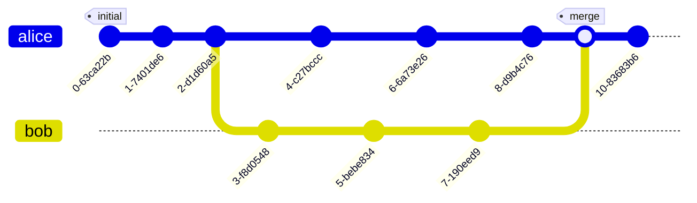
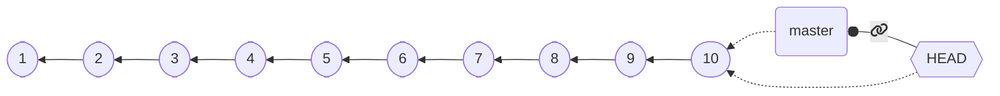

+++

title = "Progettazione e Sviluppo del Software"
description = "Progettazione e Sviluppo del Software, Tecnologie dei Sistemi Informatici"
outputs = ["Reveal"]
aliases = ["/git/"]

+++

# Sistemi di controllo versione

{}


## Riconoscimenti

* Questo materiale è ampiamente basato su quello realizzato dal Prof.
Danilo Pianini, che ringrazio.

* Ogni errore riscontratovi è esclusiva responsabilità degli autori di questo documento.

---


## Outline

### Goal della lezione

* Apprendere motivazioni, obiettivi, e tipologie degli strumenti di controllo di versione
* Apprendere l'utilizzo pratico del DVCS `git`

### Argomenti

* Concetto di *Version Control System (VCS)* e VCS *decentralizzato*
* 

---

# Introduction to Version Control Systems (VCS)

---

## Tracking changes

Did you ever need to *roll back* some project or assignment to a previous version?

How did you track the *history* of the project?

### Classic way

1. find a *naming convention* for files/folders
2. *make a copy* every time there is some relevant progress
3. *make a copy* every time an ambitious but risky development begins

**Inefficient!**
* Consumes a lot of resources (space)
* Requires time
* How to tell what was in some previous releases?
* How to cherry-pick some changes?

---

## Fostering collaborative workflows

Did you ever need to develop some project or assignment *as a team*?

How did you organize the work to *maximize the productivity*?

### Classic ways

* *One screen, many heads*
  * a.k.a. one works, the other ones sleep
* *Locks*: "please do not touch section 2, I'm working on that"
  * probability of arising conflicts close to 100%
* *Realtime-sharing* (like google docs or overleaf)
  * okay in many cases for text documents (but with a risk of frankestein-ization)
  * disruptive with code (inconsistencies are much less tolerable in formal languages)

---

## Version control systems

Tools meant to support the development of projects by:
* Tracking the project *history*
* Allowing *roll-backs*
* Collecting *meta-information* on the changes
  * Authors, dates, notes...
* *Merging* information produced at different stages
* (in some cases) *facilitate parallel workflows*
* Also called Source Content Management (SCM)

**Distributed**: *Every copy* of the repository contains
(i.e., every developer locally have)
*the entire history*.

**Centralized**: A *reference copy* of the repository contains the whole history;
developers work on a subset of such history


---

## Short history

* **Concurrent Versioning System (CVS)** (1986): client-server (*centralized* model, the truth is on the server), operates on single files or repository-level, history stored in a hidden directory, uses delta compression to save space.
* **Apache Subversion (SVN)** (2000): successor to CVS, still largely used (especially in businesses that struggle to renovate their processes). *Centralized* model (similar to CVS). Improved binary file management. Improved concurrency for the operation, still cumbersome for parallel workflows.
* **Mercurial** and **Git** (both April 2005): *decentralized* version control systems (DVCSs), no "special" copy of the repository, each client stores the whole history. Highly scalable. Foster parallel work by allowing easy branching and merging. Very similar conceptually (when two succesful tools emerge at the same time with a similar model independently, it is an indication that the underlying model is "the right one" for the context).

**Git** is now the dominant DVCS (although Mercurial is still in use, e.g., for Python, Java, Facebook).

---

## Google trends to today

<script type="text/javascript" src="https://ssl.gstatic.com/trends_nrtr/3045_RC01/embed_loader.js"></script>
<script type="text/javascript">
var today = new Date().toISOString().split('T')[0]
var dateRange = `2004-01-01 ${today}`
trends.embed.renderExploreWidget(
  "TIMESERIES",
  {
    "comparisonItem":[
      {"keyword":"/m/05vqwg","geo":"","time":dateRange},
      {"keyword":"/m/012ct9","geo":"","time":dateRange},
      {"keyword":"/m/09d6g","geo":"","time":dateRange},
      {"keyword":"/m/08441_","geo":"","time":dateRange}
    ],
    "category":0,
    "property":""
  },
  {
    "exploreQuery":"date=all&q=%2Fm%2F028m4s,%2Fm%2F04tj5z,%2Fm%2F080c0g9",
    "guestPath":"https://trends.google.com:443/trends/embed/"
  }
);
</script>

---

## Intuition: the history of a project

1. Create a new project


---

2. Make some changes


---

3. Then more and more, until the project is ready


At a first glance, the history of a project *looks like* a **line**.

---

## Except that, in the real world...

> Anything that can go wrong will go wrong
> <br><cite>$1^{st}$ Murphy's law</cite>

> If anything simply cannot go wrong, it will anyway
> <cite>$5^{th}$ Murphy's law</cite>

---

# ...things go wrong


---

## Rolling back changes

Go *back in time* to a previous state where things work


---

## Get the previous version and fix

Then fix the mistake


If you consider rollbacks, history is a **tree**!

---

# Collaboration: diverging

Alice and Bob work together for some time, then they go home and work separately, in parallel

They have a *diverging history*!


---

# Collaboration: reconciling


If you have the possibility to *reconcile diverging developments*, the history becomes a **graph**!

Reconciling diverging developments is usually referred to as **merge**

---

## DVCS concepts and terminology: *Repository*

Project **meta-data**. Includes the whole project history
* information on how to *roll back* changes 
* *authors* of changes
* *dates*
* *differences* between different points in time
* and so on

Usually, stored in a hidden folder in the *root folder* of the project

---

## DVCS concepts and terminology: *Working Tree*

(or *worktree*, or *working directory*)

the collection of **files** (usually, inside a *root folder*) that constitute the project,
excluding the *meta-data*.

---

## DVCS concepts and terminology: *Commit*

A **saved status** of the project.
* Collects the *changes* required to transform the previous (*parent*) commit into the current (*differential tracking*)
* Creates a *snapshot* of the status of the worktree (snapshotting).
* Records metadata: *parent commit*, *author*, *date*, a *message* summarizing the changes, and a *unique identifier*.
* A commit with no parent is an *initial commit*.
* A commit with multiple parents is a *merge commit*.



---

## DVCS concepts and terminology: *Branch*

A **named sequence of commits**


If no branch has been created at the first commit, a default name is used.

---

## DVCS concepts and terminology: *Commit references*

To be able to go *back in time* or *change branch*, we need to **refer to commits**
* 
* Commit references are also referred to as `tree-ish`es
* Every commit has a **unique identifier**, which is a valid reference
* A **branch name** is a valid commit reference (points to the *last commit of that branch*)

### A special commit name is  **HEAD**, which refers to the *current commit*
  * When committing, the **HEAD** moves forward to the new commit


### Absolute and relative references

Appending `~` and a number `i` to a valid tree-ish means "`i-th` parent of this tree-ish"


---

## DVCS concepts and terminology: *Checkout*

The operation of **moving to another commit**
* Moving to *another branch*
* Moving *back in time*

Moves the `HEAD` to the specified *target tree-ish*

---

## Project evolution example

Let us try to see what happens when ve develop some project, step by step.

---

1. first commit


2. second commit


---


---


Oh, no, there was a mistake! We need to roll back!

---

## *checkout of C4*


* No information is lost, we can get back to `6` whenever we want to.
* what if we commit now?

---

## Branching!


* Okay, but there was useful stuff in `5`, I'd like to have it into `new-branch`

---

## Merging!


**Notice that:**
* we have two branches
* `8` is a merge commit, as it has two parents: `7` and `5`
* the situation is the same regardless that is a *single developer going back on the development* or *multiple developers working in parallel*!
* this is possible because *every copy of the repository contains the entire history*!


---


## Reference DVCS: Git

De-facto reference distributed version control system

* *Distributed*
* Born in *2005* to replace BitKeeper as SCM for the Linux kernel
  * Performance was a major concern
  * Written in C
* Developed by Linus Torvalds
  * Now maintained by others
* *Unix-oriented*
  * Tracks Unix file permissions
* Very *fast*
  * At conception, 10 times faster than Mercurial¹, 100 times faster than Bazaar

¹ Less difference now, Facebook vastly improved Mercurial

---

## Funny historical introduction



---

## Approach: terminal-first

#### (actually: terminal-only)

**Git is a command line tool**

Although graphical interfaces exsist, it makes no sense to learn a GUI:
* they are more prone to future changes than the CLI
* they add a level of interposition between you and the tool
* unless they are incomplete, they expose *more complexity* than what we can deal with in this course
  * what do you do with a checkbox labeled "squash when merging"?
  * and what about *recursively checkout submodules*?
* as soon as you learn *the CLI*, you become so proficient that you get *slower* when there is a graphical interface in-between

**I am assuming minimal knowledge of the shell, please let me know NOW if you've never seen it**

---

# Basic operations with git

---

## Configuration

Configuration in Git happens at two level
* **global**: the default options, valid system-wide
* **repository**: the options specific to a repository. They have *precedence* over the global settings

### Strategy

Set up the global options reasonably,
then override them at the repository level, if needed.

### `git config`

The `config` subcommand sets the configuration options
* when operated with the `--global` option, configures the tool globally
* otherwise, it sets the option for the *current repository*
  * (there must be a valid repository)
* Usage: `git config [--global] category.option value`
  * sets `option` of `category` to `value`

---

## Configuration: main options

As said, `--global` can be omitted to override the global settings locally

### Username and email: `user.name` and `user.email`

A name and a contact are always saved as metadata, so they need to be set up

* `git config --global user.name "Your Real Name"`
* `git config --global user.email "your.email.address@your.provider"`

### Default editor

Some operations pop up a text editor.
It is convenient to set it to a tool that you know how to use
(to prevent, e.g., being "locked" inside `vi` or `vim`).
Any editor that you can invoke from the terminal works.

* `git config --global core.editor nano`

### Default branch name

How to name the default branch.
Two reasonable choices are `main` and `master`

* `git config --global init.defaultbranch master`

---

## Initializing a repository

### `git init`
* Initializes a new repository *inside the current directory*
* Reified in the `.git` folder
* The location of the `.git` folder marks the root of the repository
  * Do not nest repositories inside repositories, it is fragile
  * Nested projects are realized via *submodules* (not discussed in this course)
* **Beware of the place where you issue the command!**
  * First use `cd` to locate yourself inside the folder that contains (or will containe the project)
    * (possibly, first create the folder with `mkdir`)
  * **Then** issue `git init`
  * if something goes awry, you can delete the repository by deleting the `.git` folder.

---

## Staging

Git has the concept of *stage* (or *index*).
* Changes must be added to the stage to be committed.
* Commits save the *__changes__ included in the stage*
  * Files changed after being added to the stage neet to be re-staged
* `git add <files>` moves the current state of the files into the stage as *changes*
* `git reset <files>` removes currently staged *changes* of the files from stage
* `git commit` creates a new *changeset* with the contents of the stage


---

## Observing the repository status

It is extremely important to understand *clearly* what the current state of affairs is
* Which *branch* are we working on?
* Which *files* have been *modified*?
* Which *changes* are already *staged*?

`git status` prints the current state of the repository, example output:

```git
❯ git status
On branch master
Your branch is up to date with 'origin/master'.

Changes to be committed:
  (use "git restore --staged <file>..." to unstage)
        modified:   content/_index.md
        new file:   content/dvcs-basics/_index.md
        new file:   content/dvcs-basics/staging.png

Changes not staged for commit:
  (use "git add <file>..." to update what will be committed)
  (use "git restore <file>..." to discard changes in working directory)
        modified:   layouts/shortcodes/gravizo.html
        modified:   layouts/shortcodes/today.html
```

---

## Committing

* Requires an **author** and an **email**
  * They can be configured *globally* (at the *computer level*):
    * `git config --global user.name 'Your Real Name'`
    * `git config --global user.email 'your@email.com'`
  * The global settings can be *overridden* at the *repository level*
    * e.g., you want to commit with a different email between work and personal projects
    * `git config user.name 'Your Real Name'`
    * `git config user.email 'your@email.com'`
* Requires a **message**, using appropriate messages is **extremely important**
  * If unspecified, the commit does not get performed
  * it can be specified inline with `-m`, otherwise Git will pop up the *default editor*
    * `git commit -m 'my very clear and explanatory message'`
* The *date* is recorded automatically
* The *commit identifier* (a cryptographic hash) is generated automatically

---

## Default branch

At the first commit, there is no branch and no `HEAD`.

Depending on the version of Git, the following behavior may happen upon the first commit:
* Git creates a *new branch* named `master`
  * *legacy behavior*
  * the name is inherited from the default branch name in *Bitkeeper*
* Git creates a *new branch* named `master`, but warns that it is a deprecated behavior
  * although coming from the Latin "*magister*" (teacher) and not from the "master/slave" model of asymmetric communication control, many recently prefer `main` as seen as more inclusive
* Git refuses to commit until a default branch name is specified
  * *modern behavior*
  * Requires configuration: `git config --global init.defaultbranch default-branch-name`

---

## Ignoring files

In general, we do not want to track *all* the files in the repository folder:
* Some files could be *temporary* (e.g., created by the editor)
* Some files could be *regenerable* (e.g., compiled binaries and application archives)
* Some files could contain *private* information

Of course, we could just not `add` them, but the error is around the corner!

It would be much better to just tell Git to ignore some files.

This is achieved through a *special `.gitignore` file*.
  * the file must be named `.gitignore`, names like `foo.gitignore` or `gitignore.txt` won't work
    * A good way to create/append to this file is via `echo whatWeWantToIgnore >> .gitignore` (multiplatform command)
  * it is a list of paths that git will ignore (unless `git add` is called with the `--force` option)
  * it is possible to add exceptions

---

## `.gitignore` example

```ignore-list
# ignore the bin folder and all its contents
bin/
# ignore every pdf file
*.pdf
# rule exception (beginning with a !): pdf files named 'myImportantFile.pdf' should be tracked
!myImportantFile.pdf
```

---

## Going to a new line is more complicated than it seems

Going to a new line is a two-phased operation:
1. Bring the cursor back to the begin of the line
2. Bring the cursor down one line

In *electromechanic teletypewriters* (and in typewriters, too), they were two distinct operations:
1. *Carriage Return* (bringing the carriage to its leftmost position)
2. *Line Feed* (rotating the carriage of one step)

---

## A teletypewriter


* driving them text without drivers required to *explicitly send* *carriage return* and *line feed* commands

---

## Newlines in the modern world

Terminals were designed to behave like virtual teletypewriters
* Indeed, they are still called **TTY** (**T**ele**TY**pewriter)
* In Unix-like systems, they are still implemented as *virtual devices*
  * If you have MacOS X or Linux, you can see which virtual device backs your current terminal using `tty`
* At some point, Unix decided that `LF` was sufficient in virtual TTYs to go to a new line
  * Probably *inspired by the C language*, where `\n` means "newline"
  * The behaviour can still be disabled
```text
we would get
            lines
                 like these
```

####  Consequence:
* Windows systems go to a new line with a `CR` character followed by an `LF` character: `\r\n`
* Unix-like systems go to a new line with an `LF` character: `\n`
* Old Mac systems used to go to a new line with a `CR` character: `\r`
  * Basically they decided to use a single character like Unix did, but made the opposite choice
  * MacOS X is POSIX-compliant, uses `\n`

---

## Newlines and version control

If your team uses *multiple OSs*, it is likely that, by default, the text editors use either `LF` (on Unix) or `CRLF`

It is also very likely that, upon saving, the whole file gets rewritten with the "*locally* correct" *line endings*

* This however would result in *all the lines being changed*!
* The differential would be huge
* *Conflicts would arise everywhere*!

Git tries to tackle this issue by converting the line endings so that they match the initial line endings of the file,
resulting in repositories with *illogically mixed line endings*
(depending on who created a file first)
and loads of warnings about `LF`/`CRLF` conversions.

Line endings should instead be **configured per file type!**

---

## `.gitattributes`

* A sensible strategy is to use `LF` everywhere, but for Windows scripts (`bat`, `cmd`, `ps1`)
* Git can be configured through a `.gitattributes` file in the repository root
  * It can do [much more than enforcing line endings](https://git-scm.com/docs/gitattributes), actually
* Example: 
```text
* text=auto eol=lf
*.[cC][mM][dD] text eol=crlf
*.[bB][aA][tT] text eol=crlf
*.[pP][sS]1 text eol=crlf
```


---

## Dealing with removal and renaming of files

* The removal of a file is a legit *change*
* As we discussed, `git add` adds a *change* to the stage
* **the change can be a removal!**

`git add someDeletedFile` is a correct command, that will stage the fact that `someDeletedFile` does not exist anymore, and its deletion must be registered at the next `commit`.

* File *renaming* is *equivalent to file deletion and file creation* where, incidentally, the new file has the same content of the deleted file
* To stage the rinomination of file `foo` into `bar`:
  * `git add foo bar`
  * it records that `foo` has been deleted and `bar` has been created
  * Git is smart enough to understand that it is a name change, and will deal with it *efficiently*

---

## Visualizing the history

Of course, it is useful to visualize the history of commits.
Git provides a dedicated sub-command:

`git log`

* opens a *navigable interactive view* of the history from the `HEAD` commit (the current commit) backwards
  * Press <kbd>Q</kbd>
* *compact* visualization: `git log --oneline`
* visualization of *all branches*: `git log --all`
* visualization of a lateral *graph*: `git log --graph`
* compact visualization of all branches with a graph: `git log --oneline --all --graph`

---

### example output of `git log --oneline --all --graph`

```text
* d114802 (HEAD -> master, origin/master, origin/HEAD) moar contribution
| * edb658b (origin/renovate/gohugoio-hugo-0.94.x) ci(deps): update gohugoio/hugo action to v0.94.2
|/  
* 4ce3431 ci(deps): update gohugoio/hugo action to v0.94.1
* 9efa88a ci(deps): update gohugoio/hugo action to v0.93.3
* bf32a8b begin with build slides
* b803a65 lesson 1 looks ready
* 6a85f8f ci(deps): update gohugoio/hugo action to v0.93.2
* b474d2a write more on the introductory lesson
* 8a7105e ci(deps): update gohugoio/hugo action to v0.93.1
* 6e40642 begin writing the first lesson
```

---

## Referring to commits: `<tree-ish>`es

In git, a reference to a commit is called `<tree-ish>`. Valid `<tree-ish>`es are:
* Full *commit hashes*, such as `b82f7567961ba13b1794566dde97dda1e501cf88`.
* *Shortened commit hashes*, such as `b82f7567`.
* *Branch names*, in which case the reference is to the last commit of the branch.
* `HEAD`, a special name referring to the current commit (the head, indeed).
* *Tag names* (we will discuss what a tag is later on).

---

## Relative references

It is possible to build *relative references*, e.g., "get me the commit before this `<tree-ish>`",
by following the commit `<tree-ish>` with a tilde (`~`) and with the number of parents to get to:
* `<tree-ish>~STEPS` where `STEPS` is an integer number produces a reference to the `STEPS-th` parent of the provided `<tree-ish>`:
  * `b82f7567~1` references the *parent* of commit `b82f7567`.
  * `some_branch~2` refers to the *parent of the parent* of the last commit of branch `some_branch`.
  * `HEAD~3` refers to the *parent of the parent of the parent* of the current commit.

* In case of merge commits (with multiple parents), `~` selects the first one
* Selection of parents can be performed with caret in case of multiple parents (`^`)
  * We won't go in depth here, but:
    * The [`git rev-parse` reference on specifying revision](https://git-scm.com/docs/git-rev-parse#_specifying_revisions) is publicly available
    * A [much more readable explanation can be found on Stack overflow](https://stackoverflow.com/a/2222920/1916413)

---

## Visualizing the differences

We want to see which *differences* a commit introduced, or what we modified in some files of the work tree

Git provides support to visualize the changes in terms of *modified lines* through `git diff`:
* `git diff` shows the difference between the *stage* and the *working tree*
  * namely, what you would stage if you perform a `git add`
* `git diff --staged` shows the difference between `HEAD` and the *working tree*
* `git diff <tree-ish>` shows the difference between `<tree-ish>` and the *working tree* (*stage excluded*)
* `git diff --staged <tree-ish>` shows the difference between `<tree-ish>` and the *working tree*, *including staged changes*
* `git diff <from> <to>`, where `<from>` and `<to>` are `<tree-ish>`es, shows the differences between `<from>` and `<to>`

---

### `git diff` Example output:

```diff
diff --git a/.github/workflows/build-and-deploy.yml b/.github/workflows/build-and-deploy.yml
index b492a8c..28302ff 100644
--- a/.github/workflows/build-and-deploy.yml
+++ b/.github/workflows/build-and-deploy.yml
@@ -28,7 +28,7 @@ jobs:
           # Idea: the regex matcher of Renovate keeps this string up to date automatically
           # The version is extracted and used to access the correct version of the scripts
           USES=$(cat <<TRICK_RENOVATE
-          - uses: gohugoio/hugo@v0.94.1
+          - uses: gohugoio/hugo@v0.93.3
           TRICK_RENOVATE
           )
           echo "Scripts update line: \"$USES\""
```

The output is compatible with the Unix commands `diff` and `patch`

Still, *binary files are an issue*! Tracking the right files is paramount.

---

## Navigating the history

Navigation of the history concretely means to move the head (in Git, `HEAD`) to arbitrary points of the history

In Git, this is performed with the `checkout` commit:
* `git checkout <tree-ish>`
  * Unless there are changes that could get lost, *moves* `HEAD` to the provided `<tree-ish>`
  * Updates all tracked files to their version at the provided `<tree-ish>`

The command can be used to selectively checkout a file from another revision:
* `git checkout <tree-ish> -- foo bar baz`
  * Restores the status of files `foo`, `bar`, and `baz` from commit `<tree-ish>`, and adds them to the stage (unless there are uncommitted changes that could be lost)
  * Note that `--` is surrounded by whitespaces, it is not a `--foo` option, it is just used as a separator between the `<tree-ish>` and the list of files
    * the files could be named as a `<tree-ish>` and we need disambiguation

---

## Detached head

Git does **not** allow *multiple heads per branch*
(other DVCS do, in particular Mercurial):
for a commit to be valid, `HEAD` must be at the "end" of a branch (on its last commit), as follows:



When an old commit is checked out this condition doesn't hold!

If we run `git checkout HEAD~4`:

```mermaid
flowchart RL
  HEAD{{"HEAD fas:fa-unlink"}}
  b1(master)

  C10([10]) --> C9([9]) --> C8([8]) --> C7([7]) --> C6([6]) --> C5([5]) --> C4([4]) --> C3([3]) --> C2([2]) --> C1([1])

  b1 -.-> C10

  HEAD -.-> C6

  class HEAD head;
  class b1,b2 branch;
  class C1,C2,C3,C4,C5,C6,C7,C8,C9,C10 commit;
```

The system enters a special workmode called *detached head*.

When **in detached head**, Git allows to make **commits**, but they **are lost**!

(Not really, but to retrieve them we need `git reflog` and `git cherry-pick`, that we won't discuss)


---

# Branching and merging

---

## Branches as labels

To be able to start new development lines,
we need to *create* a **branch**.

In Git, branches work like *movable labels*:
* Upon creation, they are attached to the same commit `HEAD` refers to
* If a new commit is made when `HEAD` is attached to them, they **move along with `HEAD`**

---

## Branch creation

Branches are created with `git branch branch_name`

```mermaid
flowchart RL
%%  HEAD{{"HEAD fas:fa-unlink"}}
  HEAD{{"HEAD"}}
  b1(master)

  C10([10]) --> C9([9]) --> C8([8]) --> C7([7]) --> C6([6]) --> C5([5]) --> C4([4]) --> C3([3]) --> C2([2]) --> C1([1])

  b1 -.-> C10

  HEAD -.-> C10
  HEAD --"fas:fa-link"--o b1

  class HEAD head;
  class b1,b2 branch;
  class C1,C2,C3,C4,C5,C6,C7,C8,C9,C10 commit;
```

⬇️ `git branch new-experiment` ⬇️

{}

```mermaid
flowchart RL
%%  HEAD{{"HEAD fas:fa-unlink"}}
  HEAD{{"HEAD"}}
  b1(master)
  b2(new-experiment)

  C10([10]) --> C9([9]) --> C8([8]) --> C7([7]) --> C6([6]) --> C5([5]) --> C4([4]) --> C3([3]) --> C2([2]) --> C1([1])

  b1 -.-> C10
  b2 -.-> C10

  HEAD -.-> C10
  HEAD --"fas:fa-link"--o b1

  class HEAD head;
  class b1,b2 branch;
  class C1,C2,C3,C4,C5,C6,C7,C8,C9,C10 commit;
```

`HEAD` does not attach to the new branch by default,
an explicit `checkout` is required.

{}

---

## Creating branches when in **DETACHED_HEAD**

Creating new branches allows to store changes made when we are in **DETACHED_HEAD** state.

```mermaid
flowchart RL
%%  HEAD{{"HEAD fas:fa-unlink"}}
  HEAD{{"HEAD"}}
  b1(master)

  C10([10]) --> C9([9]) --> C8([8]) --> C7([7]) --> C6([6]) --> C5([5]) --> C4([4]) --> C3([3]) --> C2([2]) --> C1([1])

  b1 -.-> C10

  HEAD -.-> C10
  HEAD --"fas:fa-link"--o b1

  class HEAD head;
  class b1,b2 branch;
  class C1,C2,C3,C4,C5,C6,C7,C8,C9,C10 commit;
```

{}
⬇️ `git checkout HEAD~4` ⬇️

{}

{}

```mermaid
flowchart RL
  HEAD{{"HEAD fas:fa-unlink"}}
  b1(master)

  C10([10]) --> C9([9]) --> C8([8]) --> C7([7]) --> C6([6]) --> C5([5]) --> C4([4]) --> C3([3]) --> C2([2]) --> C1([1])

  b1 -.-> C10

  HEAD -.-> C6

  class HEAD head;
  class b1,b2 branch;
  class C1,C2,C3,C4,C5,C6,C7,C8,C9,C10 commit;
```

* **DETACHED_HEAD**: our changes will be discarded, unless...
{}

{}
➡️ Next: `git branch new-experiment` ➡️
{}

---

## Creating branches when in **DETACHED_HEAD**

⬇️ `git branch new-experiment` ⬇️

```mermaid
flowchart RL
  HEAD{{"HEAD fas:fa-unlink"}}
  b1(master)
  b2("new-experiment")

  C10([10]) --> C9([9]) --> C8([8]) --> C7([7]) --> C6([6]) --> C5([5]) --> C4([4]) --> C3([3]) --> C2([2]) --> C1([1])

  b1 -.-> C10

  HEAD -.-> C6
  b2 -.-> C6

  class HEAD head;
  class b1,b2 branch;
  class C1,C2,C3,C4,C5,C6,C7,C8,C9,C10 commit;
```

{}
`HEAD` is still *detached* though, we need to *attach it to the new branch* for it to store our commits
{}

{}
➡️ Next: `git checkout new-experiment` ➡️
{}

---

## Creating branches when in **DETACHED_HEAD**

⬇️ `git checkout new-experiment` ⬇️

```mermaid
flowchart RL
  HEAD{{"HEAD"}}
  b1(master)
  b2("new-experiment")

  C10([10]) --> C9([9]) --> C8([8]) --> C7([7]) --> C6([6]) --> C5([5]) --> C4([4]) --> C3([3]) --> C2([2]) --> C1([1])

  b1 -.-> C10

  HEAD -.-> C6
  HEAD --"fas:fa-link"--o b2
  b2 -.-> C6

  class HEAD head;
  class b1,b2 branch;
  class C1,C2,C3,C4,C5,C6,C7,C8,C9,C10 commit;
```

* New commits will now be stored!

{}

⬇️ [changes] + `git add` + `git commit` ⬇️

{}

{}

```mermaid
flowchart RL
  HEAD{{"HEAD"}}
  b1(master)
  b2("new-experiment")

  C10([10]) --> C9([9]) --> C8([8]) --> C7([7]) --> C6([6]) --> C5([5]) --> C4([4]) --> C3([3]) --> C2([2]) --> C1([1])
  C11([11]) --> C6

  b1 -.-> C10

  HEAD -.-> C11
  HEAD --"fas:fa-link"--o b2
  b2 -.-> C11

  class HEAD head;
  class b1,b2 branch;
  class C1,C2,C3,C4,C5,C6,C7,C8,C9,C10,C11 commit;
```

$\Rightarrow$ `HEAD` brings our branch forward with it!

{}

---

## One-shot branch creation

As you can imagine, creating a *new branch* and *attaching `HEAD`* to the freshly created branch is pretty common

As customary for common operations, a short-hand is provided: `git checkout -b new-branch-name`
* Creates `new-branch-name` from the current position of `HEAD`
* Attaches `HEAD` to `new-branch-name`

```mermaid
flowchart RL
  HEAD{{"HEAD fas:fa-unlink"}}
  b1(master)

  C10([10]) --> C9([9]) --> C8([8]) --> C7([7]) --> C6([6]) --> C5([5]) --> C4([4]) --> C3([3]) --> C2([2]) --> C1([1])

  b1 -.-> C10

  HEAD -.-> C6

  class HEAD head;
  class b1,b2 branch;
  class C1,C2,C3,C4,C5,C6,C7,C8,C9,C10 commit;
```

⬇️ `git checkout -b new-experiment` ⬇️

```mermaid
flowchart RL
  HEAD{{"HEAD"}}
  b1(master)
  b2("new-experiment")

  C10([10]) --> C9([9]) --> C8([8]) --> C7([7]) --> C6([6]) --> C5([5]) --> C4([4]) --> C3([3]) --> C2([2]) --> C1([1])

  b1 -.-> C10

  HEAD -.-> C6
  HEAD --"fas:fa-link"--o b2
  b2 -.-> C6

  class HEAD head;
  class b1,b2 branch;
  class C1,C2,C3,C4,C5,C6,C7,C8,C9,C10 commit;
```

---

## Merging branches

Reunifying diverging development lines is *much trickier* than spawning new development lines

In other words, *merging* is **much trickier** than *branching*

* Historically, with *centralized* version control systems, merging was considered extremely delicate and difficult
* The *distributed* version control systems promoted *frequent*, *small-sized* merges, much easier to deal with
* **Conflicts** *can still arise!*
  * what if we change the same line of code in two branches differently?

In Git, `git merge target` merges the branch named `target` into the current branch (`HEAD` must be attached)

---

## Merge visual example

```mermaid
flowchart RL
  HEAD{{"HEAD"}}
  b1(master)
  b2("new-experiment")

  C10([10]) --> C9([9]) --> C8([8]) --> C7([7]) --> C6([6]) --> C5([5]) --> C4([4]) --> C3([3]) --> C2([2]) --> C1([1])
  C12([12]) --> C11([11]) --> C6 

  b1 -.-> C10

  HEAD -.-> C12
  HEAD --"fas:fa-link"--o b2
  b2 -.-> C12

  class HEAD head;
  class b1,b2 branch;
  class C1,C2,C3,C4,C5,C6,C7,C8,C9,C10,C11,C12 commit;
```

⬇️ `git merge master` ⬇️

{}

```mermaid
flowchart RL
  HEAD{{"HEAD"}}
  b1(master)
  b2("new-experiment")

  C10([10]) --> C9([9]) --> C8([8]) --> C7([7]) --> C6([6]) --> C5([5]) --> C4([4]) --> C3([3]) --> C2([2]) --> C1([1])
  C13([13]) --> C12([12]) --> C11([11]) --> C6 
  C13 --> C10

  b1 -.-> C10

  HEAD -.-> C13
  HEAD --"fas:fa-link"--o b2
  b2 -.-> C13

  class HEAD head;
  class b1,b2 branch;
  class C1,C2,C3,C4,C5,C6,C7,C8,C9,C10,C11,C12,C13 commit;
```

{}

---

## Fast forwarding

Consider this situation:

```mermaid
flowchart RL
  HEAD{{"HEAD"}}
  b1(master)
  b2("new-experiment")

  C10([10]) --> C9([9]) --> C8([8]) --> C7([7]) --> C6([6]) --> C5([5]) --> C4([4]) --> C3([3]) --> C2([2]) --> C1([1])

  b1 -.-> C10

  HEAD -.-> C6
  HEAD --"fas:fa-link"--o b2
  b2 -.-> C6

  class HEAD head;
  class b1,b2 branch;
  class C1,C2,C3,C4,C5,C6,C7,C8,C9,C10,C11,C12,C13 commit;
```

* We want `new-experiment` to also have the changes from `C7`, to `C10` (to be up to date with `master`)
* `master` contains all the commits of `new-experiment`
* We don't really need a merge commit, we can just move `new-experiment` to point it to `C6`
* $\Rightarrow$ This is called a **fast-forward**
  * It is the *default behavior* in Git when merging branches where the target is the head plus something

{}

```mermaid
flowchart RL
  HEAD{{"HEAD"}}
  b1(master)
  b2("new-experiment")

  C10([10]) --> C9([9]) --> C8([8]) --> C7([7]) --> C6([6]) --> C5([5]) --> C4([4]) --> C3([3]) --> C2([2]) --> C1([1])

  b1 -.-> C10

  HEAD -.-> C10
  HEAD --"fas:fa-link"--o b2
  b2 -.-> C10

  class HEAD head;
  class b1,b2 branch;
  class C1,C2,C3,C4,C5,C6,C7,C8,C9,C10,C11,C12,C13 commit;
```

{}

---

## Merge conflicts

Git tries to resolve most conflicts by *itself*
* It's *pretty good* at it
* but things can still require *human intervention*

In case of conflict on one or more files, Git marks the subject files as *conflicted*, and modifies them adding *merge markers*:

```text
<<<<<<< HEAD
Changes made on the branch that is being merged into,
this is the branch currently checked out (HEAD).
=======
Changes made on the branch that is being merged in.
>>>>>>> other-branch-name
```

* The user should *change the conflicted files* so that they reflect the *final desired status*
* The (now fixed) files should get added to the stage with `git add`
* The merge operation can be concluded through `git commit`
  * In case of merge, the message is pre-filled in
  * If the message is okay, `git commit --no-edit` can be used to use it without editing

---

## Good practices

**Avoiding merge conflicts is *much* better than solving them**

Although they are unavoidable in some cases, they can be *minimized* by following a few *good practices*:

* **Do not** *track files that can be generated*
  * This is harmful under many points of view, and merge conflicts are one
* **Do** *make many small commits*
  * Each coherent change should be reified into a commit
  * Even very small changes, like modification of the whitespaces
  * Smaller commits help Git better figure out what changed and in which order,
  generally leading to finer grained (and easier to solve) conflicts
* **Do** *enforce style rules* across the team
  * Style changes are legitimate changes
  * Style is often enforced at the IDE level
  * Minimal logical changes may cause widespread changes due to style modifications
* **Do** *pay attention to newlines*
  * Different OSs use different newline characters
  * Git tries to be smart about it, often failing catastrophically


---

# Operations with remotes

---

## Importing a repository

* We can initialize an **emtpy** repository with `git init`
* But most of the time we want to start from a *local copy* of an **existing** repository

Git provides a `clone` subcommand that copies *the whole history* of a repository locally
* `git clone URI destination` creates the folder `destination` and clones the repository found at `URI`
  * If `destination` is not empty, fails
  * if `destination` is omitted, a folder with the same namen of the last segment of `URI` is created
  * `URI` can be remote or local, Git supports the `file://`, `https://`, and `ssh` protocols
      * `ssh` *recommended* when available
* The `clone` subcommand checks out the remote branch where the `HEAD` is attached (*default branch*)

Examples:
* `git clone /some/repository/on/my/file/system destination`
  * creates a local folder called `destination` and copies the repository from the local directory
* `git clone https://somewebsite.com/someRepository.git myfolder`
  * creates a local folder called `myfolder` and copies the repository located at the specified `URL`
* `git clone user@sshserver.com:SomePath/SomeRepo.git`
  * creates a local folder called `SomeRepo` and copies the repository located at the specified `URL`

---

## Remotes

* Remotes are the *known copies* of the repository that exist somewhere (usually in the Internet)
* Each remote has a *name* and a *URI*
* When a repository is created via `init`, no remote is known.
* When a repository is imported via `clone`, a remote called `origin` is created automatically

*Non-local branches can be referenced* as `remoteName/branchName`

The `remote` subcommand is used to inspect and manage remotes:
* `git remote -v` *lists* the known remotes

* `git remote add a-remote URI` *adds* a new remote named `a-remote` and pointing to `URI`
* `git remote show a-remote` displays *extended information* on `a-remote`
* `git remote remove a-remote` *removes* `a-remote` (it does not delete information on the remote, it *locally* forgets that it exits)

---

## Upstream branches

Remote branches can be *associated* with local branches, with the intended meaning that the local and the remote branch are *intended to be two copies of the same branch*

* A remote branch associated to a local branch is its **upstream branch**
* upstream branches can be configured via `git branch --set-upstream-to=remote/branchName`
  * e.g.: `git branch --set-upstream-to=origin/develop` sets the current branch upstream to `origin/develop`
* When a repository is initialize by `clone`, its default branch is checked out locally with the same name it has on the remote, and the remote branch is automatically set as *upstream*

---

### Actual result of `git clone git@somesite.com/repo.git`

```mermaid
flowchart RL

subgraph somesite.com/repo.git
  direction RL
  HEAD{{"HEAD"}}
  master(master)
  serverless(feat/serverless)

  C10([10]) --> C9([9]) --> C8([8]) --> C7([7]) --> C6([6]) --> C5([5]) --> C4([4]) --> C3([3]) --> C2([2]) --> C1([1])
  C12([12]) --> C11([11]) --> C7

  master -.-> C10
  serverless -.-> C12

  HEAD -.-> C10
  HEAD --"fas:fa-link"--o master
end

subgraph local
  direction RL
  origin[(origin)]

  HEADL{{"HEAD"}}
  masterl(master)

  CL10([10]) --> CL9([9]) --> CL8([8]) --> CL7([7]) --> CL6([6]) --> CL5([5]) --> CL4([4]) --> CL3([3]) --> CL2([2]) --> CL1([1])

  masterl -.-> CL10
  masterl ==o master

  HEADL -.-> CL10
  HEADL --"fas:fa-link"--o masterl
end

origin ==o somesite.com/repo.git

class local,somesite.com/repo.git repo;
class origin remote;
class HEAD,HEADL head;
class master,masterl,bug22,serverless branch;
class C1,C2,C3,C4,C5,C6,C7,C8,C9,C10,C11,C12,C13,CL1,CL2,CL3,CL4,CL5,CL6,CL7,CL8,CL9,CL10,CL11,CL12,CL13 commit;
```

* `git@somesite.com/repo.git` is saved as `origin`
* The main branch (the branch where `HEAD` is attached, in our case `master`) on `origin` gets checked out locally with the same name
* The local branch `master` is set up to track `origin/master` as upstream
* Additional branches are *fetched* (they are known locally), but they are not checked out

---

## Importing remote branches

`git branch` (or `git checkout -b`) can checkout remote branches locally *once they have been fetched*.

```mermaid
flowchart RL

subgraph somesite.com/repo.git
  direction RL
  HEAD{{"HEAD"}}
  master(master)
  serverless(feat/serverless)

  C10([10]) --> C9([9]) --> C8([8]) --> C7([7]) --> C6([6]) --> C5([5]) --> C4([4]) --> C3([3]) --> C2([2]) --> C1([1])
  C12([12]) --> C11([11]) --> C7

  master -.-> C10
  serverless -.-> C12

  HEAD -.-> C10
  HEAD --"fas:fa-link"--o master
end

subgraph local
  direction RL
  origin[(origin)]

  masterl(master)

  HEADL{{"HEAD"}}

  CL10([10]) --> CL9([9]) --> CL8([8]) --> CL7([7]) --> CL6([6]) --> CL5([5]) --> CL4([4]) --> CL3([3]) --> CL2([2]) --> CL1([1])

  masterl -.-> CL10
  masterl ==o master

  HEADL -.-> CL10
  HEADL --"fas:fa-link"--o masterl
end

origin ==o somesite.com/repo.git

class local,somesite.com/repo.git repo;
class origin remote;
class HEAD,HEADL head;
class master,masterl,bug22,serverless branch;
class C1,C2,C3,C4,C5,C6,C7,C8,C9,C10,C11,C12,C13,CL1,CL2,CL3,CL4,CL5,CL6,CL7,CL8,CL9,CL10,CL11,CL12,CL13 commit;
```

➡️ `git checkout -b imported-feat origin/feat/serverless` ➡️

---

⬇️ `git checkout -b imported-feat origin/feat/serverless` ⬇️

```mermaid
flowchart RL

subgraph somesite.com/repo.git
  direction RL
  HEAD{{"HEAD"}}
  master(master)
  serverless(feat/serverless)

  C10([10]) --> C9([9]) --> C8([8]) --> C7([7]) --> C6([6]) --> C5([5]) --> C4([4]) --> C3([3]) --> C2([2]) --> C1([1])
  C12([12]) --> C11([11]) --> C7

  master -.-> C10
  serverless -.-> C12

  HEAD -.-> C10
  HEAD --"fas:fa-link"--o master
end

subgraph local
  direction RL
  origin[(origin)]

  masterl(master)
  imported(imported-feat)
  HEADL{{"HEAD"}}

  CL12([12]) --> CL11([11]) --> CL7
  CL10([10]) --> CL9([9]) --> CL8([8]) --> CL7([7]) --> CL6([6]) --> CL5([5]) --> CL4([4]) --> CL3([3]) --> CL2([2]) --> CL1([1])

  masterl -.-> CL10
  masterl ==o master
  imported -.-> CL12
  imported ==o serverless

  HEADL -.-> CL12
  HEADL --"fas:fa-link"--o imported
end

origin ==o somesite.com/repo.git

class local,somesite.com/repo.git repo;
class origin remote;
class HEAD,HEADL head;
class master,masterl,bug22,serverless,imported branch;
class C1,C2,C3,C4,C5,C6,C7,C8,C9,C10,C11,C12,C13,CL1,CL2,CL3,CL4,CL5,CL6,CL7,CL8,CL9,CL10,CL11,CL12,CL13 commit;
```

* A new branch `imported-feat` is created locally, and `origin/feat/new-client` is set as its *upstream*

---

## Importing remote branches

* It is customary to reuse the upstream name if there are no conflicts
  * `git checkout -b feat/new-client origin/feat/new-client`
* Modern versions of Git automatically checkout remote branches if there are no ambiguities:
  * `git checkout feat/new-client`
  * creates a new branch `feat/new-client` with the upstream branch set to `origin/feat/new-client` if:
    * there is **no** *local branch* named `feat/new-client`
    * there is **no** *ambiguity* with remotes
  * Quicker if you are working with a single remote (pretty common)

---

## Example with multiple remotes

```mermaid
flowchart RL

subgraph somesite.com/repo.git
  direction RL
  HEAD{{"HEAD"}}
  master(master)
  serverless(feat/serverless)

  C4([4]) --> C3([3]) --> C2([2]) --> C1([1])
  C7([7]) --> C6([6]) --> C5([5]) --> C2 

  master -.-> C4
  serverless -.-> C7

  HEAD -.-> C4
  HEAD --"fas:fa-link"--o master
end

subgraph somewherelse.org/repo.git
  direction RL

  masterl(master)
  HEADL{{"HEAD"}}

  CL10([10]) --> CL9([9]) --> CL8([8]) --> CL4([4]) --> CL3([3]) --> CL2([2]) --> CL1([1])

  masterl -.-> CL10

  HEADL -.-> CL10
  HEADL --"fas:fa-link"--o masterl
end

class local,somesite.com/repo.git,somewherelse.org/repo.git repo;
class origin remote;
class HEAD,HEADL head;
class master,masterl,bug22,serverless,imported branch;
class C1,C2,C3,C4,C5,C6,C7,C8,C9,C10,C11,C12,C13,CL1,CL2,CL3,CL4,CL5,CL6,CL7,CL8,CL9,CL10,CL11,CL12,CL13 commit;
```

➡️ Next: `git clone git@somesite.com/repo.git` ➡️

---

⬇️ `git clone git@somesite.com/repo.git` ⬇️

```mermaid
flowchart RL

subgraph somesite.com/repo.git
  direction RL
  HEAD{{"HEAD"}}
  master(master)
  serverless(feat/serverless)

  C4([4]) --> C3([3]) --> C2([2]) --> C1([1])
  C7([7]) --> C6([6]) --> C5([5]) --> C2 

  master -.-> C4
  serverless -.-> C7

  HEAD -.-> C4
  HEAD --"fas:fa-link"--o master
end

subgraph somewherelse.org/repo.git
  direction RL

  masterl(master)
  HEADL{{"HEAD"}}

  CL10([10]) --> CL9([9]) --> CL8([8]) --> CL4([4]) --> CL3([3]) --> CL2([2]) --> CL1([1])

  masterl -.-> CL10

  HEADL -.-> CL10
  HEADL --"fas:fa-link"--o masterl
end

subgraph local
  direction RL

  origin[(origin)]

  HEADa{{"HEAD"}}
  mastera(master)

  C4a([4]) --> C3a([3]) --> C2a([2]) --> C1a([1])

  mastera -.-> C4a
  mastera ==o master

  HEADa -.-> C4a
  HEADa --"fas:fa-link"--o mastera
end

origin ==o somesite.com/repo.git

class local,somesite.com/repo.git,somewherelse.org/repo.git repo;
class origin remote;
class HEAD,HEADL,HEADa head;
class master,masterl,mastera,bug22,serverless,imported branch;
class C1,C2,C3,C4,C5,C6,C7,C8,C9,C10,C11,C12,C13,C1a,C2a,C3a,C4a,C5a,C6a,C7a,C8a,C9a,C10a,C11a,C12a,C13a,CL1,CL2,CL3,CL4,CL5,CL6,CL7,CL8,CL9,CL10,CL11,CL12,CL13 commit;
```

➡️ Next: `git checkout -b feat/serverless origin/feat/serverless` ➡️

---

⬇️ `git checkout -b feat/serverless origin/feat/serverless` ⬇️

```mermaid
flowchart RL

subgraph somesite.com/repo.git
  direction RL
  HEAD{{"HEAD"}}
  master(master)
  serverless(feat/serverless)

  C4([4]) --> C3([3]) --> C2([2]) --> C1([1])
  C7([7]) --> C6([6]) --> C5([5]) --> C2 

  master -.-> C4
  serverless -.-> C7

  HEAD -.-> C4
  HEAD --"fas:fa-link"--o master
end

subgraph somewherelse.org/repo.git
  direction RL

  masterl(master)
  HEADL{{"HEAD"}}

  CL10([10]) --> CL9([9]) --> CL8([8]) --> CL4([4]) --> CL3([3]) --> CL2([2]) --> CL1([1])

  masterl -.-> CL10

  HEADL -.-> CL10
  HEADL --"fas:fa-link"--o masterl
end

subgraph local
  direction RL

  origin[(origin)]

  HEADa{{"HEAD"}}
  mastera(master)
  serverlessa(feat/serverless)

  C4a([4]) --> C3a([3]) --> C2a([2]) --> C1a([1])
  C7a([7]) --> C6a([6]) --> C5a([5]) --> C2a 

  mastera -.-> C4a
  mastera ==o master

  serverlessa -.-> C7a
  serverlessa ==o serverless

  HEADa -.-> C7a
  HEADa --"fas:fa-link"--o serverlessa
end

origin ==o somesite.com/repo.git

class local,somesite.com/repo.git,somewherelse.org/repo.git repo;
class origin remote;
class HEAD,HEADL,HEADa head;
class master,masterl,mastera,bug22,serverless,serverlessa,imported branch;
class C1,C2,C3,C4,C5,C6,C7,C8,C9,C10,C11,C12,C13,C1a,C2a,C3a,C4a,C5a,C6a,C7a,C8a,C9a,C10a,C11a,C12a,C13a,CL1,CL2,CL3,CL4,CL5,CL6,CL7,CL8,CL9,CL10,CL11,CL12,CL13 commit;
```

➡️ Next: `git remote add other git@somewhereelse.org/repo.git` ➡️

---

⬇️ `git remote add other git@somewhereelse.org/repo.git` ⬇️

```mermaid
flowchart RL

subgraph somesite.com/repo.git
  direction RL
  HEAD{{"HEAD"}}
  master(master)
  serverless(feat/serverless)

  C4([4]) --> C3([3]) --> C2([2]) --> C1([1])
  C7([7]) --> C6([6]) --> C5([5]) --> C2 

  master -.-> C4
  serverless -.-> C7

  HEAD -.-> C4
  HEAD --"fas:fa-link"--o master
end

subgraph somewherelse.org/repo.git
  direction RL

  masterl(master)
  HEADL{{"HEAD"}}

  CL10([10]) --> CL9([9]) --> CL8([8]) --> CL4([4]) --> CL3([3]) --> CL2([2]) --> CL1([1])

  masterl -.-> CL10

  HEADL -.-> CL10
  HEADL --"fas:fa-link"--o masterl
end

subgraph local
  direction RL

  origin[(origin)]
  other[(other)]

  HEADa{{"HEAD"}}
  mastera(master)
  serverlessa(feat/serverless)

  C4a([4]) --> C3a([3]) --> C2a([2]) --> C1a([1])
  C7a([7]) --> C6a([6]) --> C5a([5]) --> C2a 

  mastera -.-> C4a
  mastera ==o master

  serverlessa -.-> C7a
  serverlessa ==o serverless

  HEADa -.-> C7a
  HEADa --"fas:fa-link"--o serverlessa
end

origin ==o somesite.com/repo.git
other ==o somewherelse.org/repo.git

class local,somesite.com/repo.git,somewherelse.org/repo.git repo;
class origin,other remote;
class HEAD,HEADL,HEADa head;
class master,masterl,mastera,bug22,serverless,serverlessa,imported branch;
class C1,C2,C3,C4,C5,C6,C7,C8,C9,C10,C11,C12,C13,C1a,C2a,C3a,C4a,C5a,C6a,C7a,C8a,C9a,C10a,C11a,C12a,C13a,CL1,CL2,CL3,CL4,CL5,CL6,CL7,CL8,CL9,CL10,CL11,CL12,CL13 commit;
```

➡️ Next: `git checkout -b other-master other/master` ➡️

---

⬇️ `git checkout -b other-master other/master` ⬇️

```mermaid
flowchart RL

subgraph somesite.com/repo.git
  direction RL
  HEAD{{"HEAD"}}
  master(master)
  serverless(feat/serverless)

  C4([4]) --> C3([3]) --> C2([2]) --> C1([1])
  C7([7]) --> C6([6]) --> C5([5]) --> C2 

  master -.-> C4
  serverless -.-> C7

  HEAD -.-> C4
  HEAD --"fas:fa-link"--o master
end

subgraph somewherelse.org/repo.git
  direction RL

  masterl(master)
  HEADL{{"HEAD"}}

  CL10([10]) --> CL9([9]) --> CL8([8]) --> CL4([4]) --> CL3([3]) --> CL2([2]) --> CL1([1])

  masterl -.-> CL10

  HEADL -.-> CL10
  HEADL --"fas:fa-link"--o masterl
end

subgraph local
  direction RL

  HEADa{{"HEAD"}}
  mastera(master)
  serverlessa(feat/serverless)
  othermaster(other-master)

  C10a([10]) --> C9a([9]) --> C8a([8]) --> C4a([4]) --> C3a([3]) --> C2a([2]) --> C1a([1])
  C7a([7]) --> C6a([6]) --> C5a([5]) --> C2a 

  mastera -.-> C4a
  mastera ==o master

  serverlessa -.-> C7a
  serverlessa ==o serverless

  othermaster -.-> C10a
  othermaster ==o masterl

  HEADa -.-> C10a
  HEADa --"fas:fa-link"--o othermaster

  origin[(origin)]
  other[(other)]
end

origin ==o somesite.com/repo.git
other ==o somewherelse.org/repo.git

class local,somesite.com/repo.git,somewherelse.org/repo.git repo;
class origin,other remote;
class HEAD,HEADL,HEADa head;
class master,masterl,mastera,bug22,serverless,serverlessa,imported,othermaster branch;
class C1,C2,C3,C4,C5,C6,C7,C8,C9,C10,C11,C12,C13,C1a,C2a,C3a,C4a,C5a,C6a,C7a,C8a,C9a,C10a,C11a,C12a,C13a,CL1,CL2,CL3,CL4,CL5,CL6,CL7,CL8,CL9,CL10,CL11,CL12,CL13 commit;
```

---

## Multiple remotes

You can operate with *multiple remotes*! Just remember: *branch names* must be *unique* for every repository
  * If you want to track `origin/master` and `anotherRemote/master`, you need *two local branches* with *diverse names*

---

## Fetching updates

To check if a *remote* has any *update* available, git provides th `git fetch` subcommand.
* `git fetch a-remote` checks if `a-remote` has any new information. If so, it downloads it.
  * **Note**: *it does **not** merge* it anywhere, it just memorizes its current status
* `git fetch` without a remote:
  * if `HEAD` is *attached* and the *current branch* has an *upstream*, then the *remote* that is hosting the *upstream branch* is fetched
  * otherwise, `origin` is fetched, if present
* To apply the updates, is then necessary to use *manually* use `merge`

The new *information fetched* includes new *commits*, *branches*, and *tags*.

---

## Fetch + merge example

```mermaid
flowchart RL

subgraph somesite.com/repo.git
  direction RL
  HEAD{{"HEAD"}}
  master(master)

  C8([8]) --> C7([7]) --> C6([6]) --> C5([5]) --> C4([4]) --> C3([3]) --> C2([2]) --> C1([1])

  master -.-> C8

  HEAD -.-> C8
  HEAD --"fas:fa-link"--o master
end

origin ==o somesite.com/repo.git

subgraph local
  direction RL
  origin[(origin)]

  masterl(master)
  HEADL{{"HEAD"}}

  CL8([8]) --> CL7([7]) --> CL6([6]) --> CL5([5]) --> CL4([4]) --> CL3([3]) --> CL2([2]) --> CL1([1])

  masterl -.-> CL8
  masterl ==o master

  HEADL -.-> CL8
  HEADL --"fas:fa-link"--o masterl
end

class local,somesite.com/repo.git repo;
class origin remote;
class HEAD,HEADL head;
class master,masterl,bug22,serverless,imported branch;
class C1,C2,C3,C4,C5,C6,C7,C8,C9,C10,C11,C12,C13,CL1,CL2,CL3,CL4,CL5,CL6,CL7,CL8,CL9,CL10,CL11,CL12,CL13 commit;
```

➡️ Next: Changes happen on `somesite.com/repo.git` and on our repository concurrently ➡️

---

## Fetch + merge example

⬇️ Changes happen on `somesite.com/repo.git` and on our repository concurrently ⬇️

```mermaid
flowchart RL

subgraph somesite.com/repo.git
  direction RL
  HEAD{{"HEAD"}}
  master(master)

  C10([10]) --> C9([9]) --> C8([8]) --> C7([7]) --> C6([6]) --> C5([5]) --> C4([4]) --> C3([3]) --> C2([2]) --> C1([1])

  master -.-> C10

  HEAD -.-> C10
  HEAD --"fas:fa-link"--o master
end

origin ==o somesite.com/repo.git

subgraph local
  direction RL
  origin[(origin)]

  masterl(master)
  HEADL{{"HEAD"}}

  CL12([12]) --> CL11([11]) --> CL8([8]) --> CL7([7]) --> CL6([6]) --> CL5([5]) --> CL4([4]) --> CL3([3]) --> CL2([2]) --> CL1([1])

  masterl -.-> CL12
  masterl ==o master

  HEADL -.-> CL12
  HEADL --"fas:fa-link"--o masterl
end

class local,somesite.com/repo.git repo;
class origin remote;
class HEAD,HEADL head;
class master,masterl,bug22,serverless,imported branch;
class C1,C2,C3,C4,C5,C6,C7,C8,C9,C10,C11,C12,C13,CL1,CL2,CL3,CL4,CL5,CL6,CL7,CL8,CL9,CL10,CL11,CL12,CL13 commit;
```

➡️ `git fetch && git merge origin/master` (assuming no conflicts or conflicts resolved) ➡️

---

## Fetch + merge example

⬇️ `git fetch && git merge origin/master` (assuming no conflicts or conflicts resolved) ⬇️

```mermaid
flowchart RL

subgraph somesite.com/repo.git
  direction RL
  HEAD{{"HEAD"}}
  master(master)

  C10([10]) --> C9([9]) --> C8([8]) --> C7([7]) --> C6([6]) --> C5([5]) --> C4([4]) --> C3([3]) --> C2([2]) --> C1([1])

  master -.-> C10

  HEAD -.-> C10
  HEAD --"fas:fa-link"--o master
end

origin ==o somesite.com/repo.git

subgraph local
  direction RL
  origin[(origin)]

  masterl(master)
  HEADL{{"HEAD"}}

  CL13([13]) --> CL12([12]) --> CL11([11]) --> CL8([8]) --> CL7([7]) --> CL6([6]) --> CL5([5]) --> CL4([4]) --> CL3([3]) --> CL2([2]) --> CL1([1])
  CL13 --> CL10([10]) --> CL9([9]) --> CL8

  masterl -.-> CL13
  masterl ==o master

  HEADL -.-> CL13
  HEADL --"fas:fa-link"--o masterl
end

class local,somesite.com/repo.git repo;
class origin remote;
class HEAD,HEADL head;
class master,masterl,bug22,serverless,imported branch;
class C1,C2,C3,C4,C5,C6,C7,C8,C9,C10,C11,C12,C13,CL1,CL2,CL3,CL4,CL5,CL6,CL7,CL8,CL9,CL10,CL11,CL12,CL13 commit;
```

If there had been no updates locally, we would have experienced a *fast-forward*

---

## `git pull`

*Fetching* the remote with the upstream branch and then *merging* is *extremely common*,
so common that there is a special subcommand that operates.

`git pull` is equivalent to `git fetch && git merge FETCH_HEAD`
* `git pull remote` is the same as `git fetch remote && git merge FETCH_HEAD`
* `git pull remote branch` is the same as `git fetch remote && git merge remote/branch`

`git pull` is more commonly used than `git fetch` + `git merge`,
still, it is important to understand that *it is not a primitive operation*

---

## Sending local changes

Git provides a way to *send* changes to a remote: `git push remote branch`
* sends the current branch changes to `remote/branch`, and updates the remote `HEAD`
* if the branch or the remote is omitted, then the *upstream* branch is used
* `push` *requires writing rights to the remote repository*
* `push` *fails* if the pushed branch is not a *descendant* of the destination branch, which means:
  * the destination branch has *work that is not present* in the local branch
  * the destination branch *cannot be fast-forwarded* to the local branch
  * the commits on the destination branch *are not a subset* of the ones on the local branch

#### Pushing tags

By default, `git push` does not send *tags*
* `git push --tags` sends only the tags
* `git push --follow-tags` sends commits and then tags

---

## Example with git pull and git push

```mermaid
flowchart RL

subgraph somesite.com/repo.git
  direction RL
  HEAD{{"HEAD"}}
  master(master)

  C8([8]) --> C7([7]) --> C6([6]) --> C5([5]) --> C4([4]) --> C3([3]) --> C2([2]) --> C1([1])

  master -.-> C8

  HEAD -.-> C8
  HEAD --"fas:fa-link"--o master
end

origin ==o somesite.com/repo.git

subgraph local
  direction RL
  origin[(origin)]

  masterl(master)
  HEADL{{"HEAD"}}

  CL8([8]) --> CL7([7]) --> CL6([6]) --> CL5([5]) --> CL4([4]) --> CL3([3]) --> CL2([2]) --> CL1([1])

  masterl -.-> CL8
  masterl ==o master

  HEADL -.-> CL8
  HEADL --"fas:fa-link"--o masterl
end

class local,somesite.com/repo.git repo;
class origin remote;
class HEAD,HEADL head;
class master,masterl,bug22,serverless,imported branch;
class C1,C2,C3,C4,C5,C6,C7,C8,C9,C10,C11,C12,C13,CL1,CL2,CL3,CL4,CL5,CL6,CL7,CL8,CL9,CL10,CL11,CL12,CL13 commit;
```

➡️ Next: [some changes] `git add . && git commit` ➡️

---

## Example with git pull and git push

⬇️ [some changes] `git add . && git commit` ⬇️

```mermaid
flowchart RL

subgraph somesite.com/repo.git
  direction RL
  HEAD{{"HEAD"}}
  master(master)

  C8([8]) --> C7([7]) --> C6([6]) --> C5([5]) --> C4([4]) --> C3([3]) --> C2([2]) --> C1([1])

  master -.-> C8

  HEAD -.-> C8
  HEAD --"fas:fa-link"--o master
end

origin ==o somesite.com/repo.git

subgraph local
  direction RL
  origin[(origin)]

  masterl(master)
  HEADL{{"HEAD"}}

  CL9([9]) --> CL8([8]) --> CL7([7]) --> CL6([6]) --> CL5([5]) --> CL4([4]) --> CL3([3]) --> CL2([2]) --> CL1([1])

  masterl -.-> CL9
  masterl ==o master

  HEADL -.-> CL9
  HEADL --"fas:fa-link"--o masterl
end

class local,somesite.com/repo.git repo;
class origin remote;
class HEAD,HEADL head;
class master,masterl,bug22,serverless,imported branch;
class C1,C2,C3,C4,C5,C6,C7,C8,C9,C10,C11,C12,C13,CL1,CL2,CL3,CL4,CL5,CL6,CL7,CL8,CL9,CL10,CL11,CL12,CL13 commit;
```

➡️ Next: `git push` ➡️

---

## Example with git pull and git push

⬇️ `git push` ⬇️

```mermaid
flowchart RL

subgraph somesite.com/repo.git
  direction RL
  HEAD{{"HEAD"}}
  master(master)

  C9([9]) --> C8([8]) --> C7([7]) --> C6([6]) --> C5([5]) --> C4([4]) --> C3([3]) --> C2([2]) --> C1([1])

  master -.-> C9

  HEAD -.-> C9
  HEAD --"fas:fa-link"--o master
end

origin ==o somesite.com/repo.git

subgraph local
  direction RL
  origin[(origin)]

  masterl(master)
  HEADL{{"HEAD"}}

  CL9([9]) --> CL8([8]) --> CL7([7]) --> CL6([6]) --> CL5([5]) --> CL4([4]) --> CL3([3]) --> CL2([2]) --> CL1([1])

  masterl -.-> CL9
  masterl ==o master

  HEADL -.-> CL9
  HEADL --"fas:fa-link"--o masterl
end

class local,somesite.com/repo.git repo;
class origin remote;
class HEAD,HEADL head;
class master,masterl,bug22,serverless,imported branch;
class C1,C2,C3,C4,C5,C6,C7,C8,C9,C10,C11,C12,C13,CL1,CL2,CL3,CL4,CL5,CL6,CL7,CL8,CL9,CL10,CL11,CL12,CL13 commit;
```

* Everything okay! `origin/master` was a *subset* of `master`
* The remote `HEAD` can be *fast-forwarded*

➡️ Next: someone else pushes a change ➡️

---

## Example with git pull and git push

⬇️ someone else pushes a change ⬇️

```mermaid
flowchart RL

subgraph somesite.com/repo.git
  direction RL
  HEAD{{"HEAD"}}
  master(master)

  C10([10]) --> C9([9]) --> C8([8]) --> C7([7]) --> C6([6]) --> C5([5]) --> C4([4]) --> C3([3]) --> C2([2]) --> C1([1])

  master -.-> C10

  HEAD -.-> C10
  HEAD --"fas:fa-link"--o master
end

origin ==o somesite.com/repo.git

subgraph local
  direction RL
  origin[(origin)]

  masterl(master)
  HEADL{{"HEAD"}}

  CL9([9]) --> CL8([8]) --> CL7([7]) --> CL6([6]) --> CL5([5]) --> CL4([4]) --> CL3([3]) --> CL2([2]) --> CL1([1])

  masterl -.-> CL9
  masterl ==o master

  HEADL -.-> CL9
  HEADL --"fas:fa-link"--o masterl
end

class local,somesite.com/repo.git repo;
class origin remote;
class HEAD,HEADL head;
class master,masterl,bug22,serverless,imported branch;
class C1,C2,C3,C4,C5,C6,C7,C8,C9,C10,C11,C12,C13,CL1,CL2,CL3,CL4,CL5,CL6,CL7,CL8,CL9,CL10,CL11,CL12,CL13 commit;
```

➡️ Next: [some changes] `git add . && git commit` ➡️

---

## Example with git pull and git push

⬇️ [some changes] `git add . && git commit` ⬇️

```mermaid
flowchart RL

subgraph somesite.com/repo.git
  direction RL
  HEAD{{"HEAD"}}
  master(master)

  C10([10]) --> C9([9]) --> C8([8]) --> C7([7]) --> C6([6]) --> C5([5]) --> C4([4]) --> C3([3]) --> C2([2]) --> C1([1])

  master -.-> C10

  HEAD -.-> C10
  HEAD --"fas:fa-link"--o master
end

origin ==o somesite.com/repo.git

subgraph local
  direction RL
  origin[(origin)]

  masterl(master)
  HEADL{{"HEAD"}}

  CL11([11]) --> CL9([9]) --> CL8([8]) --> CL7([7]) --> CL6([6]) --> CL5([5]) --> CL4([4]) --> CL3([3]) --> CL2([2]) --> CL1([1])

  masterl -.-> CL11
  masterl ==o master

  HEADL -.-> CL11
  HEADL --"fas:fa-link"--o masterl
end

class local,somesite.com/repo.git repo;
class origin remote;
class HEAD,HEADL head;
class master,masterl,bug22,serverless,imported branch;
class C1,C2,C3,C4,C5,C6,C7,C8,C9,C10,C11,C12,C13,CL1,CL2,CL3,CL4,CL5,CL6,CL7,CL8,CL9,CL10,CL11,CL12,CL13 commit;
```

➡️ Next: `git push` ➡️

---

## Example with git pull and git push

⬇️ `git push` ⬇️

{}
**ERROR**

```text
To somesite.com/repo.git
 ! [rejected]        master -> master (fetch first)
error: failed to push some refs to 'somesite.com/repo.git'
hint: Updates were rejected because the remote contains work that you do
hint: not have locally. This is usually caused by another repository pushing
hint: to the same ref. You may want to first integrate the remote changes
hint: (e.g., 'git pull ...') before pushing again.
hint: See the 'Note about fast-forwards' in 'git push --help' for details.
```

* `master` is not a *superset* of `origin/master`
  * commit `10` is in `origin/master` but not in `master`, preventing a remote *fast-forward*
* How to solve?
  * (Git's error explains it pretty well)
{}

{}
➡️ Next: `git pull` ➡️
{}

---

## Example with git pull and git push

⬇️ `git pull` (assuming no merge conflicts, or after conflict resolution) ⬇️

```mermaid
flowchart RL

subgraph somesite.com/repo.git
  direction RL
  HEAD{{"HEAD"}}
  master(master)

  C10([10]) --> C9([9]) --> C8([8]) --> C7([7]) --> C6([6]) --> C5([5]) --> C4([4]) --> C3([3]) --> C2([2]) --> C1([1])

  master -.-> C10

  HEAD -.-> C10
  HEAD --"fas:fa-link"--o master
end

origin ==o somesite.com/repo.git

subgraph local
  direction RL
  origin[(origin)]

  masterl(master)
  HEADL{{"HEAD"}}

  CL12([12]) --> CL11([11]) --> CL9([9]) --> CL8([8]) --> CL7([7]) --> CL6([6]) --> CL5([5]) --> CL4([4]) --> CL3([3]) --> CL2([2]) --> CL1([1])
  CL12 --> CL10([10]) --> CL9

  masterl -.-> CL12
  masterl ==o master

  HEADL -.-> CL12
  HEADL --"fas:fa-link"--o masterl
end

class local,somesite.com/repo.git repo;
class origin remote;
class HEAD,HEADL head;
class master,masterl,bug22,serverless,imported branch;
class C1,C2,C3,C4,C5,C6,C7,C8,C9,C10,C11,C12,C13,CL1,CL2,CL3,CL4,CL5,CL6,CL7,CL8,CL9,CL10,CL11,CL12,CL13 commit;
```

* Now `master` is a *superset* of `origin/master`! (all the commits in `origin/master`, plus `11` and `12`)

➡️ Next: `git push` ➡️

---

## Example with git pull and git push


⬇️ `git push` ⬇️

```mermaid
flowchart RL

subgraph somesite.com/repo.git
  direction RL
  HEAD{{"HEAD"}}
  master(master)

  C12([12]) --> C10([10]) --> C9([9]) --> C8([8]) --> C7([7]) --> C6([6]) --> C5([5]) --> C4([4]) --> C3([3]) --> C2([2]) --> C1([1])
  C12 --> C11([11]) --> C9

  master -.-> C12

  HEAD -.-> C12
  HEAD --"fas:fa-link"--o master
end

origin ==o somesite.com/repo.git

subgraph local
  direction RL
  origin[(origin)]

  masterl(master)
  HEADL{{"HEAD"}}

  CL12([12]) --> CL11([11]) --> CL9([9]) --> CL8([8]) --> CL7([7]) --> CL6([6]) --> CL5([5]) --> CL4([4]) --> CL3([3]) --> CL2([2]) --> CL1([1])
  CL12 --> CL10([10]) --> CL9

  masterl -.-> CL12
  masterl ==o master

  HEADL -.-> CL12
  HEADL --"fas:fa-link"--o masterl
end

class local,somesite.com/repo.git repo;
class origin remote;
class HEAD,HEADL head;
class master,masterl,bug22,serverless,imported branch;
class C1,C2,C3,C4,C5,C6,C7,C8,C9,C10,C11,C12,C13,CL1,CL2,CL3,CL4,CL5,CL6,CL7,CL8,CL9,CL10,CL11,CL12,CL13 commit;
```

The push suceeds now!


---

# GitHub


---

## Git repository hosting

Several services allow the creation of *shared repositories on the cloud*.
They *enrich* the base git model with services built around the tool:

* **Forks**: copies of a repository associated to different users/organizations
* **Pull requests** (or **Merge requests**): formal requests to *pull* updates from *forks*
  * repositories do not allow pushes from everybody
  * what if we want to contribute to a project we cannot push to?
    * *fork* the repository (we *own* that copy)
    * write the contribution and push to our *fork*
    * ask the maintainers of the *original repository* to *pull from* our fork
* **Issue tracking**

---

## Most common services

* <i class="fa-brands fa-github"></i> **GitHub**
  * Replaced Sourceforge as the *de-facto standard* for open source projects hosting
  * *Academic plan*
* <i class="fa-brands fa-gitlab"></i> **GitLab**
  * Available for free as *self-hosted*
  * Userbase grew when Microsoft acquired GitHub
* <i class="fa-brands fa-bitbucket"></i> **Bitbucket**
  * From Atlassian
  * Well integrated with other products (e.g., Jira)


---

## <i class="fa-brands fa-github"></i> GitHub

* *Hosting* for git repositories
* *Free for open source*
* *Academic accounts*
* *De-facto standard* for open source projects
* One *static website* per-project, per-user, and per-organization
  * (a feature exploited by these slides)

---

## <i class="fa-brands fa-github"></i> repositories as remotes: authentication

<i class="fa-brands fa-github"></i> repositories are uniquely identified by an **owner** and a **repository name**
* `owner/repo` is a name unique to every repository

<i class="fa-brands fa-github"></i> supports two kind of authentications:
### **HTTPS** -- Requires authentication via token
* The <i class="fab fa-windows"></i> port of <i class="fa-brands fa-git"></i> should include a graphical authenticator, otherwise:
    * a token must be generated with `repo` access scope at https://github.com/settings/tokens/new
    * the URL `https://github.com/owner/repo.git` becomes: `https://token@github.com/owner/repo.git`
* Recommended to <i class="fab fa-windows"></i> users with no Unix shell

### **Secure Shell (SSH)** -- Requires authentication via public/private key pair
* Recommended to <i class="fab fa-linux"></i>/<i class="fab fa-apple"></i> users and to those with a working SSH installation
* The same protocol used to open remote terminals on other systems
* Tell Github your **public** key and use the **private** (and *secret*) key to authenticate

---

## Configuration of OpenSSH for <i class="fa-brands fa-github"></i>

**Disclaimer**: this is a "quick and dirty" way of generating and using SSH keys.
<!-- markdown-link-check-disable-next-line -->
You are warmly recommended to learn how it works and [the best security practices](https://archive.ph/3Pn0L).

1. If you don't already have one, generate a new key pair
    * `ssh-keygen`
    * You can confirm the default options
    * You can pick an empty password
        * <i class="fa-solid fa-arrow-up"></i> your private key will be stored *unencrypted* on your file system
        * please understand the associated security issues, if you don't, use a password.
2. Obtain your **public key**
    * `cat ~/.ssh/id_rsa.pub`
    * Looks something like:
    ```text
    ssh-rsa AAAAB3Nza<snip, a lot of seemingly random chars>PIl+qZfZ9+M= you@your_hostname
    ```
3. Create a new key at https://github.com/settings/ssh/new
    * Provide a title that allows you to identify the key
    * Paste your key

You are all set! Enjoy your secure authentication.
