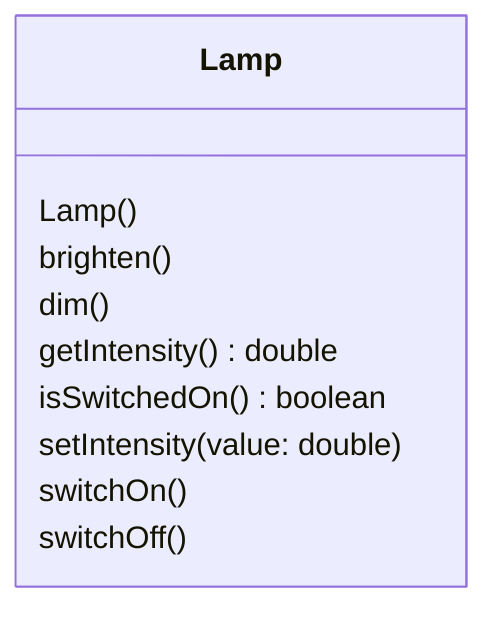
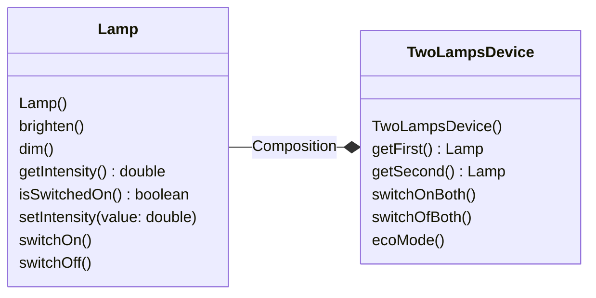
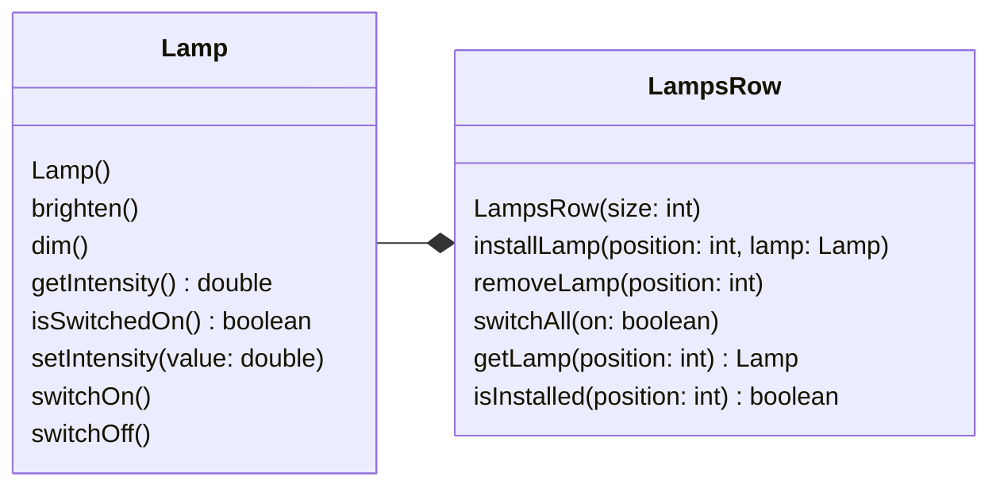
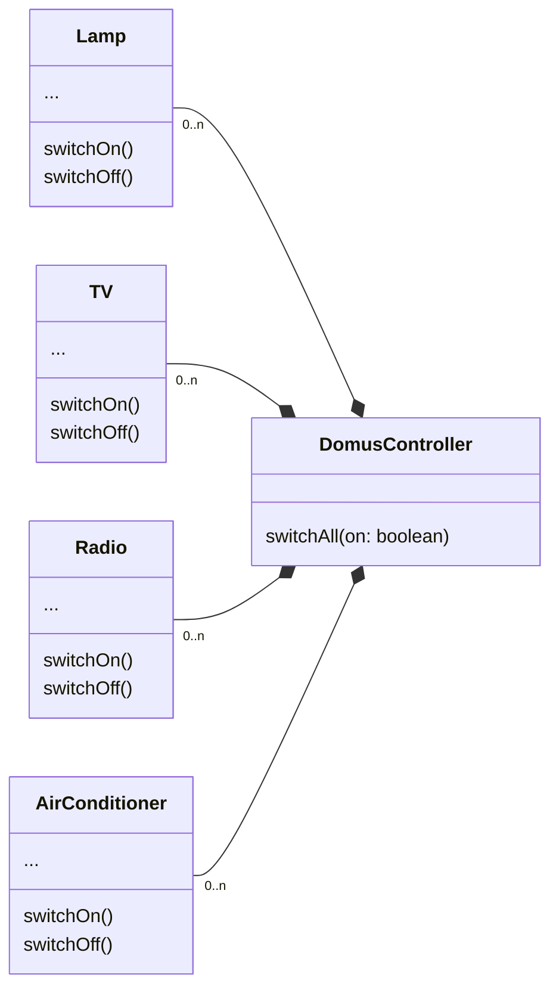

+++

title = "Progettazione e Sviluppo del Software"
description = "Progettazione e Sviluppo del Software, Tecnologie dei Sistemi Informatici"
outputs = ["Reveal"]
aliases = ["/interfaces/"]

+++

# Interfacce

{}

---

## Outline


  
### Goal della lezione


  *  Illustrare concetti generali di composizione e riuso
  *  Introdurre il concetto di interfaccia
  *  Discutere il principio di sostituibilità
  *  Evidenziare il polimorfismo derivante dalle interfacce
  


  
### Argomenti


  *  Tipi di composizione e loro realizzazione
  *  Notazione UML
  *  `interface` in Java e meccanismi collegati
  *  Polimorfismo con le interfacce
  


---


# Composizione e riuso

---


## Intro


  

L'incapsulamento ci fornisce i meccanismi per ben progettare le classi, limitando il più possibile le dipendenze con chi le usa, e quindi in modo da ridurre l'impatto delle modifiche che si rendono via via necessarie.

* $\Rightarrow$ ma le dipendenze fra classi non sono evitabili del tutto, anzi, sono un prerequisito per fare di un gruppo di classi un sistema! In più, le dipendenze sono anche manifestazione di un effettivo "riuso".
  


  
### Forme di dipendenza e riuso fra classi nell'OO


*  Associazione | Un oggetto ne usa un altro: "uses"
*  Composizione | Un oggetto ne aggrega altri: "has-a"
*  Specializzazione | Una classe ne specializza un'altra: "is-a"
  


  
### Nella lezione corrente


Introdurremo la composizione (che è una versione più forte della associazione), mostrando la sua relazione con le *__interface__* di Java
  


---


## Composizione -- relazione "has-a"


  
### Idea


*  un oggetto della classe `A` è ottenuto componendo un insieme di altri oggetti, delle classi `B1`, `B2`,..,`Bn` 
*  si dice che un oggetto di `A` contiene, o si compone di, oggetti delle classi `B1`, `B2`,..,`Bn`
*  ossia, lo stato dell'oggetto di `A` include le informazioni relative allo stato di un oggetto di `B1`, uno di  `B2`,..,uno di `Bn`
*  si noti che si parla propriamente di composizione quando `B1`, `B2`,..`Bn` non sono tipi primitivi, ma classi
*  (quando gli oggetti composti hanno vita propria senza l'esistenza di `A` si parla anche di *__aggregazione__* -- ma non ci occuperemo per ora in dettaglio di questa distinzione)
  


---


## Qualche esempio di composizione


  
### GUI


Un oggetto interfaccia grafica si compone di oggetti di tipo `Button`, `TextField`, `Label`, eccetera
  

  
### Ateneo


Un oggetto ateneo si compone di oggetti di tipo `Facoltà`, `Studenti`, `Docenti`, eccetera
  

  
### Controllore Domotica


Un oggetto controllore domotica si compone di oggetti di tipo `Lamp`, `TV`, `Radio`, eccetera
  


---


## Tipiche realizzazioni


  
### Un oggetto `A` si compone esattamente di un oggetto di `B`


*  La classe `A` avrà un campo (privato) di tipo `B`
*  Tale campo (impostato dal costruttore di `A`) è sempre presente
  


  
### Un oggetto `A` si compone opzionalmente di un oggetto di `B`


*  La classe `A` avrà un campo (privato) di tipo `B`
*  Il suo contenuto potrebbe essere `null` (oggetto di `B` assente)
  


  
### Un oggetto `A` si compone di un numero noto $n$ di oggetti di `B`


*  La classe `A` avrà $n$ campi (privati) di tipo `B` -- se "n" piccolo
  


  
### Un oggetto `A` si compone di una moltitudine non nota di oggetti di `B`


*  La classe `A` avrà un campo (privato) di tipo `B[]` (o altro container)
  


---


## Ricordiamo la classe Lamp 


```java
{}
```


---


## Un esercizio: dispositivo `TwoLampsDevice`


  
### Caratteristiche del sistema da modellare


*  una base su cui poggiano due lampadine
*  possibilità di accendere/spegnere entrambe
*  possibilità di modalità "eco"
  


  
### Idea realizzativa 1 :(


*  una classe con 4 campi, ossia le due intensità e i due flag
*  sarebbe un buon design?
*  riuserei codice? starei aderendo al principio DRY?<br>(Don't Repeat Yourself)
  


  
### Idea realizzativa 2 :)


*  riuso `Lamp` e sfrutto la composizione
  


---


## Esempio: `TwoLampsDevice` pt 1


```java
{}
```

<!--
---


## Esempio: `TwoLampsDevice` pt 2


  \srcode{\scriptsize}{24}{100}{\ecl/TwoLampsDevice.java}

-->

---


## La necessità di una notazione grafica -- UML


  
### UML -- Unified Modelling Language


*  È un linguaggio grafico e OO-based per modellare software
*  Facilita lo scambio di documentazione, e il ragionamento su sistemi articolati e complessi
*  È uno standard dell'OMG dal 1996
*  È molto utile anche a fini didattici
*  Noi ne useremo solo la parte chiamata *__Class Diagram__*
*  Nel corso di Ingegneria del Software lo approfondirete
  


---


## Class Diagram


  
### ..diagramma delle classi, una prima descrizione


*  Un box rettangolare per classe, diviso in tre aree:
    1. nome della classe, 
    2. campi, 
    3. metodi (e costruttori)

*  Su campi e metodi
    *  si antepone il simbolo `-` se privati, `+` se pubblici
    *  si sottolineano se `static`
    *  dei metodi si riporta solo la signature, con sintassi: `nome(arg1: tipo1, arg2: tipo2, ..): tipo_ritorno`
*  archi fra classi indicano relazioni speciali:{
    *  con rombo (composizione), con freccia (semplice associazione)
    *  con triangolo (generalizzazione)
    *  l'arco può essere etichettato con la molteplicità (1, 2, 0..1, 0..n, 1..n)

  
A seconda dello scopo per cui si usa il diagramma, non è necessario riportare tutte le informazioni, ad esempio spesso si omettono le proprietà, le signature complete, ed alcune relazioni


---


## Notazione UML completa per la classe `Lamp`:

* tipicamente usata in fase di implementazione


<!--   -->


---


## Notazione parziale: solo parte pubblica

* tipicamente usata in fase di design





---


## UML: `Lamp` e `TwoLampsDevice`





---


## Altro caso di composizione: `LampsRow`


```java
{}
```


---


## UML: `Lamp` e `LampsRow`





---


## Scenario `DomusController`



  
Come scrivereste il metodo `switchAll` in modo riusabile, e possibilmente rimandendo aperti all'introduzione di nuovi tipi di dispositivi?


---


## Realizzazione senza riuso: schema

```java
{}
```

---


# Interfacce

---


## Motivazioni


  
### Specifica


*  Serve un meccanismo per separare esplicitamente, ossia in dichiarazioni diverse, l'interfaccia della classe e la sua realizzazione
*  Questo consente di tenere separate fisicamente la parte di "contratto" (tipicamente fissa) con quella di "implementazione" (modificabile frequentemente)
*  Consente di separare bene il progetto dall'implementazione
  


  
### Polimorfismo


*  Serve un meccanismo per poter fornire diverse possibili realizzazioni di un contratto
*  Tutte devono poter essere utilizzabili in modo omogeneo
*  Nel caso di `DomusController`:{

	*  Avere un unico contratto per i "dispositivi", e..
	*  ..diverse classi che lo rispettano
	*  `DomusController` gestirà un unico array di "dispositivi"
	
    
}
  


---


## Java `interfaces`


  
### Cos'è una `interface`


*  È un nuovo *__tipo di dato__* dichiarabile (quindi come le classi)
*  Ha un nome, e include "solo" un insieme di intestazioni di metodi
*  Viene compilato da `javac` come una classe, e produce un `.class`
  


  
### Una `interface` `I` può essere "implementata" da una classe


*  Attraverso una classe `C` che lo dichiara esplicitamente (`{..\}`)
*  `C` dovrà definire (il corpo di) tutti i metodi dichiarati in `I`
*  Un oggetto istanza di `C`, avrà come tipo `C` al solito, ma anche `I`!!
  


  
### Esempio: dispositivi DomusController


    `Lamp`, `TV`, `Radio`, `AirConditioner` hanno una caratteristica comune, sono dispositivi e come tali possono come minimo essere accesi o spenti. È possibile definire una interfaccia `Device` che tutti e 4 implementano. 
  


---


## Interface `Device`


  %\sizedcode{\normalsize}{code/Device.java}
  \srcode{\small}{3}{30}{\ecl/domo/Device.java}


---


## Implementazioni di `Device`


  \sizedcode{\scriptsize}{code/DeviceB.java}


---


## Notazione UML per le interfacce


  


*  interfaccia come box con titolo "`<< interface >> Nome`"
*  arco tratteggiato (punta a triangolo) per la relaz. "`implements`"
*  archi raggruppati per migliorare la resa grafica
  


  


---


## Interfacce come tipi di dato


  
### Data l'interfaccia `I`, in che senso `I` è un tipo?


*  `I` è un tipo come gli altri (`int`, `float`, `String`, `Lamp`, `Lamp[]`)
*  è usabile per dichiarare variabili, come tipo di input/output di una funzione, come tipo di un campo
  


  
### Quali operazioni sono consentite?


    esattamente (e solo) le chiamate dei metodi definiti dall'interfaccia
  

  
### Quali sono i valori (/oggetti) di quel tipo?


    gli oggetti delle classi che dichiarano implementare quell'interfaccia
  


---


## Interfacce e assegnamenti


  \sizedcode{\footnotesize}{code/DueTipi.java}


---


## Ridurre la molteplicità / aumentare riuso -- prima


  \sizedcode{\scriptsize}{code/IntMethod.java}


---


## Ridurre la molteplicità / aumentare riuso -- dopo


  \sizedcode{\scriptsize}{code/IntMethod2.java}


---


## Razionale delle interfacce


  
### Quando costruire una interfaccia?


*  quando si ritiene utile separare contratto da implementazione (sempre vero per i concetti cardine in applicazioni complesse)
*  quando si prevede la possibilità che varie classi possano voler implementare un medesimo contratto
*  quando si vogliono costruire funzionalità che possano lavorare con *__qualunque__* oggetto che implementi il contratto

*  caso particolare: Quando si vuole comporre ("has-a") un qualunque oggetto che implementi il contratto

* $\Rightarrow$ l'esperienza mostra che classi riusabili di norma hanno sempre una loro `interface`
  


  
### Quindi:


*  laddove ci si aspetta un oggetto che implementi il contratto si usa il tipo dell'interfaccia
*  questo consente il riuso della funzionalità a tutte le classi che implementano il contratto
  


---


## Scenario `DomusController` rivisitato


  


---


## Codice `DomusController` pt 1


  \srcode{\scriptsize}{3}{25}{\ecl/domo/DomusController.java}


---


## Codice `DomusController` pt 2


  \srcode{\scriptsize}{26}{100}{\ecl/domo/DomusController.java}


---


## Codice `TV`


  \srcode{\ssmall}{3}{100}{\ecl/domo/TV.java}


---


## Uso di `DomusController`


  %\sizedcode{\scriptsize}{code/classes2/UseDomusController.java}
  \srcode{\scriptsize}{3}{100}{\ecl/domo/UseDomusController.java}


---


\section[Sottotipi, sostituibilità, polimorfismo]{Tipi, sottotipi, sostituibilità, polimorfismo}


## `implements` come relazione di "sottotipo"


  
### Un tipo è considerabile come un set di valori/oggetti


    

  *  $T_{`boolean`} = \{`true`, `false`\}$
  *  $T_{`int`} = \{-2147483648,\ldots,-1,0,1,2,\ldots,2147483647\}$
  *  $T_{`Lamp`} = \{X|\textrm{$X$ is an object of class `Lamp`}\}$
  *  $T_{`Device`} = \{X|\textrm{$X$ is an object of a class implementing `Device`}\}$
  *  $T_{`String`} = \{X|\textrm{$X$ is an object of class `String`}\}$
  

  
  
  
### `Lamp` è un sottotipo di `Device`!


*  Un oggetto della classe `Lamp` è anche del tipo `Device`
*  Quindi, da $X\in T_{`Lamp`}$ segue  $X\in T_{`Device`}$
*  Ossia, $T_{`Lamp`} \subseteq  T_{`Device`}$, scritto anche: `Lamp <:\!\!\! Device`
  


  
\Large Ogni classe è sottotipo delle interfacce che implementa!


---


## Sottotipi e principio di sostituibilità


  
### Principio di sostituibilità di Liskov (1993)


    Se `A` è un sottotipo di `B` allora ogni oggetto (o valore) di `A` può(/deve) essere utilizzato dove un programma si attende un oggetto (o valore) di `B`
  

  
### Nel caso delle interfacce


    Se la classe `C` implementa l'interfaccia `I`, allora ogni istanza di `C` può essere passata dove il programma si attende un elemento del tipo `I`.
  

  
### Si rischiano errori?


    No. Il programma può manipolare gli elementi del tipo `I` solo mandando loro i messaggi dichiarati in `I`, che sono sicuramente "accettati" dagli oggetti di `C`. Il viceversa non è vero.
   

   
\Large Nota: `I` è più generale di `C`, ma fornisce meno funzionalità!


---


## Polimorfismo


  
### Polimorfismo = molte forme (molti tipi)

Ve ne sono di diversi tipi nei linguaggi OO

*  Polimorfismo inclusivo: subtyping
*  Polimorfismo parametrico: genericità
  


  
### Polimorfismo inclusivo

È precisamente l'applicazione del principio di sostituibilità

*  Se il tipo `A` è una specializzazione di `B` (lo implementa)..
*  ..si può usare un oggetto `A` dove se ne  attende uno di `B`
  


---


## Polimorfismo e interfacce


  
### Una delle pietre miliari dell'OO


*  `C` deve usare uno o più oggetti di un tipo non predeterminato
*  l'interfaccia `I` cattura il contratto comune di tali oggetti
*  varie classi `C1`,`C2`,`C3` (e altre in futuro) implementano `I`
*  `C` non ha dipendenze rispetto `C1`,`C2`,`C3`
*  (l'uso potrebbe essere una composizione, come nel caso precedente)
  


  


---


## Late binding (o dynamic binding)


  \sizedcode{\scriptsize}{code/IntMethod3.java}
  
### Collegamento ritardato

Accade con le chiamate a metodi non-statici

*  Dentro a `switchOnIfCurrentlyOff()` mandiamo a `device` due messaggi (`isSwitchedOn` e `switchOn`), ma il codice da eseguire viene scelto dinamicamente (ossia "late"), dipende dalla classe dell'oggetto `device` (`Lamp`,`TV`,..)
*  Terminologia: `device` ha tipo `Device` (tipo statico), ma a tempo di esecuzione è un `Lamp` (tipo run-time)
  


---


## Early (static) vs late (dynamic) binding


  \sizedcode{\ssmall}{code/EarlyLate.java}
  
### Differenze


*  Early: con metodi statici o finali
*  Late: negli altri casi
  


---

\section[Altro su interfacce]{Altri Meccanismi delle Interfacce}


## Altri aspetti sulle interfacce


  
### Cosa non può contenere una `interface`?


*  Non può contenere campi istanza
*  Non può contenere il corpo di un metodo istanza
*  Non può contenere un costruttore
  


  
### Cosa potrebbe contenere una `interface`?


*  Java consentirebbe anche di includere dei campi statici e metodi statici (con tanto di corpo), ma è sconsigliato utilizzare questa funzionalità per il momento
*  In Java 8 i metodi possono avere una implementazione di default, che vedremo
  


  
\Large Le `interface` includano solo intestazioni di metodi!


---


## Implementazione multipla


  
### Implementazione multipla

Dichiarazione possibile: `{..\}`
  

*  Una classe `C` implementa sia `I1` che `I2` che `I3`
*  La classe `C` deve fornire un corpo per tutti i metodi di `I1`, tutti quelli di `I2`, tutti quelli di `I3`{

  *  se `I1`,`I2`,`I3` avessero metodi in comune non ci sarebbe problema, ognuno andrebbe implementato una volta sola
    
}
*  Le istanze di `C` hanno tipo `C`, ma anche i tipi `I1`, `I2` e `I3`
  


---


## Esempio `Device` e `Luminous`


  \sizedcode{\scriptsize}{code/Multi.java}


---


## Estensione interfacce


  
### Estensione

Dichiarazione possibile: `{..\}`
  

*  Una interfaccia  `I` definisce certi metodi, oltre a quelli di `I1`, `I2`, `I3`
*  Una classe `C` che deve implementare `I` deve fornire un corpo per tutti i metodi indicati in `I`, più tutti quelli di `I1`, tutti quelli di `I2`, e tutti quelli di `I3`
*  Le istanze di `C` hanno tipo `C`, ma anche i tipi `I`, `I1`, `I2` e `I3`
  


---


## Esempio `LuminousDevice`


  \sizedcode{\scriptsize}{code/Multi2.java}


---


## Qualche esempio dalle librerie Java


  
### Interfacce base


*  `java.lang.Appendable`
*  `java.io.DataInput`
*  `java.io.Serializable`: interfaccia "tag"
*  `javax.swing.Icon`
  


  
### Implementazioni multiple


*  `{...\}`
  


  
### Estensioni di interfacce


*  `{...\}`
  


  
  


---


## Preview del prossimo laboratorio


  
### Obbiettivi

Familiarizzare con:

*  Costruzione di semplici classi con incapsulamento
*  Relativa costruzione di test
*  Costruzione di classi con relazione d'uso verso una interfaccia
  


---
