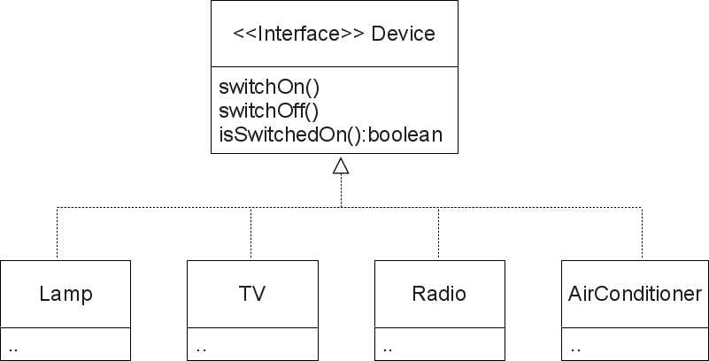
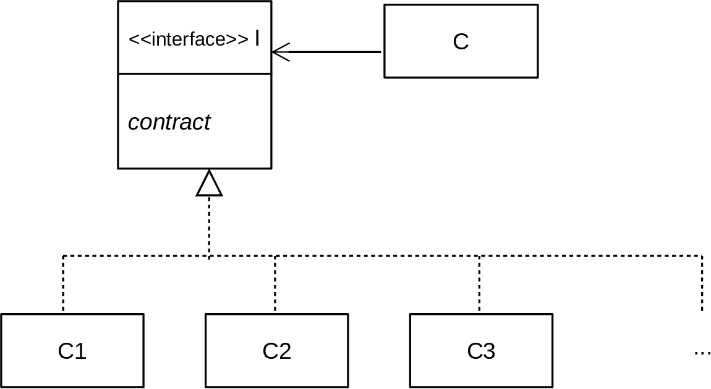

+++

title = "Progettazione e Sviluppo del Software"
description = "Progettazione e Sviluppo del Software, Tecnologie dei Sistemi Informatici"
outputs = ["Reveal"]
aliases = ["/interfaces/"]

+++

# Interfacce

{}

---

## Outline


  
### Goal della lezione


  *  Illustrare concetti generali di *composizione* e *riuso*
  *  Introdurre il concetto di *interfaccia*
  *  Discutere il *principio di sostituibilità*
  *  Evidenziare il *polimorfismo* derivante dalle interfacce
  


  
### Argomenti


  *  Tipi di composizione e loro realizzazione
  *  Notazione UML
  *  `interface` in Java e meccanismi collegati
  *  Polimorfismo con le interfacce
  


---


# Composizione e riuso

---


## Intro


  

L'*incapsulamento* ci fornisce i meccanismi per ben progettare le classi

* limitando il più possibile le dipendenze con chi le usa
* e quindi riducendo l'impatto delle modifiche che si rendono via via necessarie.

$\Rightarrow$ ma le dipendenze fra classi non sono evitabili del tutto

* anzi, sono un prerequisito per fare di un gruppo di classi un *sistema*! 
* in più, le dipendenze sono anche manifestazione di un effettivo *"riuso"*.
  

---
  
### Forme di dipendenza e riuso fra classi nell'OO


*  **Associazione**: un oggetto ne "usa" un altro (*"uses"*)

```java
class A {
    private B b;
}
```

*  **Composizione/aggregazione**: un oggetto è "composto da" o "aggrega" altri oggetti (*"has-a"*)

<div class="container">
<div class="col">

```java
// Composizione
class A {
    private B b;

    public A() {
        b = new B();
    }
}
```

</div><div class="col">

```java
// Aggregazione
class A {
    private B b;

    public A(B b) {
        b = this.b;
    }
}
```

</div>
</div>

*  **Specializzazione**: un oggetto "è una forma specializzata" di un altro tipo di oggetti (*"is-a"*)
    * la vedremo in futuro


  
### Nella lezione corrente


Introdurremo la composizione (che è una versione più forte della associazione), mostrando la sua relazione con le *__interface__* di Java
  


---


## Composizione -- relazione "has-a"


  
### Idea


*  un oggetto della classe `A` è ottenuto componendo un insieme di altri oggetti, delle classi `B1`, `B2`, ..., `Bn` 
    *  si dice che un oggetto di `A` *contiene*, o *si compone di*, o *aggrega*, oggetti delle classi `B1`, `B2`, ..., `Bn`
*  ossia, lo stato dell'oggetto di `A` include <!-- le informazioni relative allo stato di --> un oggetto di `B1`, uno di  `B2`, ..., uno di `Bn`
    *  si noti che si parla propriamente di composizione quando `B1`, `B2`, ..., `Bn` non sono tipi primitivi, ma classi

### Composizione vs. aggregazione

* Quando gli oggetti composti hanno vita propria senza l'esistenza di `A` si parla anche di *__aggregazione__* 
    * Esempio di *aggregazione*: una `ClasseScolastica` aggrega un insieme di oggetti `Studente`; una `Automobile` ha un `Motore`, quattro oggetti `Ruota` etc. 
    * Esempio di *composizione*: una `Casa` si compone di un insieme di oggetti `Stanza` (una stanza non ha vita indipendente dalla casa); un `Libro` si compone di più oggetti `Capitolo` (è vero, si potrebbe considerare un capitolo in isolamento, ma questo rimarrebbe comunque un capitolo di quel libro)
* (ma non ci occuperemo per ora in dettaglio di questa distinzione)

 


---


## Qualche esempio di composizione


  
### GUI


Un oggetto interfaccia grafica si compone di oggetti di tipo `Button`, `TextField`, `Label`, eccetera
  

  
### Ateneo


Un oggetto ateneo si compone di oggetti di tipo `Facoltà`, `Studenti`, `Docenti`, eccetera
  

  
### Controllore Domotica


Un oggetto controllore domotica si compone di oggetti di tipo `Lamp`, `TV`, `Radio`, eccetera
  


---


## Tipiche realizzazioni


  
### Un oggetto `A` si compone esattamente di un oggetto di `B`


*  La classe `A` avrà un campo (privato) di tipo `B`
*  Tale campo (impostato dal costruttore di `A`) è sempre presente
  


  
### Un oggetto `A` si compone opzionalmente di un oggetto di `B`


*  La classe `A` avrà un campo (privato) di tipo `B`
*  Il suo contenuto potrebbe essere `null` (oggetto di `B` assente)
  


  
### Un oggetto `A` si compone di un numero noto $n$ di oggetti di `B`


*  La classe `A` avrà $n$ campi (privati) di tipo `B` -- se "n" piccolo
  


  
### Un oggetto `A` si compone di una moltitudine non nota di oggetti di `B`


*  La classe `A` avrà un campo (privato) di tipo `B[]` (o altro container)
  


---


## Ricordiamo la classe Lamp 

<div class="container">
<div class="col">

{}

```java
{}
```

{}

</div>
<div class="col">

{}


```java
{}
```

{}


</div>
</div>

---


## Un esercizio: dispositivo `TwoLampsDevice`


  
### Caratteristiche del sistema da modellare


*  una base su cui poggiano due lampadine
*  possibilità di accendere/spegnere entrambe
*  possibilità di modalità "eco" (ad es.: una sola accesa a media intensità)
  


  
### Idea realizzativa 1 :(


*  una classe con 4 campi, ossia le due intensità e i due flag
*  sarebbe un buon design?
    * riuserei codice? 
    * starei aderendo al principio *DRY (Don't Repeat Yourself)*?
  


  
### Idea realizzativa 2 :)


*  riuso `Lamp` e sfrutto la composizione
  


---


## Esempio: `TwoLampsDevice`


<div class="container">
<div class="col">

{}

```java
public class TwoLampsDevice {
    /* Composizione di due Lamp! */
    private Lamp l1; // Potrei realizzare lo stato con un array
    private Lamp l2; // I clienti non ne sarebbero influenzati!
    
    /* Composizione inizializzata al momento della costruzione */
    public TwoLampsDevice(){
        this.l1 = new Lamp();
        this.l2 = new Lamp();
    }
    
    /* Metodi getter */
    public Lamp getFirst(){
        return this.l1;
    }
    
    public Lamp getSecond(){
        return this.l2;
    } 
```

{}

</div>
<div class="col">

{}


```java
    /* Altri metodi che lavorano sulla "composizione" */
    public void switchOnBoth(){
        this.l1.switchOn();  // Nota la concatenazione di "."
        this.l2.switchOn();  // .. è tipico della composizione
    }
    
    public void switchOffBoth(){
        this.l1.switchOff();
        this.l2.switchOff();
    }
    
    public void ecoMode(){
        this.l1.switchOff();
        this.l2.switchOn();
        this.l2.setIntensity(0.5);
    }
} 
```

{}


</div>
</div>


<!--
---


## Esempio: `TwoLampsDevice` pt 2


  \srcode{\scriptsize}{24}{100}{\ecl/TwoLampsDevice.java}

-->

---


## La necessità di una notazione grafica -- UML


  
### UML -- Unified Modelling Language


*  È un *linguaggio grafico* semi-formale e *OO-based* per *modellare e documentare il software*
    *  Facilita lo scambio di documentazione, e il ragionamento su sistemi articolati e complessi
    *  È uno standard dell'OMG dal 1996
    *  È molto utile anche a fini didattici
*  Noi ne useremo solo la parte chiamata *__Class Diagram__*
    *  Tipicamente approfondito in corsi di "Ingegneria del Software"
  


---


## Class Diagram


  
### ..diagramma delle classi, una prima descrizione


*  Un *box rettangolare* per classe, diviso in *tre aree*:
    1. nome della classe, 
    2. campi, 
    3. metodi (e costruttori)

*  Su campi e metodi
    *  si antepone il simbolo `-` se privati, `+` se pubblici
    *  si sottolineano se `static`
    *  dei metodi si riporta solo la signature, con sintassi: `nome(arg1: tipo1, arg2: tipo2, ..): tipo_ritorno`
*  *archi* fra classi indicano *relazioni* speciali:
    *  con *rombo* (composizione), con *freccia* (semplice associazione)
    *  con *triangolo* (generalizzazione/specializzazione)
    *  l'arco può essere etichettato con la *molteplicità* (1, 2, 0..1, 0..n, 1..n)

  
A seconda dello scopo per cui si usa il diagramma, non è necessario riportare tutte le informazioni, ad esempio spesso si omettono le proprietà, le signature complete, ed alcune relazioni


---


## Notazione UML completa per la classe `Lamp`:

* tipicamente usata in fase di implementazione


 

<!--

-->

---


## Notazione parziale: solo parte pubblica

* tipicamente usata in fase di design


---


## UML: `Lamp` e `TwoLampsDevice`

 

<!--

-->


---


## Altro caso di composizione: `LampsRow`


{}

```java
{}
```

{}

---


## UML: `Lamp` e `LampsRow`

 


<!--

-->


---


## Scenario `DomusController`

* Come scrivereste il metodo `switchAll` in modo riusabile, e possibilmente rimandendo aperti all'introduzione di nuovi tipi di dispositivi?


 


<!--

-->
  


---


## Realizzazione senza riuso: schema

```java
public class DomusController {
    private Lamp[] lamps;
    private TV[] tvs;
    private AirConditioner[] airs;
    private Radio[] radios;
    
    //...

    public void switchAll(boolean on) {
        for (Lamp lamp: this.lamps) {
            if (lamp != null) {
                if (on){ lamp.switchOn(); } else { lamp.switchOff(); } // mal formattato!
            }
        }
        for (TV tv: this.tvs) {
            if (tv != null) { 
                if (on) { tv.switchOn(); } else { tv.switchOff(); } // mal formattato!
            }
        }
        ... // e così via per tutti i dispositivi
    } 
}
```

* Si noti come la struttura dei due cicli `for` sia essenzialmente identica!
    * Cambia solo il (tipo dei) receiver e il nome delle variabili coinvolte

---


# Interfacce

---


## Motivazioni


  
### Specifica


* Serve un meccanismo per *separare esplicitamente*, ossia in dichiarazioni diverse, *l'interfaccia* della classe e la sua *realizzazione*
    * Si vuole poter *separare fisicamente* la parte di *"contratto"* (tipicamente fissa) con quella di *"implementazione"* (modificabile frequentemente)
    * Si vuole poter *astrarre* da molteplici possibili implementazioni 

  
### Polimorfismo


*  Serve un meccanismo per poter fornire *diverse possibili realizzazioni di un contratto*
*  Tutte devono poter essere *utilizzabili in modo omogeneo*
*  Nel caso di `DomusController`:
	  *  Avere un unico contratto per i "dispositivi", e ...
	  *  ... diverse classi che lo rispettano
	  *  `DomusController` gestirà un unico array di "dispositivi"
  


---


## **Interfacce** in Java


  
### Cos'è una `interface`


*  È un nuovo *__tipo di dato__* dichiarabile (quindi come le classi)
*  Ha un nome, e include "solo" un insieme di intestazioni di metodi
*  Viene compilato da `javac` come una classe, e produce un `.class`
  


  
### Una `interface` `I` può essere "implementata" da una classe


*  Attraverso una classe `C` che lo dichiara esplicitamente (`class C implements I { ... }`)
*  `C` dovrà definire (il corpo di) tutti i metodi dichiarati in `I`
*  Un oggetto istanza di `C`, avrà come tipo `C` al solito, ma anche `I`!!
  
  
### Esempio: dispositivi in `DomusController`

* `Lamp`, `TV`, `Radio`, `AirConditioner` hanno una caratteristica comune: sono dispositivi e come tali possono come minimo essere accesi o spenti. 
* È possibile definire una interfaccia `Device` che tutti e 4 implementano.
    * Definiamo così una nuova *astrazione* 
  


---


## Interface `Device`


```java
{}
```


---


## Implementazioni di `Device`


```java
public class Lamp implements Device {
    // ...
    /* NOTA: Nessun cambiamento necessario rispetto a prima!
     * Di seguito si riporta la parte di `Lamp` che
     * permette di rispettare il contratto di `Device`,
     * ovvero di implementare l'interfaccia
     */
    private boolean switchedOn;
    
    public void switchOn(){
    	this.switchedOn = true;
    }
    public void switchOff(){
    	this.switchedOn = false;
    }
    public boolean isSwitchedOn(){
    	return this.switchedOn;
    }
    
    // ...
}

public class TV implements Device {
    // Nessun cambiamento necessario rispetto a prima!
}

public class Radio implements Device {
    // Nessun cambiamento necessario rispetto a prima!
}
```

---


## Notazione UML per le interfacce


  


*  interfaccia come box con titolo "`<< interface >> Nome`"
    * essenzialmente, stessa notazione di una classe con in più lo *"stereotipo"* `<<interface>>`
*  *arco tratteggiato con punta a triangolo* per la relazione **"interface realization"** (che modella `implements`)
    * eventualmente, archi raggruppati (che si diramano dallo stesso triangolo) per migliorare la resa grafica
  


<!--

-->

---


## Interfacce come tipi di dato


  
### Data l'interfaccia `I`, in che senso `I` è un tipo?


*  `I` è un tipo come gli altri (`int`, `float`, `String`, `Lamp`, `Lamp[]`)
*  è usabile per dichiarare variabili, come tipo di input/output di una funzione, come tipo di un campo
  


  
### Quali operazioni sono consentite?

* esattamente (e solo) le *chiamate dei metodi definiti dall'interfaccia*

  
### Quali sono i valori (oggetti) di quel tipo?

* gli oggetti delle classi che dichiarano implementare quell'interfaccia


---


## Interfacce e assegnamenti


```java
/* Su Lamp effettuo le usuali operazioni */
Lamp lamp = new Lamp();    
lamp.switchOn();
boolean b = lamp.isSwitchedOn(); 
lamp.dim();

/* Una variabile di tipo Device può contenere un Lamp, 
   e su essa posso eseguire le  operazioni definite da Device */
Device dev;	                      // creo la variabile
dev = new Lamp();                 // assegnamento ok	
dev.switchOn();	                  // operazione di Device
boolean b2 = dev.isSwitchedOn();  // operazioni di Device 

/* Attenzione: non si può invocare un metodo specifico di Lamp
   su una variabile di tipo Device! */
dev.dim(); // NO!!!! 

Device dev2 = new Lamp();         // Altro assegnamento

/* Attenzione, le interfacce non sono istanziabili */
Device dev3 = new Device(); // NO!!!! 
```

---


## Ridurre la molteplicità / aumentare riuso -- prima


```java
class DeviceUtilities {
    
    /* Senza interfacce, non resta altro che... */
    
    public static void switchOnIfCurrentlyOff(Lamp lamp) {
    	if (!lamp.isSwitchedOn()){
    	    lamp.switchOn();
    	}
    }
    
    public static void switchOnIfCurrentlyOff(TV tv) {
    	if (!tv.isSwitchedOn()) {
    	    tv.switchOn();
    	}
    }
    
    public static void switchOnIfCurrentlyOff(Radio radio) {
    	if (!radio.isSwitchedOn()) {
    	    radio.switchOn();
    	}
    }
    ..
}
```

---


## Ridurre la molteplicità / aumentare riuso -- dopo


```java
class DeviceUtilities {
    // ...

    /* Grazie alle interfacce, fattorizzo in un solo metodo */
    public static void switchOnIfCurrentlyOff(Device device) {
    	if (!device.isSwitchedOn()){
    	    device.switchOn();
    	}
    }
}

/* Codice cliente */
Lamp lamp = new Lamp();
TV tv = new TV();
Radio radio = new Radio();

switchOnIfCurrentlyOff(lamp);  // OK, un Lamp è un Device 
switchOnIfCurrentlyOff(tv);    // OK, una TV è un Device
switchOnIfCurrentlyOff(radio); // OK, una Radio è un Device
```

---


## Razionale delle interfacce


  
### Quando costruire una interfaccia?


*  quando si ritiene utile separare contratto da implementazione (sempre vero per i concetti cardine in applicazioni complesse)
*  quando si prevede la possibilità che varie classi possano voler implementare un medesimo contratto
*  quando si vogliono costruire funzionalità che possano lavorare con *__qualunque__* oggetto che implementi il contratto

*  caso particolare: Quando si vuole comporre ("has-a") un qualunque oggetto che implementi il contratto

$\Rightarrow$ l'esperienza mostra che classi riusabili di norma hanno sempre una loro `interface`
  


  
### Quindi:


*  laddove ci si aspetta un oggetto che implementi il contratto si usa il tipo dell'interfaccia
*  questo consente il riuso della funzionalità a tutte le classi che implementano il contratto
  


---


## Scenario `DomusController` rivisitato


<!--

-->

---


## Codice `DomusController`


<div class="container">
<div class="col">

{}

```java
{}
```

{}

</div><div class="col">

{}

```java
{}
```

{}

</div>
</div>

---


## Codice `TV`


```java
{}
```

---


## Uso di `DomusController`

```java
{}
```

---


# Tipi, sottotipi, sostituibilità, polimorfismo


## `implements` come relazione di "sottotipo"


  
### Un tipo è considerabile come un set di valori/oggetti


    

  *  $T_{boolean} = \lbrace true, false \rbrace$
  *  $T_{int} = \lbrace -2147483648,\ldots,-1,0,1,2,\ldots,2147483647 \rbrace$
  *  $T_{Lamp} = \lbrace X|\textrm{$X$ is an object of class Lamp} \rbrace$
  *  $T_{Device} = \lbrace X|\textrm{$X$ is an object of a class implementing Device} \rbrace$
  *  $T_{String} = \lbrace X|\textrm{$X$ is an object of class String} \rbrace$
  

  
  
  
### `Lamp` è un sottotipo di `Device`!


*  Un oggetto della classe `Lamp` è anche del tipo `Device`
*  Quindi, da $X \in T_{Lamp}$ segue  $X \in T_{Device}$
*  Ossia, $T_{Lamp} \subseteq  T_{Device}$, scritto anche: `Lamp <: Device`
  


  
**Ogni classe è sottotipo delle interfacce che implementa!**


---

### Visione insiemistica


- Gli *insiemi* (ovali) denotano *tipi*
    - Un insieme contenuto in un altro insieme è un *sottotipo*
- Gli *elementi* (punti neri) denotano *oggetti*


---


## Sottotipi e principio di sostituibilità


  
### Principio di sostituibilità di Liskov (1993)


Se `B` è un sottotipo di `A` allora ogni oggetto (o valore) di `B` può(/deve) essere utilizzato dove un programma si attende un oggetto (o valore) di `A`

  
### Nel caso delle interfacce


Se la classe `C` implementa l'interfaccia `I`, allora ogni istanza di `C` può essere passata dove il programma si attende un elemento del tipo `I`.
  
```java
class Lamp implements Device { ... }

public void workOnDevice(Device d) { if(d.isSwitchedOn()) { ... } }

Lamp l = new Lamp();
Device d = l; // ok, ci si attende un Device
workOnDevice(l); // ok, il parametro dev'essere un Device
```
  
### Si rischiano errori?


No. Il programma può manipolare gli elementi del tipo `I` solo mandando loro i messaggi dichiarati in `I`, che sono sicuramente "accettati" dagli oggetti di `C`. Il viceversa non è vero.
   

   
**Nota: `I` è più generale di `C`, ma fornisce meno funzionalità!**


---


## Polimorfismo


  
### Polimorfismo = molte forme (molti tipi)

Ve ne sono di diversi tipi nei linguaggi OO

*  Polimorfismo *inclusivo*: subtyping
*  Polimorfismo *parametrico*: genericità
  


  
### Polimorfismo inclusivo

Il **polimorfismo inclusivo** precisamente l'applicazione del *principio di sostituibilità di Liskov*

*  Se il tipo `B` è una specializzazione di `A` (lo implementa)...
*  ... allora si può usare un oggetto `B` dove se ne attende uno di `A`
  


---


## Polimorfismo e interfacce


  
### Una delle pietre miliari dell'OO


*  `C` deve "usare" uno o più oggetti di un tipo non predeterminato
    *  (l'uso potrebbe essere una composizione, come nel caso precedente)
*  l'interfaccia `I` cattura il contratto comune di tali oggetti
*  varie classi `C1`, `C2`, `C3` (e altre in futuro) implementano `I`
*  `C` allora può focalizzarsi nel solo uso di oggetti di tipo `I` (astraendo da eventuali altri dettagli)
    * dunque `C` non avrebbe dipendenze rispetto `C1`, `C2`, `C3`



<!--

-->


---


## Late binding (o dynamic binding)


```java
public static void switchOnIfCurrentlyOff(Device device){
    // Collegamento dinamico con i metodi da invocare..
    if (!device.isSwitchedOn()){
        device.switchOn();
    }
}
/* Codice cliente */
Lamp lamp = new Lamp();
switchOnIfCurrentlyOff(lamp); // OK, un Lamp è un Device 
```
  
### Collegamento dinamico/ritardato

Accade con le chiamate a metodi non-statici

*  Dentro a `switchOnIfCurrentlyOff()` mandiamo a `device` due messaggi (`isSwitchedOn` e `switchOn`), ma il codice da eseguire viene scelto dinamicamente (ossia "late"), dipende dalla classe dell'oggetto `device` (`Lamp`, `TV`, ...)
*  Terminologia: `device` ha tipo `Device` (*tipo statico*), ma a tempo di esecuzione è un `Lamp` (*tipo run-time*)
  


---


## Early (static) vs late (dynamic) binding

* "statico" vuol dire "a tempo di compilazione" (compile-time)
* "dinamico" vuol dire "a tempo di esecuzione" (run-time)

```java
interface I {
    void m();
}
class C1 implements I {
    void m(){ System.out.println("I'm istance of C1");}
}
class C2 implements I {
    void m(){ System.out.println("I'm istance of C2");}
    static void m2(){ System.out.println("I'm a static method of C2");} 
}

// Codice cliente

I i = Math.random() > 0.5 ? new C1() : new C2();
i.m(); // collegamento al body da eseguire è late, ossia dinamico

C2.m2(); // collegamento al body da eseguire è early, ossia statico
```
  
### Differenze


*  Early: con metodi statici (o finali--come vedremo nel caso dell'ereditarietà)
*  Late: negli altri casi
  


---

# Altri Meccanismi delle Interfacce

---

## Altri aspetti sulle interfacce


  
### Cosa non può contenere una `interface`?

*  Non può contenere campi istanza
*  Non può contenere il corpo di un metodo istanza
*  Non può contenere un costruttore
  
  
### Cosa potrebbe contenere una `interface`?


*  Java consentirebbe anche di includere dei campi statici e metodi statici (con tanto di corpo), ma è sconsigliato utilizzare questa funzionalità per il momento
*  Da Java 8, i metodi possono avere una implementazione di default, che vedremo
  
```java
public interface I4 extends I1, I2, I3 {
    void doSomething(String s);
    // da Java 8
    double E = 2.718282; // implicitamente public, static, final
    default doSomethingTwice(String s) { doSomething(s); doSomething(s); }
    static double PI() { return Math.PI; }
}
```

  
**Le `interface` includano solo intestazioni di metodi!**


---


## Implementazione multipla di interfacce


  
### Implementazione multipla di interfacce

Dichiarazione possibile: `class C implements I1,I2,I3 { ... }`
  

*  Una classe `C` implementa sia `I1` che `I2` che `I3`
*  La classe `C` deve fornire un corpo per tutti i metodi di `I1`, tutti quelli di `I2`, tutti quelli di `I3`
    *  se `I1`, `I2`, `I3` avessero metodi in comune non ci sarebbe problema, ognuno andrebbe implementato una volta sola
*  Le istanze di `C` hanno tipo `C`, ma anche i tipi `I1`, `I2` e `I3`
  


---


## Esempio `Device` e `Luminous`


```java
/* Interfaccia per dispositivi */
public interface Device {       // Contratto:
    void switchOn();            // - si può accendere
    void switchOff();           // - si può spegnere
    boolean isSwitchedOn();     // - si può verificare se acceso/spento
}

/* Interfaccia per entità luminose */
public interface Luminous {     // Contratto:
    void dim();                 // - si può ridurre la luminosità
    void bright();              // - si può aumentare la luminosità
}

public class Lamp implements Device, Luminous {
    // ...  
    public void switchOn(){ ... }
    public void switchOff(){ ... }
    public boolean isSwitchedOn(){ ... }
    public void dim(){ ... }
    public void bright(){ ... }
}
```

---


### Visione insiemistica


---


## Estensione interfacce


  
### Estensione

Dichiarazione possibile: `interface I extends I1,I2,I3 { ... }`
  

*  Una interfaccia  `I` definisce certi metodi, oltre a quelli di `I1`, `I2`, `I3`
*  Una classe `C` che deve implementare `I` deve fornire un corpo per tutti i metodi indicati in `I`, più tutti quelli di `I1`, tutti quelli di `I2`, e tutti quelli di `I3`
*  Le istanze di `C` hanno tipo `C`, ma anche i tipi `I`, `I1`, `I2` e `I3`
  


---


## Esempio `LuminousDevice`


```java
public interface Device {  
    void switchOn(); 
    void switchOff();
    boolean isSwitchedOn();
}
public interface Luminous {     
    void dim();
    void brighten();
}

/* Interfaccia per dispositivi luminosi */
public interface LuminousDevice extends Device, Luminous {
    // non si aggiungono ulteriori metodi 
}

public class Lamp implements LuminousDevice {
    // ...  
    public void switchOn(){ ... }
    public void switchOff(){ ... }
    public boolean isSwitchedOn(){ ... }
    public void dim(){ ... }
    public void brighten(){ ... }
}
```


---


## Qualche esempio dalle librerie Java

[https://docs.oracle.com/en/java/javase/17/docs/api/java.base/module-summary.html](https://docs.oracle.com/en/java/javase/17/docs/api/java.base/module-summary.html)
  
### Interfacce base

*  `java.lang.CharSequence`: contratto per oggetti rappresentanti "sequenze di caratteri" leggibili
    * implementata da, ad esempio: `String` e `StringBuffer` (stringhe mutabili)
*  `java.lang.Appendable`: contratto per oggetti su cui "appendere" (ovvero, aggiungere in coda) sequenze di caratteri (`CharSequence`)
    * implementata da, ad esempio: `StringBuffer`
*  `java.io.DataInput`: lettura di oggetti di tipi primitivi a partire da un flusso di dati binario
*  `java.io.Serializable`: interfaccia *"tag"* (vuota, senza metodi) per oggetti "serializzabili"
*  `javax.swing.Icon`: interfaccia per icone in interfacce grafiche
  


  
### Implementazioni multiple


*  `final class String implements CharSequence, Serializable, ... { ... } `
*  `class ImageIcon implements Icon, Serializable, ... { ... }`
  


  
### Estensioni di interfacce


*  `interface ObjectInput extends DataInput { ... }`
  


---


## Preview del prossimo laboratorio


  
### Obbiettivi

Familiarizzare con:

*  Costruzione di semplici classi con incapsulamento
*  Relativa costruzione di test
*  Costruzione di classi con relazione d'uso verso una interfaccia
  
