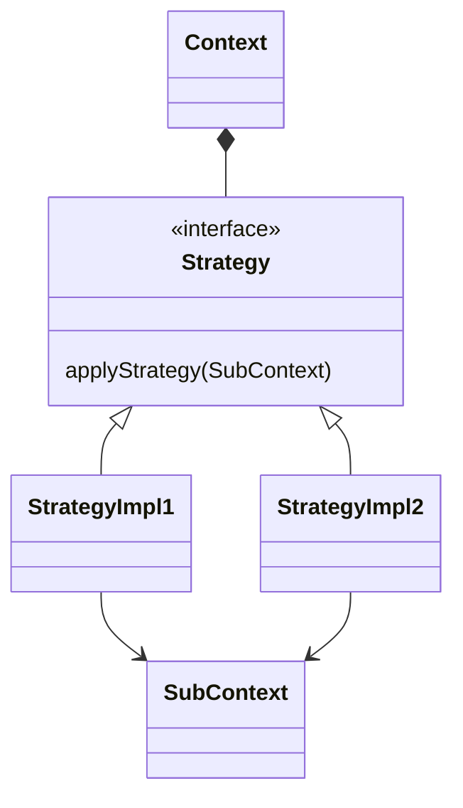

```mermaid
classDiagram

class Context { }

class Strategy {
    applyStrategy(SubContext)
}

<<interface>> Strategy

Context *-- Strategy

class StrategyImpl1 { }

class StrategyImpl2 { }

Strategy <|-- StrategyImpl1
Strategy <|-- StrategyImpl2

class SubContext

StrategyImpl1 --> SubContext
StrategyImpl2 --> SubContext 
```