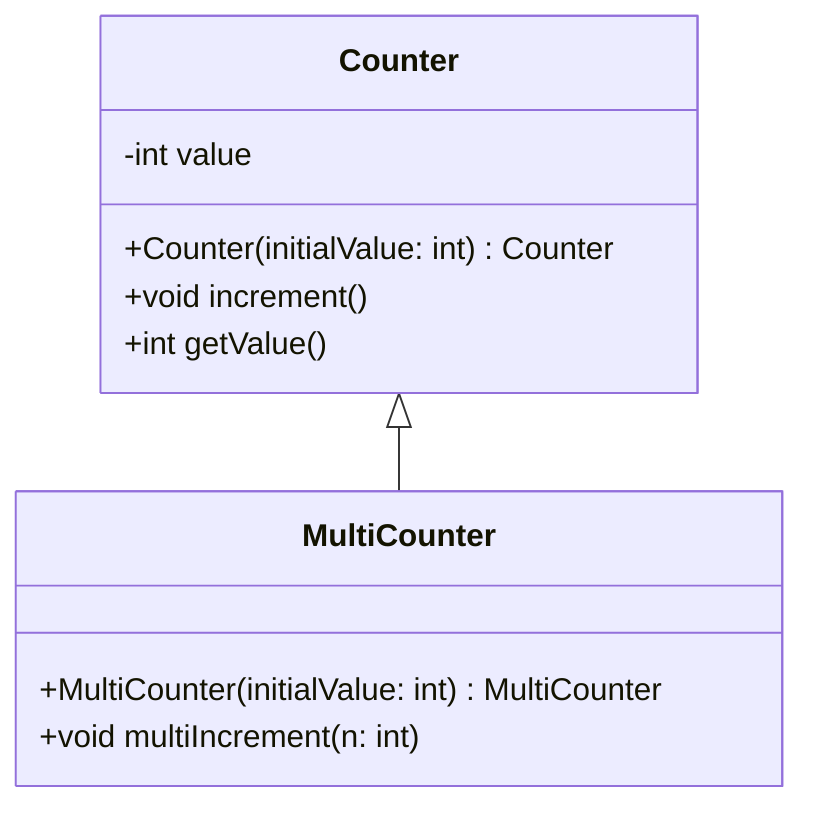
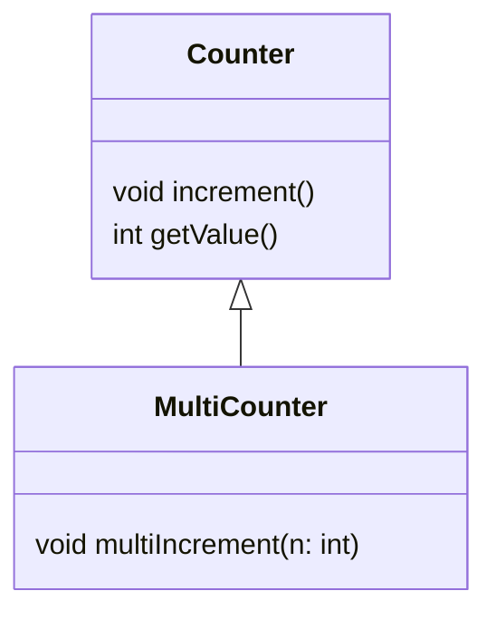
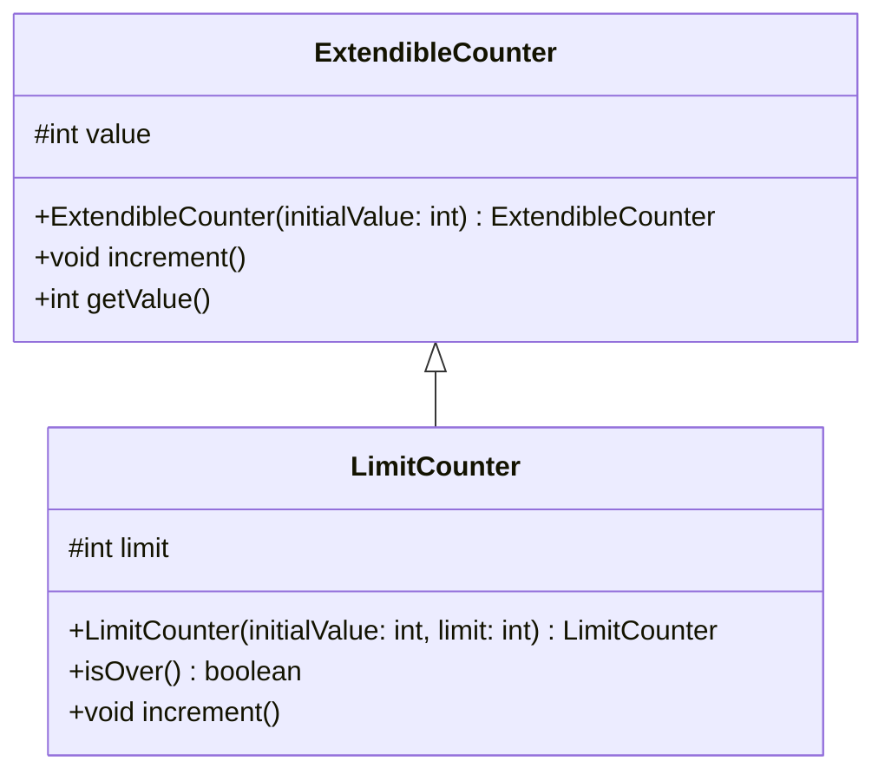

+++

title = "Progettazione e Sviluppo del Software"
description = "Progettazione e Sviluppo del Software, Tecnologie dei Sistemi Informatici"
outputs = ["Reveal"]
aliases = ["/inheritance/"]

+++

# Ereditarietà

{}

---


## Outline


  
### Goal della lezione


*  Illustrare il riuso via ereditarietà
*  Introdurre i vari meccanismi collegati all'ereditarietà
  


  
### Argomenti


*  Estensione di classi: `extends`
*  Livello d'accesso `protected`
*  Overriding dei metodi
*  Gestione dei costruttori e chiamate `super`
*  Il modificatore `final` su classi e metodi
  


---

# Riuso via ereditarietà


<!--


---

## Recap: interfacce e riuso via delega

### Interfacce

Con le interfacce, abbiamo visto che è possibile:
    
1) definire contratti

```java
interface Device {
    void switchOn();
    void switchOff();
    boolean isOn();
}
```
   
2) implementare contratti

```java
class Lamp implements Device { /* ... */ }
class Tv implements Device { /* ... */ }
class Radio implements Device { /* ... */ }
```
    
3) estendere contratti esistenti

```java
interface LuminousDevice extends Device, Luminous { }
```

---

### Riuso via delega

---
-->


## Ereditarietà

È un meccanismo che consente di definire una nuova classe *__specializzandone__* una esistente, ossia *"ereditando"* i suoi campi e metodi (quelli privati non sono visibili), possibilmente/eventualmente *modificando/aggiungendo* campi/metodi, e quindi *riusando* codice già scritto e testato.
  
<!--
È un meccanismo che consente di definire una nuova classe *__specializzandone__* una esistente, ossia

* *"ereditando" i suoi campi e metodi*, quindi riusando codice già scritto e testato
  * è ortogonale al discorso di "visibilità": membri privati, seppur non visibili, sono comunque ereditati 
* estendendo attraverso (A) *modifica* e/o (B) *aggiunta* di campi/metodi 
  
-->


### Scenari di riuso ed estensione


  


*  Data una classe, realizzarne *un'altra* con *caratteristiche solo in parte diverse (o nuove)*
    * ad esempio, data una lampadina (`Lamp`), realizzare un televisore (`Tv`)
    * SOTTOCASO: stessa cosa, ma senza disporre dei sorgenti della classe originaria (p.e., la classe di partenza è di libreria)
        * Non c'è alcuna differenza rispetto al primo caso: quello che conta in generale è il bytecode, non il sorgente
*  Data una classe, crearne una *più specializzata*
    * ad esempio, a partire da una lampadina (`SimpleLamp`), realizzare una lampadina con controllo livello di intensità luminosa (`AdvancedLamp`)
    * ad esempio, una classe più robusta e sicura, anche se più lenta
*  Creare *gerarchie di classi* ossia di comportamenti
    * Ad esempio, una famiglia di `Device` diversi e specializzati
  


---
  
### L'ereditarietà è un concetto chiave dell'OO


*  È connesso al meccanismo delle interfacce 
*  È uno degli elementi chiave insieme a *incapsulamento* e *interfacce*
*  Non riguarda solo il riuso di codice, ma influenza anche il *polimorfismo* conseguente
  


  
### Solito approccio

*  Illustreremo i meccanismi base attraverso semplici classi
*  Successivamente recupereremo l'importanza nei casi reali
*  Utilizzeremo l'idea di *__contatore__*


---


## Esempio base: `Counter`


```java
{}
```


---


## Uso della classe `Counter`


```java
{}
```

---


## Una nuova classe: `MultiCounter`

* rispetto a `Counter`, offre un metodo `multiIncrement(int)`

```java
{}
```

---


## Uso della classe `MultiCounter`


```java
{}
```

---


## Versione con riuso via composizione: `MultiCounter2`


```java
{}
```

---


## La necessità di estendere e modificare


  
### Una tipica situazione


*  È tipico nei progetti software, accorgersi di dover creare anche versioni modificate delle classi esistenti
*  Appoggiarsi al "copia e incolla" per ottenere *ripetizione di codice* è sempre sconsigliabile (principio *DRY*), perché tende a spargere errori in tutto il codice, e complica la manutenzione
*  Ottenere riuso via *composizione* (ossia *delegazione*) è in generale una *__ottima soluzione__*.. ma è possibile in alcuni casi fare meglio..
  


  
### Si usa il meccanismo di ereditarietà


*  Definizione: `class C extends D { ... }`
*  La nuova classe `C` *eredita campi/metodi* di `D`
    * Nota: eredita anche campi/metodi *privati*, ma non sono accessibili da `C` (la "visibilità" di un campo è ortogonale alla sua "presenza" in una classe)
    * Nota: i *costruttori* non vengono ereditati, ma riusati implicitamente o esplicitamente <!-- costruttori di `D` non sono direttamente richiamabili con la `new`, bisogna sempre definirne di nuovi -->
*  Terminologia: `D` *superclasse*, o *classe base*, o *classe padre*
*  Terminologia: `C` *sottoclasse*, o *classe figlia*, o *specializzazione*
*  Nota: non serve disporre dei sorgenti di `D`, basta il codice binario
  


---


## Una nuova versione di `MultiCounter`


```java
{}
```

---


## Razionale


  
### Ridefiniamo la classe `MultiCounter` come estensione di `Counter`


*  Definiamo il nuovo metodo `multiIncrement()`
*  Definiamo il costruttore necessario
    *  Il costruttore di una sottoclasse può cominciare con l'istruzione `super`, che chiama un costruttore (non privato) della classe padre
    *  Se non lo fa, si chiama il costruttore senza argomenti del padre (se c'è, altrimenti ERRORE)
    *  Senza costruttori, si ha al solito solo quello di default (che chiama il costruttore senza argomenti del padre)
*  `UseMultiCounter` continua a funzionare!
  


  
### Il senso della definizione


*  Un oggetto di `MultiCounter` è simile ad un oggetto di `Counter`
    *  Ha i metodi `increment()` e `getValue()`
    *  Ha anche il campo `value` (che in effetti è incrementato), anche se essendo privato è inaccessibile dal codice della classe `MultiCounter`
*  Due modifiche necessarie rispetto a `Counter`: metodo `multiIncrement()` e ridefinizione del costruttore
  

---


## Notazione UML per l'estensione


*  Arco a *linea continua*  e  *punta a triangolo* (vuoto/pieno) per la relazione "`extends`"
    * Stessa notazione di "realizzazione interfaccia", a parte che quest'ultima ha linea tratteggiata
*  Archi raggruppati per migliorare la resa grafica
  


<!--   -->




---


## Notazione UML -- versione semplificata per il design




---


## Livello d'accesso `protected`


  
### Usabile per le proprietà d'una classe


*  È un livello intermedio fra `public` e `private`
*  Indica che la proprietà (campo, metodo, costruttore) è accessibile dalla classe corrente, da una sottoclasse, e dalle sottoclassi delle sottoclassi (ricorsivamente) -- cavillo: anche da tutto il package
    * ovvero, é package-private con visibilità estesa alle classi discendenti  


  
### A cosa serve?


*  Consente alle sottoclassi di accedere ad informazioni della sopraclasse che non si vogliono far vedere agli utilizzatori	
*  Molto spesso usato a posteriori rimpiazzando un `private`
*  Molto meglio avere campi privati e getter/setter protetti
  


  
### Esempio classe `BiCounter` -- contatore bidirezionale


*  Un contatore con anche il metodo `decrement`
*  Irrealizzabile senza rendere accessibile il campo `counter`
  


---


## Un contatore estendibile: `ExtendibleCounter`


```java
{}
```

---


## Classe `MultiCounter`


```java
{}
```


---


## Classe `BiCounter`


```java
{}
```


---


## Overriding di metodi


  
### Estensione e modifica


*  Quando si crea una nuova classe per estensione, molto *spesso non è sufficiente aggiungere nuove funzionalità*
*  A volte serve anche *modificare* alcune di quelle disponibili, eventualmente anche stravolgendone il funzionamento originario
*  Questo è realizzabile *riscrivendo* nella sottoclasse uno (o più) dei metodi della superclasse (ossia, facendone l'*__overriding__*)
    *  Se necessario, il metodo riscritto può invocare la versione del padre usando il receiver speciale `super`
  


  
### Esempio


*  Creare un contatore che, giunto ad un certo limite, non prosegue più
    * non basta aggiungere qualcosa
*  È necessario fare overriding del metodo `increment()`
*  Un ulteriore metodo getter ispeziona il raggiungimento del limite
    
  

 


---


## Classe `LimitCounter`


```java
{}
```


---


## Uso della classe `LimitCounter`


```java
{}
```


---


## Notazione UML


  


*  I campi/metodi protetti si annotano con un "\#"
*  I metodi overridden si riportano anche nella sottoclasse
  




---


# Uno scenario completo

---


## Una applicazione allo scenario domotica


  
### Elementi


*  Usiamo `LimitCounter`
*  Definiamo una `LimitedLamp` (via estensione) che contiene un contatore, e che ha un tempo di vita basato sul numero di accensioni ammesse
*  Un `EcoDomusController` si compone di $n$ `LimitedLamp`, e ha la possibilità di verificare se tutte le lampadine sono esaurite, e di accendere la lampadina alla quale è rimasto più tempo di vita
  


  
### Note sulla soluzione


*  Una alternativa era far sì che `EcoDomusController` componesse $n$ `SimpleLamp` e $n$ `LimitCounter`
*  `LimitedLamp` realizza alcuni metodi per delegazione al suo contatore
*  Per ora, non prevediamo l'aspetto di interazione con l'utente
  


---


## Diagramma UML complessivo


---


## `LimitCounter`


```java
{}
```


---


## `SimpleLamp`


```java
{}
```

---


## `LimitedLamp`


```java
{}
```

---


## `EcoDomusController`

<div class="container">
<div class="div">

{}

```java
{}
```

{}

</div>
<div class="div">

{}

```java
{}
```

{}

</div></div>

---


## `UseEcoDomusController`


```java
{}
```


---


# Ulteriori dettagli

---


## Ereditarietà e costruttori

### Costruttori di default e chiamate implicite

```java
class A { }
class B extends A { } // OK
```

* `B` ha un costruttore di default, che invoca il costruttore senza argomenti (quello di default in questo caso) di `A`

```java
class A { A() { out.print("A"); } }
class B extends A { } // OK
```

* `B` ha un costruttore di default, che invoca il costruttore senza argomenti di `A`

```java
class A { A(int x) { out.print("A" + x); } }
class B extends A { } // ERROR
```

* `B` ha un costruttore di default, che vorrebbe invocare il costruttore di `A` senza argomenti, ma non lo trova! Il compilatore restituisce un errore.


---


```java
class A { }
class B extends A { B() { out.print("B"); } } // OK
// Stessa cosa di:
class B extends A { B() { super(); out.print("B"); } }
```

* `B` ha un costruttore definito, che invoca implicitamente il costruttore senza argomenti (quello di default in questo caso) di `A`


```java
class A { A() { out.print("A"); } }
class B extends A { B() { out.print("B"); } } // OK
// Stessa cosa di:
class B extends A { B() { super(); out.print("B"); } }
```

* `B` ha un costruttore definito, che invoca implicitamente/esplicitamente il costruttore senza argomenti di `A`

```java
class A {  A(int x) { out.print("A" + x); }  }
class B extends A { B() { out.print("B"); } } // ERROR
// Qua occorre fare:
class B extends A { B() { super(7); out.print("B"); } }
```

* `B` ha un costruttore definito, che vorrebbe implicitamente invocare il costruttore di `A` senza argomenti, ma non lo trova! Il compilatore restituisce un errore.


---


### Costruzione di oggetti in gerarchie di classi


*  Assumiamo si stia costruendo una *catena di sottoclassi*
*  Ogni classe introduce alcuni campi, che si aggiungono a quelli della superclasse a formare la struttura di un oggetto in memoria
  


  
### Linee guida per la singola classe


*  Dovrà definire tutti i costruttori necessari, seguendo l'approccio visto
*  Ogni costruttore dovrà preoccuparsi di:
    *  Chiamare l'opportuno costruttore padre come prima istruzione (`super`), altrimenti il costruttore di default verrà chiamato, se c'è
    *  Inizializzare propriamente i campi localmente definiti
    


  
### Ordine operazioni a seguito di una `new`


*  Prima si crea l'oggetto con tutti i campi non inizializzati
*  Il codice dei costruttori sarà eseguito, dalle superclassi in giù
  

  


---


## Analisi: cosa succede?


```java
{}
```

```java
{}
```

---


## Chiamate di metodo alla superclasse (`super`)


  
### Chiamate `super`


*  Una sottoclasse `C` può includere una invocazione del tipo `super.m(..args..)`
*  Non solo in caso di overriding
*  Cosa ci aspettiamo succeda?
  


  
### Semantica


*  Accade quello che accadrebbe se la classe corrente non avesse il metodo `m`, ossia viene eseguito il metodo `m` della superclasse 
    *  O, se anche lì assente, quello nella sopraclasse più specifica che lo definisce
*  Se tale metodo al suo interno chiama un altro metodo `n` (su `this`), allora si ritorna a considerare la versione più specifica a partire dalla classe di partenza `C`
  


---


## Analisi: cosa succede?


```java
{}
```

```java
{}
```

---


## Altra analisi: cosa succede?


```java
{}
```

```java
{}
```


---


## Un esempio: riprendiamo `LimitCounter`


```java
{}
```

---


## Un esempio: nuova specializzazione


  
### Cosa succede chiamando `increment()` su un `UnlimitedCounter`?


*  Non avendo fatto overriding, si chiama la versione di `LimitCounter`
*  In `LimitCounter` si chiama `this.isOver()` che chiama `this.getDistanceToLimit()`
*  La versione di `this.getDistanceToLimit()` eseguita è quella di `UnlimitedCounter`
  


```java
{}
```

---


## Uso di `UnlimitedCounter`

```java
{}
```

<!--

  %*  `uc.isOver()` chiama la versione del metodo in `LimitCounter`
  %*  questa chiama il metodo `getRemainingLifeCycle()`, ma di nuovo nella classe `UnlimitedCounter`!
  % 

-->


---


## La tabella dei metodi virtuali


    
### Anche detta: vtable, call table, dispatch table


*  ogni classe `C` ne ha una, ed è accessibile ai suoi oggetti
*  ad ogni metodo definito (o ereditato) in `C`, associa il codice corrispondente da eseguire, ossia la classe che riporta il body
*  le chiamate da risolvere con tale tabella sono quelle con *__late binding__*
*  è una struttura che rende efficiente il polimorfismo fra classi (che vedremo)
*  è utile conoscerla anche se non è detto che la JVM usi esattamente tale struttura
*  fa comprendere il funzionamento di `this.` e `super.`
    


    
### Esempio


Come sono fatte le tabelle relative alle classi `LimitedCounter` e `UnlimitedCounter` nell'esempio precedente?
    


---


## Esempio gestione memoria: stack/heap/vtables


---


## Il modificatore `final`


  
### Problema


*  Tramite l'overriding e le chiamate `super` è possibile prendere classi esistenti e modificarle con grande flessibilità
*  Questo introduce problemi di sicurezza, specialmente connessi al polimorfismo che vedremo nella prossima lezione
   


   
### Soluzione: `final`


*  Oltre che per i campi (e argomenti di funzione o variabili, come già visto), è possibile dichiare `final` anche metodi e intere classi
*  Un metodo `final` è un metodo che NON può essere ri-definito per overriding
*  Una classe `final` non può essere estesa
   


   
### Nelle librerie Java


*  Moltissime classi sono `final`, ad esempio `String`
   


---


## Overriding e controllo d'accesso


    
### Regole per fare l'overriding di un metodo $M$


*  La nuova versione deve avere esattamente la stessa signature
*  È possibile estendere la visibilità di un metodo (da `protected` a `public`)
*  Non è possile limitare la visibilità di un metodo (p.e. da `public` a `protected`, o da `public` a `private`)
*  È possibile indicare il metodo `final`

$\Rightarrow$ sono tutte conseguenze del principio di sostituibilità
    


---


## La classe `Object`


  
### Estensione di default


*  Una classe deve per forza estendere da qualcosa
*  Se non lo fa, si assume che estenda `java.lang.Object`
*  Quindi ogni classe eredita (indirettamente) da `Object`
*  `Object` è la radice della gerarchia di ereditarietà di Java
  


  
### Classe `Object`

Fornisce alcuni metodi di utilità generale

*  `toString()`, che stampa informazioni sulla classe e la posizione in memoria dell'oggetto
*  `clone()`, per clonare un oggetto
*  `equals()` e `hashCode()`, usati nelle collection
*  `notify()` e `wait()`, usati nella gestione dei thread
*  ...
    
---

## Annotazione `@Override`

* Metodi che fanno override di metodi di interfacce/classi base possono essere annotati con `@Override`
    * Non è necessario, ma è buona prassi
* Implicazioni
    * Il compilatore genererà un errore se il metodo non fa effettivamente override
    * Migliora la leggibilità di codice, rendendo immediatamente evidenti i casi di override di metodi

```java
class Person {
    // ...
    @Override
    public String toString() {
      // ...
    }
}
```

---


## **Factory Method** pattern 

```java
{}
```

---

```java
{}
```

```java
{}
```

```java
{}
```
