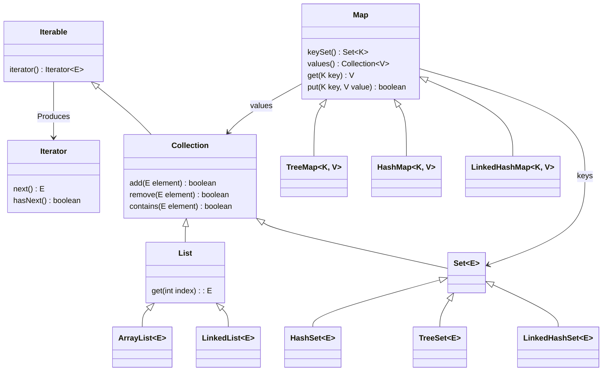

+++

title = "Progettazione e Sviluppo del Software"
description = "Progettazione e Sviluppo del Software, Tecnologie dei Sistemi Informatici"
outputs = ["Reveal"]
aliases = ["/collections/"]

+++

# Collezioni

{}

---

## Outline

### Goal della lezione
*  Illustrare la struttura del Java Collections Framework
*  Mostrare gli utilizzi delle funzonalità base
*  Discutere alcune tecniche di programmazione correlate

### Argomenti
*  Presentazione *Java Collections Framework*
*  Iteratori e foreach
*  Collezioni, Set, e Liste
*  Funzioni di utilità in `Arrays` e `Collections`
*  Implementazioni di `Set`, `List` e `Map`

---

# Java Collections Framework (JCF)

---

## Java Collections Framework

### Java Collections Framework (JCF)
*  È una libreria del linguaggio Java
*  È una parte del package `java.util`
*  Gestisce strutture dati (o collezioni) e relativi algoritmi

### Importanza pratica
*  Virtualmente ogni sistema fa uso di collezioni di oggetti
*  Conoscerne struttura e dettagli vi farà programmatori migliori

### Importanza didattica
*  Fornisce ottimi esempi di uso di composizione, ereditarietà, genericità
*  Mette in pratica pattern di programmazione di interesse
*  Impatta su alcuni aspetti del linguaggio da approfondire

---

## JCF -- struttura semplificata




---

## JCF -- alcuni aspetti generali

### È complessivamente piuttosto articolato
*  Un nostro obbiettivo è quello di isolare una sua sottoparte di interesse
*  Identificando e motivando le funzionalità prodotte

### Due categorie di collezioni, ognuna con varie incarnazioni
* `Collection` -- contenitore di elementi atomici; 2 sottotipi di collezioni
    1. `List` (sequenze)
    2. `Set` (no duplicazioni)
* `Map` -- contenitore di coppie chiave-valore (memoria associativa)

### Interfacce/classi di interesse:

*  Interfacce: `Collection`, `List`, `Set`, `Map`, `Iterator`, `Comparable`
*  Classi collection: `ArrayList`, `LinkedList`, `HashSet`, `TreeSet`, `HashMap`
*  Classi con funzionalità: `Collections`, `Arrays`

---

## Una nota su eccezioni e JCF

### Eccezioni: un argomento che tratteremo in dettaglio

Un meccanismo usato per gestire eventi ritenuti fuori dalla normale esecuzione (errori), ossia per dichiararli, lanciarli, intercettarli

### JCF e eccezioni
*  Ogni collection ha sue regole di funzionamento, e non ammette certe operazioni che richiedono controlli a tempo di esecuzione
    * ad esempio, certe collezioni sono immutabili, e non si può tentare di scriverci
    * oppure, non si può ottenere un elemento da una collezione vuota
*  Molti metodi dichiarano che possono lanciare eccezioni -- ma possiamo non preoccuparcene per ora

---

# Iteratori e foreach

---

## Foreach
### Costrutto foreach

*  Abbiamo visto che può essere usato per iterare su un array in modo più astratto (compatto, leggibile)

```java
for(int i: array) { ... }
```

*  Java fornisce anche un meccanismo per *usare il foreach su qualunque collection, in particolare, su qualunque oggetto che implementa l'interfaccia* `java.lang.Iterable<X>`

### `Iterable` e `Iterator`
*  L'interfaccia `Iterable` (contratto degli oggetti *iterabili*) ha un metodo per generare e restituire un (nuovo) `Iterator`
*  Un *iteratore* è un oggetto con metodi `next()`, `hasNext()` (e `remove()`)
*  Dato l'oggetto `coll` che implementa `Iterable<T>` allora il foreach diventa:

```java
for(final T element: coll) { ... }
```

---

## Interfacce per l'iterazione

```java
{}
```

```java
{}
```

```java
{}
```

---


## Interfacce per l'iterazione -- UML


  


---

## Iteratori e collezioni: preview

```java
{}
```

---

# Collection, List, Set

---

## Interfaccia `Collection<E>` (implementa `Iterable<E>`)
### Ruolo di questo tipo di dato
*  È la radice della gerarchia delle collezioni
*  Rappresenta gruppi di oggetti (duplicati/non, ordinati/non)
*  Implementata via sottointerfacce (`List` e `Set`)

### Assunzioni
*  Definisce *operazioni base* valide per tutte le collezioni
*  Assume implicitamente che ogni collezione abbia *due costruttori*
    *  *Senza argomenti*, che genera una collezione vuota
    *  *Che accetta una `Collection`*, dal quale prende tutti gli elementi
*  Le operazioni di *modifica* sono tutte *"opzionali"*
    *  potrebbero lanciare un `UnsupportedOperationException`
*  Tutte le operazioni di *ricerca* (e.g. `c.contains(o)`) lavorano sulla base del metodo `Object.equals()` da chiamare sugli elementi
    *  questo metodo accetta un `Object`, influendo su alcuni metodi di `Collection`

---

## `Collection`: estratto dell'interfaccia

```java
{}
```

---

## Usare le collezioni

* Nota: invocazione metodi dell'interfaccia `Collection`
* Interazione con array via ad es. `Arrays.asList()` e `Collection.toArray()`

```java
{}
```
---

## Creare collezioni (*immutabili*) -- Java 9+

- Metodi statici factory `.of(...)` e `.copyOf(c)` su `List`, `Set`, ...
    - Nota: `Arrays.ofList` visto precedentemente, invece, crea una lista mutabile (e consente valori `null`)

```java
{}
```

---

## `Set` e `List`: introduzione

### `Set`
*  Rappresenta collezioni *senza duplicati*
    *  nessuna coppia di elementi porta `Object.equals()` a dare `true`
    *  non vi sono due elementi `null`
    *  I metodi di modifica devono rispettare la non duplicazione
*  Non aggiunge metodi rispetto a `Collection`

### `List`

* Rappresenta *sequenze di elementi*
* Rispetto alle collezioni generiche:
    *  Ha metodi per accedere ad un elemento per *posizione* (0-based)

La scelta fra queste due tipologie non dipende da motivi di performance, ma da quale modello di collezione serva!

---

## `Set` e `List`: interfacce

```java
{}
```

```java
{}
```

---

## Uso di collezioni: linee guida generali

*  *In variabili, argomenti, tipi di ritorno, si usano le interfacce*
```java
void m(List<Integer> lst) {
    final Set<String> names = // Dichiaro Set, non HashSet o altra implementazione
}
```
*  *Le classi concrete solo in fase di istanziazione*, nella `new`, a parte casi molto particolari
```java
final Set<String> names = new HashSet<>();
```

---

# Implementazioni di `Set`

---

## Implementazioni di `Set`

### Caratteristiche dei set
* Nessun elemento duplicato (nel senso di `Object.equals()`)
* Veloce nella verifica della presenza di elementi
    * Mentre in un array bisogna verificare elemento-per-elemento (ricerca sequenziale),
    i `Set` possono avere prestazioni migliori
    * Si usa il metodo `Object.hashCode()` come funzione di *__hash__*,
    usata per posizionare gli elementi in uno store di elevate dimensioni

### Implementazione 1: `LinkedHashSet` e `HashSet`

* Non ordinati
* La versione `Linked` ha ordine di iterazione *predicibile* (quello degli elementi inseriti)

### Implementazione 2: `TreeSet`

* Gli elementi sono ordinati
* Richiede che gli elementi siano `Comparable`, oppure che venga fornito un `Comparator`

---

## (`Linked`)`HashSet`

### Idea di base: tecnica di hashing (via `Object.hashCode()`)
*  Si crea un array di elementi più grande del necessario (p.e. almeno il 25% in più), di dimensione `size`
*  Aggiunta di un elemento `e`
    *  lo si inserisce in posizione `e.hashCode() % size`
    *  se la posizione è già occupata, lo si inserisce nella prima disponibile
    *  se l'array si riempie va espanso e si deve fare il rehashing
*  Ricerca di un elemento `f`
    *  si guarda a partire da `f.hashCode() % size`, usando `Object.equals()`
    *  La funzione di hashing deve evitare il più possibile le collisioni
*  Risultato: scritture/letture sono $O(1)$ ammortizzato

### Dettagli interni
*  Realizzata tramite `HashMap`, che approfondiremo in futuro

---

## Costruttori di `HashSet`

```java
{}
```

---

## `equals()` e `hashCode()`

### La loro corretta implementazione è cruciale
*  Le classi di libreria di Java sono già OK
*  `Object` uguaglia lo stesso oggetto e l'hashing restituisce la posizione in memoria..
*  .. quindi nuove classi devono ridefinire `equals()` e `hashCode()` opportunamente

### Quale funzione di hashing?

* oggetti `equals` devono avere lo stesso `hashCode`
* non è detto il viceversa, ma è opportuno per avere buone performance di `HashSet`
* è possibile implementare un buon `hashCode()` sfruttando il metodo di libreria
   [`Objects.hash(Object...)`](https://docs.oracle.com/en/java/javase/17/docs/api/java.base/java/util/Objects.html#hash(java.lang.Object...))
    * andranno passati come argomenti tutti i campi che vengono controllati nella `equals`
    * ne esistono di migliori, per applicazioni che hanno bisogno di alte performance: (`djb2`, `murmur3`)

---

## `TreeSet<E>`

*  Assume che esista un *ordine totale* fra gli elementi
*  Quindi ogni elemento ha una sua *posizione* nell'elenco
*  Questo consente l'approccio dicotomico alla ricerca

### Realizzazione ordinamento: due approcci (interno o esterno)
*  O con elementi che implementano direttamente `Comparable`
    *  Nota che, p.e., `Integer` implementa `Comparable<Integer>`
*  O attraverso un `Comparator` esterno fornito alla `new`

### Implementazione `TreeSet`
*  Basata su red-black tree (albero binario bilanciato)
*  Tempo logaritmico per inserimento, cancellazione, e ricerca

---


## Comparazione "interna" agli elementi

```java
public interface Comparable<T> {
    /*
     * returns:
     * 0 if this is equal to other
     * positive int (1 is preferred) if this > other
     * negative int (-1 is preferred) if this < o
     */
    public int compareTo(T other);
}
```

Consente di definire una nozione di *ordine naturale* sugli oggetti di una classe

---

## Ordine naturale negli oggetti Java

Pre-implementato in molte classi di libreria (più di 100!)

```java
class Integer extends Number implements Comparable<Integer> { ... }
class String extends Object implements Comparable<String>, ... { ... }
```

Implementabile in modo personalizzato nelle nostre classi

```java
public class Person implements Comparable<Person> {
    private final int birthYear;
    private final String surname;
    /*
     * Sort by year, and if they are equal by name
     */
    public int compareTo(final Person other) {
        final var byYear = this.birthYear > other.birthYear
            ? 1
            : (this.birthYear < other.birthYear ? -1 : 0)
        // Alternatively, just:
        // final var byYear = Integer.compare(this.birthYear, other.birthYear)
        return byYear == 0 ? this.name.compareTo(other.name) : byYear;
    }
}
```

---

## Comparazione interna

```java
// String implements Comparable<String>
final var internal = new TreeSet<String>();
internal.add("zzz");
internal.add("lll");
internal.add("aaaaa");
internal.add("10");
internal.add("2");
// String uses lexicographical ordering!
System.out.println(internal); // [10, 2, aaaaa, lll, zzz]
```

Se a una collezione ordinata non è fornito un `Comparator` esterno specifico,
allora sfrutterà l'ordinamento naturale del tipo degli elementi
(quindi se il tipo `T` degli elementi non implementa `Comparable<? super T>`, un'eccezione verrà sollevata)

---

## Comparazione esterna

Va passato un comparatore personalizzato (una classe che implementa `Comparator`), due casi d'uso:
* Dobbiamo ordinare una collezione di elementi che **non** implementano `Comparable`
* Vogliamo ordinare in modo differente dall'ordine naturale

```java
public class StringByLength implements Comparator<String> {
    // Sort by length, then lexicographically
    public int compare(final String s1, final String s2) {
        final var byLength = Integer.compare(s1.length(), s2.length());
        return byLength == 0 ? s1.compareTo(s2) : byLength;
    }
}
```
```java
final var external = new TreeSet<String>(new StringByLength());
external.add("zzz");
external.add("lll");
external.add("aaaaa");
external.add("10");
external.add("2");
// Custom ordering!
System.out.println(external); // [2, 10, lll, zzz, aaaaa]
```

---

## Perché il tipo `Comparator<? super E>` (Approfondimento)

Data una classe `SortedSet<E>` il suo comparatore ha tipo `Comparator<? super E>`, perché non semplicemente `Comparator<E>`?

### È corretto
*  `Comparator` ha metodi che hanno `E` solo come argomento
*  quindi l'uso di `Comparator<? super E>` è una generalizzazione di `Comparator<E>`

### È utile
*  Supponiamo di aver costruito un comparatore per `SimpleLamp`, e che questo sia usabile anche per tutte le specializzazioni successivamente costruite (è la situazione tipica)
*  Anche un `SortedSet<UnlimitedLamp>` deve poter usare il `Comparator<SimpleLamp>`, ma questo è possibile solo grazie al suo tipo atteso `Comparator<? super E>`

---

# Implementazioni di `List`

---

## `List`

```java
{}
```
---

## Implementazioni di `List`

### Caratteristiche delle liste
*  Sono sequenze: ogni elemento ha una posizione
* $\rightarrow$ Il problema fondamentale è realizzare i metodi posizionali in modo efficiente,
considerando il fatto che la lista può modificare le proprie dimensioni nel tempo
(altrimenti andrebbe bene un array)

### Approccio 1: `ArrayList`
* Internamente usa un array di elementi con capacità maggiore di quella al momento necessaria.
* Se serve ulteriore spazio si alloca trasparentemente un nuovo e più grande array

### Approccio 2: `LinkedList`
* Usa una double-linked list con riferimento alla dimensione della lista, al primo e all'ultimo elemento
* Usata abbastanza raramente
    * Anche dal suo autore... https://twitter.com/joshbloch/status/583813919019573248?lang=en

---

## `ArrayList`

### Caratteristiche di performance
*  Lettura/scrittura in data posizione sono a tempo costante
*  La `add()` è tempo costante ammortizzato, ossia, $n$ add si effettuano in $O(n)$
*  Tutte le altre operazioni sono a tempo lineare

### Funzionalità aggiuntive
Per migliorare le performance (e l'occupazione in memoria) in taluni casi l'utente esperto può usare funzioni aggiuntive
*  Specificare la dimensione iniziale dell'array interno nella `new`
*  `trimToSize()` e `ensureCapacity()` per modifiche in itinere

---

## `LinkedList`

lista doppiamente linkata (che può essere traversata dall'inizio o dalla fine)

### Caratteristiche di performance
*  Accesso e modifica in una data posizione hanno costo lineare
*  Operazioni in testa o coda, quindi, sono a tempo costante
*  Usa in generale meglio la memoria rispetto `ArrayList`
*  (di norma però si preferisce `ArrayList`)

### Funzionalità aggiuntive
*  Implementa anche l'interfaccia `Deque`,
usata per rappresentare una coda bidirezionale
(*double-ended queue*), potenzialmente con dimensione limitata

---

## `LinkedList`: funzioni aggiuntive relative a code (e stack)


```java
{}
```

```java
{}
```

---

## `LinkedList`: costruzione


```java
{}
```

---

## `UseLinkedList`

```java
{}
```

---

# Altre classi di utilità: `Arrays` e `Collections`

---

## Classi di utilità (moduli): `Arrays` e `Collections`

### `java.util.Arrays`
*  Contiene varie funzionalità d'ausilio alla gestione degli array
*  In genere ha varie versione dei metodi per ogni array di tipo primitivo
*  *Ricerca* (`binarySearch()`), *ordinamento* (quicksort, `sort()`), *copia* (`copyOf()`), riempimento (`fill()`)
*  Operazioni base (`toString`, `equals`, `hashCode`), anche ricorsive

### `java.util.Collections`
*  Raccoglie metodi statici che sarebbero potuti appartenere alle varie classi/interfacce viste
*  *Ricerca* (binaria/dicotomica), *ordinamento* (quicksort), *copia*, fill, frequency, min, max, sublist, replace, reverse, rotate, shuffle
*  Con esempi notevoli d'uso delle wilcard

---

## `Arrays`: qualche esempio di metodi

```java
{}
```

---

## `UseArrays`: qualche esempio di applicazione

```java
{}
```

---

## `Collections`: qualche esempio di metodi

```java
{}
```

---

## `UseCollections`: qualche esempio di applicazione

```java
{}
```

---

# `java.util.Map`
# mappe associative (o dizionari)

---

## `Map`

- Una **mappa** (anche detta **mappa associativa** o **dizionario**) è una corrispondenza tra **chiavi** e **valori**, dove le chiavi (e quindi le coppie) formano un set (non ci sono chiavi duplicate)

```java
{}
```

---

## Implementazioni notevoli di `Map`

### `Map<K,V>`
*  Rappresenta una funzione dal dominio `K` in `V`
*  La mappa tiene tutte le associazioni (o "entry")
*  Non posso esistere due entry con stessa chiave (`Object.equals`)

### `HashMap`
*  Sostanzialmente un `HashSet` di coppie `Key`, `Value`
*  L'accesso ad un valore tramite la chiave è fatto con hashing
*  Accesso a tempo costante, a discapito di overhead in memoria

### `LinkedHashMap`
* Come sopra, ma l'ordine di iterazione è *predicibile* (è l'ordine di inserimento)

### `TreeMap`
*  Sostanzialmente un `TreeSet` di coppie `Key`, `Value`
*  L'accesso ad un valore tramite la chiave è fatto con red-black tree
*  Accesso in tempo logaritmico
*  Le chiavi devono essere ordinate, come per i `TreeSet`

---

## Usare le mappe

```java
{}
```


---


# Collezioni

{}
