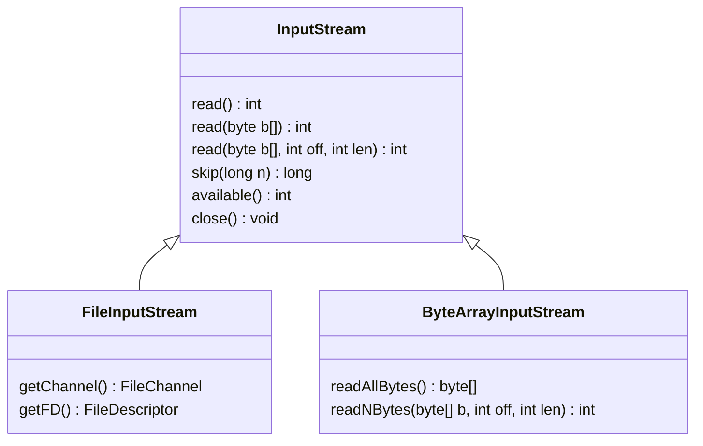

+++

title = "Progettazione e Sviluppo del Software"
description = "Progettazione e Sviluppo del Software, Tecnologie dei Sistemi Informatici"
outputs = ["Reveal"]
aliases = ["/io/"]

+++

# Input/Output

{}


---

## Outline

### Goal della lezione
* Illustrare le API fornite da Java per l'I/O
* Descrivere alcune scelte progettuali e pattern
* Mostrare esempi di applicazione

### Argomenti
* Classi per gestire file
* Classi per gestire Stream (di input/output)
* Classi per gestire file di testo
* Pattern Decorator

---

## Il problema dell'Input/Output

### Uno dei problemi fondamentali per un sistema operativo
*  Gestire le comunicazioni fra CPU e dispositivi affacciati sul BUS
  * Console, tastiera, mouse, dischi, rete, sensori, schermo
* Vi sono varie modalità di interazione possibili
  * sequenziale, random-access, buffered, per carattere/linea/byte/oggetto
* I sistemi operativi offrono vari meccanismi
  * file, I/O control interface, socket per il networking, video driver

### La libreria `java.io.*`
*  Fornisce i concetti di File e Stream di dati
*  Consente una gestione flessibile dei vari aspetti
*  È estesa con la libreria `java.nio`
*  È la base di librerie avanzate (networking,..), anche di terze parti (Jackson, Gson, ...)
*  I/O con l'utente in ambiente a finestre è realizzato con le GUI

---

# File e loro proprietà

---

## I File

### File system
* Il file system è un modulo del S.O. che gestisce la memoria secondaria
* Maschera le diversità di dispositivi fisici (HD, CD, DVD, BR, SSD,..)
* Maschera le diversità di contenuti informativi (testi, filmati, archivi,..)
* Fornisce meccanismi per fornire prestazioni, concorrenza, robustezza

### File
* Un file system contiene un insieme di *__file__*
* Un file ha un contenuto informativo che si esprime come sequenza di byte
  * interpretabili in vario modo (testi, programmi, strutture dati)
  * potrebbe essere un file virtuale, che mappa un dispositivo
  * un caso particolare è la **directory** (ossia una tabella di ID di file)
  * può avere specifici diritti di accesso (sola lettura, lettura/scrittura, eseguibilità...)
* Le **directory** consentono un'organizzazione gerarchica (ogni file ha un percorso o *path*)

---

## La classe `java.io.File`

### Usi
* Serve a *identificare* un preciso file su file systems
* Permette di ottenere *informazioni* varie sul file
* Permette di effettuare alcune operazioni sull'intero file
  * cancellazione
  * spostamento (rinominazione)
* Permette di impostare alcune proprietà (se eseguibile, se scrivibile)
* Permette di ottenere informazioni generali sul file system
* Permette di creare cartelle
* $\Rightarrow$ *non include operazioni per accedere al suo contenuto*, ma vi si potrà agganciare uno *stream*

---

## Classe `java.io.File`: pt1

```java
{}
```
---

## Classe `java.io.File`: pt2

```java
{}
```

---

## Esempio di utilizzo di File: cercare file con una certa enstensione dentro una directory

```java
{}
```

---

## Accedere al contenuto di un file

### Come fare?
* Un file ha un contenuto informativo (potenzialmente di grosse dimensioni)
* Lo si potrebbe leggere (in vari modi)
* Lo si potrebbe scrivere (in vari modi)
* Il suo contenuto potrebbe essere interpretabile in vari modi

### Alcuni di tali concetti sono condivisi con altri meccanismi
* Risorse interne al classpath Java
* Networking e file di rete
* Archivi su database
* Depositi di informazione in memoria


#### Il concetto di *__input/output-stream__* è usato come astrazione unificante

---

# Input/OutputStream

---

## Overview sugli `InputStream` e `OutputStream` in Java

### `InputStream` e `OutputStream`
* Stream = flusso (di dati)
* Di base, gestiscono flussi binari (di `byte`) leggibili vs. scrivibili
* Sono classi astratte (e non interfacce..)
* Possono essere specializzate da "sottoclassi" e "decorazioni", tra cui
  * Per diverse sorgenti e destinazioni di informazione
    * su file (`File`(`In`|`Out`)`putStream`)
    * su memoria (`ByteArray`(`In`|`Out`)`putStream`)
  * Per tipo di informazione:
    * valori primitivi (`Data`(`In`|`Out`)`putStream`)
    * interi oggetti Java (`Object`(`In`|`Out`)`putStream`)
    * archivi compressi (`Zip`(`In`|`Out`)`putStream`)

### Tipicamente usati per alimentare altre classi

*  File di testo (`Reader`, `Writer`, e specializzazioni)
  *  Librerie avanzate comunemente usate per l'accesso al file system tipicamente hanno metodi che accettano (`In`|`Out`)`putStream`

---

## La classe `java.io.InputStream`

```java
public abstract class InputStream implements Closeable {
    // Reads the next byte (0 to 255, -1 is end-of-stream)
    public abstract int read() throws IOException;

    public int read(byte b[]) throws IOException {...}

    public int read(byte b[], int off, int len) throws IOException {...}

    public long skip(long n) throws IOException {...}

    public int available() throws IOException {...}

    public void close() throws IOException {...}

    public synchronized void mark(int readlimit) {...}

    public synchronized void reset() throws IOException {...}

    public boolean markSupported() {...}
}
```

---


## `FileInputStream` e `ByteArrayInputStream`



---

## Uso di `ByteArrayInputStream`
### `ByteArrayInputStream`
* crea un `InputStream` a partire da un `byte[]`

```java
{}
```

---

## Il costrutto `try-with-resources`
* vuole la creazione di un `java.lang.AutoCloseable` come primo argomento
* ne assicura la chiusura
* si possono opzionalmente aggiungere delle `catch` di eccezioni
* è il modo preferibile di utilizzare risorse in Java!

```java
{}
```

---

## Esempio `StreamDumper`

```java
{}
```

---

## `UseStreamDumper` -- uso uniforme di vari `InputStream`

```java
{}
import ...

{}
```

---

## La classe `java.io.OutputStream`

```java
public abstract class OutputStream implements Closeable, Flushable{
    /**
     * ...
     * The byte to be written is the eight low-order bits of the argument <code>b</code>.
     * The 24 high-order bits of <code>b</code> are ignored.
     *
     * 0x000000FF writes byte 0xFF (255)
     * 0xFFFFFFFF writes byte 0xFF (255)
     * 0x12345678 writes byte 0x78 (120)
     */
    public abstract void write(int b) throws IOException;

    public void write(byte b[]) throws IOException {...}

    public void write(byte b[], int off, int len) throws IOException {...}

    public void flush() throws IOException {...}

    public void close() throws IOException {...}
}
```

### Stream di uscita -- Duale all'`InputStream`

*  Esistono anche le analoghe specializzazioni `ByteArrayOutputStream` e `FileOutputStream`

---

## `UseOutputStream`

```java
{}
```

---

## Solo `byte`?

* Vorremmo poter leggere e scrivere formati dati diversi
  * Ad esempio testi
  * Oppure avere dei flussi di dati che vengono compressi

### Il concetto di decoratore

Per ottenere questo risultato, si "circonda" l'(`In`|`Out`)`putStream` con un altro,
che si occupa di aggiungere funzionalità:
* *tradurre* un certo tipo di dati (ad esempio testo) da/a sequenza di byte
* *modificare il formato* della sequenza di byte (ad esempio, (de)comprimendo il flusso in formato zip)
* lasciando inalterato il flusso, modificarne la gestione
(ad esempio, registrando statistiche o aggiungendo un buffer per migliorare le performance)

Ad sempio, si definisce `Buffered`(`In`|`Out`)`putStream` che estende (`In`|`Out`)`putStream` aggiungendo un buffer intermedio
* `Buffered`(`In`|`Out`)`putStream` fa da *wrapper* per un altro (`In`|`Out`)`putStream` al quale delega le operazioni
* `Buffered`(`In`|`Out`)`putStream` è quindi un **decoratore** per (`In`|`Out`)`putStream`
  * ne modifica il funzionamento senza modificarlo!

Con questa tecnica è possibile *decorare* qualunque (`In`|`Out`)`putStream`!

---

## Decorazione, in generale

<!-- ```mermaid
classDiagram
class Component {
  +operation()
}
class ConcreteComponent {
  +operation()
}
class Decorator {
  -component: Component
  +operation()
}
class ConcreteDecorator {
  +operation()
}
Component <|-- ConcreteComponent
Component <|-- Decorator
Component --o Decorator
Decorator <|-- ConcreteDecorator
``` -->

[](https://mermaid.live/edit#pako:eNqNkTEOwyAMRa-CPLVquADq1tygK4sFThsp4IjAUKW5e1GihrRZsmH78f-XPYJhS6DAdDgMdYuPgE77uRI3dj178lGM2gtx4Z4Cxpb96az9VChvAkU6RtdkOLc5LJQ031-q2B0w-5PZ0SXM9S3lPuOOWAW3Eyl5OyimP6JrGypwFBy2Ni90zqUhPsmRBpWflhpMXdSQE2YUU-T7yxtQMSSqIPUWs9hyAlANdgNNH94AlqM)

---

## Decorazione, il caso di `BufferedInputStream`

<!-- ```mermaid
classDiagram-v2

class ByteArrayOutputStream {
  +ByteArrayOutputStream() ByteArrayOutputStream
  +ByteArrayOutputStream(int) ByteArrayOutputStream
  size() int
  toByteArray() byte[]
  writeBytes(byte[]) void
  writeTo(OutputStream) void
}


class FileOutputStream {
  +FileOutputStream(String) FileOutputStream
  +FileOutputStream(File) FileOutputStream
  +FileOutputStream(FileDescriptor) FileOutputStream
  +getFD() FileDescriptor
  +getChannel() FileChannel
}

class OutputStream {
  +OutputStream() OutputStream
  +close() void
  +flush() void
  +write(byte[]) void
  +write(byte[], int, int) void
  +write(int) void
}
<<Abstract>> OutputStream

class FilterOutputStream {
  #out: OutputStream
  +flush(): void
  +read() int
  +read(byte[]) int
  +read(byte[], int, int) int
  +skip(long) long
}
<<Abstract>> FilterOutputStream

class DeflaterOutputStream {
  +DeflaterOutputStream(OutputStream) DeflaterOutputStream
  +DeflaterOutputStream(OutputStream,Deflater) DeflaterOutputStream
  #deflate() void
}
<<Abstract>> DeflaterOutputStream

class BufferedOutputStream {
  +BufferedOutputStream(OutputStream) BufferedOutputStream
  +BufferedOutputStream(OutputStream, int) BufferedOutputStream
}

class PrintStream {
  +PrintStream(File, Charset) PrintStream
  +PrintStream(OutputStream, boolean, Charset) PrintStream
  +PrintStream(String, Charset) PrintStream
  +format(Locale, String, Object[]) PrintStream
  +print(Object)
  +printf(Locale, String, Object[]) PrintStream
  +println(Object)
}

class ZipOutputStream {
  +ZipOutputStream(OutputStreamout) ZipOutputStream
  +ZipOutputStream(OutputStream, Charset) ZipOutputStream
  setComment(String) void
  setMethod(int) void
  setLevel(int) void
  putNextEntry(ZipEntry) void
  closeEntry() void
}

OutputStream <|-- FileOutputStream
OutputStream <|-- ByteArrayOutputStream
OutputStream <|-- FilterOutputStream
OutputStream --o FilterOutputStream
FilterOutputStream <|-- BufferedOutputStream
FilterOutputStream <|-- PrintStream
FilterOutputStream <|-- DeflaterOutputStream
DeflaterOutputStream <|-- ZipOutputStream
``` -->

[](https://mermaid.live/edit#pako:eNqVVktz0zAQ_ise9eJMkgtHT6YzpaGnQpkpJzAHxV4nAlnyyHIglP53Vn7ED61Dekms_b5d7dt-YYlOgUUskbwst4LvDc_Xx3exilUtCt6fLNwZw09PlS0q-2wN8Dx4iVUQLEksXNA6FzSEsheUSvEH0CiS3MnqMxGFO3z-9t3JfxlhwUFl2AgXwVGL9Ax90eHQcIe-uki7WB-EBCLMqTjEP6H2C49Ps53gLdwtlIkRhdVmRmsP9mEbNmBP7qD7A1cKZIu3pzbQJkwixEkBvSsTqUtXhC6ly0xW5WEoqJPspX4kXrka1j8eYSBDRzebu11pDU_s7e3El0GpLBg_khtd2cj3v3U36u9FKO27qjl23hPCoe8dXP4URSi16wT367vuO9kHsIVMcjKEJQVNmpeiXKe76hjzRm7SBgjnSkIrnjdGlWVgIKUWBgFNIqMo1-m21aENDNr_Mw7v2K2BpJ7AVYBjY0pAawPIo44v32ktgasrdZsVcoGcaZNzGz7qhDuHOv7T7gck1jXpVKFw57DBF70ke6sJqXojg6x9FQVR0Il0lBKcxMVU7b9Kg4wQqii_13kOGGi3g7uBRugj2INOw9F-QfEjHHEdjqRo9BP8th-UNacQ76kferjedg04ek-MErD5u14T-9nnzLzYSGPeUI1Y67UmScQybG4mR2GOPeqGORI9-uQyq_mTIrIVywEbW6T4zVG3UMzsAXKIWYSPuHh4JW3MMOFI5ZXVzyeVsMiaClasKlK8pf1KYVHGZQmv_wCwXzaG)

---

## Decoratori

### Pro e contro
*  Sono un mix di polimorfismo e incapsulamento
*  Consentono di comporre funzionalità in modo piuttosto flessibile
*  Danno luogo a più flessibilità rispetto all'ereditarietà
*  Più complicati da usare e comprendere

### Con gli (`In`|`Out`)`putStream`, è possibile comporre:
*  Uno stream di sorgente/destinazione dati
  * `File`(`In`|`Out`)`putStream`, `ByteArray`(`In`|`Out`)`putStream`
*  Uno (o più) stream di gestione interna: `Buffer`(`In`|`Out`)`putStream`, ..
*  Uno stream di presentazione dati:
  * `PrintStream`, formato stringhe testuali
  * `DataInputStream`, dati grezzi (non visto)
  * `ObjectInputStream`, interi oggetti (non visto)

---

## Decoratori in azione

Scrittura di testo su file

[](https://mermaid.live/edit#pako:eNplUDFuwzAM_AqhyQWSIRk9ZGnRqUCKZuiihbaYRIVFGRIVxAjy99KQkbYoF1LHI3mnm-mjI9OaU8LxDG8flkEjl64C78mzHCQRhtqZI8VN8xz5Qkky7Lsv6jVLBOV5PmVAdiBn4hnrJiHAlHDKT382wHq907z9AR9HX_1A-yJj-Xe5zm6bz-SFMkSGo3J_LSZ29fEork2Pw5BhnJ3AiDmrRpW4CF9mr4ucjWWzMoFSQO_0W25z2xp1E8iaVktHRyyDWGP5rlQsEg8T96aVVGhlyuhQ6MWjWgkVvH8DgNBxIg)

Scrittura di testo su file in modo bufferizzato

[](https://mermaid.live/edit#pako:eNp1UcFuwjAM_RUrpyKVA4hTDzts006TmMZhl17cxoWg1omchFEh_n3pWhUxNF_sPD_72c5F1VaTKtRe0B3g_bNkSOZjNQIfYjjsghB2Y2YwsavsxfKJJHjYVkeqkw8WEs_w3gOyhnAgHrCqDwQogr1f3HWA5fIp-fUNnEWfY9OQkN7G4OKD-li_zkaWH5TgW0wgn4PpnNhTGgIcSWOlQ65p8VA7aW_uE7P-m2npf-2xxyb7-tUEy9Ak_h8RYn0D5sccnLMa29aDG84LDr0fZkaerjk1O09zrkpWueoorWN0-qvLkC5VWryjUhUp1NRgbEOpSr4mKsZgdz3XqggSKVfRaQz0ajDt16miwdbT9QdD2JwT)

Stesse chiamate lato cliente, basta costruire la catena di decoratori in modo opportuno!

---

## File ed encoding
### Il contenuto dei file
Supponiamo utilizziate un `FileOutputStream` per scrivere in sequenza i numeri da 0 a 20(escluso)
* Che cosa avete realmente scritto?
* avete scritto i byte da zero a 19
* In esadecimale, `0x000102030405060708090A0B0C0D0E0F10111213`
* **Non** avete scritto il testo `012345678910111213141516171819`

#### I file sono sequenze di byte

Per fare input/output occorre stabilire:
  * Una conversione dalla struttura dati che stiamo manipolando a sequenza di byte (*encoding*)
  * Una conversione da sequenza di byte a struttura dati (*decoding*)

---

## Cosa succede se ignoro l'encoding?
```java
{}
```

---

## Esecuzione

```sh
Writing...
0 1 2 3 4 ... 255 256 257 258 259 260 261 262 263 264 265 266 267 268 269 270 271 272 ... Done.
Reading...
0 1 2 3 4 ... 255 0 1 2 3 4 5 6 7 8 9 10 11 12 13 14 15 16 ... Done.
Actual file content:
 
 !"#$%&'()*+,-./0123456789:;<=>?@ABCDEFGHIJKLMNOPQRSTUVWXYZ
[\]^_`abcdefghijklmnopqrstuvwxyz{|}~����������������������������������������������������
���������������������������������������������������������������������������� 
 !"#$%&'()*+,-./0123456789:;<=>?@ABCDEFGHIJKLMNOPQRSTUVWXYZ
[\]^_`abcdefghijklmnopqrstuvwxyz{|}~����������������������������������������������������
���������������������������������������������������������������������������� 
 !"#$%&'()*+,-./0123456789:;<=>?@ABCDEFGHIJKLMNOPQRSTUVWXYZ
[\]^_`abcdefghijklmnopqrstuvwxyz{|}~����������������������������������������������������
���������������������������������������������������������������������������� 
 !"#$%&'()*+,-./0123456789:;<=>?@ABCDEFGHIJKLMNOPQRSTUVWXYZ
[\]^_`abcdefghijklmnopqrstuvwxyz{|}~����������������������������������������������������
����������������������������������������������������
```

**Non avete scritto testo!**

Avete scritto il valore in `byte` della parte *meno significativa* degli interi che avete passato
* Per questo in lettura "riparte" da `0` dopo `255` (massimo valore di un byte senza segno)
* Per questo, se letto come stringa, vi trovate un testo non comprensibile!
  * Non avete scritto caratteri di testo, avete scritto bytes!
  * E nessuno ha spiegato come convertire da/a testo

---

## Conversione da byte a testo

Per interpretare i byte come sequenza di caratteri,
occorre usare una *tabella di conversione*
(**character encoding**, `Charset` in Java)

#### Nota
* si applica anche importante anche alla rappresentazione **in memoria** dei caratteri!
* La memoria contiene `byte`, se vediamo delle stringhe di testo è perchè avviene un *encoding*

### Formati notevoli di character encoding
* **ASCII** (RFC 20)
  * l'encoding che usa il linguaggio C per i `char`
  * 1 byte per carattere (massimo 256 caratteri)
* **UTF-8** (RFC 3629)
  * Standard di fatto sul web e per il codice, *encoding da usare per sorgenti Java*
  * da 1 a 4 byte per carattere
  * Codifica 1.112.064 simboli
* **UTF-16** (RFC 2781)
  * Encoding in memoria delle `String` in Java
  * 2 o 4 byte per carattere
  * Codifica 1.112.064 simboli
* **ISO/IEC 8859-1:1998** o semplicemente **ISO Latin**
  * Encoding di default del testo in Windows

---

## Stream di caratteri: `Reader` e `Writer`

(`In`|`Out`)`putStream`s sono pensati per gestire direttamente byte, non caratteri.

Molto spesso abbiamo però bisogno di leggere o scrivere stringhe di testo!

`Reader` e `Writer` sono pensati per gestire "stream di caratteri" invece che stream di `byte`
* Noi ci interesseremo solo di `Reader`:
per la scrittura in formato carattere possiamo infatti usare `PrintStream`
  * (che, purtroppo, non ha un omologo stream di input)

---

## Esempio con `InputStreamReader`

```java
{}
```

---

## Utility `Files`

Nella maggior parte dei casi,
vogliamo salvare e caricare i nostri dati scrivendo e leggendo un intero file.
* Scrivere una stringa di testo in un file
* Leggere un file di testo riga per riga
* Scrivere un binario che abbiamo convertito in `byte[]` (ad esempio un'immagine)

La classe `Files` contiene diversi metodi convenienti per leggere e scrivere file con poco codice:

* `Paths.get(String)` ottiene un oggetto di tipo `Path` da un nome
  * simile al costruttore di `File` `File(String)`
* `Files.write(Path, byte[])` scrive un array di `byte` dentro il `Path`
* `Files.write(Path, Iterable<? extends Charsequence>, Charset)` scrive una collezione di stringhe dentro il `Path`,
  traducendo le stringhe in `byte` usando il `Charset` fornito
* `Files.writeString(Path, String, Charset)` scrive una collezione di stringhe dentro il `Path`,
  traducendo le stringhe in `byte` usando il `Charset` fornito
* `byte[] Files.readAllBytes(Path)` legge il contenuto di `Path` e lo restituisce come `byte[]`
* `List<String> Files.readAllLines(Path, Charsets)` legge il contenuto di `Path` e lo restituisce come `List<String>`,
  una stringa per ogni linea,
  interpretando i `byte` del file come testo usando il `Charset` fornito
* `String Files.readString(Path, Charsets)` legge il contenuto di `Path` e lo restituisce come singola String,
  interpretando i `byte` del file come testo usando il `Charset` fornito

---

## Esempio d'uso di `Files`

```java
{}
```

---

# Caricamento da classpath

---

## Organizzazione di un progetto Gradle con risorse

```text
├── src
│   ├── main
│   │   ├── java
│   │   └── resources
│   └── test
│       ├── java
│       └── resources
├── build.gradle.kts
└── settings.gradle.kts
```


* Le cartelle `src/[main|test]/resources` contengono le risorse del progetto opportunamente organizzate
    * Per risorse si intendono icone, file di testo, video, immagini, modelli 3D e qualunque cosa sia necessaria al corretto funzionamento del programma ma non sia una libreria o un file sorgente.
* Il contenuto di `resources` **diventa parte del classpath**!
  * viene anche copiato nel file Jar finale
  * $\Rightarrow$ dobbiamo imparare a caricare quelle risorse direttamente dal jar
  * Potremo così dare solo il nostro jar dell'applicazione, senza ulteriori risorse

---

<!-- write-here "shared-slides/java/it-classpath-resources.md" -->

<!-- end-write -->

---

# Standard per la serializzazione di oggetti

---

## Formati standard per la serializzazione di oggetti

Per scrivere oggetti (a parte le `String`),
abbiamo bisogno di convertire gli oggetti in `byte[]` o in `String`
(*serializzare*),
ossia nei formati che sappiamo scrivere.

Allo stesso modo, sapendo leggere solo `byte[]` oppure `String`,
dovremo avere modo di *deserializzare* questi flussi in oggetti

Esistono sistemi di conversione sia binaria
(oggetto $\xrightarrow{\text{serializzazione}}$ `byte[]` $\xrightarrow{\text{deserializzazione}}$ oggetto)
* ad esempio, ProtocolBuffers

che testuale
(oggetto $\xrightarrow{\text{serializzazione}}$ `String` $\xrightarrow{\text{deserializzazione}}$ oggetto)
* JavaScript Object Notation -- JSON (RFC 7159)
  * Nato in seno a JavaScript (che non c'entra nulla con Java)
  * Molto usato in ambito web
  * Librerie Java Jackson e Guava
* YAML Ain't Markup Language -- YAML
  * Superset di JSON dalla versione 1.2
  * Supporto per funzioni avanzate (e.g. anchoring)
  * Molto usato per file di configurazione complessi

Standard testuali sono più *facilmente leggibili*,
e, laddove le prestazioni e lo spazio non siano stringenti, preferiti
