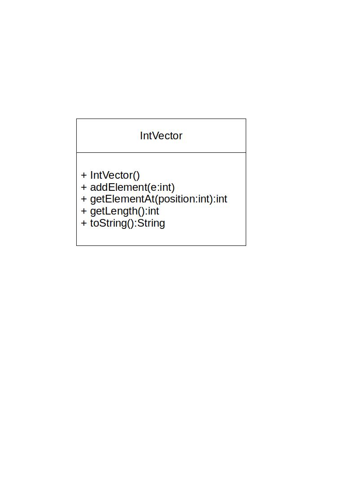
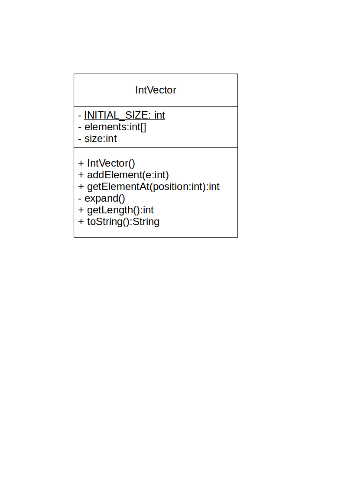
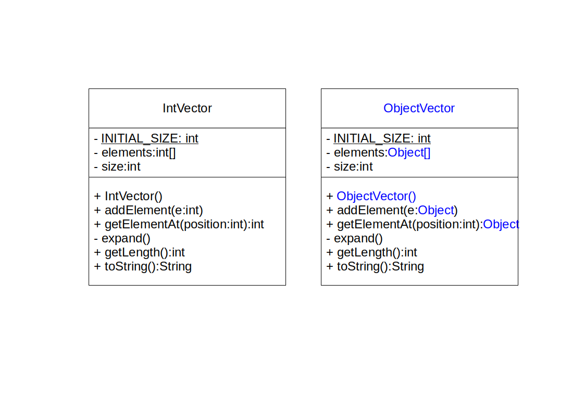

+++

title = "Progettazione e Sviluppo del Software"
description = "Progettazione e Sviluppo del Software, Tecnologie dei Sistemi Informatici"
outputs = ["Reveal"]
aliases = ["/generics/"]

+++

# Generici

{}


---


## Outline


  
### Goal della lezione


*  Illustrare il *problema delle collezioni polimorfiche*
*  Discutere il concetto di *polimorfismo parametrico*
*  Illustrare i *Generici* di Java e alcuni loro vari dettagli
  


  
### Argomenti


*  Collezioni con polimorfismo inclusivo
*  Classi generiche
*  Interfacce generiche
*  Metodi generici
  


---

# Collezioni con polimorfismo inclusivo


## Forme di **riuso** nella programmazione OO


  
### Composizione (e come caso particolare, delegazione)


Un oggetto è ottenuto per composizione di oggetti di altre classi
  

  
### Estensione (ereditarietà)


Una nuova classe è ottenuta riusando il codice di una classe pre-esistente

### Polimorfismo inclusivo (subtyping)

Una funzionalità realizzata per lavorare su valori/oggetti del tipo `A`,
può lavorare con qualunque valore/oggetto del sottotipo `B` 
(p.e., se `B` estende la classe `A`, o se `B` implementa l'interfaccia `A`)

### Polimorfismo parametrico (Java/C\# generics, C++ templates,..)

Una funzionalità (classe o metodo) 
generica è costruita in modo tale da lavorare uniformemente su valori/oggetti indipendentemente dal loro tipo: 
tale tipo diventa quindi una sorta di parametro addizionale

---


## Astrazioni uniformi con le classi


  
### Astrazioni uniformi per problemi ricorrenti

* Si consideri il *problema specifico* del controllo dell'accensione di varie tipologie di dispositivi
    * Tale funzionalità si può fattorizzare ad esempio in una classe astratta `Device`
* Durante lo sviluppo di vari sistemi si incontrano *problemi generali/ricorrenti* che possono trovare una soluzione comune
* Spesso tali soluzioni sono *fattorizzabili in una o più interfacce/classi altamente riusabili* (per astrazione)
    * **Fattorizzare = mettere a fattor comune**, si pensi alla matematica $AB + AC = A(B + C)$
  
  
### Un caso fondamentale: le *__collection__*


*  Una *collection* è un *oggetto* il cui compito è quello di immagazzinare i *riferimenti* ad un numero (tipicamente non precisato) di altri oggetti 
    *  Fra i suoi compiti c'è quello di consentire *modifiche ed accessi veloci* all'insieme di elementi di tale collezioni
    *  Varie strategie possono essere utilizzate, seguendo la *teoria/pratica degli algoritmi e delle strutture dati*
  


---


## Un esempio: `IntVector`


  
### Collection `IntVector`


  *  Contiene *serie numeriche (**vettori**)* di dimensione non nota a priori, ossia, a *lunghezza variabile*..
  


  


---


## `UseIntVector`


  
```java
{}
```


---


## `IntVector` -- implementazione


  
### Collection `IntVector`


  *  Contiene serie numeriche (vettori) di dimensione non nota a priori
  *  Realizzata *componendo un array che viene espanso all'occorrenza*
  


  


---


## `IntVector` pt 1


  
```java
{}
```


---


## `IntVector` pt 2


  
```java
{}
```


---


## Un primo passo verso l'uniformità


  
### Solo elenchi di `int`?


  *  L'esperienza porterebbe subito alla necessità di progettare vettori di `float`, `double`, `boolean`, ... ossia di ogni tipo primitivo
  *  E poi, anche vettori di `String`, `Date`, eccetera
  *  L'implementazione sarebbe analoga, ma senza possibilità di riuso..
  


  
### Collection uniformi "monomorfiche"


  *  Una prima soluzione del problema la si ottiene sfruttando il polimorfismo inclusivo e la filosofia "everything is an object" (incluso l'uso dell'autoboxing dei tipi primitivi)
  *  Si realizza unicamente un `ObjectVector`, semplicemente sostituendo `int` con `Object`
  *  Si inserisce qualunque elemento (via upcast implicito)
      * `ObjectVector` è *monomorfica* in quanto "vede" un solo tipo, `Object` (sebbene i riferimenti agli `Object` siano *polimorfici*)
  *  Quando si riottiene un valore serve un downcast esplicito


---


## Da `IntVector` a `ObjectVector`


  


---


## `UseObjectVector`

* NOTA: **necessità di downcast espliciti**
  

{}

```java
{}
```

{}

---


## La necessità di un approccio a polimorfismo parametrico


  
### Prima di Java 5


  *  Questo era l'approccio standard alla costruzione di collection
  *  Java Collection Framework --- una libreria fondamentale
  


  
### Problema


*  Con questo approccio, nel codice Java risultavano molti usi di oggetti simili a `ObjectVector` o `ObjectList`
*  Si perdeva molto facilmente traccia di quale fosse il contenuto..
    *  contenevano oggetti vari? solo degli `Integer`? solo delle `String`?
*  Il codice conteneva spesso dei downcast sbagliati, e quindi molte applicazioni Java fallivano generando dei `ClassCastException`
  


  
### Più in generale


Il problema si manifesta ogni volta che voglio collezionare oggetti il cui tipo non è noto a priori, ma potrebbe essere soggetto a polimorfismo inclusivo
  


---


## Polimorfismo parametrico


### Idea di base


  *  Dato un frammento di codice `F` che lavora su un certo tipo, diciamo `String`, se può lavorare *in modo uniforme* su altri tipi...
  *  ... allora lo si rende parametrico, sostituendo a `String` una sorta di variabile o parametro `X` (chiamata *__type variable__* o *__type parameter__*, ossia una variabile/parametro che denota un tipo)
      *  A questo punto, quando serve il frammento di codice istanziato sulle stringhe, si usa `F<String>`, ossia si richiede che `X` diventi `String`
      *  Quando serve il frammento di codice istanziato sugli Integer, si usa `F<Integer>`
      * Il codice che usa tale **polimorfismo parametrico** è *uniforme* (cioè non cambia) indipendentemente dalle istanziazioni dei tipi 
  
### Java Generics


*  I **generici** sono un meccanismo *compile-time* basato su *parametri di tipo* per implementare *polimorfismo parametrico*
*  *Classi/interfacce/metodi generici*: classi/interfacce/metodi parametrizzate su tipi, cioè che accettano tipi come parametri
*  Nessun impatto a run-time, per via dell'implementazione a "erasure"
    *  `javac` "compila via i generici", quindi la JVM non li vede


---


# Classi generiche

---


## La classe generica `Vector<X>`

* `Vector` si dice che è un **tipo parametrico** (in quanto accetta il "parametro di tipo" `X`)

```java
{}
```

---


## Uso di una classe generica

* Si istanzia il **parametro di tipo** generico `X` in un tipo specifico (**argomento di tipo**), ad es. `Integer`
  
```java
{}
```


---


## Terminologia, e elementi essenziali


  
### Data una classe generica `C<X,Y>`..

  *  `C` è detta **tipo parametrico**
  *  `X` e `Y` sono dette le sue *__type-variable__* o **parametri di tipo**
  *  `X` e `Y` possono essere usati come un qualunque tipo dentro la classe (con alcune limitazioni che vedremo)
  


  
### I clienti delle classi generiche


*  Devono usare *tipi specifici* ottenuti dai *__tipi generici__*, ovvero versioni "istanziate" delle classi generiche
    *  `C<String,Integer>`, `C<C<Object,Object>,Object>`
    *  Non `C` senza parametri, altrimenti vengono segnalati dei warning
*  Ogni type-variable va sostituita con un tipo effettivo, ossia con un *__argomento di tipo__*, che può essere
    *  una classe (non-generica), p.e. `Object`, `String`,..
    *  una type-variable definita, p.e. `X,Y` (usate dentro la classe `C<X,Y>`)
    *  un tipo generico completamente istanziato, p.e. `C<Object,Object>`
    *  ..o  parzialmente istanziato, p.e. `C<Object,X>` (in `C<X,Y>`)
    *  *NON con un tipo primitivo*


---


## Implementazione di `Vector` pt 1

* Nota: in Java NON si può istanziare un array di tipo generico: `new X[10]` (errore statico)

```java
{}
```

---


## Implementazione di `Vector` pt 2


```java
{}
```

---


## La classe generica `Pair<X,Y>`


```java
{}
```


---


## Uso di `Pair<X,Y>`

{}

```java
{}
```

{}

---


## Inferenza dei parametri


  
### Un problema sintattico dei generici


  *  Tendono a rendere il codice più pesante ("verbose")
  *  Obbligano a scrivere i parametri anche dove ovvi, con ripetizioni
  


  
### L'algoritmo di *type-inference* nel compilatore


  *  Nella `new` si possono tentare di omettere i parametri (istanziazione delle type-variable), indicando il *"diamond symbol"* `<>`
  *  Il compilatore cerca di capire quali siano questi parametri guardando gli argomenti della `new` e l'eventuale contesto dentro il quale la `new` è posizionata, per esempio, se assegnata ad una variabile
  *  Nel raro caso in cui non ci riuscisse, segnalerebbe un errore a tempo di compilazione.. quindi tanto vale provare!
  *  Ricordarsi `<>`, altrimenti viene confuso con un *__raw type__*, un meccanismo usato per gestire il legacy con le versioni precedenti di Java
    


  
### La local variable type inference (`var`)

  *  in genere è alternativa al simbolo `<>`

---


## Esempi di inferenza

{}

```java
{}
```

{}

---

## Conseguenze dell'uso dei generici

Coi generici, Java diventa un linguaggio molto più espressivo!

* Il linguaggio risulta più sofisticato, e quindi più espressivo, ma anche più complesso
* Codice più sicuro (safe) -- il compilatore segnala errori difficili da trovare altrimenti
* *Maggiore riusabilità*
* Se ben usati, rendono il codice più comprensibile
* Se non ben usati, possono minare la comprensibilità del software

---


# Interfacce generiche

---

## Interfacce generiche

### Cosa è una interfaccia generica

* È una interfaccia che dichiara parametri di tipo: `interface I<X,Y> { ... }`
* I parametri di tipo compaiono nei metodi definiti dall'interfaccia
* Quando una classe la implementa deve istanziare i parametri di tipo <!-- (o assegnarle ad altre type-variable se essa stessa è generica) -->

### Utilizzi

Per creare *contratti uniformi rispetto ai tipi utilizzati*

### Un esempio notevole, gli **iteratori**

* Un *iteratore* è un oggetto usato per accedere ad una sequenza di elementi
    * Ne vedremo ora una versione semplificata -- diversa da quella delle librerie Java

---

## L'interfaccia `Iterator`

```java
{}
```

---

## Implementazione 1: `IntRangeIterator`

```java
{}
```

---

## Implementazione 2: `VectorIterator`


```java
{}
```

---


## `UseIterators`: nota l'accesso uniforme!


```java
{}
```

---


# Metodi generici

---


## Metodi generici


  
### Metodo generico


Un metodo che lavora su qualche argomento e/o valore di ritorno in modo independente dal suo tipo effettivo. Tale tipo viene quindi astratto in una type-variable del metodo.
  

  
### Sintassi

* definizione: `<X1, ..., Xn> ReturnType nomeMetodo(ArgType1 argName1, ...) { ... }`
* chiamata: `receiver.<X1, ..., Xn>nomeMetodo(ArgType1 argName1, ...)`
* chiamata con inferenza (uso tipico): `receiver.nomeMetodo(ArgType1 argName1, ...)`

### Generici a livello di classe e metodo

* I *metodi istanza* possono vedere i parametri di tipo della classe che li ospita
* I *metodi `static`* **non** possono vedere i parametri di tipo della classe che li ospita
    * in quanto non legati ad una istanza, ma alla classe stessa
* Entrambi i tipi di metodi possono essere generici, dichiarando le proprie variabili di tipo,
  che avranno visibilità solo all'interno del metodo stesso
    * È molto più frequente vedere metodi `static` generici
    * In effetti tipicamente i metodi istanza lavorano tipicamente usando i generici della classe

---

## Definizione di un metodo generico `static` e suo utilizzo

```java
{}
```

---

## Definizione di metodi generico *istanza* e loro utilizzo

```java
{}
```

---

# Covarianza, contravarianza, wildcards

---

## Java Wildcards

### Osservazione

* In generale, dato un tipo `C<T>`, se `S` è sottotipo di `T`, **non** vale che `C<S>` è sottotipo di `C<T>`
    * Esempio: `Student extends Person` non implica che `Vector<Student>` estenda `Vector<Person>`
        * Se lo estendesse, ogni chiamata a metodi di `Vector<Person>` sarebbe valida anche per `Vector<Student>`
        * Incluso il metodo `add(Person p)`
        * Ma se posso aggiungere un `Person` ad un `Vector<Student>`, starei violando la sicurezza dei tipi!
* Questo comportamento è detto **invarianza** dei generici in Java
* A volte è utile poter esprimere relazioni di sottotipo fra tipi generici
    * Sia del tipo "qualunque sottotipo di T" (*covarianza*), tipicamente in lettura
        * Ad esempio, un `Vector` di un sottotipo non noto di `Number`
            * Non potrò aggiungere nulla, ma potrò leggere `Number`
    * Sia del tipo "qualunque supertipo di T" (*contravarianza*), tipicamente in scrittura
        * Ad esempio, un `Vector` di un supertipo non noto di `Double`
            * Potrò aggiungere `Double`, ma non potrò leggere nulla di più specifico di `Object`

### Java Wildcards

* Un meccanismo che fornisce dei nuovi tipi, chiamati Wildcards 
* Simili a interfacce (non generano oggetti, descrivono solo contratti)
* Generalmente usati come tipo dell'argomento di metodi

---

## Java Wildcards

### 3 tipi di wildcard
* Bounded (covariante): `C<? extends T>`
    * accetta un qualunque `C<S>` con `S` sottotipo di `T`
* Bounded (contravariante): `C<? super T>`
    * accetta un qualunque `C<S>` con `S` supertipo di `T`
* Unbounded: `C<?>`
    * accetta un qualunque `C<S>`

### *Uso* delle librerie che dichiarano tipi wildcard
* Piuttosto semplice, basta passare un argomento compatibile o si ha un errore a tempo di compilazione

### *Progettazione* di librerie che usano tipi wildcard
* Molto avanzato: le wildcard pongono limiti alle operazioni che uno può eseguire, derivanti dal principio di sostituibilità

---

## Esempio Wildcard 1 (unbounded)


  
```java
{}
```
---

## Esempio Wildcard 2 (bounded)


  
```java
{}
```

---

## Esempio Wildcard 3 (bounded, limitazioni)

```java
{}
```

---

## Interpretazione come Input / Output

Un modo più intuitivo di interpretare le wildcard è quello di considerare i tipi generici come
*produttori* o *consumatori* di valori del tipo specificato.

* In diversi linguaggi (fra cui C# e Kotlin) questo concetto è formalizzato con le keywords `in` e `out`.
    * In Kotlin o C#, ad esempio, si dichiara la covarianza di un tipo generico `C` con `C<out T>`, e la contravarianza con `C<in T>`.
    * L'equivalente in Java sarebbe `C<? extends T>` per la covarianza e `C<? super T>` per la contravarianza.

### Ne consegue che:

* `Vector<? extends Number>` si può leggere "`Vector` che può **fornire** ma *non accettare* `Number`"
    * come per `Vector<out Number>` in Kotlin o C#, dove la keyword `out` è usata per specificare parametri di tipo covarianti
* `Vector<? super Number>` si può leggere "`Vector` che può **accettare** ma *non fornire* `Number`"
    * come per `Vector<in Number>` in Kotlin o C#, dove la keyword `in` è usata per specificare parametri di tipo contravarianti

---

# Generici

{}