+++

title = "Progettazione e Sviluppo del Software"
description = "Progettazione e Sviluppo del Software, Tecnologie dei Sistemi Informatici"
outputs = ["Reveal"]
aliases = ["/guis-swing/"]

+++

# Interfacce utente grafiche (GUI) con Swing

{}


---


## Outline


  
### Goal della lezione


*  Illustrare la libreria Java Swing
*  Fornire pattern di progettazione per le GUI


  
### Argomenti


*  Libreria *Swing*
    *  Panoramica dei concetti, meccanismi, e costrutti principali
*  La gestione degli eventi nelle GUI ed elementi di *programmazione ad eventi*
*  Organizzazione *MVC* delle GUI


---

# Introduzione alle GUI

---

## Graphical User Interfaces (GUI)


  
### GUI


*  *Interfacce grafiche per l'interazione con l'utente*
    *  Ritenute più semplici da utilizzare rispetto alle *CUI (Console User Interfaces)*
*  Sfruttano la possibilità di disegnare più o meno arbitrariamente i pixel della matrice dello schermo
*  Oltre allo schermo possono sfruttare altri dispositivi: mouse, tastiera,..
*  Si appoggiano su *astrazioni grafiche* (pulsanti, icone, finestre)


  
### Gestione delle GUI in Java


*  **Abstract Window Toolkit (AWT)** in Java 1 e 2 -- basso livello
*  **Java Swing** in Java >= 5
    * Costruito sopra AWT
*  Alternative: **JavaFX** (consigliato per applicazioni moderne), SWT (usato da Eclipse) 


---


## AWT e Swing: UML


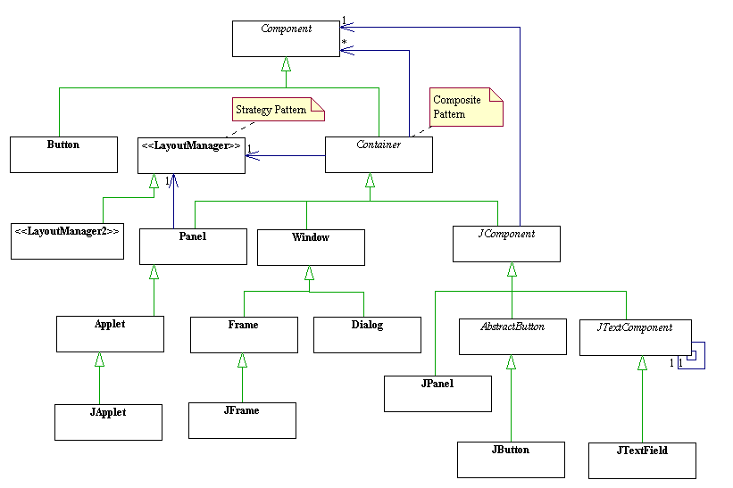


---


## AWT, Swing e concetti principali


    
### I due package


*  `java.awt`: Classi base e implementazioni supportate dal S.O.

    *  non molto utili da guardare in dettaglio
    *  fornisce comunque l'architettura base

*  `javax.swing`: implementazioni gestite "pixel per pixel"

    *  le classi `J*` e quelle sottostanti


    
### Alcune classi base di Swing


*  `JWindow`: componente piazzabile nel desktop (senza cornice)
*  `JFrame`: finestra con "cornice" (menù, barra, icone chiusura)
*  `JPanel`: pannello di componenti inseribili in un `JFrame`
*  `JComponent`: componente (pulsante, etichetta, campo di testo, ...)
*  `JDialog`: finestra di dialogo
    


---


## Concetti principali


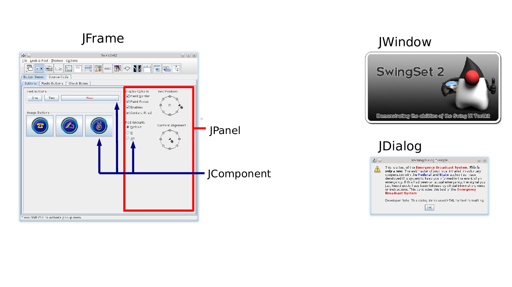


---


## Un primo esempio

{}
    
```java
{}
```

{}


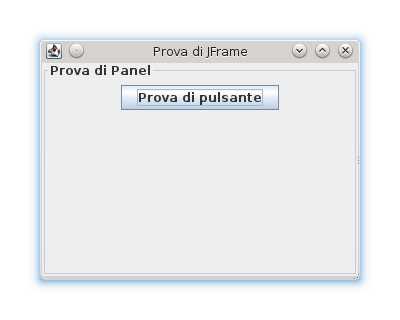


---


## Vari `JComponent` disponibili..


    
```java
{}
```


---


## Classi di Swing


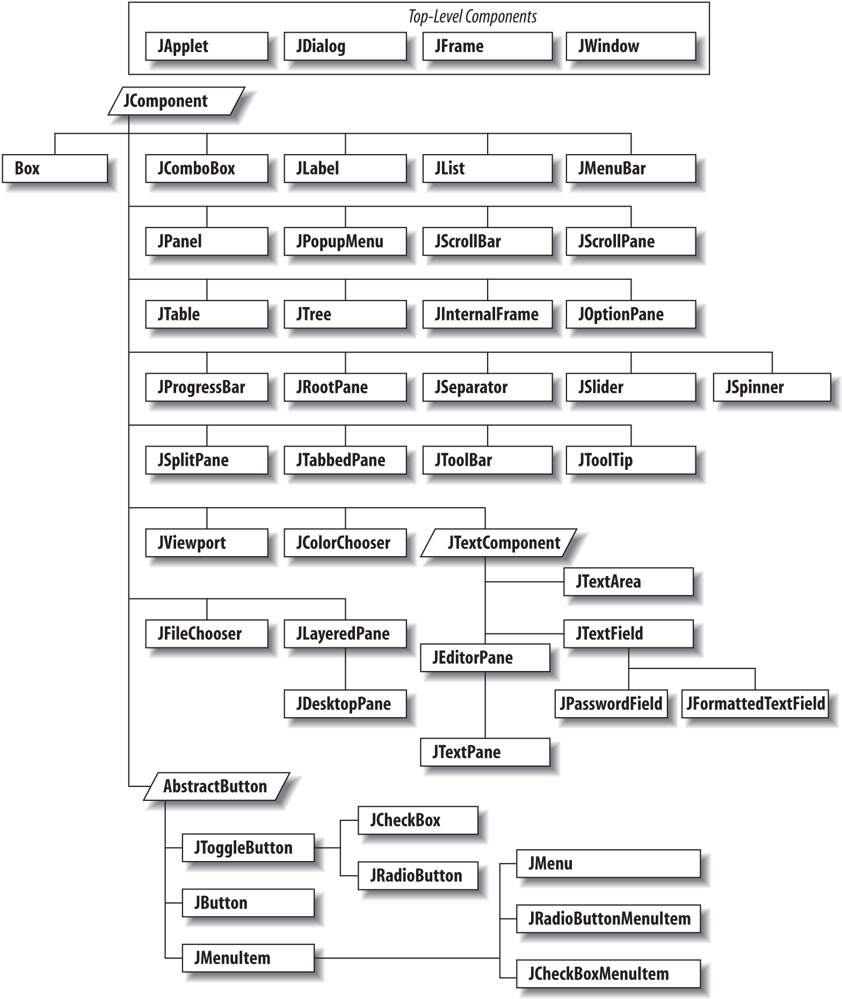


---


## Materiale da consultare


    
### Collezione di riferimenti utili


*  JavaDoc delle librerie:

    *  `http://docs.oracle.com/javase/8/docs/api`

*  Tutorial ufficiali:

    *  `http://docs.oracle.com/javase/tutorial/uiswing/`


    
### Nota

*  Questa lezione illustra le tecniche principali
*  Occasionalmente mostreremo il funzionamento di vari componenti
*  Costruire GUI efficaci (e avanzate) richiede però conoscenze ulteriori ottenibili all'occorrenza dai riferimenti di cui sopra


---

# Il layout dei pannelli

---

## Il problema del Layout di un pannello


    
### Problema


*  Intervenire sulla politica di dislocazione dei componenti
*  Scegliere politiche indipendenti dalle dimensioni della finestra
*  Organizzare tali selezioni con una buona organizzazione OO


    
### La classe `LayoutManager` e il pattern "Strategy"


*  Al pannello si passa un oggetto di `LayoutManager`
*  È lui che incapsula la strategia di inserimento dei componenti
*  Vari casi: `FlowLayout` (default), `BorderLayout`, `GridBagLayout`,.. (tipicamente da comporre tra loro)
*  Vedere: [http://docs.oracle.com/javase/tutorial/uiswing/layout/visual.html](http://docs.oracle.com/javase/tutorial/uiswing/layout/visual.html)
*  Il metodo `add()` di `JPanel` accetta un ulteriore argomento (`Object` o `int`) usato dal Layout Manager


---


## Senza Layout -- deprecabile


   


<div class="container">
<div class="col">
   
```java
{}
```

</div>
<div class="col">

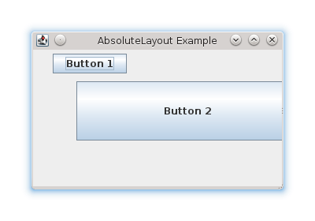

</div>
</div>


---


## `BorderLayout`

<div class="container">
<div class="col">
   
```java
{}
```

</div>
<div class="col">


</div>
</div>

---


## Lavorare specializzando `JFrame`: `MyFrame`


   
```java
{}
```


---


## Nuova versione `UseBorderLayout2`


<div class="container">
<div class="col">
   
```java
{}
```

</div>
<div class="col">


</div>
</div>


---


## Qualche modifica: `UseBorderLayout3`


<div class="container">
<div class="col">
   
```java
{}
```

</div>
<div class="col">


</div>
</div>

---


## `FlowLayout`


<div class="container">
<div class="col">
   
```java
{}
```

</div>
<div class="col">

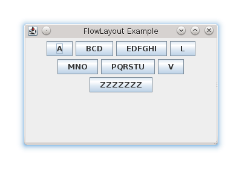

</div>
</div>


   

---


## Un uso combinato di `FlowLayout` e `BorderLayout`


<div class="container">
<div class="col">
   
```java
{}
```

</div>
<div class="col">


</div>
</div>


---


## Altro uso combinato + `GridBagLayout`


   

<div class="container">
<div class="col">
   
{}

```java
{}
```

{}


</div>
<div class="col">

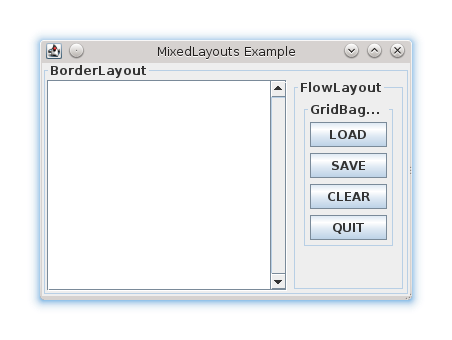

</div>
</div>

---


## Lavorare incapsulando il frame dentro una classe


   
### L'indipendenza dalla tecnologia delle GUI


*  sarà importante costruire GUI in modo che le scelte di basso livello dettate da Swing siano ben nascosti
*  così da tenere tutto il sistema ben organizzato e ad alto livello


   
### Tipica tecnica


*  si disegni una interfaccia pulita per la guida
*  i dettagli implementativi al solito siano delegati ad una classe che implementa


---


   
```java
{}
```

   
```java
{}
```


---


   
```java
{}
```


---


# La gestione degli eventi nelle GUI

---


## La gestione degli eventi


    
### Come rendere le interfacce "vive"?


*  come programmare la possibilità di intercettare le varie azioni che un utente potrebbe compiere sull'interfaccia, ossia la parte "input"?
*  al solito, sarebbe necessario uno strumento altamente configurabile e ben organizzato


    
### Il pattern Observer


*  È possibile "registrare" nei componenti degli oggetti "ascoltatori" (*__listeners__*)
*  Quando certi eventi accadono, il componente richiama un metodo dei listener registrati
*  Tale metodo contiene il codice da eseguire in risposta all'evento
*  Si assume (per ora) che tale codice arrivi "velocemente" a compimento


---


## Il pattern *__Observer__*


*  `Subject` è la sorgente degli eventi
*  `Observer` si registra con la `Subject#attach(o:Observer)`
*  Quando accade l'evento, `Subject` chiama `Observer#notify(e:Event)`


---


### Il caso dei click sui pulsanti: 3 classi

```java
// E' il subject degli eventi
class JButton ... {
   /* Sets the action command string that gets sent as part of the
     * `ActionEvent` when the button is triggered. */
    void setActionCommand(String s) { ... }
    void addActionListener(ActionListener listener) { ... }
    void removeActionListener(ActionListener listener) { ... }
}

// Interfaccia da implementare per ascoltare gli eventi
interface ActionListener ... {
    void actionPerformed(ActionEvent e);
}

// Classe per rappresentare un evento
class ActionEvent ... {
    String	getActionCommand() { ... }
    long	getWhen() { ... }
    ...
}
```

---


## Catturare gli eventi dei pulsanti con `ActionCommand`


   
```java
{}
```

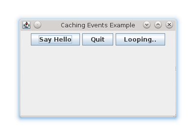


---


## Corrispondente listener, come classe esterna


   
```java
{}
```


---


## Versione incapsulata (inner listener + source eventi)

{}
   
```java
{}
```

{}

---


## Listeners come classi anonime


   
```java
{}
```

---

## Listeners come lambda


   
```java
{}
```


---


## Panoramica eventi-listeners


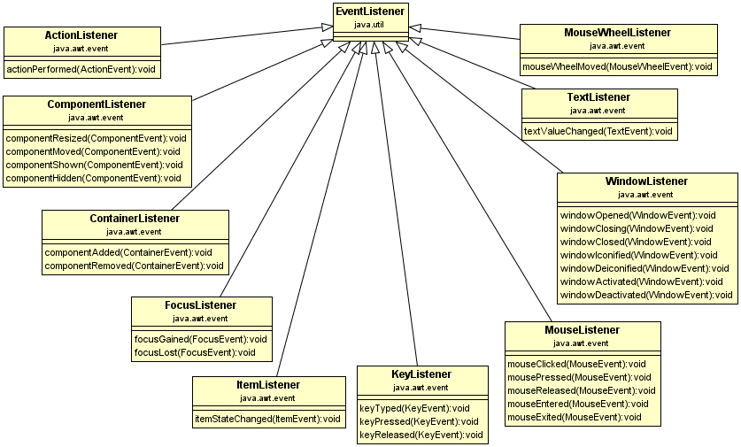


---


## Sulla gestione degli eventi


    
### Il flusso di controllo con le GUI di Swing


*  Quando si crea un `JFrame`, la JVM crea l'**Event Dispatch Thread (EDT)**
*  Quindi l'applicazione non termina quando il `main` completa
*  Quando un evento si verifica la JVM fa eseguire il corrispondente codice all'EDT
*  Ecco perché la GUI non risponde a nuovi eventi finché uno precedente non è stato gestito
*  Per gestire con migliore flessibilità le GUI servono meccanismi di programmazione concorrente


    


---


# Alcune funzionalità avanzate delle GUI

---

## GUI con I/O: listeners che modificano l'interfaccia


<div class="container">
<div class="col">
   
{}

```java
{}
```

{}


</div>
<div class="col">

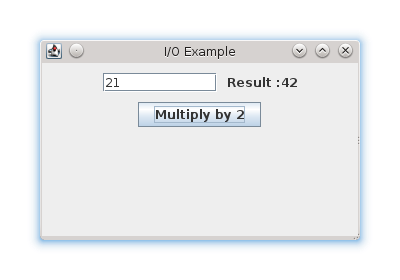

</div>
</div>


---


## GUI con Layout dinamico


<div class="container">
<div class="col">
   
{}

```java
{}
```

{}


</div>
<div class="col">

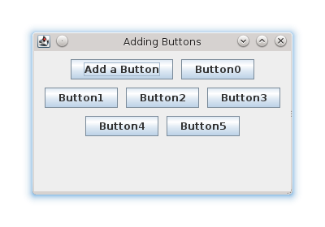

</div>
</div>


---


## Uso di un pannello come Canvas


<div class="container">
<div class="col">
   
{}

```java
{}
```

{}


</div>
<div class="col">

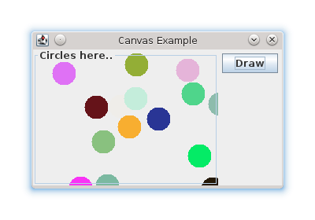

</div>
</div>


---


## La classe `DrawPanel`

{}
   
```java
{}
```

{}

---


## Uso delle finestre di dialogo


<div class="container">
<div class="col">
   
{}

```java
{}
```

{}


</div>
<div class="col">

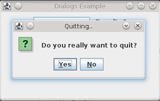

</div>
</div>

---


## Le GUI builder


    
### Cosa sono?


*  Sono sistemi software usabili per creare il codice che genera le interfacce
*  Permettono una descrizione WYSIWYG (What you see is what you get)
*  Spesso non sono particolarmente semplici da  usare
*  Con un po' di esperienza e una buona conoscenza delle librerie sottostanti, possono essere usati con successo
*  Se li si usasse, si deve però anche comprendere (e criticare) il codice che producono


---


## WindowBuilder: un plugin per Eclipse


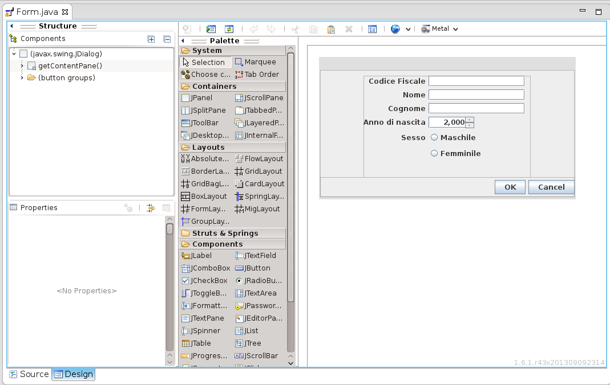


---


# Organizzazione applicazioni grafiche con MVC

---


## Il pattern architetturale MVC


  
### MVC -- divide l'applicazione in 3 parti


*  `Model`: modello OO del dominio applicativo del sistema
*  `View`: gestisce le interazioni con l'utente (input e output)
*  `Controller`: gestisce il coordinamento fra Model e View


---


## Applicazione del MVC


    
### Sulla costruzione di applicazioni con GUI


*  Specialmente se non esperti, possono essere alquanto laboriose
*  Usare un approccio strutturato sembra richiedere più tempo nel complesso, ma in realtà porta a soluzione più facilmente modificabili e controllabili


    
### Alcune linee guida


*  Usare il pattern MVC per la struttura generale
*  Identificate le varie "interazioni", e quindi costruire le interfacce dei vari componenti bene fin dall'inizio
*  Cercare massima indipendenza fra i vari componenti (interfacce con meno metodi possibile)
*  Costruire e testare modello e GUI separatamente (M e V), poi collegare il tutto col controllore (C) che risulterà particolarmente esile
*  Per la GUI eventualmente usare un GUI Builder


---


## MVC con le GUI: un esempio di struttura


---


## Componenti e loro interazioni


    
### MVC


*  `Model`: incapsula dati e logica relativi al dominio della applicazione
*  `View`: incapsula la GUI, le sue sottoparti, e la logica di notifica
*  `Controller`: intercetta gli eventi della View, comanda le modifiche al modello, cambia di conseguenza la View


    
### Interfacce -- nomi da modificare in una applicazione concreta


*  `ModelInterface`: letture/modifiche da parte del Controller
*  `ViewObserver`: comandi inviati dalla view al controller (`void`)
*  `ViewInterface`: comandi per settare la view, notifiche a fronte dei comandi (errori..)


---


## Un esempio di applicazione: `DrawNumber`


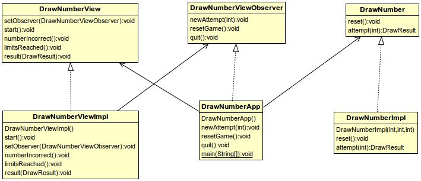


---


## Interfaccia del model: `DrawNumber`


```java
{}
```


```java
{}
```


```java
{}
```


---


## Implementazione del model: `DrawNumberImpl` (1/2)


```java
{}
```


---


## Implementazione del model: `DrawNumberImpl` (2/2)


```java
{}
```


---


## Interfacce della view: `DrawNumberView`


```java
{}
```


```java
{}
```


---


## Implementazione della view: `DrawNumberViewImpl` (1/3)


```java
{}
```


---


## Implementazione della view: `DrawNumberViewImpl` (2/3)


```java
{}
```


---


## Implementazione della view: `DrawNumberViewImpl` (3/3)


```java
{}
```


---


## Implementazione del controller: `DrawNumberApp` (1/2)


```java
{}
```


---


## Implementazione del controller: `DrawNumberApp` (2/2)


```java
{}
```


---


## Linee guida generali consigliate su MVC


   
### Metodologia proposta


*  progettare le 3 interfacce

    *  M: metodi di "dominio", chiamati da C
    *  C: metodi (`void`) chiamati da V, esprimono "azioni utente"
    *  V: metodi (`void`) chiamati da C, esprimono richieste di visualizzazione


*  la tecnologia scelta per le GUI sia interna a V, e mai menzionata altrove o nelle interfacce
*  implementare separatamente M, V e C, poi comporre e testare
*  in progetti reali, M, V e C si compongono di varie parti


   
### Aspetti


*  MVC è implementato in vari modi, o esiste in diverse varianti
    - Model-View-ViewModel (MVVM), Model-View-Presenter (MVP), ...
*  l'approccio proposto è particolarmente indicato per la sua semplicità
*  si usino altri approcci se non peggiorativi

---


# Interfacce utente grafiche (GUI) con Swing

{}
