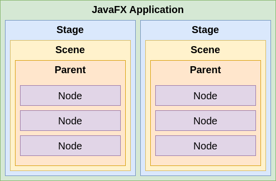

+++

title = "Progettazione e Sviluppo del Software"
description = "Progettazione e Sviluppo del Software, Tecnologie dei Sistemi Informatici"
outputs = ["Reveal"]
aliases = ["/guis-javafx/"]

+++

# Interfacce utente grafiche (GUI) con JavaFX

{}

---

## Premessa

### Obiettivi della lezione

- Introdurre la libreria *JavaFX*
- Attraverso essa, introdurre allo sviluppo di interfacce grafiche utente, *Graphical User Interface (GUI)*
- Gettare le basi per la possibilità di un approfondimento autonomo

### Argomenti

- Elementi principali di applicazioni JavaFX (applicazione, stage, scene, layout, nodi)
- Elementi avanzati: data binding

### Riferimenti

- [https://github.com/unibo-lptsi-pss/pss-javafx](https://github.com/unibo-lptsi-pss/pss-javafx)
- *Learn JavaFX 17. Kishori Sharan and Peter Späth (Apress, 2022)* ([repo](https://github.com/Apress/learn-javafx17))
- [JavaFX JavaDoc](https://openjfx.io/javadoc/17/)

---

## Introduzione a JavaFX

---

### JavaFX

* Libreria Java per la creazione di GUI per Rich Applications multi-piattaforma

    * Disponibile dal 2008 (v. 1.0 -- 2.2) come libreria stand-alone
    * Presente "*stabilmente*" nel JDK da Java 8 (v. JavaFX 8)
    * ~~Introdotto ufficialmente in Java con l'idea di sostituire (gradualmente) Swing~~
    * Torna ad essere una *libreria stand-alone da Java 11*:
    è opensource e parte del progetto OpenJDK -- [https://openjfx.io](https://openjfx.io)

<!-- 
* Propone un look-and-feel personalizzabile

    * La descrizione dello stile/aspetto dei componenti della GUI è separato dalla relativa implementazione
    * Fornisce costrutti che promuovono il pattern MVC

-->

* Consente la creazione di GUI moderne, di qualità e ben adattabili a qualunque piattaforma e supporto hardware


---

## JavaFX: funzionalità principali

### Java APIs

* Libreria che include classi e interfacce scritte in Java <!-- e compilato con retro compatibilità fino a Java 7 -->
* Nel 2025, la versione più recente, *JavaFX 25*, richiede *JDK >= 23*


### FXML (e CSS per lo stile)

* **FXML** è un linguaggio dichiarativo per definire la GUI di un'applicazione JavaFX-based
* **CSS** è un linguaggio flessibile per specificare lo stile di elementi della GUI
* Il loro impiego non è indispensabile, ma fortemente consigliato per una buona *separazione dei concern*
* Noi in questo corso non li tratteremo (e non vi chiederemo di usarli)

### MVC-friendly

* Attraverso *proprietà osservabili* e *data binding*


---


### Graphics API


* Supporto nativo per la grafica 3D (geometrie, camere, luci)
* Abilita la possibilità di disegnare direttamente sulla superficie (canvas) dell'applicazione


### Supporto per schermi Multi-touch e Hi-DPI


* Fornisce il supporto per funzionalità  multi-touch (cf. `SwipeEvent`), in funzione della piattaforma in cui l'applicazione è in esecuzione
* Garantisce una buona visualizzazione della GUI anche su schermi ad alta densità di pixel


---

## Astrazioni fondamentali


### Stage


* Il contenitore (esterno) dove la GUI sarà visualizzata (ad es., una finestra del S.O.)
* [javafx.stage.Stage](https://openjfx.io/javadoc/15/javafx.graphics/javafx/stage/Stage.html), sottoclasse di `Window` 


### Scene


* Una **scene** rappresenta un contenuto (una *pagina* della GUI) visualizzabile sullo `Stage`
    * ogni `Stage` può mostrare una sola `Scene` alla volta: si imposta via `Stage#setScene(Scene)`
* [javafx.scene.Scene](https://openjfx.io/javadoc/15/javafx.graphics/javafx/scene/Scene.html) contiene il cosiddetto *scene graph*, impostabile attraverso `Scene#setRoot(Parent)`


---


### Application


* Un'**applicazione JavaFX** si definisce estendendo [javafx.application.Application](https://openjfx.io/javadoc/15/javafx.graphics/javafx/application/Application.html)
    * Consente di definire metodi hook sul ciclo di vita dell'applicazione (`init`, `start`, `stop`, ...)
    * Tipicamente, si opera ridefinendo `start(Stage)` che riceve lo stage primario


#### Esempio: GUI vuota

```java
public class App extends javafx.application.Application {
    @Override
    public void start(Stage stage) throws Exception {
        Group root = new Group();
        Scene scene = new Scene(root, 500, 300);
        stage.setTitle("JavaFX Demo");
        stage.setScene(scene);
        stage.show();
    }

    public static void run(String[] args) {
        launch(args);
    }
}
```

---

### Applicazione JavaFX: runner


```java
void main(String[] args) {
    App.run(args);
}
```

* ATTENZIONE: per motivi tecnici che non approfondiremo, definire il metodo `main()` dentro la classe `App` (che estende `Application`) può risultare nel seguente errore: *"Error: JavaFX runtime components are missing, and are required to run this application"* (richiederebbe l'aggiunta di JavaFX al module path all'avvio dell'applicazione)
* Di conseguenza, si consiglia di definire `main` in una *classe separata da quella dell'applicazione JavaFX*


---

### Ciclo di vita di applicazioni JavaFX


L'avvio mediante `Application.launch(App.class)` comporta:


1. Avvio del runtime JavaFX <!-- %(se necessario) -->
    - comporta la creazione di vari thread, tra cui il *JavaFX Application Thread*
2. Istanziazione di `App` (la classe specificata che estende `Application`) 
3. Invocazione metodo `init()`
3. Invocazione metodo `start(javafx.stage.Stage)` dell'applicazione
4. Attesa terminazione applicazione 
	  - (a) mediante `Platform.exit()` 
	  - (b) chiusura dell'ultima finestra (e `Platform.isImplicitExit()` è true)
5. Invocazione metodo `stop()` dell'applicazione

---

### `Node`


* Un **nodo** è un elemento/componente della scena
    * Ciascun nodo ha sia la parte di view (aspetto) sia la parte di controller (comportamento)
    * Hanno **proprietà** (con supporto al *binding*) e possono generare **eventi**
    * Possono essere organizzati gerarchicamente
        * La sottoclasse `Parent` rappresenta nodi che possono avere figli (recuperabili via `getChildren()`)
    * Un nodo ha un ID univoco, coordinate locali, può subire trasformazioni (ad es. rotazione), ha un bounding rectangle associato, e può essere stilizzato via CSS
* Sottoclassi di [`Node`](https://openjfx.io/javadoc/15/javafx.graphics/javafx/scene/Node.html): `Canvas`, `Parent`


---

### Sommario





---

### Struttura di un'applicazione JavaFX-based


---

### Build Gradle ed esempi

- Si faccia riferimento al repository di esempio: 
[https://github.com/unibo-lptsi-pss/pss-javafx](https://github.com/unibo-lptsi-pss/pss-javafx)
- Qui di seguito, una versione minimale del `build.gradle.kts` per un progetto JavaFX-based

```kotlin
plugins {
    java
    application
    id("org.openjfx.javafxplugin") version "0.1.0"
}

repositories {
    mavenCentral()
}

javafx {
    modules("javafx.base", "javafx.controls", "javafx.graphics")
    version  = "25"
}


```

---

### Creazione di un'applicazione JavaFX: linee guida

1. La classe principale di un'applicazione JavaFX (chiamiamola `App`) deve estendere la classe `javafx.application.Application`
3. Si effettua l'override di `void start(Stage primaryStage)` che è, di fatto, l'entry point dell'applicazione JavaFX (lo stage primario è creato dalla piattaforma)
4. Sullo stage is imposta la scena (`setScene()`)
5. Lo stage va mostrato invocando `show()`
2. Una *classe separata* definisce il `main()` dell'applicazione Java, che deve chiamare `Application.launch(App.class)`

<!-- La scena definita per lo stage (vedi metodo `setScene()`) costituisce il container principale per tutti i componenti della GUI -->


---

### Nodi e Proprietà


* Ogni scena ha un *root node* relativo a una *gerarchia di nodi* descrivente la GUI
* Ciascun nodo (componente) espone diverse *proprietà osservabili* (classe `Property<T>`)
    * relative all'aspetto (es. `size`, `posizion`, `color`, ...)
    * relative al contenuto (es. `text`, `value`, ...)
    * relative al comportamento (es. *event handler*, `controller`, ...)

* Ciascun nodo genera *eventi* in relazione ad azioni dell'utente


---

### GUI con bottone e label

```java
public class Example1 extends Application {
	@Override
	public void start(Stage stage) throws Exception {
		final Label lbl = new Label();
		lbl.setText("Label text here...");

		final Button btn = new Button();
		btn.setText("Click me");

		final HBox root = new HBox();
		root.getChildren().add(btn);
		root.getChildren().add(lbl);

		stage.setTitle("JavaFX - Example 1");
		stage.setScene(new Scene(root, 300, 250));
		stage.show();
	}
}
```

---

### Binding e proprietà


* Per *binding* si intende il meccanismo che consente di collegare due proprietà fra loro, in modo unidirezionale o bidirezionale
* Una *proprietà JavaFX* `Property<T>` è un `ObservableValue<T>` (un valore ottenibile con `getValue()` a cui possono essere associati dei `ChangeListener` via `remove/addListener`) *scrivibile* che può essere collegato/scollegato ad altri osservabili o proprietà attraverso
    * `bind(ObservableValue<? extends T> observable)` / `bindBidirectional(Property<T> other)`
    * `unbind()` / `unbindBidirectional(Property<T> other)`
* Una proprietà JavaFX `xxx` di tipo `T` ha (opzionalmente) getter/setter `getXxx()` e `setXxx()`, e un metodo `xxxProperty()` che restituisce un oggetto `Property<T>`
    * Ad esempio, un `TextField` offre `getText():String`, `setText(String)`, e `textProperty():Property<String>`


```java
final TextField input = new TextField();
final Label mirror = new Label();
// connette la label con il valore del textfield
mirror.textProperty().bindBidirectional(input.textProperty());
mirror.setText("default");
```


---

## I layout (cf. package [javafx.scene.layout](https://openjfx.io/javadoc/13/javafx.graphics/javafx/scene/layout/package-summary.html))

* Sottoclassi di `Parent` (nodo che può avere nodi figli -- cf. proprietà protected `children`): 
    * `Group` (gestisce un insieme di figli; ogni trasformazione/effetto è applicata su ogni figlio)
    * `Region` (classe base per tutti i controlli UI e i layout)
        * `Control` (classe base per tutti i controlli UI)
* Ogni **layout** è un contenitore che regola il *posizionamento e il dimensionamento* dei nodi figli

### Group

* Da utilizzare per posizionare i componenti figli in posizioni fisse (cf. proprietà `layoutX` e `layoutY` dei `Node`)
* Ogni trasformazione/effetto applicato al gruppo è applicato su ogni figlio


### Region

* Classe base per tutti i layout general purpose:
    * `BorderPane`, `HBox`/`VBox`, `TilePane`, `GridPane`, `FlowPane`, `AnchorPane`, `StackPane`


---


---


### Aggiungere componenti ad un layout


* Il metodo `ObservableList<Node> getChildren()` restituisce la lista di nodi figli di un qualunque nodo/layout
    * Alla lista possono essere aggiunti (`add(Node)` e `addAll(Node...)`) e gestiti i componenti figli

```java
Group g = new Group();
Label l1 = new Label("label");
Button b1 = new Button("a larger button");
Button b2 = new Button("small button");
g.getChildren().addAll(l1, b2, b3);
// Use binding to suitable place the components
b1.layoutXProperty().bind(l1.widthProperty().add(10));
b2.layoutXProperty().bind(b1.layoutXProperty()
    .add(b1.widthProperty()).add(10));
g.setTranslateX(-5); // applies translation to all children
g.setEffect(new DropShadow()); // applies effect to all children
```

---

- Layout pane forniscono metodi d'istanza/statici per dettagliare i posizionamenti

```java
Text center = new Text("Center"); // ...
BorderPane bpane = new BorderPane(center, top, right, bottom, left);
bpane.setCenter(new Text("NewCenter"));
```

```java
Button topLeft = new Button("Top Left");
AnchorPane.setTopAnchor(topLeft, 10.0); // 10px from the top edge
AnchorPane.setLeftAnchor(topLeft, 10.0); // 10px from the left edge
AnchorPane root = new AnchorPane(topLeft);
```

```java
// An empty vertical TilePane with 5px horiz / 10px vertical spacing
TilePane tp2 = new TilePane(Orientation.VERTICAL, 5, 10);
tp2.setPrefRows(3);
tp.setPrefTileHeight(100);
for(Month m : Month.values()) { tp2.getChildren().add(new Label(m.name())); }
```

```java
GridPane gp = new GridPane();
gp.setGridLinesVisible(true);
for(Month m : Month.values()) {
    Label l = new Label(m.name());
    gp.getChildren().add(l);
    int columnIndex = (m.getValue()-1) / 4; int rowIndex = (m.getValue()-1) % 4;
    GridPane.setConstraints(l, columnIndex, rowIndex);
    // OR ALSO: gp.add(l, columnIndex, rowIndex);
}
```


---

### Layout pane: sommario


---

### Una nota sul posizionamento e dimensionamento delle GUI

- I *bound* di un nodo/scena/stage/schermi ne definiscono:
    - (1) *posizione* (position)
    - (2) *dimensione* (size)
- Essi sono definiti in termini di un cosiddetto *bounding rectangle*, rappresentato da un'istanza di `javafx.geometry.Bounds` che espone:
    - (1) le coordinate del punto in alto a sinistra: `getMinX()`, `getMinY()`, `getMinZ()`
    - (2) le dimensioni: `getWidth()`, `getHeight()`, `getDepth()`
    - Di conseguenza si definisce un default anche per `getMaxX()`... come `getMinX()+getWidth()`...
- Sul dimensionamento di una `Scene`
    - Se dimensione non è specificata, sarà calcolata automaticamente in base alla dimensione preferita dal contenuto
    - Se il nodo radice di una scene è ridimensionabile (ad es. `Region` ma non un `Group`), allora il ridimensionamento della scena causerà un aggiustamento del layout
- Sul dimensionamento di uno `Stage`
    - Se non ha una scena associata o la scena è vuota, la dimensione è specificata dalla piattaforma. Altrimenti, la dimensione sarà data dalla scena.
- Un `Node` può essere "gestito" (*managed*) o meno: nel primo caso, il parent ne gestirà il posizionamento/dimensionamento (in base alla *preferred size* del nodo)
- Se ci sono più `Screen` (si veda slide più avanti), i bound degli schermi non-primari saranno relativi a quelli dello schermo primario

---

## Eventi


* Gli **eventi** (`javafx.event.Event`) possono essere generati dall'interazione dell'utente con gli elementi grafici 
    * ogni evento ha un *event source*, *event target*, ed *event type*  e può essere consumato (`consume()`)
* Gli eventi possono essere gestiti attraverso *event handlers*
    * Per ogni tipo `T` che implementa `Event`, `EventHandler<T>` deve implementare il metodo `void handle(T)`
* Ogni nodo può registrare uno o più event handler
    * In generale, attraverso i metodi `setOn...()`
* Processamento degli eventi
    1. selezione dell'*event target* (ad es., il nodo su cui si è clickato)
    2. costruzione dell'*event route* (tipicamente dallo `Stage` all'event target)
    3. percorrimento dell'event route
        - (A) *capture phase*: esecuzione degli *event filter* dalla testa alla coda della route
        - (B) *event bubbling*: esecuzione degli *event handler* dalla coda alla testa della route

---

### Es. Gestione del click su un `Button`

```java
// Handler for mouse click events
public class ClickHandler implements EventHandler<MouseEvent> {
    private final Label lbl;
    public ClickHandler(Label lbl) { this.lbl = lbl; }
    @Override
    public void handle(MouseEvent event) {
        lbl.setText("Hello, JavaFX World!");
    }
}
```

```java
// General event handler for action events
public class ActionHandler implements EventHandler<ActionEvent> {
    private final Label lbl;
    public ActionHandler(Label lbl) { this.lbl = lbl; }
    @Override
    public void handle(ActionEvent event) {
        lbl.setText("Hello, JavaFX World!");
    }
}
```
```java
// Wiring the handlers to the button and label
btn.setOnMouseClicked(new ClickHandler(lbl));
btn.addEventHandler(ActionEvent.ACTION, new ActionHandler(lbl));
```


---

### Esempio con più Stage (1/3)

```java
public class App extends Application {
    @Override
    public final void start(final Stage mainStage) {
        final Scene scene = new Scene(initSceneUI());
        mainStage.setScene(scene);
        mainStage.setTitle("JavaFX Example");
        mainStage.show();
    }
    private Parent initSceneUI() {
        final Label inputLbl = new Label("Input: ");
        final TextField inputArea = new TextField();
        final Button okBtn = new Button("Open a new Stage with the input data!");

        okBtn.setOnMouseClicked(new OpenSecondStageHandler(inputArea));
        final BorderPane root = new BorderPane();
        root.setRight(okBtn);
        root.setLeft(inputLbl);
        root.setCenter(inputArea);
        BorderPane.setAlignment(inputLbl, Pos.CENTER_LEFT);
        BorderPane.setAlignment(okBtn, Pos.CENTER_RIGHT);

        return root;
    }

    public static run(String[] args) {
        launch(args);
    }
}
```

---

### Esempio con più Stage (2/3)

```java
public class OpenSecondStageHandler implements EventHandler<MouseEvent> {
    private final TextField inputField;

    public OpenSecondStageHandler(final TextField inputField) {
        this.inputField = inputField;
    }

    @Override
    public void handle(final MouseEvent event) {
        new SecondStage(inputField.getText()).show();
    }
}
```

---

### Esempio con più Stage (3/3)

```java
public class SecondStage extends Stage {
    private Label lbl;

    public SecondStage(final String message) {
        super();
        setTitle("New Window...");
        setScene(new Scene(initSceneUI(), 400, 200));
        lbl.setText(message);
    }

    private Parent initSceneUI() {
        lbl = new Label();
        FlowPane root = new FlowPane();
        root.setAlignment(Pos.CENTER);
        root.getChildren().add(lbl);
        return root;
    }
}
```
```java
// To run the application
void main(String[] args) {
    App.run(args);
}
```

---

### JavaFX e concorrenza

* JavaFX ha un singolo thread che gestisce il processing degli eventi: **JavaFX Application Thread** (JFXAT)
* Tutte le modifiche allo *scene graph* devono essere effettuate su JFXAT
* Nota: è opportuno conoscere quali metodi hook dell'`Application` sono eseguiti (ad es. `start`) oppure no (ad es. `init`) su JFXAT
* **Platform.runLater(Runnable)**
 accoda il runnable nella coda degli eventi del JFXAT
    - Capiremo meglio questo aspettando quando parleremo di applicazioni multithreaded in Java

---

### Conoscere dettagli degli schermi in uso

```java
Screen s = Screen.getPrimary();
double dpi = s.getDpi();
Rectangle2D sb = s.getBounds();
Ractangle2D svb = s.getVisualBounds();

ObservableList<Screen> screenList = Screen.getScreens();
```

---

### JavaFX e GUI in Java
- JavaFX è una libreria moderna per la creazione di GUI in Java
- Abbiamo visto le basi, che ci permettono di iniziare a sviluppare applicazioni GUI
  - Layout, nodi, eventi, proprietà e binding
- Ci sono molte altre funzionalità che non abbiamo trattato (grafica 3D, media, web, ...)
- Per approfondimenti, si rimanda alla documentazione ufficiale e ai riferimenti indicati


----

# Interfacce utente grafiche (GUI) con JavaFX

{}

