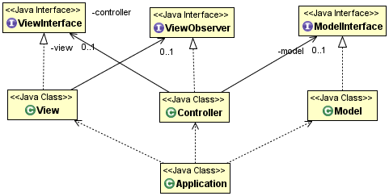

+++

title = "Progettazione e Sviluppo del Software"
description = "Progettazione e Sviluppo del Software, Tecnologie dei Sistemi Informatici"
outputs = ["Reveal"]
aliases = ["/mvc/"]

+++

# Progettazione di interfacce Grafiche
## Pattern Model-View-Controller (MVC)

{}

---

## Architettura del Software

### Definizione

* L'**architettura del software** descrive la struttura complessiva di un sistema software
* Definisce i componenti principali, le loro responsabilità e le interazioni tra di essi
* Fornisce una visione ad alto livello che guida lo sviluppo e l'evoluzione del sistema

### Obiettivi principali

* **Separazione delle responsabilità**: dividere il sistema in parti con compiti ben definiti
* **Modularità**: facilitare la manutenzione e l'evoluzione del codice
* **Riusabilità**: permettere il riutilizzo di componenti in contesti diversi
* **Testabilità**: rendere più semplice il testing delle varie parti

---

## Pattern Architetturali per le GUI

### Problematiche delle applicazioni con interfacce grafiche

* Mescolamento tra logica di dominio e logica di presentazione
* Difficoltà nel testare la logica applicativa senza l'interfaccia
* Codice difficile da mantenere e modificare
* Impossibilità di cambiare facilmente l'interfaccia utente

### Focus del corso

* **MVC** (Model-View-Controller): separa modello, vista e controllo
* Permette una chiara separazione delle responsabilità
* Facilita lo sviluppo di applicazioni GUI ben strutturate

---

## MVC: descrizione sintetica del pattern

### MVC -- divide l'applicazione in 3 parti

*  `Model`: modello OO del dominio applicativo del sistema
*  `View`: gestisce le interazioni con l'utente (input e output)
*  `Controller`: gestisce il coordinamento fra Model e View

---

## Applicazione del MVC

### Sulla costruzione di applicazioni con GUI

*  Specialmente se non esperti, possono essere alquanto laboriose
*  Usare un approccio strutturato sembra richiedere più tempo nel complesso, ma in realtà porta a soluzione più facilmente modificabili e controllabili

### Alcune linee guida
 
* Usare il pattern MVC per la struttura generale
* Identificate le varie "interazioni", e quindi costruire le interfacce dei vari componenti bene fin dall'inizio
* Cercare massima indipendenza fra i vari componenti (interfacce con meno metodi possibile)
* Costruire e testare modello e GUI separatamente (M e V), poi collegare il tutto col controllore (C) che risulterà particolarmente esile

---

## MVC con le GUI: un esempio di struttura

---

## Componenti e loro interazioni

    
### MVC

*  `Model`: incapsula dati e logica relativi al dominio della applicazione
*  `View`: incapsula la GUI, le sue sottoparti, e la logica di notifica
*  `Controller`: intercetta gli eventi della View, comanda le modifiche al modello, cambia di conseguenza la View

    
### Interfacce -- nomi da modificare in una applicazione concreta

*  `ModelInterface`: letture/modifiche da parte del Controller
*  `ViewObserver`: comandi inviati dalla view al controller (`void`)
*  `ViewInterface`: comandi per settare la view, notifiche a fronte dei comandi (errori..)

---

## Un esempio di applicazione: `DrawNumber`
- Elementi di dominio (Model):
  - `DrawNumber`: interfaccia del modello che espone i metodi di gioco:
    - `void` reset(): resetta il gioco
    - `DrawResult` drawNumber(int number): esegue una estrazione e restituisce il risultato
- Elementi di presentazione:
    - `DrawNumberView`: interfaccia della view che espone i metodi di visualizzazione
- Elementi di controllo:
    - `DrawNumberViewObserver`: interfaccia del controller che espone i comandi della view

---

## Linee guida generali consigliate su MVC

   
### Metodologia proposta

*  progettare le 3 interfacce

    *  M: metodi di "dominio", chiamati da C
    *  C: metodi (`void`) chiamati da V, esprimono "azioni utente"
    *  V: metodi (`void`) chiamati da C, esprimono richieste di visualizzazione

*  la tecnologia scelta per le GUI sia interna a V, e mai menzionata altrove o nelle interfacce
*  implementare separatamente M, V e C, poi comporre e testare
*  in progetti reali, M, V e C si compongono di varie parti

   
### Aspetti

*  MVC è implementato in vari modi, o esiste in diverse varianti
    - Model-View-ViewModel (MVVM), Model-View-Presenter (MVP), ...
*  l'approccio proposto è particolarmente indicato per la sua semplicità
*  si usino altri approcci se non peggiorativi

---

# Progettazione di interfacce Grafiche
## Pattern Model-View-Controller (MVC)

{}