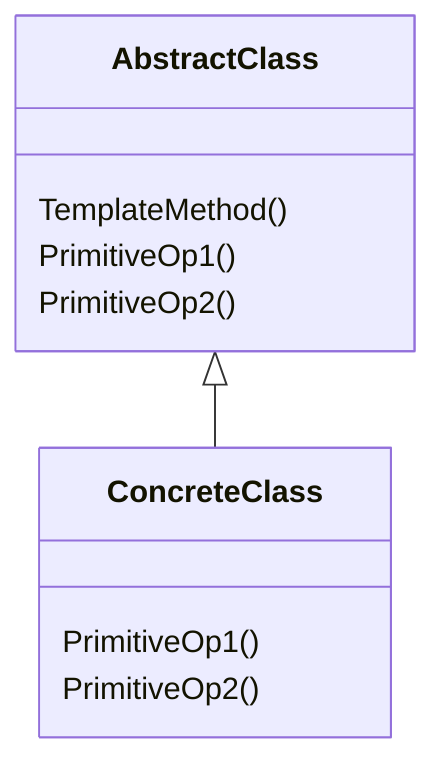

+++

title = "Progettazione e Sviluppo del Software"
description = "Progettazione e Sviluppo del Software, Tecnologie dei Sistemi Informatici"
outputs = ["Reveal"]
aliases = ["/abstract-classes/"]

+++

# Classi astratte 

{}


---


## Outline


  
### Goal della lezione


*  Capire il concetto di *classe astratta* in Java
*  Capire come e quando usarle
*  Introdurre il pattern *Template Method*


  
### Argomenti

* Classi astratte: motivazioni, sintassi, esempi
* Argomenti variabili
* Pattern Template Method basato su classi astratte
  


---

# Classi astratte

---


## Motivazioni


  
### Fra interfacce e classi


*  Le interfacce descrivono solo un contratto
*  Le classi definiscono un comportamento completo
*  ...c'è margine per costrutti intermedi?
  


  
### Classi astratte


*  Le **classi astratte** sono usate per descrivere classi dal *comportamento parziale* (ossia, in cui alcuni metodi sono dicharati ma non implementati)
*  Tali classi *non sono istanziabili* (l'operatore `new` non può essere usato)
*  Possono essere estese e ivi completate, da cui la generazione di oggetti
  


  
### Tipica applicazione: pattern *Template Method*


Serve a dichiare uno *schema di strategia* con un **metodo "template"** (spesso `final`) che definisce un comportamento comune, *basato su metodi astratti* da concretizzare in sottoclassi
  


---


## Classi astratte


  
### Una classe astratta:


*  è dichiarata tale: `abstract class C ... { ... }`
*  *non è istanziabile* (in quanto astratta, ovvero non pienamente specificata)
*  può opzionalmente dichiarare *metodi astratti*: 
    *  hanno forma ad esempio: `abstract int m(int a, String s);`
    *  ossia senza body, come nelle dichiarazioni delle interfacce


  


  
### Altri aspetti


*  può definire campi, costruttori, metodi, concreti e non
    *  ...deve definire con cura il loro livello d'accesso
*  può estendere da una classe astratta o non astratta
*  può implementare interfacce, senza essere tenuta ad ottemperarne il contratto
    * i metodi dell'interfaccia implementata, se non implementati, sono astratti
*  *chi estende una classe astratta può essere non-astratto solo se concretizza/implementa tutti i metodi astratti*
  


---


## Esempio: `LimitedLamp` come classe astratta


  
### Obiettivo


*  Vogliamo progettare una estensione di `SimpleLamp` col concetto di esaurimento
*  La strategia con la quale gestire tale esaurimento può essere varia
*  Ma bisogna far sì che qualunque strategia si specifichi, sia garantito che:
    *  la lampadina si accenda solo se non esaurita
    *  in caso di effettiva accensione sia possibile tenerne traccia ai fini della strategia
  


  
### Soluzione


*  Un uso accurato di `abstract`, `final`, e `protected`
*  Daremo tre possibili specializzazioni per una `LimitedLamp`
    1.  che non si esaurisce mai
    2.  che si esaurisce all'n-esima accensione
    3.  che si esaurisce dopo un certo tempo dalla prima accensione


---


## UML complessivo


  


---


## `SimpleLamp`

```java
{}
```


---


## `LimitedLamp`


```java
{}
```


---


## `UnlimitedLamp`


```java
{}
```


---


## `CountdownLamp`


```java
{}
```


---


## `ExpirationTimeLamp`

```java
{}
```


---


## `UseLamps`


{}

```java
{}
```

{}

---


## Classi astratte vs interfacce


  


*  Due versioni quasi equivalenti
*  Unica differenza: ereditarietà singola per classi, ereditarietà multipla per le interfacce
  


```java
/* Versione interfaccia */
public interface Counter {
    void increment();
    int getValue();
} 

/* Versione classe astratta */
public abstract class Counter {
    public abstract void increment();
    public abstract int getValue();
} 
```

---

## Approfondimento: classi astratte vs. interfacce con metodi di default

Interfacce con metodi di default ...

```java
public interface I4 extends I1, I2, I3 {
    void doSomething(String s);
    // da Java 8
    double E = 2.718282; // implicitamente public, static, final
    default void doSomethingTwice(String s) { doSomething(s); doSomething(s); }
    static double PI() { return Math.PI; }
}
```

... sembrano piuttosto simili alle classi astratte, in quanto possono fornire, in aggiunta a un contratto, alcune implementazioni di default

Tuttavia, ci sono differenze cruciali:

- le classi astratte possono definire variabili d'istanza (stato)
- le classi astratte possono definire costruttori
- le classi astratte possono definire membri con visibilità diverse
- le classi astratte possono fare overriding di metodi da `Object`
- i default method non possono essere `final`

---


## Wrap-up su ereditarietà


  
### Il caso più generale:


```java
class C extends D implements I, J, K, L { ... }
```
  

  
### Cosa deve/può fare la classe `C`


*  deve implementare tutti i metodi dichiarati in `I,J,K,L` e super-interfacce
*  può fare overriding dei metodi (non finali) definiti in `D` e superclassi
  


  
### Classe astratta:


```java
abstract class CA extends D implements I, J, K, L { ... }
```
  

  
### Cosa deve/può fare la classe `CA`


*  non è tenuta a implementare alcun metodo
*  può implementare qualche metodo per definire un comportamento parziale
  


---


# Argomenti variabili

---


## Variable arguments


  
### A volte è utile che i metodi abbiano un numero variabile di argomenti


```java
int i = sum(10, 20, 30, 40, 50, 60, 70);
printAll(10, 20, 3.5, new Object());
```

*  prima di Java 5 si simulava passando un unico array
  


  
### Variable arguments


*  L'ultimo (o unico) argomento di un metodo può essere del tipo "`Type... argname`"
```java
void m(int a, float b, Object... argname) { ... }
```
*  Nel body del metodo, `argname` è trattato come un `Type[]`
*  Chi chiama il metodo, invece che passare un array, passa una lista di argomenti di tipo `Type`
*  Funziona automaticamente con polimorfismo, autoboxing, `instanceof`, ...
  


---


## Uso dei variable arguments


```java
{}
```

---


# Alcuni pattern basati sulle classe astratte


---


## Pattern **Template Method**: comportamentale, su classi

### Intento/motivazione

Definisce lo scheletro (template) di un algoritmo (o comportamento), lasciando l'indicazione di alcuni suoi aspetti alle sottoclassi.

### Esempi

* Definizione della logica di accensione (`switchOn`) di una lampadina (`Lamp`)
* Un comparatore può fornire metodi template per capire se un oggetto è minore/maggiore/uguale di un altro, sulla base di un metodo astratto `int compareTo(T a, T b)`

<!--
* Implementazione del pattern **Factory Method**: il metodo template usa un factory method per definire un comportamento astraendo dall'implementazione specifica di uno o più oggetti coinvolti
* In un input stream (`InputStream`), i vari metodi di lettura sono dei Template Method: dipendono dall'implementazione del solo concetto di lettura di un `int`
	%*  Similmente, i metodi di `AbstractSet` tranne `size()` e `iterator()`
	*  Le interfacce funzionali con metodi di default che chiamano l'astratto
    }}
-->

### Soluzione

* L'algoritmo è realizzato attraverso un **metodo template** che *realizza un algoritmo chiamando metodi astratti/da specializzare* quando servono gli aspetti non noti a priori
* Una sottoclasse fornisce l'implementazione dei metodi astratti

<!--
* L'algoritmo è realizzato attraverso un metodo non astratto (il template method) di una classe astratta
* Questo realizza l'algoritmo, chiamando metodi astratti quando servono gli aspetti non noti a priori
* Una sottoclasse fornisce l'implementazione dei metodi astratti
-->

---

<!--  -->

<div class="container">
<div class="col">



</div>
<div class="col">

```java
abstract class AbstractClass {
    public void TemplateMethod() {
        // ...
        PrimitiveOp1();
        // ...
        PrimitiveOp2();
        // ...
    }
    public abstract void PrimitiveOp1();
    public abstract void PrimitiveOp2();
}

class ConcreteClass extends AbstractClass {
    public void PrimitiveOp1() { /* ... */ }
    public void PrimitiveOp2() { /* ... */ }
}
```

</div></div>

---

## Template Method: esempio `BankAccount`

{}

```java
{}
```

{}

---

```java
{}
```

```java
{}
```

---

# Classi astratte

{}

