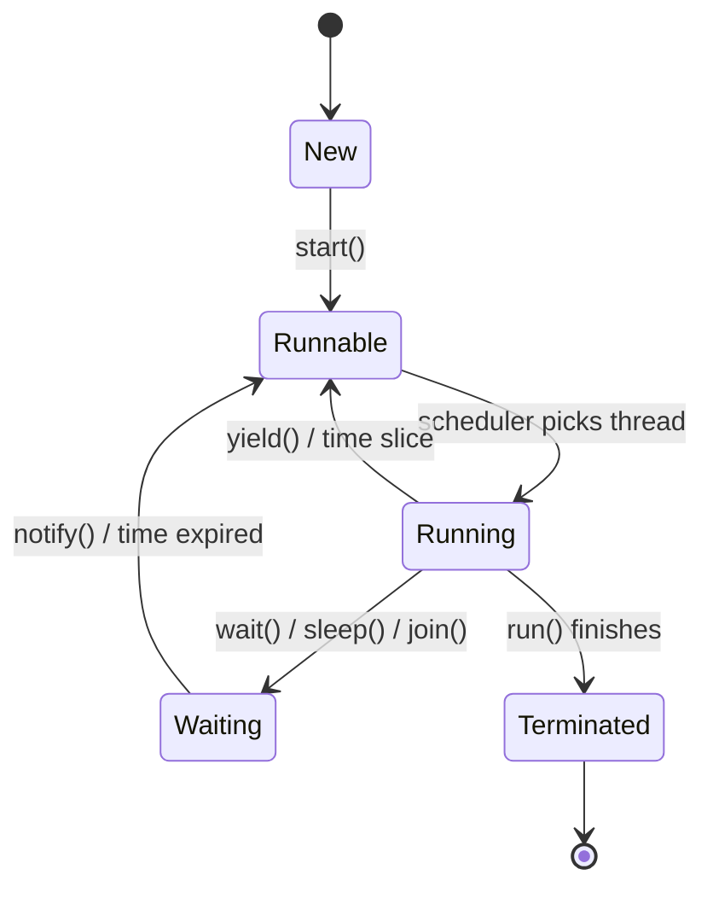
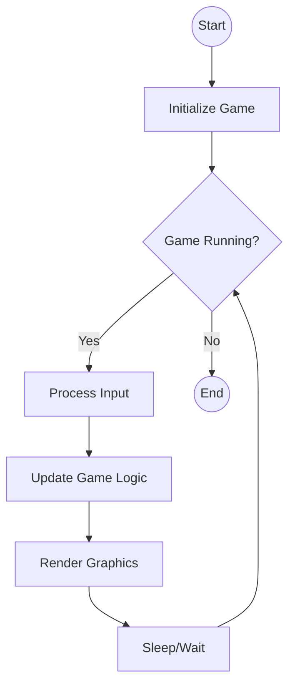

+++

title = "Progettazione e Sviluppo del Software"
description = "Progettazione e Sviluppo del Software, Tecnologie dei Sistemi Informatici"
outputs = ["Reveal"]
aliases = ["/multithread/"]

+++

# Introduzione alla Programmazione Concorrente in Java

{}


---


## Outline


  
### Goal della lezione


* Capire le basi della programmazione concorrente in Java
* Vedere come creare e gestire thread in Java
* Introdurre concetti di sincronizzazione e comunicazione tra thread
* Uso della programmazione concorrente nelle interfacce JavaFX  


  
### Argomenti

* Thread in Java: creazione e gestione
* Sincronizzazione e comunicazione tra thread
* Concorrenza in JavaFX
  


---

# Thread in Java

---

## Perché la programmazione concorrente?
- Le applicazioni moderne sono di fatto quasi sempre concorrenti
  - I server web gestiscono più richieste contemporaneamente
  - Le interfacce grafiche devono rimanere reattive mentre eseguono calcoli in background
- Sulla notazione:
> *Programmazione asincrona*: esecuzione di operazioni che possono completarsi in momenti diversi senza bloccare il flusso principale del programma.

> *Programmazione concorrente*: esecuzione di più operazioni in parallelo, spesso utilizzando thread o processi separati.

---

## Meccanismo di concorrenza in Java
- Java fornisce il supporto *nativo* per la programmazione concorrente attraverso l'uso di **thread**
> Thread: Un thread è un'unità di esecuzione all'interno di un processo. Ogni thread ha il proprio stack di esecuzione, ma condivide lo spazio di memoria del processo con altri thread.

- Come?
    - Everything is an Object
    - Quindi anche i thread sono oggetti :)

---

## La classe Thread
> Un thread è rappresentato dalla classe Thread, caratterizzata
dal metodo `run`, che definisce il comportamento (attività) del
thread
```java
class Thread {

    public void run();
    ...
}
```

---

## Ciclo di vita di un Thread


---

## Linea guida per creare un thread
1. Creare una classe che implementa l'interfaccia Runnable
2. Implementare il metodo run() con il codice che si vuole eseguire nel thread
3. Creare un'istanza della classe Thread, passando un'istanza della classe Runnable al costruttore
4. Avviare il thread chiamando il metodo start()

*Nota*: In generale è sconsigliato estendere direttamente la classe Thread

---

## Esempio: clock

```java
public class Clock implements Runnable {
    private String name;
    private int amount;
    public Clock(String name, int amount) {
        this.name = name;
        this.amount = amount; 
    }
    @Override
    public void run() {
        while(true) {
            System.out.println("Clock " + name + ": " + System.currentTimeMillis());
            try {
                Thread.sleep(this.amount); // Pausa di 1 secondo
            } catch (InterruptedException e) {
                e.printStackTrace();
            }
        }
    }
}
```

---
## Esempio: avvio dei thread

- Dato un oggetto Clock, possiamo avviare due thread che eseguono due orologi distinti

```java
void main(String[] args) {
    Clock clock1 = new Clock("A", 500);
    Thread thread1 = new Thread(clock1);
    thread1.start();
    Clock clock2 = new Clock("B", 1000);
    Thread thread2 = new Thread(clock2);
    thread2.start();
}
```
Un possibile output sarà:
```java
Clock A: 1700000000000
Clock A: 1700000000500
Clock B: 1700000001000
Clock A: 1700000001500
```
- Notate: i due orologi funzionano in modo indipendente e concorrente!
- Altra nota: il metodo `start()` non dà garanzie sull'ordine di esecuzione dei thread! (quindi thread1 potrebbe partire dopo thread2)

---

## Come dare garanzie sull'esecuzione dei thread?
- Non ci sono mai garanzie sull'ordine di esecuzione dei thread
- Ad esempio:
```java
void main() throws InterruptedException {
    Thread t1 = new Thread(() -> System.out.println("Thread 1"));
    Thread t2 = new Thread(() -> System.out.println("Thread 2"));
    t1.start();
    t2.start();
    System.out.println("after start");
}
```
- Quale sarà l'output?
- Potrebbe essere:
```java
Thread 1
Thread 2
after start
```
- Oppure (e molte altre...):
```java
Thread 2
after start
Thread 1
```
- Perché? Perché i thread vengono eseguiti in modo concorrente e l'ordine di esecuzione non è deterministico!

---

## Come sapere quando un thread ha finito?
- Se volessi per dire usare diversi thread per ordinare una lista?
- Come facciamo a sapere quando tutti i thread hanno finito?
- Possiamo usare il metodo `join()` della classe Thread!
```java
void main() throws InterruptedException {
    Thread t1 = new Thread(() -> System.out.println("Thread 1"));
    Thread t2 = new Thread(() -> System.out.println("Thread 2"));
    t1.start();
    t2.start();
    t1.join();
    t2.join();
    System.out.println("after join");
    System.out.println("Tutti i thread hanno finito!");
}
```
- Il metodo `join()` blocca il thread chiamante finché il thread su cui viene chiamato non termina

---

## Accesso concorrente a risorse condivise
- Supponiamo di avere questo esempio:
{}
```java
class Counter {
    private int counter = 0;
    public void increment() {
        counter++;
    }
    public int getCounter() {
        return counter;
    }
    public static Runnable incrementFor(int amount, Counter counter) {
        return () -> {
            for(int i = 0; i < amount; i++) {
                counter.increment();
            }
        };
    }
}
void main() throws InterruptedException {
    var shared = new Counter();
    var thread1 = new Thread(Counter.incrementFor(1000, shared));
    var thread2 =new Thread(Counter.incrementFor(1000, shared));
    thread1.start();
    thread2.start();
    thread2.join();
    thread1.join();
    System.out.println("Final counter value: " + shared.getCounter());
}
```
{}

- Cosa ci aspettiamo come output?
- Ci aspettiamo `Final counter value: 2000`
- Ma in realtà potremmo ottenere un valore inferiore a 2000!
- Perché? La variabile `counter` viene letta e scritta da due thread contemporaneamente, causando una **corsa critica**

---

## Corse Critiche
> Una corsa critica si verifica quando due o più thread accedono contemporaneamente a una risorsa condivisa (ad esempio, una variabile) e almeno uno di essi modifica la risorsa. Questo può portare a risultati imprevedibili e incoerenti.
- Nel nostro esempio, entrambi i thread leggono il valore di `counter`, lo incrementano e lo riscrivono. Se entrambi leggono il valore prima che uno di loro lo riscriva, perderemo un incremento.
- Come risolvere questo problema? Usando la **sincronizzazione**
- Cioè, vorremo che solo un thread alla volta possa eseguire il metodo `increment()` (in mutua esclusione)
- In Java, si possono usare i *monitor* per fare questo

---

## Monitor 
> Un monitor è una struttura di sincronizzazione che consente a un solo thread alla volta di eseguire un blocco di codice protetto. In Java, ogni oggetto ha un monitor associato, e i metodi sincronizzati utilizzano questo monitor per garantire l'accesso esclusivo.

- Un monitor, in Java è una classe che ha *tutti* i metodi pubblici sincronizzati
- Esempio, un `Counter` sincronizzato:
{}
```java
public class SynchronizedCounter {
    private int counter = 0;
    public synchronized void increment() {
        counter++;
    }
    public synchronized int getCounter() {
        return counter;
    }
    static Runnable incrementFor(int amount) {
        return () -> {
            for(int i = 0; i < amount; i++) {
                increment();
            }
        };
    }
}
```
{}

--- 

## Uso del SynchronizedCounter
- Ora, usiamo `SynchronizedCounter` nel nostro esempio:
```java
static void main(String[] args) throws InterruptedException {
    var shared = new SynchronizedCounter();
    var thread1 = new Thread(SynchronizedCounter.incrementFor(1000, shared));
    var thread2 = new Thread(SynchronizedCounter.incrementFor(1000, shared));
    thread1.start();
    thread2.start();
    thread2.join();
    thread1.join();
    System.out.println("Final counter value: " + shared.getCounter());
}
```

- Ora, se usiamo `SynchronizedCounter` al posto di `Counter`, i due thread non potranno eseguire `increment()` contemporaneamente, evitando la corsa critica
- Così, otterremo sempre `Final counter value: 2000`

---

## Comunicazione tra thread
- A volte, i thread devono comunicare tra loro
- Java espone un meccanismo di comunicazione tra thread basato sui metodi `wait()`, `notify()` e `notifyAll()`
> `wait()`: sospende l'esecuzione del thread corrente fino a quando un altro thread non chiama `notify()` o `notifyAll()` sullo stesso oggetto.
> `notify()`: risveglia un thread in attesa sul monitor dell'oggetto.
> `notifyAll()`: risveglia tutti i thread in attesa sul monitor dell'oggetto.

---

## Esempio di comunicazione tra thread - Produttore/Consumatore
- Supponiamo di avere un buffer condiviso tra un thread produttore e un thread consumatore
- Il produttore produce dati e li mette nel buffer, mentre il consumatore prende i dati dal buffer
- Se il buffer è pieno, il produttore deve aspettare; se il buffer è vuoto, il consumatore deve aspettare
- Possiamo usare `wait()` e `notify()` per gestire questa comunicazione
```java
class UnboundedBuffer<T> {
    private Queue<T> buffer = new LinkedList<>();
    public synchronized void put(T item) {
        buffer.add(item);
        notify(); // Notifica un consumatore in attesa
    }
    public synchronized T take() throws InterruptedException {
        while (buffer.isEmpty()) {
            wait(); // Aspetta che ci sia un elemento
        }
        return buffer.remove();
    }
}
```
---

## Esempio uso del UnboundedBuffer
```java
UnboundedBuffer<Integer> buffer = new UnboundedBuffer<>();
// put 10 elements before
for (int i = 0; i < 10; i++) {
    buffer.put(i);
}
Thread producer = new Thread(() -> {
    for (int i = 10; i < 20; i++) {
        buffer.put(i);
        System.out.println("Produced: " + i);
    }
});
Thread consumer = new Thread(() -> {
    for (int i = 0; i < 10; i++) {
        try {
            Object item = buffer.take();
            System.out.println("Consumed: " + i);
        } catch (InterruptedException e) {
            e.printStackTrace();
        }
    }
});
producer.start();
consumer.start();
```

---

## Come stoppare un thread?
- Il Thread, una volta avviato, continua a eseguire il metodo `run()` fino a quando non termina
- Se metto un ciclo infinito in `run()`, il thread non terminerà mai!
- Come posso fermare un thread in modo sicuro?
- La soluzione più comune è usare un flag booleano che il thread controlla periodicamente!
```java
class StopSignal {
    private boolean stop = false;
    public synchronized void requestStop() {
        stop = true;
    }
    public synchronized boolean shouldStop() {
        return stop;
    }
}
```

---

## Uso dello StopSignal
```java
class StoppableTask implements Runnable {
    private StopSignal stopSignal;
    public StoppableTask() {
        this.stopSignal = new StopSignal();
    }
    @Override
    public void run() {
        while (!stopSignal.shouldStop()) {
            // Esegui il lavoro
            System.out.println("Working...");
        }
    }

    public void kill() {
        stopSignal.requestStop();
    }
}
```
- In questo modo, il thread può essere fermato in modo sicuro chiamando il metodo `kill()`
Esempio:
```java
StoppableTask task = new StoppableTask();
new Thread(task).start();
thread.start();
task.kill(); // Chiede al thread di fermarsi
```

---

# Concorrenza in JavaFX

---

## Problema della reattività
- Immaginate di avere una interfaccia grafica che esegue un calcolo pesante quando si preme un bottone
- Ad esempio:
```java
public class UnresponsiveUI extends Application {
    @Override
    public void start(Stage primaryStage) {
        Button btn = new Button("Calcola");
        TextField result = new TextField();
        btn.setOnAction(event -> {
            long sum = 0;
            for (long i = 0; i < 1_000_000_000_0L; i++) { sum ++; }
            result.setText("Somma: " + sum);
        });
        VBox root = new VBox();
        root.getChildren().addAll(btn, result);
        Scene scene = new Scene(root, 300, 250);
        primaryStage.setTitle("Esempio JavaFX");
        primaryStage.setScene(scene);
        primaryStage.show();
    }
}
```
- Perché l'interfaccia grafica si blocca quando premo il bottone?

---

## JavaFX Application Thread
- In JavaFX, c'è un thread speciale chiamato **JavaFX Application Thread** che gestisce l'interfaccia grafica
- Tutte le operazioni che modificano l'interfaccia grafica devono essere eseguite su questo thread
- Se eseguiamo un calcolo pesante sul JavaFX Application Thread, l'interfaccia grafica si blocca fino a quando il calcolo non termina
- Per evitare questo, dobbiamo eseguire i calcoli pesanti su un thread separato :)

```java
public class ResponsiveUI extends Application {
    @Override
    public void start(Stage primaryStage) {
        Button btn = new Button("Calcola");
        TextField result = new TextField();
        btn.setOnAction(event -> {
            new Thread(() -> {
                long sum = 0;
                for (long i = 0; i < 1_000_000_000_0L; i++) { sum ++; }
                final long finalSum = sum;
            }).start();
        });
        VBox root = new VBox();
        root.getChildren().addAll(btn, result);
        Scene scene = new Scene(root, 300, 250);
        primaryStage.setTitle("Esempio JavaFX");
        primaryStage.setScene(scene);
        primaryStage.show();
    }
}
```
- Funziona?
- No! Perché stiamo cercando di aggiornare l'interfaccia grafica da un thread separato!
- Come risolviamo questo problema?

## Far eseguire codice sul JavaFX Application Thread
- JavaFX fornisce il metodo `Platform.runLater(Runnable r)` per eseguire codice sul JavaFX Application Thread
- Si usa in questo modo:
```java
Platform.runLater(() -> {
    result.setText("Somma: " + finalSum);
});
```
- Così facendo, il codice all'interno di `runLater` verrà eseguito sul JavaFX Application Thread, evitando problemi di concorrenza con l'interfaccia grafica
- *Nota*: Non si dovrebbero MAI eseguire operazioni bloccanti all'interno di `runLater`, altrimenti si bloccherà l'interfaccia grafica!

---

## Concorrenza e Videogiochi
- Nei videogiochi, la concorrenza è spesso usata per gestire diverse componenti del gioco in modo indipendente
- Tipicamente, l'aggiornamento della logica di gioco e il rendering grafico sono eseguiti su thread separati
   - Nota!! Anche se si potrebbe pensare di usare un thread per ogni entità del gioco, questo è inefficiente e non scalabile
- Un approccio comune è usare un **game loop** che aggiorna la logica di gioco e il rendering a intervalli regolari
- Idea base del game loop:
```java
while (gameIsRunning) {
    inputHandling(); // Gestisce l'input dell'utente
    updateGameLogic(); // Aggiorna la logica di gioco
    renderGraphics();  // Esegue il rendering grafico
    sleepUntilNextFrame(); // Attende fino al prossimo frame
}
```
---

## Diagramma del Game Loop


- Nota: process input deve essere non bloccante!
- Render, allo stesso mode, deve essere eseguito sul JavaFX Application Thread
- Proviamo a farlo in JavaFX!

---

## Jumping Ball
- Supponiamo di fare un semplice gioco in cui una palla può saltare su e giù
- Il sistema deve gestire:
    - la fisica della palla (gravità, salto)
    - il rendering grafico della palla
    - l'input dell'utente (premere spazio per saltare)
- Usiamo un game loop per gestire tutto questo in modo concorrente!

---

## Game Loop 

```java
public abstract class GameLoop<I, O> implements Runnable {
    @Override
    public void run() {
        while(true) {
            var start = System.currentTimeMillis();
            processInput();
            updateGame();
            waitForNextFrame(start);
        }
    }

    private void processInput() { ... }

    private void updateGame() { ... }

    private void waitForNextFrame(long startTime) { ... }

    protected abstract void processInput(I input);

    protected abstract O logic(float deltaTimeMillis);
}
```

---

## Gestione dell'input/output
- L'input può essere gestito tramite code thread-safe
- L'output (rendering) deve essere eseguito sul JavaFX Application Thread
- Uso un meccanismo di sincronizzazione per passare i dati tra il game loop e il thread grafico
{}
```java
public class SynchValue<V> {
    private V value = null;

    public synchronized void setValue(V value) {
        this.value = value;
        this.notifyAll();
    }

    public synchronized V getValue() throws InterruptedException {
        while (value == null) {
            wait();
        }
        var result = this.value;
        this.value = null;
        return result;
    }

    public synchronized Optional<V> tryGetValue() {
        if (value == null) {
            return Optional.empty();
        }
        var result = this.value;
        this.value = null;
        return Optional.of(result);
    }
}
```
{}

---

## Come usare SynchValue nel GameLoop?
```java
class GameLoop<I, O> implements Runnable {
    private SynchValue<I> inputBuffer = new SynchValue<>();
    private SynchValue<O> outputBuffer = new SynchValue<>();
    ...

    private void processInput() {
        var input = this.inputBuffer.tryGetValue(); // non bloccante
        input.ifPresent(this::processInput);
    }

    private void updateGame() {
        var result = logic(expectedFrameTimeMillis);
        this.outputBuffer.setValue(result);
    }
    
    public void sendInput(I input) {
        this.inputBuffer.setValue(input);
    }
}
```

---

## Piccolo esempio di Jumping Ball -- Demo

---

## Piccolo esempio di Many Balls -- Demo

---

## Conclusioni
- La programmazione concorrente è fondamentale per applicazioni moderne reattive e performanti
- Java fornisce un supporto nativo per la concorrenza attraverso i thread
- La sincronizzazione è essenziale per evitare corse critiche e garantire l'integrità dei dati
- In JavaFX, è importante eseguire le operazioni di interfaccia grafica sul JavaFX Application Thread
- I game loop sono un pattern comune per gestire la logica di gioco e il rendering in modo concorrente
- Queste sono solo le basi della programmazione concorrente in Java (ma è quello che vi serve per il progetto!)

---

# Introduzione alla Programmazione Concorrente in Java

{}

