+++

title = "Progettazione e Sviluppo del Software"
description = "Progettazione e Sviluppo del Software, Tecnologie dei Sistemi Informatici"
outputs = ["Reveal"]
aliases = ["/uml-crash/"]

+++

# UML crash course 

<!-- {} -->

{}

---

## Outline


  
### Goal della lezione

* Riassunto dei concetti fondamentali di UML

  
### Argomenti

* UML Class Diagrams
* Mermaid Syntax
  
---

## Introduzione ai Diagrammi di Classe UML

- Diagramma di Classe UML: Una rappresentazione visiva delle classi, dei loro attributi, metodi e relazioni.
- Usi Principali: Design orientato agli oggetti e comprensione dell'architettura del sistema.
- Componenti Base:
  - Classi: Rappresentano entità con proprietà comuni.
  - Relazioni: Mostrano come le classi interagiscono tra loro.

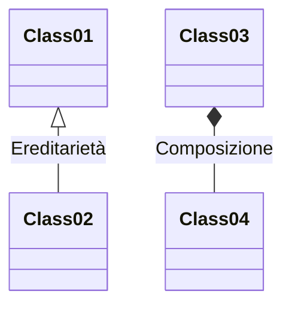
---

## Struttura Base di una Classe

- Anatomia di una Classe UML:
  - **Nome della Classe**: Tipicamente maiuscolo, rappresenta l'entità.
  - **Attributi**: Variabili o proprietà della classe.
  - **Metodi**: Funzioni o operazioni che la classe può eseguire.
- Indicatori di Visibilità:
  - `+` per pubblico, `-` per privato, `#` per protetto.
- Esempio:

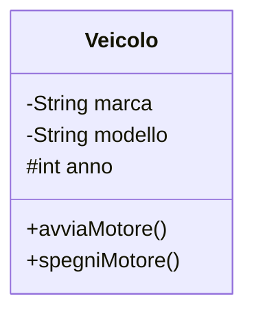
---

## Relazioni tra Classi - Associazione

- **Associazione**: Rappresenta una gamma di relazioni tra classi (ad es., uno-a-uno, uno-a-molti).
- **Molteplicità**: Indica quante istanze di una classe possono essere associate con un'istanza di un'altra classe.
- Esempio: Uno `Studente` può iscriversi a molti `Corsi` e un `Corso` può avere molti `Studenti`.

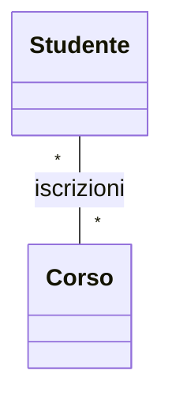
---
## Relazioni tra Classi - Aggregazione

- **Aggregazione**: Una forma speciale di associazione che rappresenta una relazione "intero-parte".
- **Caratteristiche**:
  - La 'parte' può esistere indipendentemente dall' 'intero'.
  - Rappresenta una relazione di 'possesso'.
- Esempio: Un `Dipartimento` ha molti `Professori`, ma i `Professori` possono esistere indipendentemente.

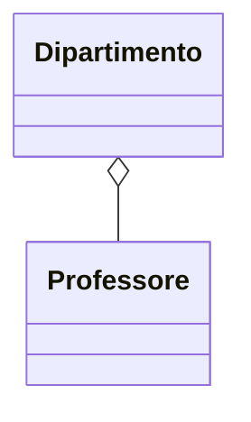
---
## Relazioni tra Classi - Composizione

- **Composizione**: Una forma più restrittiva di aggregazione.
- **Differenze Chiave**:
  - La 'parte' non può esistere indipendentemente dall' 'intero'.
  - Indica una forte dipendenza nel ciclo di vita.
- Esempio: Un `Automobile` è composta da un `Motore`. Se l'`Automobile` viene distrutta, lo è anche il `Motore`.

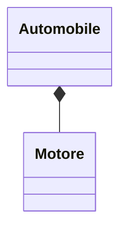
---
## Ereditarietà nei Diagrammi di Classe

- **Ereditarietà**: Rappresenta una relazione genitore-figlio tra classi, dove il figlio eredita attributi e metodi del genitore.
- **Vantaggi**:
  - Riutilizzo del codice.
  - Organizzazione gerarchica.
- Esempio: Un `AutomobileElettrica` eredita da `Automobile`.

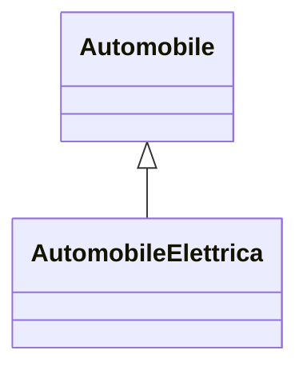
---

## Interfacce e Implementazioni

- **Interfaccia**: Un contratto che le classi possono implementare. Definisce i metodi ma non la loro implementazione.
- **Implementazione**: Una classe che si impegna ad implementare tutti i metodi dichiarati da un'interfaccia.
- Esempio: `InterfacciaVeicolo` implementata da `Automobile`.

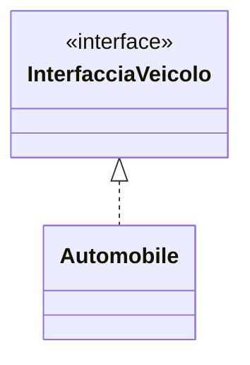
---

## Classi e Metodi Astratti

- **Classe Astratta**: Una classe che non può essere istanziata da sola ed è destinata ad essere subclassificata.
- **Metodi Astratti**: Metodi dichiarati in una classe astratta che devono essere implementati dalle sottoclassi.
- **Utilizzo**: Utile nel definire un modello base per altre classi.
- Esempio: `Forma` con un metodo astratto `disegna()`.

```mermaid
classDiagram
  class Forma {
    {abstract} +disegna()
  }
  Forma <|-- Cerchio
```
---

## Relazioni di Dipendenza

- **Dipendenza**: Una relazione in cui un cambiamento in una classe può influenzare un'altra classe.
- **Casi d'Uso**: Spesso usati in scenari come parametri di metodi o variabili locali.
- **Notazione**: Rappresentata da una freccia tratteggiata.
- Esempio: Una classe `ProcessorePagamenti` che utilizza un oggetto `CartaDiCredito`.

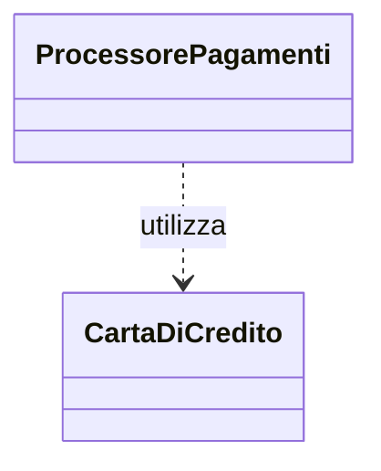
---

## Molteplicità nelle Relazioni

- **Molteplicità**: Definisce quante istanze di una classe possono essere collegate a una singola istanza di un'altra classe.
- **Notazione**: Espressa come numeri (ad es., 1, 0..*, 1..n).

Esempio**: In un sistema di shopping online, un `Ordine` può contenere più `Prodotti`.

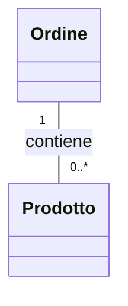
---

## Associazione vs Aggregazione vs Composizione

- **Analisi Comparativa**:
  - **Associazione**: Collegamento generale tra due classi.
  - **Aggregazione**: Relazione "intero-parte" con cicli di vita indipendenti.
  - **Composizione**: Relazione "intero-parte" più forte con cicli di vita dipendenti.
- **Scegliere la Relazione Giusta**:
  - Basato sul grado di dipendenza e ciclo di vita.
- **Esempi**: `Persona` associata con `Indirizzo`, `Squadra` aggrega `Giocatore`, `Casa` composta da `Stanza`.

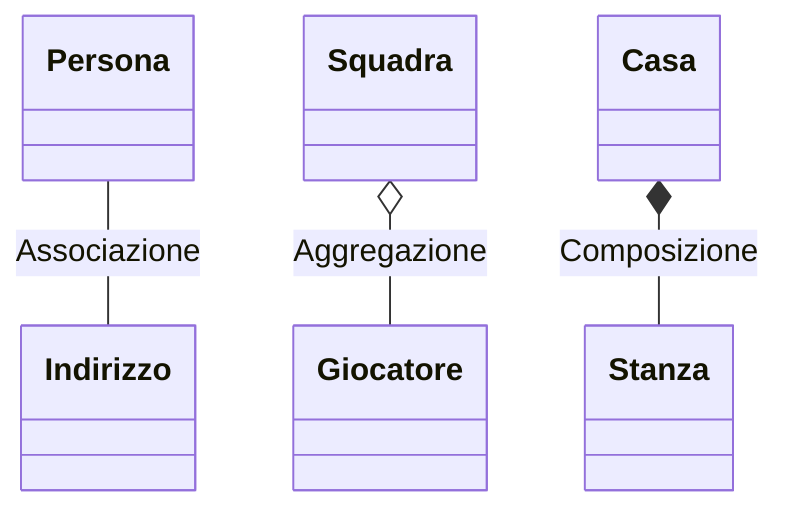
---
## Elementi Avanzati dei Diagrammi di Classe

- **Stereotipi**: Etichette o tag personalizzati applicati agli elementi per indicare il loro ruolo o vincoli.
- **Vincoli**: Regole o condizioni aggiuntive applicate alle relazioni.
- **Integrazione del Diagramma dei Pacchetti**: Raggruppamento di classi in pacchetti per una migliore organizzazione.
- **Esempi**:
  - Stereotipo: `<<controller>>` per una classe che gestisce richieste degli utenti.
  - Vincolo: `{immutabile}` per indicare che una classe non può essere modificata.

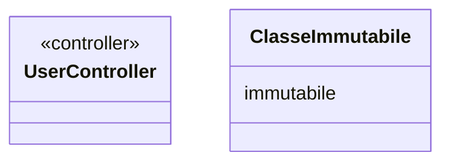
---

## Creazione di un Esempio Completo di Diagramma di Classe

- **Costruzione Passo Dopo Passo**:
  - Identificare classi e i loro attributi/metodi.
  - Determinare relazioni e la loro molteplicità.
  - Applicare le notazioni appropriate.
- **Integrazione di Diversi Elementi**: Mix di associazioni, ereditarietà e composizioni.
- **Esempio**: Un diagramma semplificato di un sistema di biblioteca.

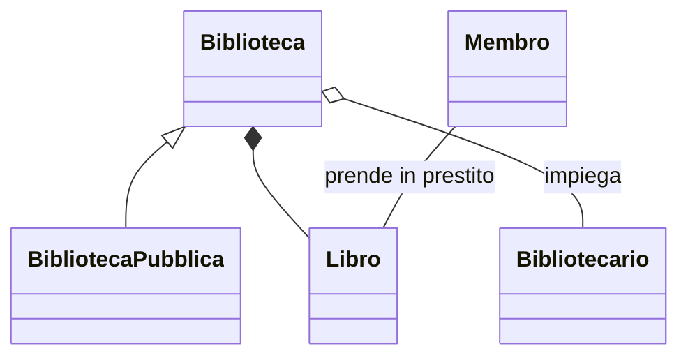
---

## Errori Comuni nei Diagrammi di Classe

- **Complicare Troppo i Diagrammi**: Includere troppi dettagli che rendono il diagramma confuso.
- **Abuso delle Relazioni**: Uso errato di associazione, aggregazione o composizione.
- **Tralasciare Molteplicità e Vincoli**: Non definire chiaramente le relazioni tra le classi.
- **Ignorare la Logica del Mondo Reale**: Non riflettere le relazioni reali nel sistema modellato.
