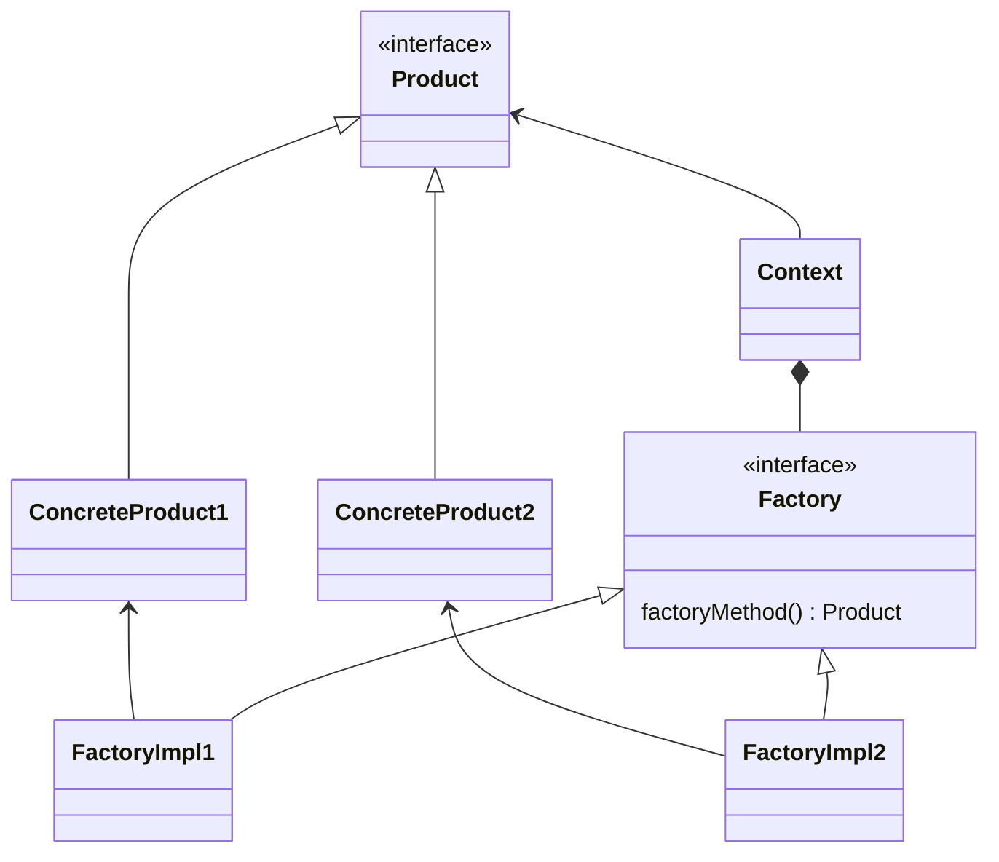
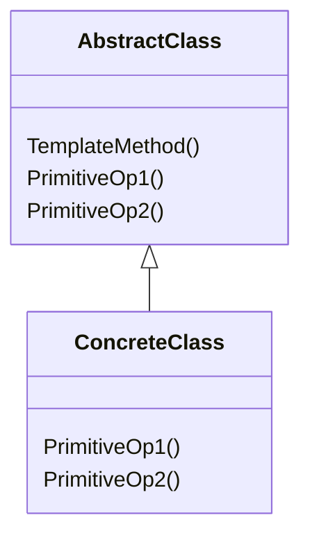

<!--

## Singleton: creazionale, su oggetti


    
### Intento/motivazione


	Garantire che una classe abbia una unica istanza, accessibile globalmente e facilmente a molteplici classi, senza doversi preoccupare di fornirne il riferimento a chi lo richiede (ad esempio passandolo al costruttore)
    

    
### Esempi


*  Un unico gestore di stampanti in un sistema
*  Un unico gestore del "log"
*  `java.lang.Runtime`
    


    
### Soluzione


*  La classe sia responsabile di tenere traccia di tale unica istanza
*  La classe impedisca la creazione di altri oggetti
*  La classe fornisca l'accesso a tale oggetto staticamente
*  Attenzione: singleton accoppia clienti e implementazione
    


---


## Singleton: UML


---


## Singleton: Il caso di `java.lang.Runtime`


    \sizedrangedcode{\scriptsize}{3}{100}{\ecl/singleton/UseRuntime.java}


---


## Singleton: Il caso di una classe `Log`


    \sizedrangedcode{\scriptsize}{3}{100}{\ecl/singleton/Log.java}
    \sizedrangedcode{\scriptsize}{3}{100}{\ecl/singleton/UseLog.java}


---


## Singleton: conseguenze


    
### Effetti benefici


*  C'è un controllo "incapsulato" di chi vi accede
*  Evita di dover portare i riferimenti all'oggetto nei campi di tutti le classi che lo usano
*  È facile raffinare l'implementazione del singleton (via subclassing)
*  Può gestire la creazione by-need (detta anche *lazy*) dell'oggetto
*  Più flessibile dei metodi statici (che non hanno overriding)
    


    
### Critiche


*  Il Singleton può essere problematico col multi-threading
*  Crea dipendenze nascoste, gli user dipendono dal nome della classe
*  Difficile tornare indietro dalla scelta di usare il singleton
*  Incapsula due responsabilità distinte (creazione + aspetti interni)
*  Rende meno estendibile il codice della classe (è meno "OOP")
* $\Rightarrow$ *__Da usare quando portare "in giro" il riferimento all'oggetto sarebbe complesso__*
    


---


## Singleton con "lazy initialization" (non thread-safe)


    \sizedrangedcode{\scriptsize}{3}{100}{\ecl/singleton/LogLazy.java}


---


## Singleton con "lazy initialization" e "thread-safe"


    \sizedrangedcode{\ssmall}{3}{100}{\ecl/singleton/LogLazyTS.java}


---


## Template Method: comportamentale, su classi


    
### Intento/motivazione


	Definisce lo scheletro (template) di un algoritmo (o comportamento), lasciando l'indicazione di alcuni suoi aspetti alle sottoclassi.
    

    
### Esempi


*  In un input stream (`InputStream`), i vari metodi di lettura sono dei Template Method: dipendono dall'implementazione del solo concetto di lettura di un `int`
	%*  Similmente, i metodi di `AbstractSet` tranne `size()` e `iterator()`
*  Le interfacce funzionali con metodi di default che chiamano l'astratto
    


    
### Soluzione


*  L'algoritmo è realizzato attraverso un metodo non astratto (il template method) di una classe astratta
*  Questo realizza l'algoritmo, chiamando metodi astratti quando servono gli aspetti non noti a priori
*  Una sottoclasse fornisce l'implementazione dei metodi astratti
    


---


## Template Method: UML


    


---


## Template Method: Una estensione di `InputStream`


    \sizedrangedcode{\ssmall}{3}{100}{\ecl/tmethod/UseRandomInputStream.java}


---


## Template Method: esempio `BankAccount`


    \sizedrangedcode{\ssmall}{3}{100}{\ecl/tmethod/BankAccount.java}


---


## Template Method: esempio con i metodi `default`


    \sizedrangedcode{\ssmall}{5}{100}{\ecllambda/interfaces/SimpleIterator.java}
    \sizedrangedcode{\ssmall}{3}{100}{\ecllambda/interfaces/UseSimpleIterator.java}


---


# Factory Method

## Factory Method: creazionale, su oggetti


    
### Intento/motivazione


Definisce una interfaccia per creare oggetti, lasciando alle implementazioni il compito di decidere quale classe istanziare e come
    

    
### Esempi


* Un framework deve creare oggetti, ma sue specializzazioni devono crearne versioni specializzate
    
### Soluzione

*  Una interfaccia creatrice fornisce il metodo factory col compito di creare e ritornare l'oggetto
*  Tale interfaccia viene poi specializzata, e incapsula la logica di creazione dell'oggetto
* ..spesso frainteso con static o simple factory
    


---


## Factory Method: UML


---


## Factory Method: Esempio `Person` e `PersonFactory`


```java
{}
```

{}

```java
{}
```

{}

---

```java
{}
```

```java
{}
```

---

```java
{}
```

---

## Abstract Factory

### Abstract Factory: UML




-->


### Template Method: comportamentale, su classi

#### Intento/motivazione

Definisce lo scheletro (template) di un algoritmo (o comportamento), lasciando l'indicazione di alcuni suoi aspetti alle sottoclassi.

#### Esempi

<!--
* In un input stream (`InputStream`), i vari metodi di lettura sono dei Template Method: dipendono dall'implementazione del solo concetto di lettura di un `int`
	%*  Similmente, i metodi di `AbstractSet` tranne `size()` e `iterator()`
	*  Le interfacce funzionali con metodi di default che chiamano l'astratto
    }}
-->

#### Soluzione

* L'algoritmo è realizzato attraverso un **metodo template** che realizza un algoritmo chiamando metodi astratti/da specializzare quando servono gli aspetti non noti a priori
* Una sottoclasse fornisce l'implementazione dei metodi astratti

<!--
* L'algoritmo è realizzato attraverso un metodo non astratto (il template method) di una classe astratta
* Questo realizza l'algoritmo, chiamando metodi astratti quando servono gli aspetti non noti a priori
* Una sottoclasse fornisce l'implementazione dei metodi astratti
-->

---


<!--




## Template Method: Una estensione di `InputStream`


    \sizedrangedcode{\ssmall}{3}{100}{\ecl/tmethod/UseRandomInputStream.java}


---


## Template Method: esempio `BankAccount`


    \sizedrangedcode{\ssmall}{3}{100}{\ecl/tmethod/BankAccount.java}


---


## Template Method: esempio con i metodi `default`


    \sizedrangedcode{\ssmall}{5}{100}{\ecllambda/interfaces/SimpleIterator.java}
    \sizedrangedcode{\ssmall}{3}{100}{\ecllambda/interfaces/UseSimpleIterator.java}


---

---

-->


## Decorator: strutturale, su oggetti


    
### Intento/motivazione


	Aggiunge ad un oggetto ulteriori responsabilità, dinamicamente, e in modo più flessibile (e componibile) rispetto all'ereditarietà.
    

    
### Esempi


	*  Aggiungere (in modo componibile) la gestione "buffered" ad uno stream
	*  Aggiungere una barra di scorrimento ad un pannello
	*  Ottenere uno stream ordered da uno unordered
    


    
### Soluzione


	*  La classe base viene estesa con una nuova classe che è anche wrapper di un oggetto della classe base
	*  Uno o più metodi potrebbero delegare semplicemente all'oggetto wrappato, altri modificare opportunamente, altri essere aggiuntivi
	* $\Rightarrow$ può essere visto come variante dello strategy (in cui la strategia è la realizzazione base del comportamento), e potrebbe includere dei template method
    


---


## Decorator: UML


    


---


## Esempio di problema


    
### Data la seguente interfaccia `Pizza`..


      \sizedrangedcode{\ssmall}{3}{100}{\ecl/decorator/problem/Pizza.java}
    

    
### Realizzare le seguenti astrazioni


      *  Margherita (6.50 euro, ingredienti: pomodoro + mozzarella)
      *  Aggiunta Salsiccia (1.50 euro), anche doppia o tripla eccetera
      *  Aggiunta Funghi (1 euro), anche doppia o tripla eccetera
      *  Pizza senza glutine (+10% costo) 
    


    
### Forniamo la soluzione col decoratore (tipica del concetto di "ingrediente")


      *  Class concreta `Margherita`
      *  Decoratore astratto `IngredientDecorator`
      *  Specializzazioni `Salsiccia`, `Funghi` e `GlutenFree`
    


---


## Funzionalità di testing


  \sizedrangedcode{\ssmall}{23}{100}{\ecl/decorator/problem/Test.java}


---


## Classe `Margherita`


  \sizedrangedcode{\ssmall}{3}{100}{\ecl/decorator/Margherita.java}


---


## Classe `IngredientDecorator`


  \sizedrangedcode{\ssmall}{3}{100}{\ecl/decorator/IngredientDecorator.java}


---


## Classi per gli ingredienti..


  \sizedrangedcode{\ssmall}{3}{100}{\ecl/decorator/Salsiccia.java}
  \sizedrangedcode{\ssmall}{3}{100}{\ecl/decorator/Funghi.java}
  \sizedrangedcode{\ssmall}{3}{100}{\ecl/decorator/GlutFree.java}


---


## Decorator: strutturale, su oggetti


    
### Intento/motivazione


Aggiunge ad un oggetto ulteriori responsabilità, dinamicamente, e in modo più flessibile (e componibile) rispetto all'ereditarietà.
    

    
### Esempi


*  Aggiungere (in modo componibile) la gestione "buffered" ad uno stream
*  Aggiungere una barra di scorrimento ad un pannello
*  Ottenere uno stream ordered da uno unordered


    
### Soluzione


*  La classe base viene estesa con una nuova classe che è anche wrapper di un oggetto della classe base
*  Uno o più metodi potrebbero delegare semplicemente all'oggetto wrappato, altri modificare opportunamente, altri essere aggiuntivi
* $\Rightarrow$ può essere visto come variante dello strategy (in cui la strategia è la realizzazione base del comportamento), e potrebbe includere dei template method
    


---


## Decorator: UML


---


## Esempio di problema


    
### Data la seguente interfaccia `Pizza`..


```java
{}
```
    

    
### Realizzare le seguenti astrazioni


*  Margherita (6.50 euro, ingredienti: pomodoro + mozzarella)
*  Aggiunta Salsiccia (1.50 euro), anche doppia o tripla eccetera
*  Aggiunta Funghi (1 euro), anche doppia o tripla eccetera
*  Pizza senza glutine (+10% costo) 
    


    
### Forniamo la soluzione col decoratore (tipica del concetto di "ingrediente")


*  Classe concreta `Margherita`
*  Decoratore astratto `IngredientDecorator`
*  Specializzazioni `Salsiccia`, `Funghi` e `GlutenFree`
    


---


## Funzionalità di testing

```java
{}
```


---


## Classe `Margherita`


```java
{}
```

---


## Classe `IngredientDecorator`


```java
{}
```

---


## Classi per gli ingredienti..


```java
{}
```

```java
{}
```

```java
{}
```
